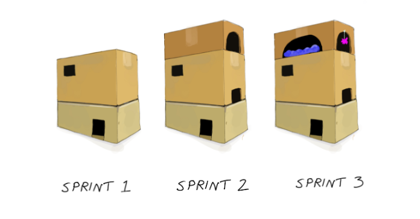
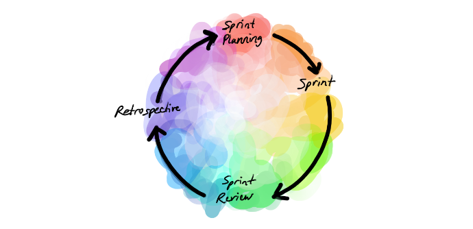
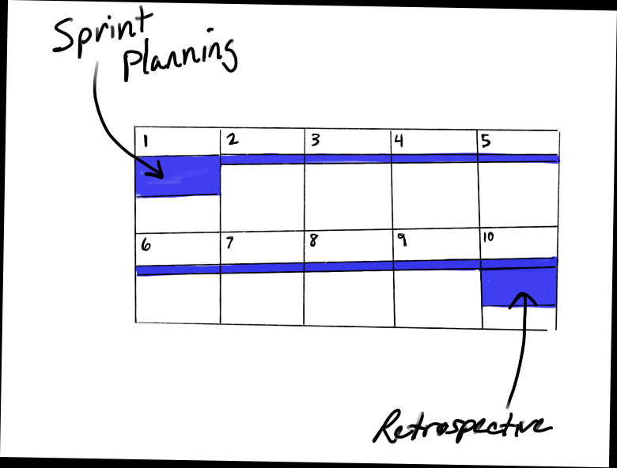

# Sprints 

- [The Goal](#the-goal)
- [The Sprint](#the-sprint)
- [Create Your Sprint Schedule](#create-your-sprint-schedule)

## The Goal 

This is where the magic happens. You’ll establish short working cycles (a lot of people like one- or two-week cycles). At the end of each cycle, you’ll deliver an updated, working product.

You’ll receive immediate feedback from the customer, and you’ll know right away if your team is on the right track, or not.

These cycles are called **sprints** or **iterations**. All project work is performed in this manner.

## The Sprint

A typical project may take six sprints, or twelve weeks, to complete. This may seem short, but remember, agile approaches are particularly useful when there is an urgent need to produce a product which can be delivered in an incremental approach.

  

During each sprint, you’ll constantly assess progress toward your sprint goals.

- You’ll schedule a **sprint planning** meeting to plan the goals of the current sprint.
- You’ll have quick **daily scrum meetings** to touch base with your team and find out what they did yesterday, what they’ll do today, and if there is anything standing in their way.
- You’ll have a **retrospective** meeting to evaluate what went well during the sprint, and where the team can improve.

## Create Your Sprint Schedule

Let’s say your team agrees on two-week sprints, running from Monday, to the Friday of the following week. Here's how to begin:

- Schedule a two-hour sprint planning meeting for Monday morning. Everyone on the team must attend.

- Schedule a 15-minute daily scrum meeting for every day. Mornings are a good time, if the team agrees.

- Schedule a retrospective meeting for the following Friday afternoon.

  

