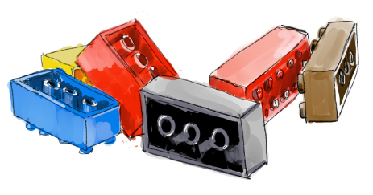
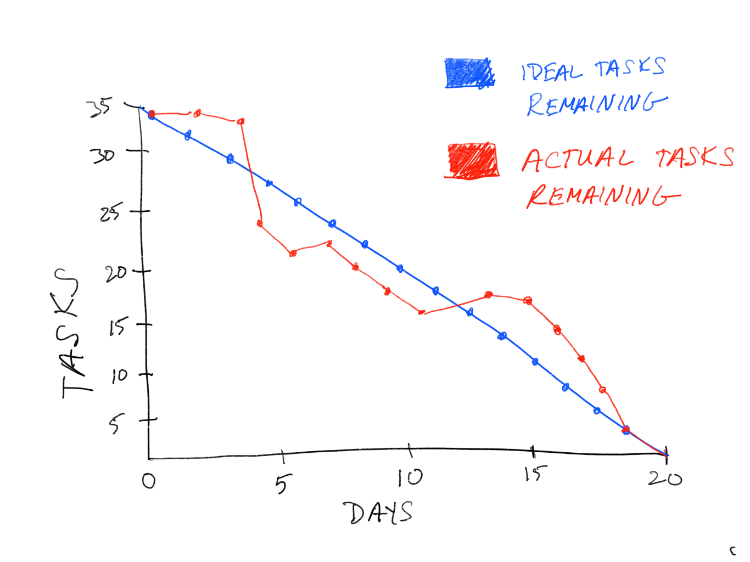

# Measuring the Madness

- [Staying On Track](#staying-on-track)
- [Watch Out For These Patterns](#watch-out-for-these-patterns)
- [Good Questions to Ask](#good-questions-to-ask)
- [Meet The Burndown Chart](#meet-the-burndown-chart)

## Staying On Track

At the beginning of each sprint, the team forecasts how much work they can complete during a sprint.

The goal is to have all the forecasted work completed by the end of the sprint.

  

You’ll need to have some tools and metrics in place to show progress as the sprint progresses.

## Watch Out For These Patterns

Keep an eye out for these patterns, and change them, if they arise.

* Work is completed before the sprint is complete because the team isn’t committing to enough work.

* The team doesn’t complete their forecasted work because they’re committing to too much.

* The **burndown line** makes steep drops because the work hasn’t been broken down into small enough chunks.

* **Scope** is added or changed mid-sprint. Beware of **scope creep**.

## Good Questions to Ask

* Are your metrics easily accessible by the project Sponsor and other stakeholders that require regular updates?
* Is everyone comfortable with the amount of work they are committing to?

## Meet The Burndown Chart

This handy guy is for someone who wants to track progress with a simple line chart.

A sprint burndown chart tracks the completion of work throughout the sprint. The x-axis represents time, and the y-axis refers to the amount of work left to complete, measured in story points.

  