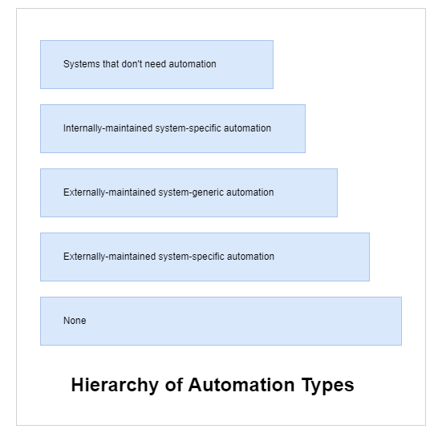
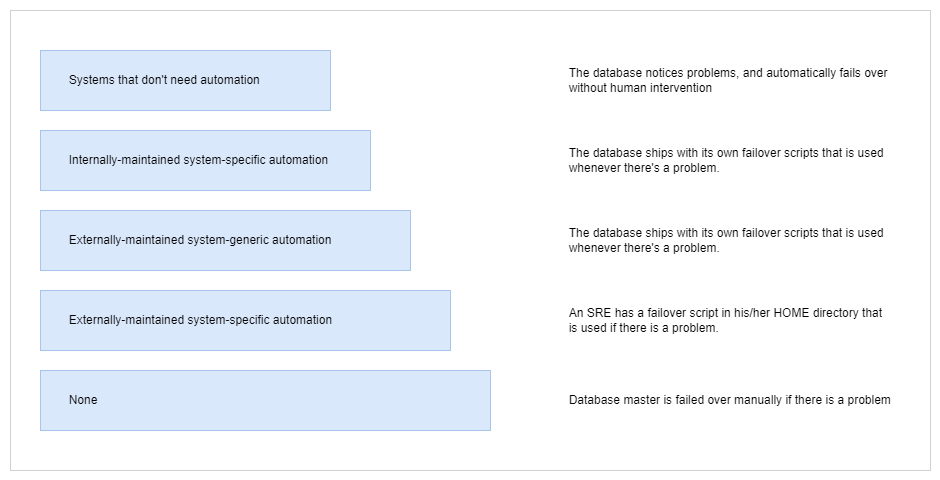

# Automation within SRE

- [Benefits of Automation within SRE](#benefits-of-automation-within-sre)
- [Requirements for Automations](#requirements-for-automations)
- [What Good Automation looks like](#what-good-automation-looks-like)
    - [Being Operations-lead and Using IaaC](#being-operations-lead-and-using-iaac)
    - [Automated Functional and Non-functional Tests](#automated-functional-and-non-functional-tests)
    - [Canary Testing and Blue-Green Deployments](#canary-testing-and-blue-green-deployments)
    - [Versioned and Signed Artifacts for Deploying Components](#versioned-and-signed-artifacts-for-deploying-components)
    - [Making Services Observable](#making-services-observable)
    - [Performance Testing for Outlining Future Growth](#performance-testing-for-outlining-future-growth)
    - [Clear Anti-Fragility Strategy](#clear-anti-fragility-strategy)
- [Hierarchy of Automation Types](#hierarchy-of-automation-types)
- [Secure Automation](#secure-automation)
- [How much automation do you have?](#how-much-automation-do-you-have)
    - [Manage](#manage)
    - [Plan](#plan)
    - [Create](#create)
    - [Verify](#verify)
    - [Package](#package)
    - [Secure](#secure)
    - [Release](#release)
    - [Configure](#configure)
    - [Monitor](#monitor)
    - [Defend](#defend)

## Benefits of Automation within SRE

- **Consistency**, a machine is more consistent than a human .
- Faster action, faster fixes
- Time-savings
- Eliminates toil
- Improving SLOs
- Improves service delivery

## Requirements for Automations

- A problem to be solved
- Automation requires the right tools for the right job. 
- Upfront engineering effort is also required for automation 
- Measurable outcomes

## What Good Automation looks like 

1. Being operations-lead and uses IaaC 
2. Automated functional and non-functional testing 
3. Canary tests and Blue-Green deployments
4. Versioned and signed artifacts for deploying system components 
5. Enabled instrumentation to make services observable from the outside
6. Uses performance testing to outline future growth
7. Clear anti-fragility strategy

### Being Operations-lead and Using IaaC

Automation effort is "Ops" lead, which means shifting operations at the early stage to ensure reliability engineering opprotunities.

- Environments must be provisioned as Infrastructure as Code (IaaC)  
- Apply immutability, environments do not "mutate" but are clean re-builds  
- When change are required, environment need to be re-build  
- This maeks code consistent, repeatable, and productin-ready 
- Easy to test and audit changes 
- Easy to reproduce errors in test environment
- All codes can be rebuilt from code repositories 

### Automated Functional and Non-functional Tests 

In SRE, the pipeline is focused on introducing more and mroe reliability. In order to achieve this, tests need to be performed on both production and before-production environments.

- **Functional tests** uses a dummy account to perform a transaction in Prod
- **Non-functional tests** include tests before production:
    - Is the system running?
    - Can I connect? 

### Canary Testing and Blue-Green Deployments 

Canary testing allows production testing by enabling automated rollback.

- This means the code can rollback to previous version if a test fails in production.

Blue-green deployments allows immutability by having a "dual prod". 

- A "green" version of the code is deployed and tests are ran   
- if tests fail, users are not migrated across
- if tests pass, users are migrated to the "green" version  

### Versioned and Signed Artifacts for Deploying Components 

The build step needs to version and digitally sign the comonents that make up the service, and all its components should be securely stored in a suitable artifact repository, such as Artifactory.

- Changes are automated 
- Dependency errors are reduced 
- Easier tod etermine security vulnerabilites

### Making Services Observable 

Instrumentation like monitoring shuold be enabled in pre-prod and prod environments to ensure that services are observable from the outside.

- Security adn audit events are centralized 
- Reduce mean time to fix since developers have read-only access to log 
- Assists in protective monitoring

Notes on monitoring:

- Correct data and service-level indicators should be reported by monitoring
- Monitoring should also return generated and stored log files 

Tools that can make services externally observable 

- Nagios
- Prometheus 
- Splunk
- Catchpoint 

Tools for aggregating log files for failure analysis 
    
- Logstash 

### Performance Testing for Outlining Future Growth

We can use performance testing to outline and test how our service can scale to meet the required future growth.

- **Auto scaling** can be used to ensure services can meet predicted and unrpedicted demand.
- Toil is imnimized upfront 
- Reduced work 
- Reduced service TOtal Cost of Ownership (TCO)

### Clear Anti-Fragility Strategy

We can use **chaos engineering** tot est failures and address any discovered failures that may lead to service disruption.

- Ensure a disaster recovery plan (DR Plan) is validated through fire drills 
- Ensure on-call personnel are ready

When implemented correctly, this strategy ensures:

- Mitigation of availability and integrity risks 
- Risks are reduced as mitigations are evidenced and tested   

Tools to alert and support unplanned incidents:

- PagerDuty 
- VictorOps 
- Squadcast 

## Hierarchy of Automation Types

Based on an idea that is originated by Google, the hierarchy of automation types describes automation in different forms.

At the very beginning, there is no automation in place. We can see that automation starts to appear and mature as an organization steps up in the hierarchy. As an example, we could use a simple database and how automation can improve and support:

## Secure Automation 

With automation, we can remove the chance of human error or "willful sabotage".

**Secure Builds**

- We can secure automated steps but we cannot provenly secure manual steps

- Generated artifacts can be validated and checked for compliance

- All build artifacts should be digitally signed with approved organization certificates

- DevSecOps works to secure the delivery  pipeline

- Every should be in code - Infra-as-code, config-as-code, etc. 

- Code should be held in secure code repositories with regualted access

**Secure Tests**

- Deployed artifacts should be the same acorss all environments  

- Using environment variables and configuration to handle differences when deploying artifacts 

- Using secure and insecure test data to test the security boundaries of the service

**Secure Staging**

- Immutable staging environments 

- Staging/pre-prod is typically where dependencies and integrations are tested.

- Same artifact should be deployed to staging/pre-prod environment 

- Consider how data-handling rules like GDPR apply on staging data   

- PCI compliance may need to be considered for financial and payment-related data

**Secure Production**

- Production environments are immutable 

- Same artifacts are deployed to prod

- Ensure data security compliance (e.g. GDPR, PCI, SOX) are met

- Failure testing can help with audit compliance

- Dedicated security scanning to uncover security vulnerabilites

## How much automation do you have?

### Manage 

**Audit Management**

Using automated tools ensure products and services are auditable. This includes audit logs of the pipeline stages, auditing configurations, and log files from production operations. 

**Authentication** 

Implement mechanisms to ensure appropriate access to products, services, and tools are in place.

- User and Password Management 
- Multi-factor Authentication
- Cloud-specific IAM

**DevOps Score**

This is a metric showing DevOps adoption across the organization and the corresponding impact on delivery velocity. 

**Value Stream Management** 

This pertains to the ability to visualize the flow of value delivery through the DevOps lifecycle.

- Gitlab CI and Jenkins extension 
- DevOptics for visualization

### Plan 

**Issue-tracking**

Usage fo tools for capturing incidents or backlgos of work 

- Jira 
- Trello 
- Agile Central 

**Kanban Boards**

The same tools for issue-tracking can also represent delivery flow through Scrum and Kanban workflow boards  

**Time-tracking**

Issue-tracking tools can also be used for tracking time, either against the individual issues, other work, or project types.

**Agile Portfolio Management**

This involves evaluating in-flight projects and proposed future initiatives to shape and govern the ongoing investment in projects and discretionary work.

- CA's Agile Central 
- VersionOne 

**Service desk**

Using a service-desk platform improves the managing of the services lifecycle, as well as internal and external stakeholder engagement. 

- ServiceNow

**Requirements management** 

Tools that handle requirements definition, traceability, hierarchies, and dependency. Often also handles code requirements and test cases for requirements. 

**Quality management**
Tools that handle test case planning, test execution, defect tracking, severity, and priority analysis.

- CA's Agile Central.

### Create 

**Source code management** 

Tools to securely store source code and make it available in a scalable multi-user environment. 

- Git 
- SVN 

**Code review** 

The ability to perform peer code-reviews to check quality can be enforced through tools.

- Gerrit
- Team Foundation Service
- Crucible
- Gitlab. 

**Wiki** 

Tools for knowledge sharing and creating a rich Wiki of content. 

- Confluence 

**Web IDE**

Tools that have a web client integrated development environment. Enables developer productivity without having to use a local development tool.

**Snippets**

Stored and shared code snippets to allow collaboration around specific pieces of code. Also allows code snippets to be used in other code-bases. 

- BitBucket 
- Gitlab

### Verify

**Continuous integration** 

Refers to integrating, building, and testing code within the development environment

**Code quality**

Also referred to as code analysis. Use tools that automatically check the seven main dimensions of code:

- quality
- comments
- architecture
- duplication
- unit test coverage
- complexity
- potential defects
- language rules

Tools:

- Sonar 
- Checkmarks 

**Performance testing**
 
Performance testing is the process of determining the speed, responsiveness, and stability of a computer, network, software program, and or device under a workload. 

**Usability testing**

Usability testing is a way to see how easy to use something is by testing it with real users. Tools can be used to track how a user works with a service. For example, scroll recording, eye checking, and mouse tracking.

### Package

**Package registry**

A repository for software packages, artifacts and their corresponding metadata. Can store files produced by an organization itself or for third party binaries. 

- Artifactory 
- Nexus

**Container registry**

Secure and private registry for container images. Typically allowing for easy upload and download of images from build tools.

**Dependency proxy** 

Implement a local proxy for frequently used upstream images or packages. In the case of CI/CD, the proxy is responsible for receiving a request and returning the upstream image from a registry, acting as a pull-through cache. 

**Helm chart registry**

Helm charts describe related Kubernetes resources. Use tools that support a registry for maintaining master records of Helm charts.

- Artifactory 
- Codefresh 

**Dependency firewall**

Many projects depend on packages that may come from unknown or unverified providers, introducing potential security vulnerabilities. There are tools to scan dependencies but that is done after they are downloaded. These tools prevent those vulnerabilities from being downloaded to begin with. 

### Secure 

**SAST**

Static application security testing tests applications from the inside out by looking at source code, byte code, or binaries.

**DAST**

Dynamic application security testing tests applications from the outside in to detect security vulnerabilities.

**IAST**

Interactive application security testing combines both SAST and DAST approaches but involves application tests changing in real time based on information feedback from SAST and DAST, creating new test cases on the fly. 

- Synopsis
- Acunetix
- Parasoft
- Quotium 

**Secret detection**

Secret detection aims to prevent sensitive information like passwords, authentication tokens, and private keys being unintentionally leaked as part of the repository content.

**Dependency scanning**

Used to automatically find security vulnerabilities in your dependencies while you are developing and testing your applications. 

- Synopsis
- Gemnasium
- Retire.js
- bundler-audit

**Container scanning**

When building a container image for your applications, tools can run a security scan to ensure it does not have any known vulnerability in the environment where your code is shipped. 

- Blackduck
- Synopsis
- Snyk
- Claire 
- Klar

**License compliance**

use tools that perform checks to ensure licenses of your dependencies are compatible with your application and either approve or blacklist them. 

- Blackduck 
- Synopsis

**Vulnerability database** 

Aimed at collecting, maintaining, and disseminating information about discovered computer security vulnerabilities. This is then checked as part of the delivery pipeline. 

**Fuzzing**

Fuzzing or fuzz testing is an automated software testing technique that involves providing invalid, unexpected, or random data as inputs to a service and then watching the results.

### Release

**Continuous delivery** 

This is a software development discipline where you build software in such a way that the software can be released to production at any time. 

**Release orchestration**

Typically a deployment pipeline used to detect any changes that will lead to potential problems in production. Orchestrating other tools will identify performance, security, or usability issues. 

- Jenkins 
- Gitlab CI

**Pages**

For creating supporting web pages automatically as part of a CI/CD pipeline. 

**Review apps** 

Allow code to be committed and launched in real time. Environments are spun up to allow developers to review their applications. 

- Gitlab CI 

**Incremental rollout** 

This means deploying many small, gradual changes to a service instead of a few large ones. Users are then incrementally moved across to the new version of the service until eventually all users are moved across. Sometimes referred to by colored environments, e.g., blue/green deployments.

**Canary deployments**

Similar to incremental rollout, it is where a small portion of the user base is updated to a new version first. This subset, the canaries, then serve as the proverbial canary in the coal mine. If something goes wrong, then a release is rolled back and only a small subset of the users have been impacted. 

**Feature flags**

Sometimes called feature toggles, a technique that allows system behavior to change without changing the underlying code through the use of flags to decide which behavior is invoked. This is primarily a programming practice although there are tools which can help with flag management and invocation.

- Launch Darkly

**Release governance**

Release governance is all about the controls and automation, security compliance or otherwise, that ensure your releases are managed in an auditable and trackable way in order to meet the need of the business to understand what is changing. 

**Secrets management** 

Secrets management refers to the tools and methods for managing digital authentication credentials, secrets, including passwords, keys, APIs, and tokens for use in applications, services, privileged accounts, and other sensitive parts of the IT ecosystem.

### Configure

**Auto DevOps**

Auto DevOps brings DevOps best practices to your project by automatically configuring software development life cycles. It automatically detects, builds, test, deploys, and monitors applications. 

- Gitlab 
- AWS Code Pipelines 

**ChatOps**

The ability to execute common DevOps transactions directly from chat, build, deploy, test, incident management, rollback, et cetera, with the resulting output sent back to the ChatOps channel.

**Runbooks**

A collection of procedures necessary for the smooth operation of a service. Previously manual in nature, they are now usually automated with tools.

- Ansible

**Serverless**

A code execution paradigm where no underlying infrastructure or dependencies are needed. Moreover, a piece of code is executed by a service provider, typically cloud, who takes over the creation of the execution environment. 

- Lambda functions in AWS 
- Microsoft's Azure functions 

### Monitor

**Metrics**

Tools that collect and display performance metrics for deployed apps.

- Prometheus

**Logging**

The capture, aggregation, and storage of all logs associated with system performance including but not limited to process calls, events, user data, responses, error, and status odes. 

- Logstash 
- Nagios 

**Tracing**

Tracing provides insight into the performance and health of a deployed application, tracking each function or microservice which handles a given request.

**Cluster monitoring**

Tools that let you know the health of your deployed environments running in clusters such as Kubernetes. 

**Error tracking**

Tools to easily discover and show the errors that an application may be generating along with the associated data. 

**Incident management** 

Involves capturing the who, what, when of service incidents, and the onward use of this data in ensuring service level objectives are being met.

**Synthetic monitoring**

The ability to monitor service behavior by creating scripts to simulate the action or path taken by a customer or end user and the associated outcome. 

**Status page**

Service pages that easily communicate the status of services to customers and end users. 

### Defend

**RASP**

Runtime application self-protection. Tools that actively monitor and block threats in the production environment before they can exploit vulnerabilities. 

**WAF**

Web application firewall. Tools that examine traffic being sent to an application and can block anything that looks malicious.

**Threat detection** 

Refers to the ability to detect, report, and support the ability to respond to attacks. Intrusion detection systems and denial-of-service systems allow for some level of threat detection and prevention. 

**UEBA**

User and entity behavior analytics is a machine learning technique to analyze normal and abnormal user behavior with the aim of preventing the latter. 

**Vulnerability management** 

This is about ensuring that assets and applications are scanned for vulnerabilities and then the subsequent processes to record, manage, and mitigate those vulnerabilities. 

**DLP**

Data loss protection. Tools that prevent files and content from being removed from within a service environment or organization.

**Storage security**

A specialty area of security that is concerned with securing data storage systems and ecosystems and the data that resides on these systems. 

**Container network security**

Used to prove that any app that can be run on a container cluster with any other app can be confident that there is no unintended use of the other app or any unintended network traffic between them. 

## Resources 

- [SRE Tools & Automation](https://cloudacademy.com/course/sre-tools-automation-1039/results/?context_resource=lp&context_id=1759)