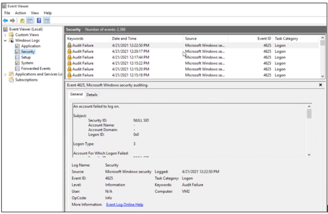
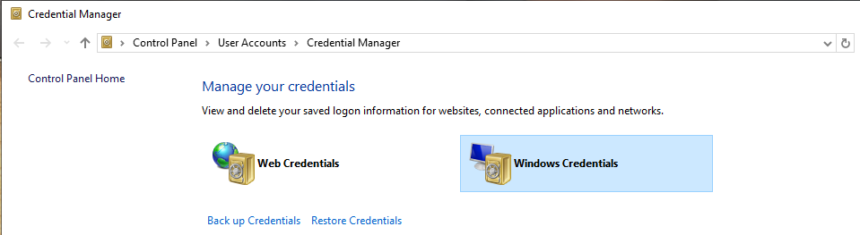

# Security Principles

- [Information Security](#information-security)
- [CIA Triad](#cia-triad)
    - [Confidentiality](#confidentiality)
    - [Integrity](#integrity)
    - [Availability](#availability)
    - [Relationship between Confidentiality and Integrity](#relationship-between-confidentiality-and-integrity)
- [AAA of Security](#aaa-of-security)
    - [Authentication](#authentication)
    - [Authorization](#authorization)
    - [Accounting](#accounting)
- [Authentication](#authentication)
    - [Methods of Authentication](#methods-of-authentication)
    - [Common Authentication Techniques](#common-authentication-techniques)
    - [Multi-Factor Authentication](#multi-factor-authentication)
    - [Types of MFA](#types-of-mfa)
    - [Token-based Authentication](#token-based-authentication)
    - [Password-less Authentication](#password-less-authentication)
    - [Best Practices](#best-practices)
- [IAM Concepts](#iam-concepts)
    - [Identity Proofing](#identity-proofing)
    - [Provisioning](#provisioning)
    - [Deprovisioning](#deprovisioning)
    - [Permission/Authorization Creep](#permissionauthorization-creep)
    - [Interoperability](#interoperability)
    - [Attestation](#attestation)
    - [User Account Control](#user-account-control)
    - [Password Security](#password-security)
    - [Sensitivity](#sensitivity)
    - [Non-repudiation](#non-repudiation)
    - [Privacy](#privacy)
    - [Principle of Least Privilege](#principle-of-least-privilege)
    - [Segregation of Duties](#segregation-of-duties)
    - [Trust but Verify](#trust-but-verify)
    - [Due Care](#due-care)
    - [Collusion](#collusion)
- [Gap Analysis](#gap-analysis)
    - [Steps](#steps)
    - [Technical Gap Analysis](#technical-gap-analysis)
    - [Business Gap Analysis](#business-gap-analysis)
- [Zero Trust](#zero-trust)
    - [Control Plane](#control-plane)
    - [Data Plane](#data-plane)

## Information Security 

**Information Security** 

- Protecting the data and information from unauthorized access, unlawful modification and disruption, disclosure, corruption, and desctruction.

**Information Systems Security**

- Protecting the systems that hold and process our critical data.
- That can be a computer, server, etc.

## CIA Triad 

### Confidentiality

Confidentiality refers to protecting information from unauthorized access. It is all about ensuring only authorized individuals can access sensitive data.

- **Confidentiality Challenges**
  - Balancing confidentiality in systems with numerous guest or customer users.
  - Unknown security status of user devices complicates achieving confidentiality.

- **Security Professional's Role**
  - Obligation to regulate access.
  - Protecting sensitive data while allowing access for authorized individuals.

- **PII and Related Terms**
  - Personally Identifiable Information (PII) linked to confidentiality.
  - Other terms: Protected Health Information (PHI), classified/sensitive information.

- **Sensitivity in Information**
  - Sensitivity as a measure of information importance.
  - Harm to the organization or individuals if improperly disclosed or modified.

- **External Stakeholder Impact**
  - Sensitivity often linked to harm to external stakeholders.
  - External entities not part of information-processing organization.

### Integrity

Integrity is about safeguarding the accuracy and reliability of data. It is all about preventing unauthorized modification or tampering of information.

- **Application**
  - information or data
  - systems and processes for business operations
  - organizations
  - people and their actions

- **Data Integrity**
  - Ensures data remains unaltered in an unauthorized manner.
  - Protection during storage, processing, and transit to prevent modification, errors, or loss.
  - Information must be accurate, internally consistent, and useful.
  - Consistency ensures data is uniform across systems, maintaining the same form, content, and meaning.

- **System Integrity**
  - Maintaining a known good configuration and expected operational function.
  - Begins with awareness of the system's current state, establishing a baseline for future comparisons.

- **Baseline for Integrity**
  - Establishing a baseline to document and understand the state of data or a system.
  - Ongoing protection to preserve the baseline state through transactions.

- **Comparing Baseline for Integrity**
  - Regular comparison of baseline with the current state.
  - Match indicates intact integrity, while a mismatch signifies compromise.

- **Regulatory and Organizational Needs**
  - Safeguarding integrity may be dictated by laws or organizational requirements.
  - Crucial for accessing reliable, accurate information and maintaining system reliability.
  
### Availability

Availability refers to ensuring that authorized users have access to information when needed.

- **Core Concept**
  - Data accessible where and when needed, in the required form.
  - Not necessarily 100% availability; meets business requirements for timely and reliable access.

- **Criticality and Security Professional's Role**
  - Critical systems require appropriate availability levels.
  - Consultation with the business to identify and ensure availability of critical systems.

- **Association with Criticality**
  - Availability linked to criticality, reflecting the importance an organization assigns to data or information systems.
  - Crucial for operations and mission achievement.

### Relationship between Confidentiality and Integrity 

Confidentiality and integrity are separate but complementary security concepts. Confidentiality protects against unauthorized access, while integrity ensures data remains accurate and unaltered.

## AAA of Security 

### Authentication

When a person’s identity is established with proof and confirmed by a system.

- Something you know
- Something you have
- Something you are
  
### Authorization
  
Occurs when a user is given access to a certain piece of data or certain areas of a building

### Accounting

Often called **auditing**, it involves tracking of data, computer usage, and network resources.

  - Non-repudiation - proof that someone has taken an action
  - Types of auditing:
    - Resource access 
    - Failed login attempts 
    - Changes to files/records
  - In Windows, we can see audit logs in the Event viewer.

    

## Authentication 

This is the process of verifying the identity of a user who has stated their identity. 
- Proving the identity of the requestor.
- Enhances security by ensuring authorized access.

### Methods of Authentication

- **Single-Factor Authentication (SFA)**
  - Relies on only one method of authentication.

- **Multi-Factor Authentication (MFA)**
  - Requires successful demonstration of two or more authentication methods.

### Common Authentication Techniques

- **Knowledge-based**
  - Uses a passphrase or secret code.
  - Vulnerable to attacks; often requires additional authentication methods for better security.
  - Examples:
    - **Password Managers**
      - Also called "password vaults"
      - a master key protects the vault - DON'T FORGET IT!
      - Examples: LastPass, cloud-based vaults to store password keys
      - For Windows, we can use Credentials Manager - NOT RECOMMENDED

        

    - **One-time Password (OTP)**
      - Unique password code generated for single use 
      - Static code sent by email or SMS

    - **Time-based OTP**
      - Code is only valid for a short period of time

    - **Push Notifications**
      - Phone call, SMS, or email

    - **HMAC OTP**
      - HMAC encrypts a hash to ensure authenticity
      
- **Certificate-based**
  - PKI certificates are issued by a trusted authority to an individual entity
  - Device, VPN, app access 
  - Can be stored in a smart card
  - **Common Access Card** - can authenticate to everything

- **Token-based**
  - Involves tokens, memory cards, or smart cards.

- **SSH Public Keys**
  - Sign-in with username + private key + passphrase for private key
  - Private key is not a password for the user, its used to decrypt the private key 
  - Public key is stored in the client
  - Private key is stored in the admin device
  - Commonly used in Linux servers 

- **Characteristic-based**
  - Relies on measurable characteristics, such as biometrics.
  - Biometrics like:
    - Fingerprint 
    - Retina
    - Iris
    - Facial
    - Voice 
    - Vein 
    - Gait analysis (how you walk)
  - Efficacy rates:
    - False acceptance  
    - False rejection rate 
    - Crossover error rate

### Multi-Factor Authentication

Multifactor Authentication (MFA) is a security system that requires more than one method of a authentication from independent categories of credentials to verify the user's identity. 

Factors:

- **Knowledge-based**
  - Something you know
  - Examples: Passwords or passphrases.

- **Possession-based**
  - Something you have
  - Examples: Tokens, memory cards, smart cards, keyfob

- **Inherence-based**
  - Something you are
  - Measurable characteristics.
  - Examples: Biometrics, facial, fingerprint, voice

- **Behavior-based**
  - Something you do 
  - Recognizing patterns associated with a user
  - Examples: Mouse movement, keystroke pattern, how they walk

- **Location-based**
  - Somewhere you are
  - IP address verification, geolocation, GPS tracking
  - Access can be restricted based on a user's location

### Types of MFA 

- **Single-Factor Authentication**
  - Using a single authentication factor to access a user account
  - Username + password 
  - Insecure, not recommended

- **Two-Factor Authentication**
  - Using two different authentication factors 
  - Username-password + SMS or email or push notifications

- **Multi-Factor Authentication**
  - Using two or more factors for authentication
  - The more factors used, the safer it is, but the more complex it becomes 

### Token-based Authentication 

- **Synchronous**
  - Generates codes at fixed intervals without a server challenge.
  - Security token produces a new code every 30 seconds.
  - Server and token stay synchronized for code expectations.

- **Asynchronous**
  - Does not generate codes at fixed intervals.
  - Requires a server challenge for each code.

### Password-less Authentication 

Provides improved security and a more user-friendly experience.

- **Biometrics**
  - Unique characteristics
  - Fingerprint, facial, voice 

- **Hardware Tokens**
  - Uses physical device that generate short-lived and ever-changing login code 
  - Security key 

- **One-time Passwords**
  - Sent via SMS or email
  - Code is only valid for a short period of time 
  - Code can only be used once, new code is generated after given time. 

- **Magic Links**
  - Email link that automatically logs in user
  - Sent via email, user just needs to click 
  - Can be accessed only once, new link is needed for each login

- **Passkeys**
  - Integrates with browser or OS
  - Can also user biometrics as login method 

### Best Practices

Implement at least two of the three common authentication techniques for better security.

- **Challenges with Knowledge-based Authentication**
  - Vulnerable to attacks; password resets may pose risks.
  - Better security often requires additional forms of authentication, like tokens or characteristics.

- **User ID and Password Combination**
  - Not considered MFA as it involves two things that are known.
  - MFA requires two or more authentication methods, not simply two known elements.

## IAM Concepts 

### Identity Proofing

Process of verifying the identity of the user before the account is created.

- Checking user details against a trusted source of data
- Request user to provide some sort of identification

### Provisioning 

Creating new user accounts, assigning them appropriate permissions, and providing users with access to the systems 

### Deprovisioning 

Removing an individual's access rights when the rights is no longer required, such as when they move to a different team or when they leave the company. 

### Permission/Authorization Creep 

Occurs when user gains more and more rights during their career progression in the company.

### Interoperability 

The ability of different systems, devices, and applications to work together 
and share information.

- Can involve standards such as SAML or OpenID connect

### Attestation 

Process of validating that user accounts and access rights area correct and up-to-date.

- Involves regular reviews and audits of user access
- Ensures users can only access what they need

### User Account Control 

A mechanism designed to ensure that actions requiring administrative rights are explicitly authorized by the user.

- Similar to a security checkpoint
- When a user tries to install a software, a pop will appear prompting him to enter an admin user and password.

### Password Security  

Measures the password's ability to resist guessing and brute-force attacks.
To learn more, please see [Common Security Policies.](./014-Common-Security-Policies.md#password-policy) 

### Sensitivity 

Sensitivity is also defined as the measure of the importance assigned to information by its owner, or the purpose of representing its need for protection (see the ISC2 study guide, module 1, under CIA Deep Dive).

### Non-repudiation

Non-repudiation is a legal term that refers to protecting against false denial of a specific action by an individual.

  - Determines whether an individual performed actions like creating, approving, or sending/receiving information.

- **Relevance in E-commerce**
  - Crucial in the context of e-commerce and electronic transactions.
  - Prevents impersonation or denial of actions, such as making a purchase online and later denying it.

- **Trust in Online Transactions**
  - Ensures trust in online transactions.
  - Holds individuals accountable for the transactions they conduct.

- **Methodologies**
  - Non-repudiation methodologies are employed to establish accountability.
  - Helps in verifying and confirming actions performed by individuals.

### Privacy 

Privacy is the right of an individual to control the distribution of information about themselves.

- **Security and Privacy**
  - While both focus on protecting personal data, security and privacy differ.
  - Privacy is crucial in information assurance because it ensures that personal information and sensitive data are protected from misuse, unauthorized access, and disclosure.

- **Confidentiality and Privacy**
  - Confidentiality focuses on data protection, whille privacy focuses on appropriate handling of personal information.

- **Privacy Legislation Importance**
  - Increasing data collection emphasizes the need for privacy legislation and compliance.
  - Global impact, irrespective of physical location, in today’s digital era.

- **Global Privacy Considerations**
  - Crucial issue, especially concerning personal information collection and security requirements.
  - Laws, like **GDPR**, have multinational implications affecting organizations globally.

- **HIPAA in the U.S.**
  - Health Insurance Portability and Accountability Act (HIPAA).
  - Governs the maintenance of privacy for medical information.

- **GDPR in the EU**
  - General Data Protection Regulation (GDPR).
  - Provides individuals in the EU control over personal information compilation and retention by companies.

- **Data Protection Responsibilities**
  - Security measures alone are insufficient; understanding and compliance with privacy laws are crucial.
  - Organizations must abide by privacy requirements to avoid penalties for mishandling personal information.

### Principle of Least Privilege

The Principle of Least Privilege dictates that users or programs should be granted the minimum access essential to fulfill their functions. Access is restricted to the specific systems and programs required for their designated job or tasks.

### Segregation of Duties 

In cybersecurity, 'segregation', or 'segregation of duties' (SoD), is a security principle designed to prevent fraud or error by dividing tasks among multiple persons.It is an administrative control that reduces the risk of potential errors or fraud from a single person having control over all aspects of a critical process.

To learn more, see [Privilege Access Management.](./011-Privilege-Access-Management.md)

### Trust but Verify 

The "Trust but verify" model is a method of threat protection that involves granting privileged accounts access to the network and other resources, while at the same time verifying their actions and activities. 

- Limitations in this model expose organizations to security threats.
- Increasingly abandoned in favor of the Zero Trust model.
- Other options are considered best practices in access management.

### Due Care 

In cybersecurity, 'due care' means taking reasonable steps to secure and protect the organization's assets, reputation and finances. 

- Also known as '**the prudent person rule**.'
- Refers to what a prudent person would do in a given situation.
- Encompasses implementing security standards, policies, and continuous improvement.
- Includes cybersecurity awareness training.
- Specific tasks like patching and security practices are part of due care.
- *Reference:* ISC2 Study Guide, Chapter 1, Module 5.

### Collusion 

Collusion occurs when two or more individuals work together to circumvent the segregation of duties for fraudulent purposes.

## Gap Analysis

Process of evaluating the differences betweenan organization's current performance and its desired performance. 

### Steps

1. Define the scope of analysis.
2. Gather data on the current state of the organization.
3. Analyze the data to identify the gaps.
4. Develop a plan to bridge the gap.

### Technical Gap Analysis

- Focuses on IT systems, infrastructure, and technical skills to identify areas for improvement.
- Aims to find gaps in technology, security, or technical competencies that affect operations.
- Common in IT audits, technology upgrades, cybersecurity assessments, and technical training.

### Business Gap Analysis

- Examines business processes, strategy, and organizational goals to find discrepancies.
- Aims to identify gaps between current practices and business objectives or market demands.
- Useful for business strategy planning, process improvements, and customer satisfaction analysis.

## Zero Trust 

Security model that operates on the principle that no one, whether inside or outside the organization, should be trusted by default and verification is required for everybody.

### Control Plane
Define, manage, and enforce the policies related to user and system access 

- **Adaptive identity** - rely on real-time validation.
- **Threat scope reduction** - limit user's access to only what they need.
- **Policy-driven access control** - enforce user access policies based on their roles
- **Secured zones** - isolated environments within a network that is designed to house sensitive data.

### Data Plane
Ensures that the policies and procedures are properly executed.

- **Subject/system** - individual or entity attempting to gain access.
- **Policy engine** - cross-references the access request with its pre-defined policies.
- **Policy administrator** - establish and manage the access policies.
- **Policy enforcement points** - acts as gatekeeper which allow or restrict access.

----------------------------------------------

[Back to main page](../../README.md#security)