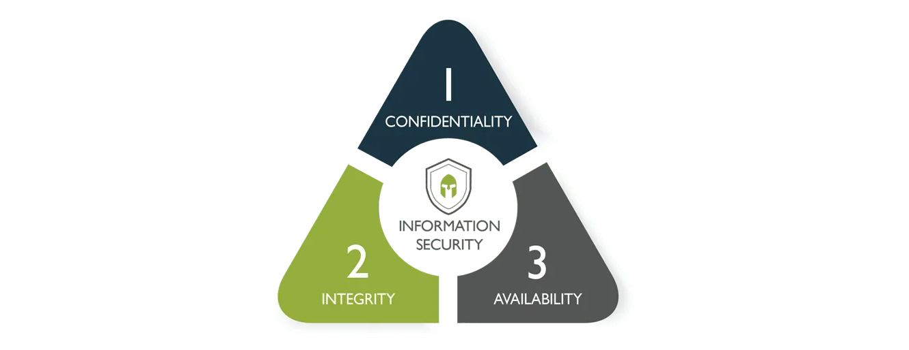

# Security Principles

- [CIA Triad](#cia-triad)
  - [Confidentiality](#confidentiality)
  - [Integrity](#integrity)
  - [Availability](#availability)
- [Relationship between Confidentiality and Integrity](#relationship-between-confidentiality-and-integrity)
- [Sensitivity](#sensitivity)
- [Authentication](#authentication)
  - [Methods of Authentication](#methods-of-authentication)
  - [Common Authentication Techniques](#common-authentication-techniques)
  - [Token-based Authentication](#token-based-authentication)
      - [Synchronous](#synchronous)
      - [Asynchronous](#asynchronous)
  - [Best Practices](#best-practices)
- [Non-repudiation](#non-repudiation)
- [Privacy](#privacy)
- [Principle of Least Privilege](#principle-of-least-privilege)
- [Segregation of Duties](#segregation-of-duties)
- [Trust but Verify](#trust-but-verify)
- [Due Care](#due-care)

## CIA Triad 

### Confidentiality

Confidentiality refers to protecting information from unauthorized access. It is all about ensuring only authorized individuals can access sensitive data.

**Confidentiality Challenges**
  - Balancing confidentiality in systems with numerous guest or customer users.
  - Unknown security status of user devices complicates achieving confidentiality.

**Security Professional's Role**
  - Obligation to regulate access.
  - Protecting sensitive data while allowing access for authorized individuals.

**PII and Related Terms**
  - Personally Identifiable Information (PII) linked to confidentiality.
  - Other terms: Protected Health Information (PHI), classified/sensitive information.

**Sensitivity in Information**
  - Sensitivity as a measure of information importance.
  - Harm to the organization or individuals if improperly disclosed or modified.

**External Stakeholder Impact**
  - Sensitivity often linked to harm to external stakeholders.
  - External entities not part of information-processing organization.

### Integrity

Integrity is about safeguarding the accuracy and reliability of data. It is all about preventing unauthorized modification or tampering of information.

The concept of integrity applies to:

- information or data
- systems and processes for business operations
- organizations
- people and their actions

**Data Integrity**
  - Ensures data remains unaltered in an unauthorized manner.
  - Protection during storage, processing, and transit to prevent modification, errors, or loss.
  - Information must be accurate, internally consistent, and useful.
  - Consistency ensures data is uniform across systems, maintaining the same form, content, and meaning.

**System Integrity**
  - Maintaining a known good configuration and expected operational function.
  - Begins with awareness of the system's current state, establishing a baseline for future comparisons.

**Baseline for Integrity**
  - Establishing a baseline to document and understand the state of data or a system.
  - Ongoing protection to preserve the baseline state through transactions.

**Comparing Baseline for Integrity**
  - Regular comparison of baseline with the current state.
  - Match indicates intact integrity, while a mismatch signifies compromise.

**Regulatory and Organizational Needs**
  - Safeguarding integrity may be dictated by laws or organizational requirements.
  - Crucial for accessing reliable, accurate information and maintaining system reliability.
  
### Availability

Availability refers to ensuring that authorized users have access to information when needed.

**Core Concept**
  - Data accessible where and when needed, in the required form.
  - Not necessarily 100% availability; meets business requirements for timely and reliable access.

**Criticality and Security Professional's Role**
  - Critical systems require appropriate availability levels.
  - Consultation with the business to identify and ensure availability of critical systems.

**Association with Criticality**
  - Availability linked to criticality, reflecting the importance an organization assigns to data or information systems.
  - Crucial for operations and mission achievement.

## Relationship between Confidentiality and Integrity 

Confidentiality and integrity are separate but complementary security concepts. Confidentiality protects against unauthorized access, while integrity ensures data remains accurate and unaltered.

## Sensitivity 

Sensitivity is also defined as the measure of the importance assigned to information by its owner, or the purpose of representing its need for protection (see the ISC2 study guide, module 1, under CIA Deep Dive).

## Authentication 

This is the process of verifying the identity of a user who has stated their identity. 
- Proving the identity of the requestor.
- Enhances security by ensuring authorized access.

There are three common methods of authentication:
  1. **Something you know**
     - Examples: Passwords or passphrases.

  2. **Something you have**
     - Examples: Tokens, memory cards, smart cards.

  3. **Something you are**
     - Examples: Biometrics - measurable characteristics.

### Methods of Authentication

  - **Single-Factor Authentication (SFA)**
    - Relies on only one method of authentication.
  
  - **Multi-Factor Authentication (MFA)**
    - Requires successful demonstration of two or more authentication methods.

### Common Authentication Techniques

  - **Knowledge-based**
    - Uses a passphrase or secret code.
    - Vulnerable to attacks; often requires additional authentication methods for better security.

  - **Token-based**
    - Involves tokens, memory cards, or smart cards.

  - **Characteristic-based**
    - Relies on measurable characteristics, such as biometrics.

### Token-based Authentication 

#### Synchronous
- Generates codes at fixed intervals without a server challenge.
- Security token produces a new code every 30 seconds.
- Server and token stay synchronized for code expectations.

#### Asynchronous
- Does not generate codes at fixed intervals.
- Requires a server challenge for each code.

### Best Practices

Implement at least two of the three common authentication techniques for better security.

- **Challenges with Knowledge-based Authentication**
  - Vulnerable to attacks; password resets may pose risks.
  - Better security often requires additional forms of authentication, like tokens or characteristics.

- **User ID and Password Combination**
  - Not considered MFA as it involves two things that are known.
  - MFA requires two or more authentication methods, not simply two known elements.

## Non-repudiation

Non-repudiation is a legal term that refers to protecting against false denial of a specific action by an individual.

  - Determines whether an individual performed actions like creating, approving, or sending/receiving information.

- **Relevance in E-commerce**
  - Crucial in the context of e-commerce and electronic transactions.
  - Prevents impersonation or denial of actions, such as making a purchase online and later denying it.

- **Trust in Online Transactions**
  - Ensures trust in online transactions.
  - Holds individuals accountable for the transactions they conduct.

- **Methodologies**
  - Non-repudiation methodologies are employed to establish accountability.
  - Helps in verifying and confirming actions performed by individuals.

## Privacy 

Privacy is the right of an individual to control the distribution of information about themselves.

- **Security and Privacy**
  - While both focus on protecting personal data, security and privacy differ.
  - Privacy is crucial in information assurance because it ensures that personal information and sensitive data are protected from misuse, unauthorized access, and disclosure.

- **Confidentiality and Privacy**
  - Confidentiality focuses on data protection, whille privacy focuses on appropriate handling of personal information.

- **Privacy Legislation Importance**
  - Increasing data collection emphasizes the need for privacy legislation and compliance.
  - Global impact, irrespective of physical location, in today’s digital era.

- **Global Privacy Considerations**
  - Crucial issue, especially concerning personal information collection and security requirements.
  - Laws, like **GDPR**, have multinational implications affecting organizations globally.

- **HIPAA in the U.S.**
  - Health Insurance Portability and Accountability Act (HIPAA).
  - Governs the maintenance of privacy for medical information.

- **GDPR in the EU**
  - General Data Protection Regulation (GDPR).
  - Provides individuals in the EU control over personal information compilation and retention by companies.

- **Data Protection Responsibilities**
  - Security measures alone are insufficient; understanding and compliance with privacy laws are crucial.
  - Organizations must abide by privacy requirements to avoid penalties for mishandling personal information.

## Principle of Least Privilege

The Principle of Least Privilege dictates that users or programs should be granted the minimum access essential to fulfill their functions. Access is restricted to the specific systems and programs required for their designated job or tasks.

## Segregation of Duties 

In cybersecurity, 'segregation', or 'segregation of duties' (SoD), is a security principle designed to prevent fraud or error by dividing tasks among multiple persons.It is an administrative control that reduces the risk of potential errors or fraud from a single person having control over all aspects of a critical process.

To learn more, see [Privilege Access Management.](./011-Privilege-Access-Management.md)

## Trust but Verify 

The "Trust but verify" model is a method of threat protection that involves granting privileged accounts access to the network and other resources, while at the same time verifying their actions and activities. 

- Limitations in this model expose organizations to security threats.
- Increasingly abandoned in favor of the Zero Trust model.
- Other options are considered best practices in access management.

## Due Care 

In cybersecurity, 'due care' means taking reasonable steps to secure and protect the organization's assets, reputation and finances. 

- Also known as '**the prudent person rule**.'
- Refers to what a prudent person would do in a given situation.
- Encompasses implementing security standards, policies, and continuous improvement.
- Includes cybersecurity awareness training.
- Specific tasks like patching and security practices are part of due care.
- *Reference:* ISC2 Study Guide, Chapter 1, Module 5.

----------------------------------------------

[Back to main page](../../README.md#security)