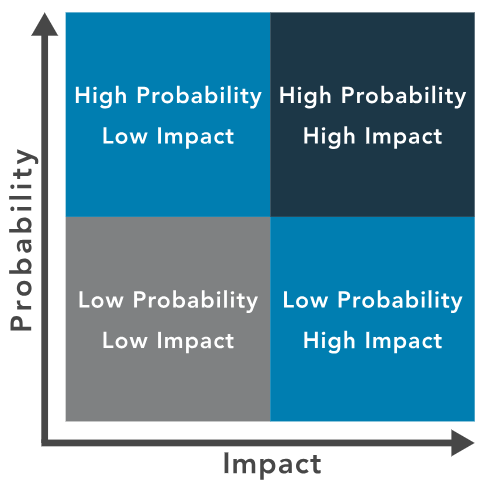
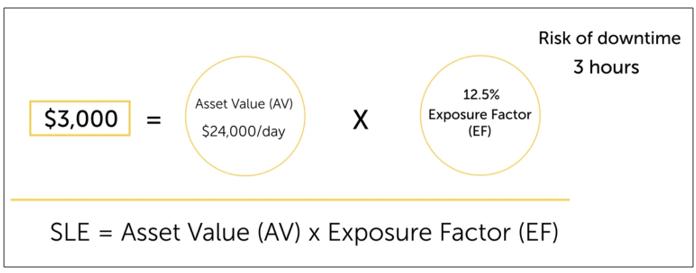
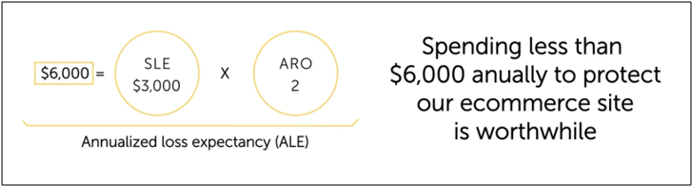
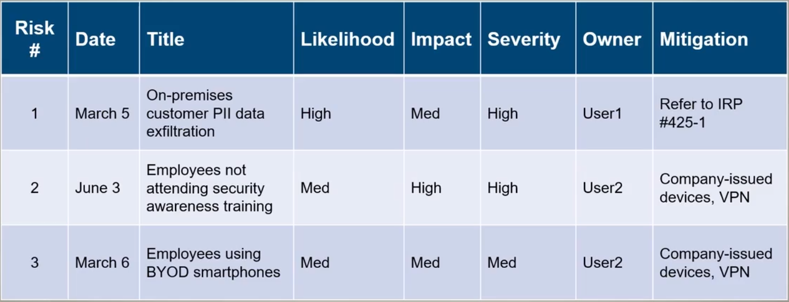
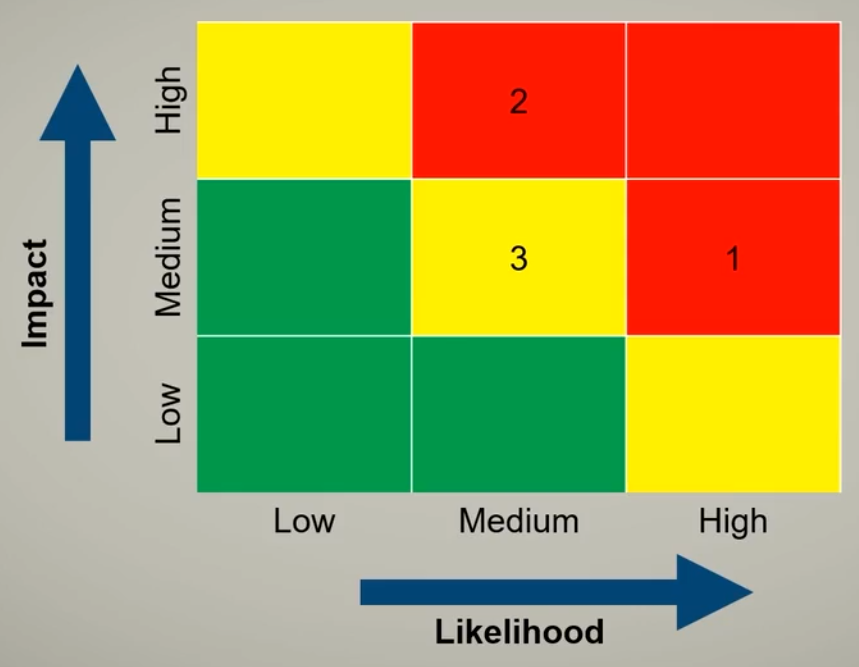
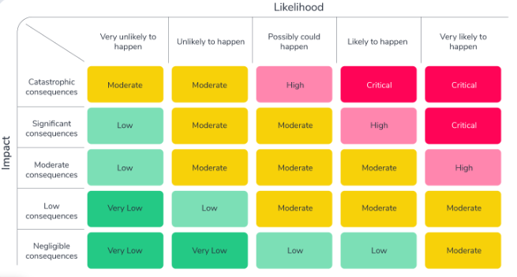

# Risk Management 


- [Importance of Risk Management](#importance-of-risk-management)
- [Terminologies](#risk-management-terminologies)
- [Risk Management Frameworks](#risk-management-frameworks)
    - [CIS](#cis)
    - [NIST RMF/CSF](#nist-rmfcsf)
    - [ISO/IEC](#isoiec)
    - [SSAE SOC 2](#ssae-soc-2)
    - [NIST SP-800](#nist-sp-800)
- [Data Privacy Regulations and Standards](#data-privacy-regulations-and-standards)
    - [GDPR](#gdpr)
    - [HIPAA](#hipaa)
    - [PCI DSS](#pci-dss)
- [Risk Management Process](#risk-management-process)
    - [Risk Identification](#risk-identification)
    - [Risk Assessment](#risk-assessment)
    - [Risk Treatment](#risk-treatment)
    - [Risk Priorities](#risk-priorities)
- [Risk Assessment Frequency](#risk-assessment-frequency)
    - [Ad-Hoc](#ad-hoc)
    - [Recurring](#recurring)
    - [One-Time](#one-time)
    - [Continuous](#continuous)
- [Risk Assessment Types](#risk-assessment-types)
    - [Quantitative risk assessment](#quantitative-risk-assessment)
    - [Qualitative risk assessment](#qualitative-risk-assessment)
- [Managing Risks](#managing-risks)
    - [Risk Register](#risk-register)
    - [Risk Heat Map](#risk-heat-map)
    - [Risk Matrix](#risk-matrix)
- [Prioritizing Risks](#prioritizing-risks)
    - [Risk Tolerance](#risk-tolerance)
    - [Risk Appetite](#risk-appetite)
- [Third-Party Risk Management](#third-party-risk-management)
    - [Measurement Systems Analysis](#measurement-systems-analysis)
    - [Supply Chain Security Risks](#supply-chain-security-risks)
- [Business Impact Analysis](#business-impact-analysis)
- [Agreement Types](#agreement-types)
    - [Interconnection Security Agreement](#interconnection-security-agreement)
    - [Service Level Agreement](#service-level-agreement)
    - [Memorandum of Understanding](#memorandum-of-understanding)
    - [Memorandum of Agreement](#memorandum-of-agreement)
    - [Business Partnership Agreement](#business-partnership-agreement)
    - [Non-Disclosure Agreement](#non-disclosure-agreement)
- [Risk Monitoring adn Reporting](#risk-monitoring-adn-reporting)
    - [Risk Monitoring](#risk-monitoring)
    - [Risk Reporting](#risk-reporting)


## Importance of Risk Management 
Information assurance and cybersecurity are key for risk management. The required cybersecurity level is determined by the entity's risk tolerance. 

- Assess and evaluate risks, and then implement security controls  
- To prioritize risk based on their impact 

## Risk Management Terminologies 

- **Asset**

  - An asset is something in need of protection.

- **Vulnerability**

  - Gap or weakness in protecting valuable assets, including information.
  - Example: IT environment vulnerable to flooding during a major storm.

- **Threat**

  - Something or someone aiming to exploit a vulnerability for unauthorized access.

  - Example: Natural disaster threatening utility power supply, impacting IT asset availability.

  - **Harm by Exploitation:**

    - Exploiting a vulnerability allows threats to harm assets.
    - Example: Storm cutting off power, rendering IT components unusable.

  - **Mitigation and Risk Evaluation:**

    - Evaluate event likelihood and take actions to mitigate risks.
    - Example: Assessing storm risk and implementing measures to protect IT assets.

- **Threat Actor**  

  - An individual or a group posing a threat (according to NIST SP 800-150 under Threat Actor). 
  - Typical threat actors include the following:
    - Insiders (either deliberately, by simple human error, or by gross incompetence).
    - Outside individuals or informal groups (either planned or opportunistic, discovering vulnerability).
    - Formal entities that are nonpolitical (such as business competitors and cybercriminals).
    - Formal entities that are political (such as terrorists, nation-states, and hacktivists).
    - Intelligence or information gatherers (could be any of the above).
    - Technology (such as free-running bots and artificial intelligence , which could be part of any of the above).

  - For more details, please see [Cyber Threat and Attacks.](./017-Cyber-Threats-and-Attacks.md)

- **Threat Vector**

  - The means by which a threat actor carries out their objectives.

- **Attacker**

  - An Attacker is always an individual, but a Threat Actor can be either a group or an entity.

  - The three most common goals of cybersecurity attackers are DAD:

    - Disclosure
    - Alteration
    - Denial


- **Attack Vectors** 

  - Pathways to gain access to infrastructure. 

    - Weak configurations 
    - Open firewall ports 
    - Lack of user security awareness 
    - Lack of MFA
    - Missing patches 
    - Infected USB drive 

- **Supply-Chain Attacks** 

  - Anyone or anything that allows you to deliver a product or a service:

    - Manufacturers 
    - Contractors
    - Outsourced personnel 

  - As owners of the contractual agreement, we have the **right to audit** the third-party systems any time to make sure they're compliant with standards and regulations.

- **Likelihood**

  - **Likelihood of occurrence** 

      - This is the weighted factor based on a subjective analysis of the probability that a given threat or set of threats is capable of exploiting a given vulnerability or set of vulnerabilities.

  - **Assessing Impact:**

      - Impact is the magnitude of harm resulting from unauthorized actions like disclosure, modification, destruction, or loss of information or system availability.
      - Consideration: Potential results if a threat materializes and an event occurs.  


- **Shadow IT**  

  - Shadow IT is the use of unapproved technology, software, or hardware by employees without authorization from IT or security teams. 

  - It poses risks like data breaches, compliance issues, and other security vulnerabilities. 

  - Focus is on identifying, managing, and mitigating these risks through effective policies, detection methods, and user education.

- **State Actor** 

  - State actors work for or represent a government or nation-state, often with cyber-focused goals.

  - They have extensive resources and technical skills for complex cyber operations.
  - Common targets include government, military, critical infrastructure, and major corporations.
  - Effective responses require strong cybersecurity, intelligence sharing, and international cooperation.

- **Advanced Persistent Threat**

  - An Advanced Persistent Threat (APT) is a sophisticated and stealthy cyber attack.
  - Usually conducted by organized groups, often linked to nation-states.
  - They focus on maintaining long-term access to a target's network.
  - APTs often aim to gather intelligence, steal data, or disrupt operations.

- **Advance Tactics, Techniques, and Procedures**

  - Advanced Tactics, Techniques, and Procedures (TTP) describe the behaviors and methods used by threat actors in cyber attacks.

    - **Tactics** refer to the high-level goals or strategies that threat actors aim to achieve.
    - **Techniques** involve the specific ways or approaches attackers use to execute tactics.
    - **Procedures** describe detailed steps or sequences used to carry out techniques consistently.

## Risk Management Frameworks 

### CIS

Center for Internet Security (CIS) is known for its CIS Controls, a set of prioritized security practices to mitigate common cyber threats.

- Provides benchmarks and guidelines for securing various technologies, including operating systems and software.
- Offers resources like risk assessments and training to help organizations strengthen their cybersecurity.

### NIST RMF/CSF

The NIST Risk Management Framework (RMF) manages cybersecurity risks for federal systems, including categorization and security control selection.

- The NIST Cybersecurity Framework (CSF) is a voluntary guideline with five core functions: Identify, Protect, Detect, Respond, and Recover.
- RMF emphasizes risk assessment, control implementation, and continuous monitoring for federal compliance.
- CSF provides flexible cybersecurity practices, adaptable to various industries and sectors.

### ISO/IEC

ISO/IEC refers to standards developed by the International Organization for Standardization (ISO) and the International Electrotechnical Commission (IEC).

- Establish best practices and frameworks for technology, information security, and related fields.
- **ISO/IEC 27001** - Information Security Management Systems (ISMS), providing a framework to protect sensitive information.

### SSAE SOC 2  

SSAE SOC 2 (Statement on Standards for Attestation Engagements) is an auditing standard designed for service organizations to assess their data security practices.

- "Trust Services Criteria" of security, availability, processing integrity, confidentiality, and privacy.
- The audit evaluates whether a service organization’s controls and processes meet these criteria, providing assurance to clients and stakeholders.
- A **SOC 2 report** is often required in industries with sensitive data handling to demonstrate strong data security and compliance.
- Financial statement integrity
- Internal controls; Type I and Type II

### NIST SP-800 

The NIST Special Publications (SP) 800 series contains cybersecurity guidelines, best practices, and technical standards from the National Institute of Standards and Technology.
- Addresses various cybersecurity topics, such as risk management, data protection, and incident response.
- Publications are used by U.S. federal agencies and widely adopted by private-sector organizations.
- Key documents include:

  - **SP 800-53** for federal security controls and 
  - **SP 800-171** for non-federal handling of controlled unclassified information.

## Data Privacy Regulations and Standards 

### GDPR 

The General Data Protection Regulation (GDPR) is a strict EU law governing the collection and handling of personal data.
- Gives EU residents rights over their data, like access, correction, deletion, and data use restrictions.
- Organizations must implement strong data protection and report data breaches within 72 hours.
- Violating GDPR can result in heavy fines, up to 4% of global revenue or €20 million.

### HIPAA 

HIPAA, or the Health Insurance Portability and Accountability Act, is a U.S. law regulating the protection of patient health information.

- It sets rules for healthcare providers, insurers, and other entities on handling and sharing medical data to ensure patient privacy.
- Includes the **Privacy Rule for patient rights** and the **Security Rule for data protection safeguards**.
- Violating HIPAA can lead to severe penalties, including fines and criminal charges.

### PCI DSS 

- The Payment Card Industry Data Security Standard (PCI DSS) is a set of security requirements designed to protect cardholder data during payment processing.

- Applies to any organization handling, processing, or storing cardholder information.
- Requires measures like encryption, access controls, and security assessments to prevent data breaches.
- Non-compliance can lead to fines, penalties, or loss of the right to process card payments.

## Risk Management Process

### Risk Identification 

- **Risk Identification in Cybersecurity**
  - Proactively identifying cyber risks requires constant attention.
  - Continuous identification, characterization, and estimation of potential disruptions.
  - Security professionals understand strategic, tactical, and operational plans.
  - Identify risks for clear communication and protection.
  - Employee Involvement - All levels contribute to identifying risks.

- **Security Professional's Role**
  - Assist in system-level risk assessment, focusing on processes, controls, monitoring, or incident response.
  - Contribute to risk management in smaller organizations lacking mitigation plans.

### Risk Assessment 

Risk Assessment is the process of identifying, estimating, and **prioritizing** risks to an organization's operations, assets, individuals, and mission.

- **Alignment with Goals**
  - Links risks to organizational goals, objectives, assets, or processes.

- **Example: Fire Risk**
  - Options: Alarms, sprinklers, gas-based solutions.
  - Goal: Estimate and prioritize, considering costs and effectiveness.

- **Further Assessment**
  - Management may request detailed assessments.
  - Reports are required for review and approval.
  - Consider inherent or residual risks 


### Risk Treatment 

Risk treatment involves deciding on the most appropriate actions based on management's risk attitude and the availability and cost of mitigation measures.

- **Risk Avoidance**
    - Decision to eliminate a risk entirely.
    - May involve halting specific activities.
    - Leadership decision when impact or likelihood is deemed too high.

- **Risk Acceptance**
    - Decision to take no action to reduce risk likelihood.
    - Management proceeds with associated business functions without further action.
    - Occurs when impact or likelihood is negligible, or benefits outweigh the risk.
    - **Exemption** - provision that grants an exception from a specific rule or requirement

- **Risk Mitigation**
    - Most commonly used in risk management.
    - Aims to prevent or reduce risk likelihood or impact.
    - Involves measures like security controls and policies.
    - While complete mitigation isn't always possible, safety measures should be implemented.

- **Risk Transference**
    - Involves passing the risk to another party.
    - The party accepts financial impact in exchange for payment.
    - Commonly done through insurance policies.    


### Risk Priorities 

- **Prioritizing and Analyzing Risks**
  - Essential step post-risk identification.
  - Utilizes qualitative and quantitative analyses.
  - Aims to determine root causes and prioritize risk-response actions.

- **Contextualizing Risks**
  - Understands the organization's mission and supporting functions.
  - Places risks in context and identifies root causes.

- **Management Direction**
  - Typically, management directs the use of risk assessment findings.
  - Guides the prioritization of risk-response actions.

- **Risk Matrix for Prioritization**
  - Aligns likelihood of occurrence with impact.
  - Provides a common language for team and management.
<br>
    <p align=center>
    
    </p>

- **Priority Assignment Factors**
  - Business priorities.
  - Mitigation costs.
  - Potential losses in case of an incident.

## Risk Assessment Frequency 

Refers to how often the risk assessment process is conducted within an organization.

### Ad-Hoc 

Risk assessments performed on an as-needed basis, typically in response to unexpected events or changes in the environment. 

- Examples include after a security incident, a significant organizational change, or the introduction of new technology.
- Assessments when launching a new product or entering a new market. 

### Recurring 

Risk assessments scheduled at regular intervals, such as annually or semi-annually. 

- Normally part of an organization's standard operating procedures.
- Ensures risks are continually identified and managed effectively
- An example is a recurring penetration testing.

### One-Time 

A risk assessment carried out just once, often at the beginning of a project, implementation of a new system, or during an initial risk evaluation. 

- Typically used for specific situations or projects with a defined timeline.
- Example is when there's new IT system or organizational change.
- **One-time is not repeated, while Ad-hoc may be repeated**

### Continuous 

An ongoing process of risk assessment that integrates risk monitoring into daily operations. 

- Real-time data collection and analysis.
- Uses automated tools and analytics to provide real-time risk insights
- Proactive risk management and swift response to emerging threats.

## Risk Assessment Types

### Quantitative risk assessment

Quantitative risk assessment is a risk analysis approach that uses numerical values and data to estimate risks.

- It relies on metrics, statistical models, and historical data to quantify risks.
- Prioritize risk management by focusing on risk exposure and potential financial or operational consequences.
- Often used to inform decision-making, budgeting, and resource allocation in cybersecurity and beyond.
- Example: Calculate the potential financial loss if a critical server fails

Important terms: 

- **Asset Value (AV)** - value of an asset, financial loss if asset fails
- **Exposure Factor (EF)** - Percentage of asset considered loss when negative incident occurs.

  ```bash
  EF = Risk of downtime (hours) / 24 hours
  ```
- **Single Loss Expectancy (SLE)** - How much loss is experienced during one negative incident?

  ```bash
  SLE = AV * EF
  ```

- **Annualized Rate of Occurrence (ARO)** - Expected number of yearly occurrences.
- **Annualized Loss Expectancy (ALE)** - Total yearly cost of bad things happening.

  ```bash
  ALE = SLE * ARO
  ```

Example:






### Qualitative risk assessment

Qualitative risk assessment evaluates risks using descriptive, subjective factors instead of numerical data.
- Relies on expert judgment, interviews, and categorization of threats and vulnerabilities.
- Risks are classified into categories based on probability and impact:
  
  - High
  - Medium
  - Low

- Prioritize risks and determine security measures when quantitative data is unavailable or not suitable.
- Example: Understand the impact on the organization's reputation.


## Managing Risks 

###  Risk Register 

To manage the different types of risks, we can use a **Risk Register**

- One or more risk register per organization
- Centralized list of risks, severities, responsibilities, and mitigations
- Also known as **risk log**

Components:

- **Risk Owners**
  Individuals or teams responsible for managing specific risks, including monitoring, mitigation, and reporting on risk status.

- **Key Risk Indicators**
  Measurable metrics suggesting when a risk may be increasing or approaching a critical point.

- **Risk Description**
  A summary of a risk, outlining its nature, causes, and potential consequences if it occurs.


- **Risk Impact**
  The potential consequences if risks materialize, usually measured in number of losses.

- **Risk Likelihood**
  The probability that a risk event will occur, often categorized as high, medium, or low based on historical data or expert judgment.

- **Risk Outcome**
  The result or effect after a risk event occurs, which can be positive or negative.

- **Risk Thresholds**
  Predefined limits or levels at which a risk triggers specific actions or responses, indicating when a risk requires attention or mitigation.

- **Risk Level**
  A combined measure of risk likelihood and impact, often used to categorize risks into priority levels for management and response.

- **Cost**
  The financial resources required to manage, mitigate, or transfer a risk, including expenses for controls, insurance, and other risk-reduction measures.

Example:



### Risk Heat Map 

Take risk severity levels and map visually by colors.



### Risk Matrix 

Centralized table containing all the risk details.



## Prioritizing Risks 

The highest priority should be given to risks estimated to high impact and low probability over high probability and low impact value (ISC2 Study Guide, Chapter 1, Module 2). 

In qualitative risk analysis, the 'expected probability of occurrence' and the 'frequency of occurrence' refer to the same thing. 

**Prioritize:**

- Low frequency of occurrence 
- High expected impact

### Risk Tolerance 

Likened to the entity's risk acceptance, risk tolerance varies across organizations and departments.

- **Management's Role**
  - Executives or the Board sets acceptable risk levels.
  - Security professionals align risks with management's tolerance.

- **Geographic Influence**
  - Risk tolerance often dictated by location.
  - Example: Volcano-prone areas plan for related risks.
  - Calculating downtime likelihood defines risk tolerance.

- **Power Outage Example**
  - Risks vary by location.
  - Low tolerance leads to generator investment.
  - Higher tolerance involves multiple generators for increased assurance.

### Risk Appetite 

Signifies an organization's willingness to embrace  or retain specific types and levels of risks to fulfill its strategic  goals.

Types of risk appetites:

- **Expansionary**

  - Willing to take on higher risks for higher returns 
  - Example: entering new markets or launching innovative products.
  - Often characterized by aggressive business strategies and a focus on rapid expansion.
  - Prioritizes opportunities and is comfortable with occasional setbacks in pursuit of greater rewards.

- **Conservative**

  - Prefers stability and risk minimization, avoiding high-risk ventures.
  - Focuses on compliance, risk mitigation, and maintaining existing assets.
  - Common in industries with strict regulations or lower risk tolerance, like healthcare and banking.

- **Neutral**

  - Strikes a balance between risk-taking and risk-avoidance, assessing risks case-by-case.
  - Open to opportunities but cautious, focusing on sustainable growth.
  - Aims to manage risks carefully while not being overly risk-averse.


## Third-Party Risk Management 

### Measurement Systems Analysis

Measurement Systems Analysis (MSA) is a quality assurance metric that evaluates the accuracy and reliability of a measurement system or instrument.
- Determine if measurement process is consistent, precise, and free from significant errors or bias.
- Analyzing factors like repeatability, reproducibility, and measurement uncertainty.
- Crucial in quality control and manufacturing to ensure reliable data for decision-making and compliance with standards.

### Supply Chain Security Risks 

Outsourced hardware and software from vendors:

- EOS (End-of-service) or EOL (End-of-life) means no more patches and support 
- Outdated operating systems are security risks
- Cloud providers are big targets by threat actors, but they also have a lot to lose if their environments cannot be trusted
- Temporary access for contractors
- Company mergers and system linking
- Developers using third-party componenets

## Business Impact Analysis 

A Business Impact Analysis (BIA) is a process used to identify and evaluate the effects of disruptions to business operations. 

The goal of a BIA is to understand which functions and processes are critical to an organization's success and how they would be impacted by disruptions, such as natural disasters, cyberattacks, or equipment failures.

To learn more, please see [Business Continuity](./007-Business-Continuity.md).


## Agreement Types 

### Interconnection Security Agreement

An Interconnection Security Agreement (ISA) outlines the security requirements for two organizations that are connecting their information systems.

- Details the roles, responsibilities, and technical safeguards for secure connections and data exchange.
- Encryption, authentication, and auditing to ensure data protection.
- Commonly used for secure connections between government agencies or business partners.

Used for:

- Legal review, regulatory compliance 
- Linking companies, partners, and agencies
- Vulnerability scan results
- Mandatory training/certification

### Service Level Agreement

A Service Level Agreement (SLA) is a contract that defines the performance expectations and service standards between a service provider and a customer.

- Metrics like response times, uptime, and quality levels to ensure accountability and customer satisfaction.
- Outlines the remedies or penalties if the service provider fails to meet the agreed-upon standards.
- Commonly used in IT, telco, and cloud services to manage service quality and customer relationships.


### Memorandum of Understanding

Agreement between parties to understand mutual goals and expectations.

- Outlines broad terms and general understanding.
- Often non-binding and serves as a framework for future agreements.

### Memorandum of Agreement

More formal and detailed than MOU, involves a legally binding commitment.

- Specifies detailed terms, responsibilities, and obligations.
- Clearly outlines the agreed-upon course of action.

### Business Partnership Agreement 

A Business Partnership Agreement (BPA) is a legally binding document that outlines the terms and conditions of a business relationship between two or more partners.

- Includes ownership, roles, profit-sharing, decision-making, and dispute resolution.
- Also addresses capital contributions, management, and exit or dissolution processes.
- Goal is to prevent conflicts by clearly outlining the rights and responsibilities of each partner.

### Non-Disclosure Agreement

A Non-Disclosure Agreement (NDA) is a legally binding contract that requires parties to keep certain information confidential.

- Protect sensitive information, trade secrets, or proprietary knowledge from unauthorized disclosure.
- Sspecifies what information is considered confidential and any exceptions or permissible disclosures.
- Violation can lead to legal consequences, including lawsuits and financial penalties.


## Risk Monitoring adn Reporting 


### Risk Monitoring 

Continuously tracking  identified risks, assessing new risks executing response plans, and evaluating their effectiveness during a project's lifecycle.

- **Residual Risk**
  Likelihood and impact after implementing mitigation, transference, or acceptance measures on the initial risk.


- **Control Risk**
  Assessment of how a security measure has lost effectiveness over time.

### Risk Reporting 

Process of communicating information about risk management activities, including the results of risk identification, assessment, response, and monitoring.

- Often presented in the form of a monthly risk report.
- Shared with stakeholders and potentially the clients.

----------------------------------------------

[Back to main page](../../README.md#security)    