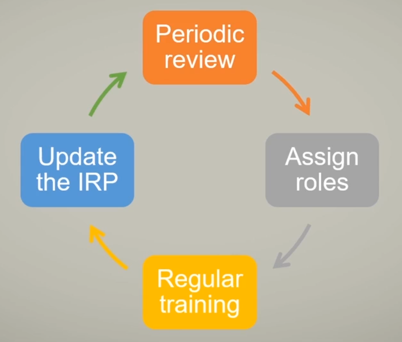

# Incident Response

- [Terminologies](#terminologies)
- [Indicator of Compromise](#indicator-of-compromise)
- [Goal of Incident Response](#goal-of-incident-response)
- [Incident Response Lifecycle](#incident-response-lifecycle)
- [Incident Response Plan](#incident-response-plan)
    - [Preparation](#preparation)
    - [Detection](#detection)
    - [Analysis](#analysis)
    - [Containment](#containment)
    - [Eradication](#eradication)
    - [Recovery](#recovery)
    - [Post-incident Activity](#post-incident-activity)
- [Incident Response Models](#incident-response-models)
    - [Leveraged Incident Response Model](#leveraged-incident-response-model)
    - [Dedicated Incident Response Model](#dedicated-incident-response-model)
    - [Hybrid Incident Response Model](#hybrid-incident-response-model)
- [Incident Response Team](#incident-response-team)
    - [Roles](#roles)
    - [Responsibilities](#responsibilities)
- [Incident Response Exercises](#incident-response-exercises)
    - [Training](#training)
    - [Testing](#testing)
- [SOAR](#soar)

## Terminologies

Understanding incident response begins with knowing the terms for various cyberattacks.

| Terminology         | Description                                                                                                                                                                   |
|---------------------|-------------------------------------------------------------------------------------------------------------------------------------------------------------------------------|
| **Breach**          | The loss of control or unauthorized access to personally identifiable information. (NIST SP 800-53 Rev. 5)                                                                    |
| **Event**           | Any observable occurrence in a network or system. (NIST SP 800-61 Rev. 2)                                                                                                     |
| **Exploit**         | A specific attack that targets a system vulnerability.                                                                                                                        |
| **Incident**        | An unplanned event impacting the confidentiality, integrity, or availability of information, requiring a response.                                                            |
| **Intrusion**       | An event where an intruder gains or attempts to gain unauthorized system access. (IETF RFC 4949 Ver. 2)                                                                       |
| **Threat**          | A circumstance or event with the potential to harm organizational operations, assets, or individuals through unauthorized access or data destruction. (NIST SP 800-30 Rev. 1) |
| **Vulnerability**   | A weakness in a system or security process that could be exploited by a threat source. (NIST SP 800-30 Rev. 1)                                                                |
| **Attacks**         | Deliberate actions or activities carried out by threat actors with the intent to exploit vulnerabilities. |
| **Zero Day**        | An unknown system vulnerability that could be exploited without typical detection or prevention.                                                                              |
| **Impact**          | The expected harm from unauthorized data disclosure, modification, or loss.                                                                                                   |

## Indicators of Compromise 

Indicators of Compromise (IOCs) are evidence or clues that suggest a computer system or network has been breached or compromised by malicious actors. These indicators can take various forms and are used by cybersecurity professionals to detect, investigate, and respond to security incidents. 

- Malware Signatures
- Anomalous Network Traffic
- Unauthorized Access Attempts
- Unusual File or System Modifications
- Abnormal User Behavior
- Phishing or Social Engineering Indicators
- Security Alerts or Warnings
- Unusual System Performance
- Suspicious File Attachments or Downloads
- IoT Device Anomalies

To learn more, see [Indicators of Compromise.](./044-Indicators-of-Compromise.md)   

## Goal of Incident Response

The objectives of Incident Response:

- Organizations must prepare for incidents despite preventive measures.
- Incident response prioritizes safety and aims to minimize impact.
- **Crisis management** is sometimes used interchangeably with incident management.
- Events disrupting the business mission are termed **incidents**.
- An incident response plan ensures business viability.
- The incident response process aims to minimize impact and resume operations swiftly.
- It's a subset of the broader business continuity management (BCM).

## Incident Response Lifecycle

<!-- 
 -->

## Incident Response Plan

The incident response policy aligns with the plan, outlining procedures and standards. Shaped by the organization's vision, the process defines technical processes and tools used in incident response. 

The phases of incident response:

- [Preparation](#preparation)
- [Detection](#detection)
- [Analysis](#analysis)
- [Containment](#containment)
- [Eradication](#eradication)
- [Recovery](#recovery)
- [Post-incident Activity](#post-incident-activity)

### Preparation

Preparation involves strengthening systems and networks to resist attacks. 

- **All about getting ready for future incidents.**
- Develop a **management-approved policy** and **communication plan,**
- Identify roles and responsibilities.
- Identify critical data, systems, and single points of failure.
- Implement an incident response team.
- Train and test your personnel with simulated incidents.

### Detection

The detection phase identifies the security incidents.

- Monitor all potential attack vectors.
- Analyze incidents using known data and threat intelligence.
- Categorize, assess, and prioritize incident response efforts.
- Standardize incident documentation.

### Analysis

Analysis involves a thorough examination and evaluation of the incident.

- Involves meticulous data collection and handling.
- Understand the scope and impact of an incident.
- In addition, provide insight and potential consequences.
- Ensure the admissibility of evidence in court.
- Notify the relevant stakeholders.

**Digital forensics**

Digital forensics plays a critical role in the analysis phase of incident response, where investigators examine collected evidence to determine what happened during a security incident and how to respond. 

To learn more, please see [Digital forensics.](./034-Digital-Forensics.md)

### Containment

After informing the relevant stakeholders, containment begins, and initial response actions are taken.

- **Limits the scope and magnitude of incident.**
- Taking immediate actions to isolate and contain the incident.
- Gather evidence.
- Choose an appropriate containment strategy.
- Disconnecting infected clients from the network, etc.

### Eradication 

Eradication begins once the incident is contained. It is focused on removing the malicious activity from a system.

- After isolating the infected resource, remove the malware.
- Reinstall a known good image to the client.

### Recovery 

Recover is focused on restoring affected systems to their normal state after the incident.

- Identify evidence that may need to be retained.
- Restore the resource from a known good backup.
- Install security patches. 
- Implement configuration updates.
- Business resumes regular activities with increased resilience.

Recovery is all about ensuring that any exploited vulnerabilities before the incident have been fully and appropriately remediated.

### Post-incident Activity

This is the last phase and only happens after containment, eradication, and a full system recovery.

- **Root Cause Analysis (RCA)**
 
  - Main purpose is not to assign blame. 
  - Instead, figure out what caused the incident.
  - Process:
      a. Define/scope the incident.
      b. Determine causal relationship that led to the incident.
      c. Identify an effective solution.
      d. Implement and track solutions

- **Lessons Learned**
  - Document experiences during the incident.
  - Identifying areas for improvement.
  - What went right, what went wrong, and what can we do better.

- **After-action Report**
  - Collect formalized information about what occured.
  - Report contains RCA and recommendations for improvement.

## Incident Response Models 

### Leveraged Incident Response Model

   - Outsourcing incident response capabilities to external experts.
   - Leverages third-party services or partnerships for specialized support.
   - Allows organizations to benefit from external expertise and resources.

### Dedicated Incident Response Model

   - Establishes an in-house incident response team.
   - Team members are dedicated solely to handling and mitigating incidents.
   - Enables a rapid and focused response to security events.

### Hybrid Incident Response Model

   - Combines internal and external resources for incident response.
   - Utilizes both in-house teams and external support as needed.
   - Offers flexibility and scalability in managing incidents effectively.

## Incident Response Team

Establishing a Security Operations Center (SOC) necessitates the creation of an efficient incident response team. 

### Roles

The roles:

- **First Responder Role** 

  - IT professionals often serve as the first responders.
  - They distinguish security incidents from routine IT problems.

- **Training Requirement** 

  - Specific trainingis essential to identify and  report security incidents.

- **Team Composition** 

  - An incident response team is typically comprised by cross-functional members representing various areas impacted by security incidents.

    - Leader/Management
    - Subject Matter Experts 
    - IT Support Staff 
    - Legal Counsel
    - Public Relations
    - Human Resource

### Responsibilities

- **Training Requirement** 
  - Team members should undergo training on the orrganization's incident response plan.

- **Investigation and Assessment**
  - Assist in investigating the incident.
  - Assess the extent of the damage.

- **Evidence Collection and Reporting**
  - Collect evidence related to the incident.
  - Report the incident to relevant stakeholders.
- **Recovery Procedures:**
  - Initiate and participate in recovery procedures.

- **Remediation and Analysis**
  - Participate in remediation efforts.
  - Contribute to the lessons learned stage.
  - Assist with root cause analysis.

**Dedicated Incident Response Teams (CIRTs/CSIRTs):**
- **Primary Responsibilities:**
  - Determine the extent and scope of damage.
  - Assess the compromise of confidential information.
  - Implement recovery procedures.
  - Supervise additional security measures for prevention.

## Incident Response Exercises

Incident response drills and exercises are conducted to simulate real-world scenarios and test the organization's incident response capabilities. 

- Vulnerabilities and weaknesses in the security posture can be identified and addressed.
- The organization can then improve its overall resilience against potential cyber threats.

### Training

Training ensures staff grasp processes and priorities for incident response.

- Integrate past lessons-learned into training.
- Tailored training for diverse employee needs.
- As an example, a first responder and a manager may have different training requirements.

**Varying Training per roles**

- First responders 
  - Procedures 
  - Machine re-image 
  - Removing malware 
  - Change configuration settings 

- Managers 
  - Risk vs. Rewards 
  - Decision-making and Communication
  - Law enforcement and media

- End Users
  - Report suspected incident occuring
  - Remedial Training

### Testing

This is the practical exercise of incident response procedures.

- Training teaches what to do, testing make sure you know how to do it.
- Simulating an incident, can cost time and money

To learn more, please see [Security Awareness.](./015-Security-Awareness-Training.md#incident-response-exercises)

## SOAR 

SOAR stands for Security Orchestration, Automation, and Response. It refers to a set of practices, processes, and technologies used by cybersecurity teams to streamline and enhance their incident response capabilities.

- Typically integrate with a variety of security tools and technologies, such as SIEM
- Provide centralized dashboards and workflows for managing security incidents
- Built-in capabilities for automation and orchestration

Here's a breakdown of each component:

- **Security Orchestration**
  - Coordinating and managing security processes and tools.
  - Defining workflows and assigning tasks across teams.
  
- **Automation**
  - Using technology to automate repetitive tasks.
  - Improving response times and reducing human error.
  - Use playbooks to automate:
    - Firewall rules, content filters
    - Application Allow/Deny Lists
    - Revoke certificates
  
- **Response**
  - Taking actions to investigate, contain, and mitigate security incidents.
  - Blocking malicious activities and implementing remediation measures.

----------------------------------------------

[Back to main page](../../README.md#security)    