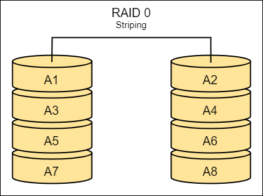
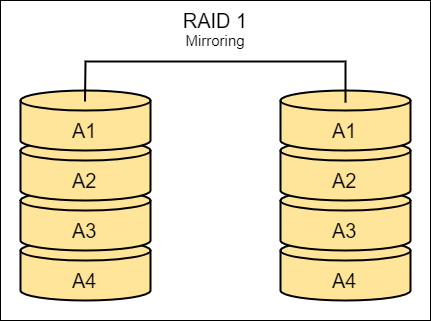
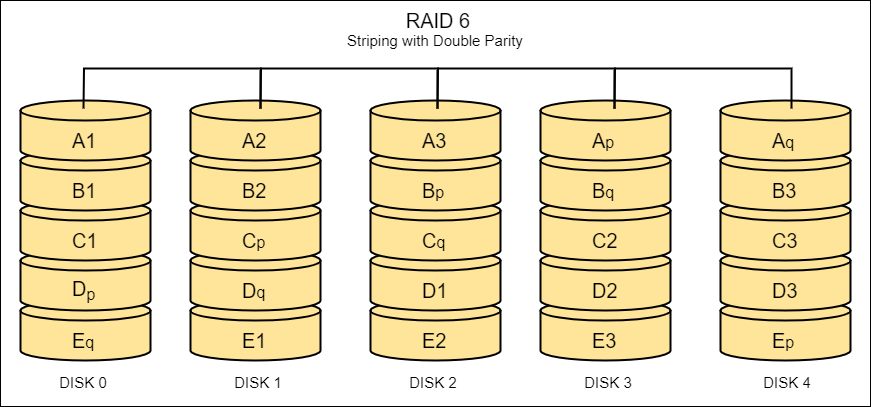
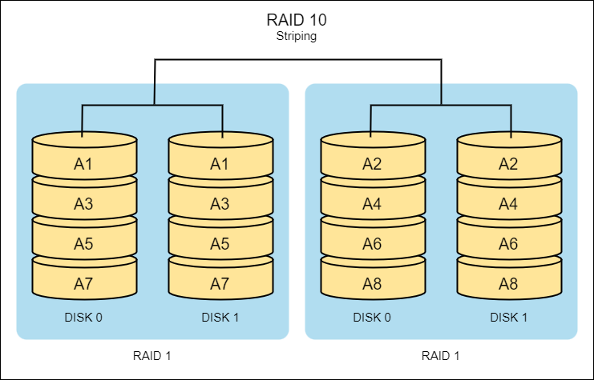

# High Availability and Disaster Recovery

- [Capacity Planning](#capacity-planning)
- [High Availability](#high-availability)
    - [Uptime](#uptime)
    - [Load Balancing](#load-balancing)
    - [Clustering](#clustering)
- [Disaster Recovery](#disaster-recovery)
    - [Redundancy](#redundancy)
    - [Failover](#failover)
    - [The Goal of Disaster Recovery](#the-goal-of-disaster-recovery)
    - [Disaster Recovery Sites](#disaster-recovery-sites)
    - [Disaster Recovery Tests](#disaster-recovery-tests)
    - [Disaster Recovery Plan](#disaster-recovery-plan)
- [Disaster Recovery in the Real World](#disaster-recovery-in-the-real-world)
    - [Sample Scenario](#sample-scenario)
    - [Financial Department is rarely involved](#financial-department-is-rarely-involved)
- [Data Redundancy through RAID](#data-redundancy-through-raid)
    - [RAID Classifications](#raid-classifications)
    - [RAID 0](#raid-0)
    - [RAID 1](#raid-1)
    - [RAID 5](#raid-5)
    - [RAID 6](#raid-6)
    - [RAID 10](#raid-10)
- [Data Backups](#data-backups)
    - [Considerations](#considerations)
    - [Data Recovery Process](#data-recovery-process)
    - [Data Backup Types](#data-backup-types)
- [BC vs DR](#bc-vs-dr)

## Capacity Planning 

Critical strategic planning effort that ensures an organization is adequately equipped to meet any future demands at the right time and in the most cost-effective manner. 

Main aspects of an organization's capacity:

- **People**
  - Analyze current skills of the members.
  - Forecast ftuture needs for hiring or training.
  - Right number of people with right skills.

- **Technology** 
  - Assessing current resources and utilization.
  - Anticipating future needs; evaluate if current technology can accomodate future growth.

- **Infrastructure**
  - Considering physical space and utilities to support organizational needs.
  - Office spaces, warehouses, production facilities, datacenters.

- **Processes**
  - Optimize business processes to handle demand fluctuations.
  - Fluctuations can be increase or decrease in demand.
  - Enhance workflow, efficiency through automation, or outsourcing througb third-party vendor.

## High Availability 

The ability of a service to be continuously available by minimizing downtime to the lowest amount possible. 

### Uptime 

The number of minutes or hours that a system remains online over a given period.

- Usually expressed in percentage
- Gold standard - five nines or "99.999" 
- 99.999% uptime means only 5 minutes downtime in one year.

### Load Balancing 

The process of distributing workloads across multiple computing resources.

- Optimize resource use and maximize throughput.
- Minimize response time.
- Prevent overloading of any single resource.

**Session Persistence**

- Ensures user sessions are consistently directed to the same server in a load-balanced environment.
- Useful for applications where user session state must be maintained across multiple requests.
- Often implemented through cookies or session IDs that are recognized by the load balancer.

**Round-robin**

- Incoming requests are distributed sequentially to each server in a set.
- No server-specific criteria are considered; each server gets an equal share of traffic.
- Effective for evenly distributed, stateless applications.

**Least Connections**

- Directs traffic to the server with the fewest active connections.
- BalanceS load more effectively in environments where some servers may be faster or more capable.
- Can be more efficient in handling sessions that require significant processing power.

**Weighted Value**

- Load balancing based on predefined weights assigned to each server based on capacity or performance.
- Higher weights are assigned to servers that can handle more traffic or have better performance capabilities.
- Allows for more fine-tuned control over how traffic is distributed across servers.

### Clustering 

Multiple computers and multiple storage devices are grouped together to work as a single system.

- Redundant connections.
- Ensure no single point of failure by providing redundancy.
- Provide high levels of availability, reliability, and scalability.
- Can be combined with loadbalancing.

## Disaster Recovery

### Redundancy

Design systems with duplicate components for backup in case of failure.

- Assess the need for multiple utility service entrances for redundant communication.
- Aim for full redundancy with devices having two power supplies from diverse sources.
- Backup power sources include batteries and generators.
- In high-availability environments, generators should be redundant and fueled by different sources.

### Failover 

Failover involves establishing an alternate location, such as a secondary data center or cloud infrastructure, where critical business functions can continue in case the primary site becomes unavailable due to a disaster or incident.

### The Goal of Disaster Recovery

- Complements Business Continuity for IT and communication service restoration
- Guides emergency response for full recovery
- Aims to restore to last-known reliable operations
- Critical for overall business operation recovery

### Disaster Recovery Sites 

- **Hot Site**

  - **Fully operational duplicate** of the primary site.
  - Quickest switchover time, but most expensive.
  - Real-time data replication for immediate takeover.

- **Warm Site**

  - Has **necessary systems but lacks current data** for immediate operations.
  - Longer switchover but less expensive 
  - Hardware and connectivity are in place.
  - Data is restored from backups, which may not be up-to-date.
  - Example: A financial services company with a warm site in another city.

- **Cold Site**

  - Basic facility with power and cooling.
  - Requires significant time to become operational.
  - No hardware, software, data, personnel
  - Longest switchover, but cheapest option.

- **Mobile Site**
  - Can be a hot site, warm site, or a cold site.
  - Utilizes independent and portable units like trailers or tents.
  - Self-sufficient, contains everything you need.
  - Deployed to places that needs recovery quick.

- **Virtual Site**
  - Utilized cloud-based environments.
  - Offers highly flexible approach to redundancy.
  - Examples:
    - Virtual Hot Site - fully replicated and instantly accesible
    - Virtual Warm Site - Partially replicated and scalable
    - Virtual Cold Site - Minimal activation to minimize costs

### Disaster Recovery Tests 

- **Tabletop Exercises**

  - Focuses on assessing procedures and protocols rather than technical recovery.
  - Presenting a scenario, prompting team members to discuss and plan their responses.
  - **Least impact on system operations** - does not involve actual disruption or cost-effective.

- **Simulation Exercise**

  - Computer-generated representations of real-world scenarios.
  - Provides a realistic scenario to assess practical incident handling.

- **Failover Test**

  - Verifies seamless system transition to a backup in the event of failure.
  - Require more resources, time, and energy but verify planned actions work.

- **Parallel Test**

  - Runs primary and alternate processing facilities simultaneously.
  - Primary site continues normal operations while alternate site processes backup transactions.
  - Evaluates compatibility and backup system support.
  - Least disruptive and time-consuming among disaster recovery tests.

- **Full Interruption Test**

  - Shuts down primary site, relies entirely on the alternate site.
  - More disruptive and costly compared to a parallel test.

- **Checklist Reviews**

  - Evaluates procedures and protocols, not technical recovery aspects.

### Disaster Recovery Plan

Organizations often maintain diverse documents for different audiences in their Disaster Recovery Planning (DRP) efforts. These include:

- **Executive summary**: High-level plan overview.
- **Department-specific plans**: Tailored for various organizational units.
- **Technical guides**: For IT personnel handling critical backup systems.
- **Full plan copies**: For critical disaster recovery team members.
- **Checklists**: Tailored for specific roles, including:
  - Critical disaster recovery team members
  - IT personnel
  - Managers and public relations personnel

## Disaster Recovery in the Real World

Ensure critical systems are formally identified and regularly test backups, as incidents may go undetected for extended periods.

- Complex systems store valuable information across multiple servers.
- Basic disaster recovery involves server-level data backup.
- Considerations for databases and dependencies are vital.
- Data entered into one system is distributed to others in large enterprises.
- Coordination among systems is crucial for maintaining common data.
- Understanding data flow and dependencies is essential for successful disaster recovery.

### Sample Scenario

At a hospital in Los Angeles, it took 260 days (about 8 and a half months) to discover that there was a compromise.

- Time-based malware corrupted the last backup.
- Restoration required going back nearly a year prior to the incident.
- Data was restored piece-by-piece to avoid reinfection.
- Highlights the need for multiple backup levels and retention periods.

### Financial Department is rarely involved

- **Executives** and **Public Relations** staff need to be aware of the company's Disaster Recovery Plan (DRP) to properly handle the expectations of the public, as well as of company stakeholders. 

- **IT personnel** should be focused on helping businesses return to normal operations. 

A company's financial department is rarely involved in a disaster recovery plan, except when the issue at hand is directly connected to company finances (see Chapter 2 ISC2 Study Guide, module 3, under Components of a Disaster Recovery Plan).

## Data Redundancy through RAID

RAID (Redundant Array of Independent Disks) combines multiple physical disks into a single logical unit to improve performance, reliability, and data redundancy.

### RAID Classifications 

There are multiple ways to setup RAID disks, depending on the level of resilience that we will want to aim for.

**Failure-resistant**

- Systems designed to withstand certain hardware malfunctions without losing data.
- Achieved through redundancy of storage devices by **mirroring** the data.
- RAID 1 and RAID 10.

**Fault-resistant**

- Designed for continued operation in the event of hardware failure without any downtime.
- Quickly rebuild any lost data from the remaining healthy storage devices.
- Achieve through mirroring or striping with parity.
- RAID 1, RAID 5, RAID 6, and RAID 10.

**Disaster-resistant**

- Broader level of protection from catastrophic events.
- Utilize two independent zones that always have full access to all the data.
- RAID 1 and RAID 10, "full mirrors".

### RAID 0

- "**Striping**"
- Stripes data across multiple disks for higher performance but no redundancy.
- Faster read and write speeds; data is split across multiple drives.
- Focus is performance, but no fault tolerance.
 
  

  
  

### RAID 1

- "**Mirroring**"
- Mirrors data across two disks for redundancy .
- One disk can fail without data loss.
 
  

  
  

### RAID 5

- "**Striping with parity**"
- Stripes data and parity information across three or more disks.
- Balances performance and redundancy.
- In case of failed disk, there will be slower speed in retrieving.
- Slower speed because its calculating the missing data on the fly.
- Can only lose one storage device, if more than that, it'll be difficult to rebuild missing data.
 
  

  
  

### RAID 6

- "**Striping with double parity**"
- Similar to RAID 5 but with additional parity, allowing two disks to fail.
- Uses two identical pieces of parity data.
- Requires at least four storage devices.
- Can lose two disks and still be able to rebuild the data without suffering downtime.
 
  

  
  

### RAID 10 

- Combines mirroring and striping for high performance and redundancy
- Requires at least four disks.
- Faster speed because of the striping of data across two arrays.
- Can lose two disks and still be able to rebuild the data without any downtime, as long as they're not in the same RAID 1 array.
 
  

  
  

## Data Backups

### Considerations

Data Backup involves creating duplicate copies of critical data and storing them off-site. These backups serve as a safeguard in case the primary data becomes unavailable due to a disaster or incident.

- On-premises 
  - Tape 
  - Network-Attached Storage (NAS) 
  - Storage Area Network (SAN)
- Offsite 
  - Cloud
- Frequency
  - Daily 
  - Weekly 
  - Bi-monthly 
  - Monthly
- Compression 
- Encryption 
- Type of Backup
- Virtual Machines  
  - Snapshots 
  - Custom images

### Data Recovery Process 

1. **Selection of Backup**
   - Identify the most recent and relevant backup.
   - Ensure backup integrity and completeness.
   - Choose the appropriate backup type (full, incremental, differential).

2. **Initiating the Recovery Process**
   - Load the backup data onto the recovery system.
   - Follow the recovery protocol for the specific backup software.
   - Monitor the progress to identify any issues early.

3. **Data Validation**
   - Verify the completeness of the recovered data.
   - Check for any corruption or missing files.
   - Compare the restored data with the original backup.

4. **Testing and Validation**
   - Test the recovered data in a controlled environment.
   - Ensure all applications and services function correctly.
   - Confirm data integrity and usability.

5. **Documentation and Reporting**
   - Record the recovery process steps and outcomes.
   - Document any issues encountered and their resolutions.
   - Generate a comprehensive report for stakeholders.

6. **Notification**
   - Inform relevant parties of the recovery completion.
   - Provide details on the restored data and any discrepancies.
   - Communicate any follow-up actions required.

### Data Backup Types

- **Full Backup**

  - Copies all selected files and data.
  - Provides a complete snapshot at a specific point in time.

- **Incremental Backup**

  - Copies only the data that has changed since the last backup.
  - Efficient in terms of storage space but may require multiple backups for a complete restore.

- **Differential Backup**

  - Copies all the data that has changed since the last full backup.
  - Requires less time for restoration compared to incremental backups.

- **Mirror Backup**

  - Creates an exact copy of the source data.
  - Ensures a one-to-one replica of the original but may not offer versioning.

- **Snapshot Backup**

  - Captures the state of the system or data at a specific point in time.
  - Provides a consistent view for backup purposes without affecting ongoing operations.

- **Cloud Backup**

  - Involves storing data in an offsite cloud environment.
  - Enhances data accessibility and provides a secure offsite backup solution.

## BC vs DR

**Business Continuity (BC) plans** 

- Focuses on proactive measures to prevent incidents.
- Ensures the continuous operation of critical business functions. 

**Disaster Recovery (DR) plans**

- Focuses on reactive measures to recover IT systems, applications, and data after a disaster or major incident.

----------------------------------------------

[Back to main page](../../README.md#security)    