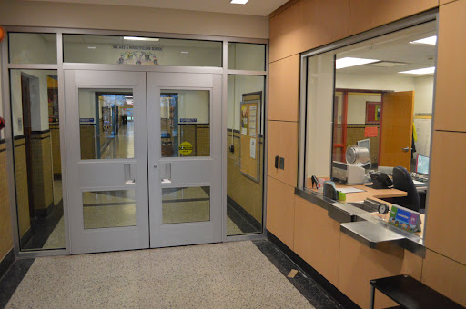

# Access Control

- [Security Control](#security-control)
- [Elements of Access Control](#elements-of-access-control)
    - [Subjects](#subjects)
    - [Objects](#objects)
    - [Rules](#rules)
- [Controls Assessment](#controls-assessment)
- [Privileged Access Management](#privileged-access-management)
- [Physical Access Controls](#physical-access-controls)
    - [What it is](#what-it-is)
    - [Physical Security](#physical-security)
    - [Securing Facilities](#securing-facilities)
    - [Surveillance System](#surveillance-system)
    - [Logging](#logging)
    - [Alarm Systems](#alarm-systems)
    - [Visitor Management Policy](#visitor-management-policy)
    - [Considerations on Choosing an Access Control System](#considerations-on-choosing-an-access-control-system)
    - [Site Assessment](#site-assessment)
    - [Physical Attacks](#physical-attacks)
- [Logical Access Controls](#logical-access-controls)
    - [What it is](#what-it-is)
    - [Discretionary Access Control (DAC)](#discretionary-access-control-dac)
    - [Mandatory Access Control (MAC)](#mandatory-access-control-mac)
    - [Attribute-Based Access Control (ABAC)](#attribute-based-access-control-abac)
    - [Role-Based Access Control (RBAC)](#role-based-access-control-rbac)
    - [Rule-Based Access Control (RBAC)](#rule-based-access-control-rbac)
- [Other Concepts](#other-concepts)
    - [Trust but Verify](#trust-but-verify)
    - [Need to Know](#need-to-know)
    - [Account Review](#account-review)
    - [Privilege creep](#privilege-creep)
    - [Decentralized Access Control](#decentralized-access-control)
    - [Self-service Password Reset](#self-service-password-reset)

## Security Control 

A control is a protective measure aiming to uphold the principles of Confidentiality, Integrity, and Availability (CIA Triad) for data. 

**Access control**, a subset, dictates the availability of objects to subjects based on specific rules.

For instance, a firewall is a control implemented in systems or networks to prevent external threats from compromising the environment and restrict unauthorized access to information within.

## Elements of Access Control 

Access controls involve more than just limiting access; they also encompass facilitating appropriate access for authorized personnel and processes while blocking access for unauthorized functions or individuals.

### Subjects

Subjects are the active initiators of service requests.

- Types: Users, processes, clients, programs, devices (endpoints, smartphones, etc.).
- Actively initiate access requests to resources or services.
- Request services from objects.
- Require suitable clearance (permissions) for accessing services or resources.

### Objects

By definition, anything that a subject attempts to access is referred to as an object. 

- Types: Buildings, computers, files, databases, printers, servers, memory blocks, etc.
- Passive responders to subject-initiated service requests.
- Lack their own access control logic, relying on integrated systems.
- Access is often recorded in rule bases or access control lists.
- May be classified based on access rules.

### Rules 

Access rules guide whether a subject can access an object based on their validated identity. For instance:

- Firewalls use access control lists for object access.
- Rules specify access levels, e.g., inside network to outside.
- When a user accesses a file, a rule validates and defines their access.
- Rules may compare attributes, define access levels, deny access, or apply time-based restrictions.

## Controls Assessment 

Risk reduction relies on the control's efficacy, adapting to changing situations. In securing a repurposed office space for confidential file storage, consider the following:

* Evaluate the necessity of biometric scanners on all doors.
* Conduct a site assessment to determine optimal scanner placement.
* Consider permanently securing or replacing non-critical doors.
* Ensure control implementation aligns with the value of the protected assets.

## Privileged Access Management 

To ensure confidentiality, integrity, and availability of information, the Principle of Least Privilege is employed through **Privileged Acces ,Management**. Users receive access only to essential items, limiting exposure.

- **Access Control Examples**
  - Billing personnel access consumer financial data.
  - Limited authority for data modification to a select few.

- **Temporary or Limited Access**
  - Allowed for specific time periods or business hours.
  - Access rules restricting fields based on roles.

- **Regulatory Compliance**
  - Healthcare environment compliance (e.g., HIPAA).
  - Legal and privacy laws govern access.

- **Monitoring and Alarms**
  - Systems monitor access to private information.
  - Unauthorized attempts trigger alarms.

- **Security Measures**
  - Multi-factor authentication for critical access.

## Physical Access Controls

### What it is

Physical access controls are tangible security measures designed to prevent, monitor, or detect direct contact with systems or specific areas within a facility.

**Examples of Physical Access Controls**

- Security Guards
- Fences
- Motion Detectors
- Locked Doors/Gates
- Sealed Windows
- Lights
- Cable Protection
- Laptop Locks
- Badges
- Swipe Cards
- Guard Dogs
- Cameras
- Mantraps/Turnstiles
- Alarms

**Priority in Deployment**

- Biggest concern is the safety and security of personnel, followed by the protection of other physical assets belonging to the company.
- Various physical access control mechanisms can be deployed to manage and monitor access to a facility, ranging from deterrents to detection systems. Each area requires distinct physical access controls, monitoring, and preventive measures.

### Physical Security

- **Badge Systems and Gate Entry**
   - Examples are Turnstiles, mantraps, remotely/system-controlled door locks.
   - Access control devices are assigned and activated 
   - Include biometric characteristics in high-security environments.
   - System compares individual's badge against a verified database.
   - For card types: Bar code, magnetic stripe, proximity, smart, hybrid.

- **Environmental Design**
   - Crime Prevention through Environmental Design (CPTED) focuses on passive design elements.
   - Directing flow, signaling authorized spaces, providing visibility to reduce the likelihood of criminal activities.

- **Biometrics**
   - User's registered biometric code stored in the system or on a smart card.
   - User presents biometric data for comparison with the stored code.
   - High accuracy, potential expense, user discomfort, privacy concerns, device sanitization challenges.
   
- **Biometric Types**
    - **Physiological** 
      - Fingerprint, iris scan, retinal scan, palm scan, venous scan.
    - **Behavioral** 
      - Voiceprints, signature dynamics, keystroke dynamics.

### Securing Facilities

- **Fences**
  - Structure that encloses an area using interconnected panels or posts.
  - Crafted with materials such as wood, metal, wiremesh, concrete, etc.
  - Visual deterrent, shows where property starts and ends.
  - Delays intruders, providing security personnel longer time to react.

    

    
    

- **Bollards**

  - A bollard is a short post embedded into a street or sidewalk. 
  - These posts are common in city and building designs
  - Boundary markings or protective barriers, redirecting vehicular traffic

    

    
    

- **Mantrap** 

  - A Mantrap is a small room with an entry door on one wall and an exit door on the opposite wall. One door of a mantrap cannot be unlocked and opened until the opposite door has been closed and locked. Mantraps are often used in physical security to separate non-secure areas from secure areas and prevent unauthorized access.

    

    
    

- **Access Control Vestibules**

  - Double-door system with two electroniccally-controlled doors that ensure only one door is open at any given time.
  - Like a mantrap, a security vestibule consists of a small space between two sets of doors, but it may be larger and more open.
  - It can serve multiple purposes, such as controlling foot traffic, reducing drafts, or creating a barrier for noise.
  - Prevents the following:
    - **Piggybacking** 
      - Involves two people, with and without access, entering a secure area.
      - Intentionally allowing the second person to enter. 

    - **Tailgating**
      - Unauthorized person closely follows someone with access without their knowledge and consent.
  
    

    
    

- **Door Locks**      
  - Padlocks 
  - Simple pin and tumbler locks
  - Numeric locks 
  - Wireless locks 
  - Biometric locks
  - Cipher locks

### Surveillance System 

Organized strategy or setup designed to observe and report activities in a given area.

- **Security Guards**
  - Security guards discourage individuals from attempting unauthorized access.
  - Acts as a visible deterrent against impersonation or tailgating.

- **Video/Cameras (CCTV)**
  - Deter criminal activity.
  - Serve as forensic tools.
  - Centrally monitored for swift response.
  - Features:
    - Motion detection 
    - Night vision
    - Facial recognition 
    - Remote access
    - Pan-tilt-zoom (PTZ)

- **Lighting**
  - Proper lighting is crucial for an effective surveillance system.
  - Well-lit areas can also deter criminals
  - Can be integrated with motion sensors  - lights on when motion is detected.

- **Motion Sensors**
  - Detect and respond to external changes in the environment.
  - Categories:
    - Infrared Sensors 
    - Pressure sensors
    - Microwave sensors
    - Ultrasonic sensors

- **Integrated Sensors**
  - Deployed in doors, gates, and turnstiles.
  - Strain-sensitive cables and vibration sensors.
  - Detect and respond to potential breaches.

### Logging

This includes physical logs, such as sign-in sheets or electronic access system logs. It emphasizes the importance of logs in supporting business needs, compliance, and forensic investigations.

- **Log Protection**
  - Essential for legal and business reasons.
  - Safeguarded against manipulation and unauthorized disclosure.

- **Review and Retention**
  - Regular log review integral to the security program.
  - Established guidelines for log retention aligned with policy.

- **Log Anomalies**
  - Identification of unusual occurrences crucial.
  - Key step in security issue detection during audits or routine monitoring.

- **Business and Legal Variances**
  - Varying requirements for log retention.
  - Compliance influenced by legal guidelines and industry standards.

### Alarm Systems

Alarm systems aim to promptly notify relevant authorities in case of unexpected events.

- **Basic Functionality**
  - Commonly on doors/windows, designed to signal unexpected openings.
  - Simplest form alerts appropriate personnel when unauthorized access occurs.

- **Access Control**
  - Authorized access (e.g., code/badge) does not trigger an alarm.
  - Unauthorized access (e.g., forced entry) activates the alarm.

- **Fire Alarm Systems**
  - Activated by heat or smoke sensors.
  - Audible warnings safeguard lives and notify local response teams.

- **Emergency Response**
  - Panic buttons serve as a quick alert mechanism.
  - When activated, alerts police or security personnel for immediate response.

### Visitor Management Policy 

A visitor management policy is a vital component of physical access controls, as it helps organizations track and manage visitor access.

  - Ensures legitimacy and monitors movements for facility and asset security.
  - *Reference:* ISC2 Study Guide, Module 2, Physical Access Controls.
  

### Considerations on Choosing an Access Control System

The following are some considerations:

- Performance is primary factor.
- Includes control effectiveness, reliability, scalability, and compatibility.
- Critical factor is the system's ability to perform its intended function effectively and reliably.

Example: 

- Choosing a biometric system for higher security performance despite complexity.
- Simplicity and efficiency are secondary considerations.
- Aesthetic appeal is irrelevant to the primary function of access control.

**Primary consideration when choosing physical access controls**

- While building, equipment, and network security matter, **personnel security is the top priority.**
- Examples of Controls: Locks, security cameras, and security personnel.
- Designed to safeguard both people and assets.
- Security cameras and personnel to deter and respond to threats like theft, violence, and unauthorized access.
  
**Reference:** ISC2 Study Guide, Chapter 3, Module 2.

### Site Assessment 

- **Factors Considered**
  - Sensitivity of protected information, 
  - cost of scanners, and 
  - impact on employees and operations.

- **Primary Consideration**
  - The result of the site assessment.
  - This is a critical factor when implementing access controls for a physical site

- **Example**
  - Biometric scanners installed based on sensitivity; needed for server rooms, executive offices, but not break rooms or supply closets.

- **Reference**: ISC2 Study Guide, Chapter 3, Module 1.

### Physical Attacks

**Attacking with Brute Force**

- Forcible entry like disabling locks
- Tampering with security devices 
- Confronting or attacking the security personnel
- Ramming a barrier with a vehicle

**Bypassing surveillance systems**

- Visual obstructions 
- Blinding sensors and Cameras
- Interfering with acoustics
- Electronic interference 
- Physical environment attack, e.g. causing fire

**Access badge cloning**

- Refers to copying data from a badge to a blank device
- Cloned badge can then be used to trick the system
- How attackers clone badges:
  - Scanning 
  - Data exfiltration 
  - Writing to a new card 
  - Using a cloned access badge

## Logical Access Controls

### What it is 

Physical access controls utilize tangible methods to limit entry to specific areas or assets, whereas logical access controls employ electronic methods to restrict access to systems, and occasionally tangible assets or areas. 

- Passwords
- Biometrics (implemented on systems like smartphones or laptops)
- Badge/token readers linked to a system

These electronic tools play a crucial role in restricting logical access to an asset, independent of an individual's physical access.

### Discretionary Access Control (DAC)

Discretionary Access Control (DAC) is an access control policy governing subjects and objects in an information system. 

- Share information with other subjects or objects
- Grant its privileges to other subjects
- Modify security attributes on various entities
- Define security attributes for newly created or revised objects
- Adjust rules governing access control (with restrictions in mandatory access controls)
- Assigns permissions based on data owners' decisions

**DAC in the Workplace**

- In a DAC system, users can share or pass files at their discretion. 
- Asset owners decide access permissions, from digital file-sharing to low-tech measures like visitor's badges issued at the security desk.

### Mandatory Access Control (MAC)

Mandatory Access Control (MAC) ensures a uniform policy across an information system, restricting specific actions to trusted security administrators. 

Unlike Discretionary Access Control (DAC), MAC mandates access rights rather than relying on owner discretion.

- Relies on the user's clearance and security classification 
- Only trusted admins modify security rules.
- Subjects have restricted privileges.
- Restricts granting of privileges.
- Governs security attributes of new objects.
- Resources are labelled and permissions are based on the assigned labels

**MAC in the Workplace**

Determines access uniformly based on policies, often associated with government agencies.

- Goal is to prevent the unauthorized disclosure of classified information
- "No read up, no write down" rule
- Security clearance dictates access.
- Access determined by government policy.
- Limited individual decision-making.
- Separation of duties is common.
- Role-based access control often utilized.

**Bell and LaPadula access control modeel**

The Bell and LaPadula access control model arranges subjects and objects into security levels and defines access specifications, whereby subjects can only access objects at certain levels based on their security level.

- It employs a State Machine Model with Security Levels and Access Modes.
- Basic principle: "No Read Up, No Write Down."
- Rules include Simple Security Property and Star Property.
- Enforcement through Access Control Lists, Labels, and Clearances.
- Commonly used in military and government contexts.
- Limitations: Primarily addresses confidentiality, can be complex to implement.

### Attribute-Based Access Control (ABAC)

Attribute-Based Access Control (ABAC) manages access based on user, resource, and environmental attributes.
- Supports flexible and dynamic access policies.
- Ideal for complex access control needs where role-based models are insufficient.
- Examples: roles, departments, security clearances, and factors like time and location.

### Role-Based Access Control (RBAC) 

Assigns user permissions based on predefined roles, streamlining access management.

- Permissions assigned according to roles.
- Roles group users with similar permissions.
- Efficient management of user access.
- Simplifies administration tasks.
- Enhances security and reduces complexity.

**RBAC in the Workplace**

Role-based access control tailors user privileges based on their organizational roles, ensuring appropriate access.

- HR staff access personnel files.
- Finance accesses bank accounts.
- Managers have access to direct reports and departments.
- System administrators may have comprehensive access.
- New employees receive minimal required access.
- Continuous monitoring prevents privilege creep.
- Careful management of evolving roles and permissions.
- Standard roles for new user creation to avoid issues.
- Ensures employees have necessary access for their roles.

Role-Based Access Control (RBAC) defines user access based on roles, while Rule-Based Access Control defines access based on rules. Here's a distinction between the two:

### Rule-Based Access Control (RBAC)

Grants or restricts access based on a set of rules or conditions, rather than roles.

- Rules can include attributes like time, location, IP addresses, or specific security clearances.
- Useful for more dynamic access control scenarios, where rules can be applied to various users or roles.
- Offers greater flexibility and contextual access management.
- Example: MFA, Device types, Location

## Other Concepts 

### Trust but Verify 

The "Trust but verify" model is a method of threat protection that involves granting privileged accounts access to the network and other resources, while at the same time verifying their actions and activities. 

- Limitations in this model expose organizations to security threats.
- Increasingly abandoned in favor of the Zero Trust model.
- Other options are considered best practices in access management.

### Need to Know 

Need to know is a principle that limits access to information to only those who require it to perform their job duties (see ISC2 Study Guide, Chapter 3, Module 1). 

Example:

- John requests access to a database containing sensitive HR records.
- He has high-security clearance but is denied access to HR records.
- Access denied due to lack of business justification.
- Upholds data confidentiality and restricts access based on job roles.
- Ensures adherence to security principles.

### Account Review 

Account review is a process used to verify that employees have the necessary privileges considering their roles within the organization
  - Verifies employees' privileges align with their roles within the organization.
  - Periodically examines and updates permissions for relevance and necessity.
  - Mitigates privilege creep, preventing unnecessary access accumulation.

**Re-provisioning**

  - Reassigns privileges to an employee who has changed roles within the organization.

**Account Revocation**

  - Process of revoking access privileges for a specific user account.

- *Reference:* ISC2 Study Guide, Module 1, under Privileged Access Management.

### Privilege creep 

Privilege creep occurs when an individual accumulates access rights beyond what is necessary for their current job responsibilities, often as a result of changing roles within an organization.

### Decentralized Access Control

Decentralized access control means that access permissions and management are scattered across different departments or systems within an organization.

- Decentralized access control often leads to inconsistent control.
- Results in varying security levels and access rights.
- Maintaining a consistent access control policy becomes challenging.

Example:

- Department A may enforce strict access controls, while Department B adopts lax controls, posing security risks.
- Varying access controls between departments pose security risks.
- Inconsistencies may lead to unauthorized access, breaches, and challenges in auditing.

### Self-service Password Reset

- Decreases help desk cases related to password changes.
- Allows users to reset passwords without help desk assistance.
- Reduces help desk workload, increases user autonomy.

----------------------------------------------

[Back to main page](../../README.md#security)    