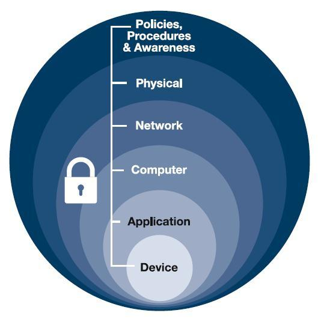

# Defense in Depth

In access control, organizations employ a defense-in-depth strategy, integrating people, technology, and operations across multiple layers. This aims to prevent or deter cyberattacks by implementing various permissions in building, server rooms, networks, and applications.

* **Multi-Factor Authentication (MFA) Example**
  - Combines username/password with a phone-sent code.
  - Implements two-layered authentication: something you have and something you know.

* **Firewall Implementation for Network Security**
  - Adds firewalls to segregate untrusted and trusted networks.
  - Validates network traffic with rules on multiple firewalls, especially for sensitive data.

For a non-technical example, consider the multiple layers of access required to get to the actual data in a data center.

* **Physical Barrier**
  - Door lock restricts physical entry to data storage devices.

* **Technical Access Rule**
  - Network-based rule limits access to data.

* **Administrative Control (Policy)**
  - Defines access rules for authorized individuals.

This layered approach ensures comprehensive protection, combining physical, technical, and administrative controls.

----------------------------------------------

[Back to main page](../../README.md#security)    