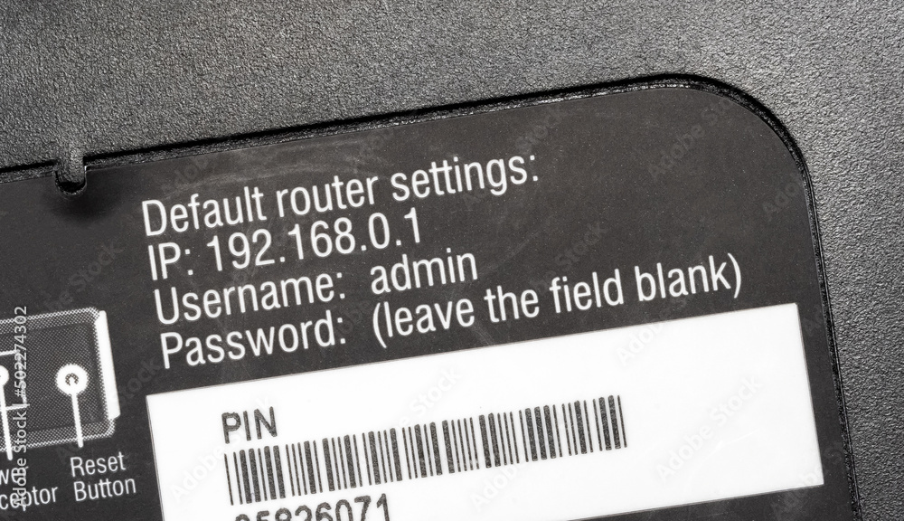
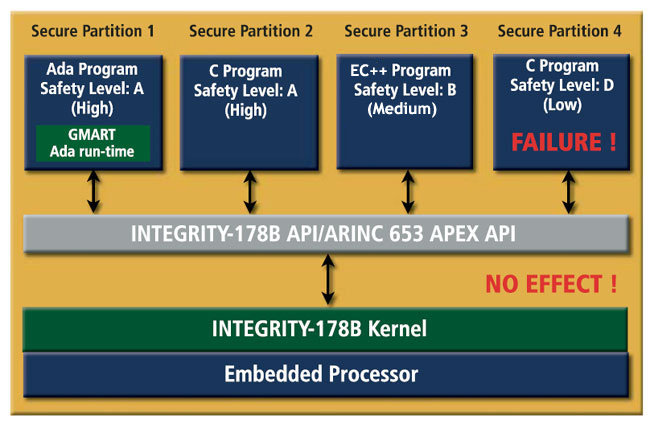

# System Hardening


- [Hardening](#hardening)
- [Reducing system elements](#reducing-system-elements)
- [Configurations](#configurations)
    - [Changing Default Configurations](#changing-default-configurations)
    - [Configuration management](#configuration-management)
- [Restricting Applications](#restricting-applications)
    - [Least Functionality](#least-functionality)
    - [Secure Baseline Image](#secure-baseline-image)
    - [Noncompliant to Security Baselines](#noncompliant-to-security-baselines)
    - [Filtering Applications](#filtering-applications)
- [Trusted Operating Systems TOS](#trusted-operating-systems-tos)
    - [Features of Trusted Operating Systems](#features-of-trusted-operating-systems)
    - [Using Microkernels](#using-microkernels)
    - [Integrity 178B](#integrity-178b)
    - [Common Criteria CC Standards](#common-criteria-cc-standards)
    - [SELinux](#selinux)
    - [Trusted Solaris](#trusted-solaris)
- [Updates and Patches](#updates-and-patches)
    - [Patch Management](#patch-management)
    - [Terms](#terms)
    - [Recommendations](#recommendations)
- [Security-Enhanced Linux SELinux](#security-enhanced-linux-selinux)
    - [Features](#features)
    - [Context-based Permission Schemes](#context-based-permission-schemes)
    - [SELinux Contexts](#selinux-contexts)
    - [Multi-level Security Context](#multi-level-security-context)
    - [SELinux Modes](#selinux-modes)
    - [SELinux Policies](#selinux-policies)


## Hardening 

Hardening is the process of applying secure configurations (to reduce the attack surface) and locking down various hardware, communications systems and software, including the operating system, web server, application server and applications, etc.

- Applying security patches
- Configure access controls
- Disable unnecessary services 
- Adopt best practices

## Reducing system elements

Reducing the number of system elements is a system hardening technique that removes unnecessary software and services to reduce the attack surface. 

## Configurations 

### Changing Default Configurations 

When setting up new systems or devices, default configurations are often used to simplify the initial setup process. However, these default settings can pose significant security risks if not properly managed. Below are some common default configurations that should be addressed to enhance security.

- **Default Passwords**

  - Devices and software often come with preset passwords.
  - Default credentials are widely known and can be easily exploited by attackers.
  - Examples include "admin/admin" or "root/root".
  - Always change default passwords to strong, unique ones upon installation.

    <!-- <p>
    
    </p> -->

- **Unneeded Ports and Protocols**

  - Default configurations may enable more services than necessary.
  - Open ports and running protocols can provide additional attack surfaces.
  - Common unnecessary services include Telnet and FTP.
  - Disable or close any ports and protocols that are not required for operation.
  - If you're using SMTP, use the secure versions, SMTPS and HTTPS.

    <!-- <p>
    
    </p> -->

- **Extra Open Ports**

  - Systems may have several ports open by default for various services.
  - Ports 22, 23, 80, and 443 are open by default on some devices.
  - Often done by manufacturers to provide maximum compatibility.
  - Extra open ports can be entry points for unauthorized access.
  - Regularly review and close any ports that are not in use.
  - Use firewall rules to restrict access to essential ports only.


### Configuration management 

Configuration management ensures that authorized and validated changes are the only ones made to a system. It involves decision-making and control procedures, focusing on aspects like identification, establishing baselines, and applying updates and patches.

- **Identification**

    - Baseline identification of a system and all its components, interfaces and documentation.

- **Baseline**

    - A security baseline is a reference point that sets the minimum accepted level of security requirements. 
    - It ensures updates adhere to essential security standards.
    - Security baselines are used to guarantee that network devices, software, hardware and endpoints are configured consistently. 

- **Change Control**   

    - Process for requesting changes to a baseline, with a review and approval process for updates and patches.

- **Verification and Audit**    

    - Ensure system integrity after changes and an audit to validate the current baseline against its initial baseline plus approved changes.

## Restricting Applications

### Least Functionality

Ensuring systems and devices operate with the least functionality necessary reduces the attack surface and minimizes security risks. This principle involves disabling or removing all non-essential features, services, and applications.

- **Minimize Installed Applications**

  - Install only the applications needed for the system's purpose.
  - Regularly review and uninstall unnecessary software.

- **Disable Unnecessary Services**

  - Turn off services that are not required for the system's operation.
  - This includes services like file sharing, remote desktop, and print services.

- **Limit User Access**

  - Restrict user permissions to the minimum required to perform their tasks.
  - Use role-based access control (RBAC) to manage user privileges.

- **Use Minimal Software Versions**

  - Opt for software versions with the least number of features that meet requirements.
  - Avoid using versions with unnecessary add-ons or plugins.

- **Regularly Update and Patch**

  - Ensure all essential software is up-to-date with the latest security patches.
  - Remove or replace unsupported or obsolete software versions.

### Secure Baseline Image 

In large networks, the best solution is to prevent excessive installations. To achieve this, we can use a **secure baseline image** for all workstations. This image will have:

- Operating system 
- Minimum applications required
- Strict configuration policy

### Noncompliant to Security Baselines 

Whenever a device is found not compliant with the security baseline, it may be disabled or isolated into a quarantine area until it can be checked and updated

### Filtering Applications

**Whitelisting/Allowlisting**

- Allows only authorized applications; blocks all others.
- Requires creating a list of approved applications.
- Greater control, prevents malware, and unauthorized applications.

**Blacklisting/Blocklisting**

- Preventing listed applications from running.
- Blocks known malicious software.
- Doesn't prevent unknown threats.

**Graylisting**

- Temporarily blocks emails from unknown senders.
- Requires the sender to resend the email.

## Trusted Operating Systems (TOS)

Trusted Operating Systems (TOS) are designed with enhanced security features to ensure a higher level of protection and integrity for the system. These systems are particularly suitable for environments where security is a critical concern.

- Implement fine-grained access control mechanisms.
- Use mandatory access controls (MAC) to enforce strict policies.
- Ensure the boot process is secure to prevent unauthorized changes.
- Use cryptographic checks to validate system integrity at startup.
- Run applications in isolated environments to limit the impact of potential breaches.
- Use virtualization and containerization for additional isolation.

### Features

Trusted Operating Systems (TOS) incorporate advanced security features to ensure a high level of protection and integrity. Key features include:

- **Mandatory Access Control (MAC)**

  - Enforces strict policies that control access to resources based on security labels.
  - Prevents unauthorized users from accessing sensitive information.
  - Centralized control over security policies, reducing the risk of data breaches.

- **Security Auditing**

  - Tracks and records system activities and access attempts.
  - Helps in detecting and investigating security incidents.
  - Accountability and transparency, by maintaining logs of user actions and system events.

- **Role-based Access Control (RBAC)**

  - Assigns permissions based on user roles rather than individual users.
  - Simplifies the management of user privileges.
  - Ensures users have the minimum necessary access to perform their duties.

### Using Microkernels

Trusted OS enhances security with microkernels by minimizing the trusted base. The trusted computing base includes all the parts of the system that are critical to security and must be trusted to operate correctly.

- Core functionalities kept minimal
- Communication via messages between kernel components and user-space processes
- Isolated kernel services enhance system stability
- Flexible, easier addition or removal of features
- Enhanced security through isolation
- Message passing may introduce performance overhead
- Implementing and debugging can be more complex

### Integrity 178B

Integrity 178B is a high-assurance, POSIX-based real-time operating system (RTOS) designed for systems requiring stringent security and reliability standards, often used in aerospace, defense, and critical infrastructure.

- Meets DO-178B Level A certification for avionics.
- Critical for mission-critical applications.
- Secure boot and advanced access controls.
- Supports a wide range of hardware platforms.
- Provides deterministic, predictable response times.
- Strict separation between applications.
- Built-in encryption and security protocols.

This operating system is used in numerous aircrafts like the B2-Bimber, F-16, and F-22.
This specific operating system is also rated as **EAL6.**



### Common Criteria (CC) Standards

The Common Criteria (CC) standards evaluate the security controls in an operating system to assess their effectiveness. The evaluation is categorized into seven Evaluation Assurance Levels (EALs), each with increasing rigor and assurance.

- **EAL1: Functionally Tested**

  - Basic testing to ensure the system functions as claimed.
  - Suitable for systems requiring minimal assurance.

- **EAL2: Structurally Tested**

  - Analysis of design and testing of security features.
  - Useful for systems where developers' cooperation is available.

- **EAL3: Methodically Tested and Checked**

  - Focuses on testing and checking the system's security functions.
  - Requires evidence of developer testing and a review of the development environment.

- **EAL4: Methodically Designed, Tested, and Reviewed**

  - Involves a thorough review of the system's design and implementation.
  - Requires rigorous testing and development practices.

- **EAL5: Semiformally Designed and Tested**

  - Employs semiformally specified design and analysis methods.
  - Suitable for high assurance applications requiring rigorous validation.

- **EAL6: Semiformally Verified Design and Tested**

  - Requires detailed and comprehensive design and testing, including formal methods.
  - Ideal for systems requiring high levels of trust and security.

- **EAL7: Formally Verified Design and Tested**

  - The highest level, involving formal design verification and extensive testing.
  - Ensures the highest degree of security assurance.
  - Suitable for extremely sensitive applications.

### SELinux 

Security-Enhanced Linux (SELinux) is a set of controls that are installed on top of another Linux distribution like CentOS or Red Hat Linux. 

Please see [Security-Enhanced Linux.](#security-enhanced-linux-selinux)

### Trusted Solaris

Trusted Solaris is a highly secure version of the Solaris operating system developed by Sun Microsystems (now Oracle). It provides enhanced security features and mechanisms designed to meet the stringent requirements of high-security environments.

- LBAC enforces mandatory access controls based on security labels.
- RBAC manages user privileges through predefined roles.
- Provides labeled networking and multilevel security (MLS).
- Generates detailed audit logs for analysis.
- Establishes secure communication paths for critical operations.
- Mitigates spoofing and tampering risks.

## Updates and Patches 

### Patch Management 

Patch Management involves updating software to address vulnerabilities and improve security.
- Ensures systems are protected against known threats.
- Key for maintaining a secure and resilient IT infrastructure.

**Challenges and Best Practices**

- Patches may disrupt system stability.
- Balancing rapid deployment with stability is crucial.
- Test patches in a qualification environment before production.
- Relying solely on vendor reputation for patch qualification is insufficient.
- Applying patches on fixed days doesn't ensure post-patch stability.

### Terms 

**Software Patch**
  
- A software patch is a quick-repair solution for programming issues. 
- Designed to address functionality problems, enhance security.
- Introduces new functionalities to improve user experience.

**Hotfix**

- Also known as "Quick-Fix", it solves a security issue.
- Cumulative package addressing specific issues in a software product.
- Should be applied immediately after being tested in a lab environment. 

**Updates**

- An update provides the system with additional functionality,
- It does not usually provide any patching of security related issues. 
- Often introduce new security vulnerabilities, which may require another hotfix.

**Service Pack**
  
- Collection of updates, fixes, or enhancements bundled into a single installable package.
- Provides comprehensive improvements to a software program.

### Recommendations

1. Designate a team to monitor vendor security patches.
2. Implement automated system-wide patching for OS and apps.
3. Extend patch management to cover cloud resources.
4. Prioritize patches as urgent, important, or non-critical.
5. Validate critical patches in test environments before deployment.
6. Keep detailed patching logs for evaluation and monitoring.
7. Define a process for assessing, testing, and applying firmware updates.
8. Establish a technical procedure for deploying urgent patches.
9. Regularly review non-critical patches for combined deployment.

## Security-Enhanced Linux (SELinux) 

### Features 

Security-Enhanced Linux (SELinux) is a powerful security module for Linux that implements Mandatory Access Control (MAC) policies. Developed by the NSA, it enhances the security of Linux systems through the following features:

- **Mandatory Access Control (MAC)**

  - Enforces strict policies controlling access to files, processes, and resources.
  - Prevents unauthorized actions by users and applications.
  - Policies are defined by the administrator and enforced by the kernel.

- **Fine-Grained Security Policies**

  - Allows detailed specification of security rules.
  - Policies can be customized to fit specific security requirements.
  - Controls access based on a wide range of attributes and contexts.

- **Context-Based Permissions**

  - Uses security contexts to determine access permissions.
  - Every file, process, and system resource is labeled with a security context.
  - Access decisions are made based on these contexts.

- **Isolation and Containment**

  - Helps in isolating applications and users to prevent the spread of security breaches.
  - Limits the potential damage from compromised processes or accounts.
  - Ensures that applications run with the minimum necessary privileges.

- **Comprehensive Security Auditing**

  - Provides extensive logging of security-relevant events.
  - Enables tracking and analysis of security policy violations.
  - Helps in incident response and forensic investigations.

- **Role-Based Access Control (RBAC)**

  - Integrates RBAC to manage permissions based on user roles.
  - Simplifies the administration of access controls.
  - Ensures users have only the permissions necessary for their role.

### Context-based Permission Schemes

**SELinux**

- Each file, process, and system resource is labeled with a security context.
- A security context consists of a type and a domain. 
- Access decisions are based on these labels
- This enforces strict policies to prevent unauthorized access and actions.
- Sample SELinux Configuration:

    ```bash
    # Example SELinux policy rule
    allow httpd_t user_home_t:file { read getattr };
    ```

**AppArmor**

- Linux security module, offers application-level access control through the use of profiles.
- Each profile defines a set of rules specifying the allowed resources and operations
- This enhances security by limiting the scope of potential attacks.
- Sample AppArmor Configuration:

    ```bash
    # Example AppArmor profile for the Apache web server
    /usr/sbin/apache2 {
    # Allow read access to the Apache configuration files
    /etc/apache2/apache2.conf r,
    /etc/apache2/conf.d/ r,
    /etc/apache2/conf.d/** r,
    /etc/apache2/sites-available/ r,
    /etc/apache2/sites-available/** r,
    
    # Allow read access to web content directories
    /var/www/ r,
    /var/www/** r,
    
    # Allow access to log files
    /var/log/apache2/ r,
    /var/log/apache2/** rw,
    }
    ```

### SELinux Contexts 

SELinux defines security contexts for various system entities, helping to enforce access controls and policies.

- **User**: Represents the identity of the user accessing the system.
- **Role**: Defines the role or set of permissions associated with a user.
- **Type**: Specifies the type of object, such as files, processes, or devices, and the associated security policy.

Common User contexts:

| User Context   | Description                                      |
|----------------|--------------------------------------------------|
| unconfined_u   | Unrestricted access to resources.                |
| user_u         | Regular user without admin privileges.           |
| sysadmin_u     | Access to system administration tasks.           |
| root           | Superuser with full access to system resources.  |

Common Role contexts:

| Role Context   | Description                                            |
|----------------|--------------------------------------------------------|
| object_r       | Role assigned to objects such as files and directories.|
| system_r       | Role assigned to system-related processes and services.|
| user_r         | Role assigned to regular user processes.               |

Common Type contexts: 

| Type Context       | Description                                                    |
|--------------------|----------------------------------------------------------------|
| file_t             | Type assigned to regular files.                                |
| dir_t              | Type assigned to directories.                                   |
| process_t          | Type assigned to processes.                                     |

To view the SELinux contexts for running processes:

```bash
$ ps -eZ 

system_u:system_r:dhcpc_t:s0             1869 ?  00:00:00 dhclient
system_u:system_r:sshd_t:s0-s0:c0.c1023  1882 ?  00:00:00 sshd
system_u:system_r:gpm_t:s0               1964 ?  00:00:00 gpm
system_u:system_r:crond_t:s0-s0:c0.c1023 1973 ?  00:00:00 crond
system_u:system_r:kerneloops_t:s0        1983 ?  00:00:05 kerneloops
system_u:system_r:crond_t:s0-s0:c0.c1023 1991 ?  00:00:00 atd
```

### Multi-level Security Context 

SELinux provides support for multi-level security contexts through a fourth context which indicates the sensitivity levels.

| Sensitivity Level | Description                                |
|-------------------|--------------------------------------------|
| s0                | Lowest sensitivity level                   |
| s1                | Intermediate sensitivity level             |
| s2                | Higher sensitivity level                   |
| s3                | Highest sensitivity level                  |

### SELinux Modes

SELinux operates in three modes:

- **Enforcing Mode**

  - Enforces security policies, denying actions that violate rules.
  - Provides active protection against policy violations.
  - Ensures strict adherence to security policies.

- **Permissive Mode**

  - Logs policy violations without enforcing them.
  - Allows actions that would otherwise be denied for monitoring purposes.
  - Provides insights into potential policy issues without affecting system behavior.

- **Disabled Mode**

  - Completely disables SELinux.
  - No security policies are enforced.
  - System operates without SELinux restrictions.

These modes allow administrators to control SELinux behavior based on their security requirements and system configurations. To show the current mode: 

```bash
sestatus
```

To change the mode: 

```bash
sudo setenforce enforcing   # Switch to enforcing mode
sudo setenforce permissive  # Switch to permissive mode
```

To completely disable SELinux (switch to disabled mode), change the value of SELINUX to disabled.

```bash
sudo nano /etc/selinux/config 
```

### SELinux Policies

SELinux supports various policies, including:

- **Targeted Policy**

  - Default policy used in Red Hat Linux and CentOS.
  - Applies SELinux restrictions selectively to targeted processes.
  - Leaves other processes unconfined.
  - Offers a balance between security and flexibility.
  
- **Strict Policy**

  - Enforces SELinux restrictions on all processes.
  - Provides a higher level of security.
  - May require more configuration effort to manage.


----------------------------------------------

[Back to main page](../../README.md#security)        