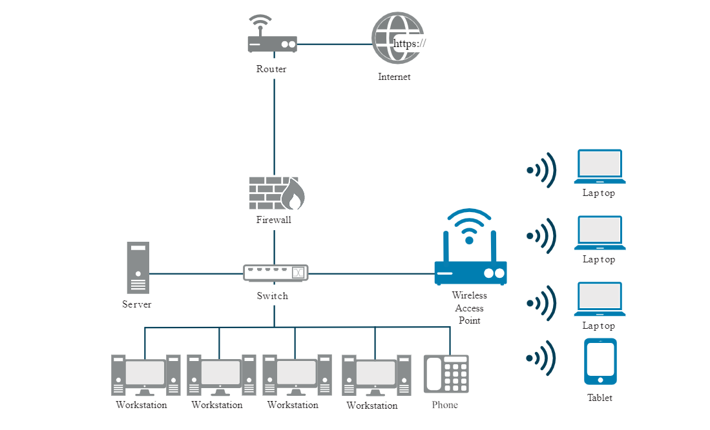
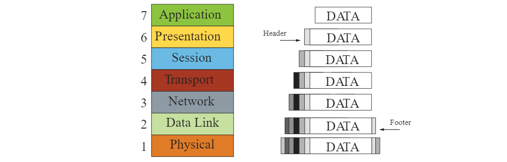
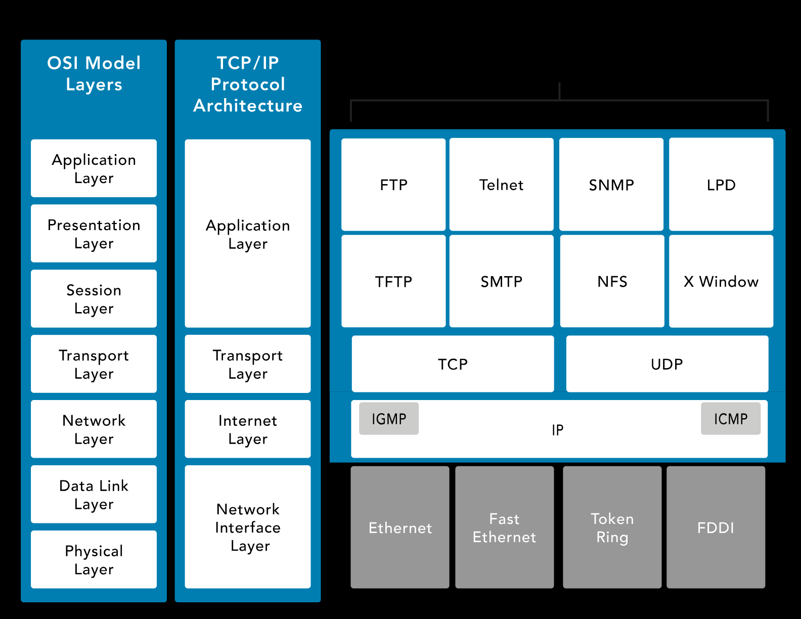
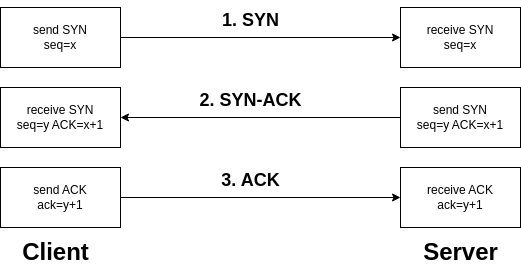

# Networking Basics

- [Network](#network)
    - [Types of Networks](#types-of-networks)
    - [Ethernet](#ethernet)
    - [Device Address](#device-address)
    - [Internet Protocol IPv4 and IPv6](#internet-protocol-ipv4-and-ipv6)
    - [Wifi](#wifi)
    - [Quality of Service](#quality-of-service)
    - [Proxy](#proxy)
    - [Networking Tools](#networking-tools)
- [Networking Models](#networking-models)
    - [OSI Model](#osi-model)
    - [TCP/IP](#tcpip)
    - [SYN, SYN-ACK, ACK Handshake](#syn-syn-ack-ack-handshake)
- [Network Appliance](#network-appliance)
    - [Common Network Devices](#common-network-devices)
    - [SD-WAN](#sd-wan)
    - [SASE](#sase)

## Network 

A network refers to the connection of two or more computers for the purpose of sharing data, information, or resources.

### Types of Networks

- **Local Area Network (LAN)**
   - Typically spans a single floor or building.
   - Limited geographical area.

- **Wide Area Network (WAN)**
   - Encompasses long-distance connections between geographically remote networks.

### Ethernet

Ethernet (IEEE 802.3) is a standard that defines wired connections of networked devices. This standard defines the way data is formatted over the wire to ensure disparate devices can communicate over the same cables.

### Device Address

**Media Access Control (MAC) Address** -
- Assigned to every network device.
- Example: 00-13-02-1F-58-F5.
- First 3 bytes (24 bits) denote the vendor or manufacturer of the physical network interface.
- No two devices can have the same MAC address in the same local network.

**Internet Protocol (IP) Address** -
- Logical address associated with a unique network interface.
- MAC addresses are assigned in the firmware, while IP addresses are logical.
- Helps maintain communications when physical devices are swapped.
- Examples: 192.168.1.1 and 2001:db8::ffff:0:1.

### Internet Protocol (IPv4 and IPv6)

IP is currently deployed and used worldwide in two major versions. IPv4 provides a 32-bit address space, which by the late 1980s was projected to be exhausted. IPv6 was introduced in December 1995 and provides a 128-bit address space along with several other important features. 

To learn more, check out [IP address](https://en.wikipedia.org/wiki/IP_address)

### Wifi 

Widely adopted for its easy deployment and cost-effectiveness, wireless networking provides versatility, enabling devices to roam freely within signal range. 

- **Wi-Fi Evolution**
    - Evolving over time with faster updated versions, Wi-Fi continues to improve its performance.

- **Security Considerations**
    - Despite its benefits, wireless networks introduce additional vulnerabilities. Unlike wired networks, intrusions can occur remotely, without physical access to the network.

### Quality of Service 

Quality of Service (QoS) refers to the technology that allows the network to prioritize certain types of traffic over others. 

- Prioritizes critical traffic like VoIP or video conferencing.
- Uses mechanisms like classes of service (CoS), packet classification, and traffic shaping.

### Proxy 

A proxy server acts as an intermediary between a client and the internet.

- Allows clients to make requests to servers while hiding their IP addresses.
- Receives client requests, forwards them to the server, and returns server responses.
- Provides additional anonymity by masking the client's IP address during internet access.

### Networking Tools 

- **Ping Sweep**

  - Common method to map live hosts in a network.
  - Involves sending ping messages (ICMP Echo Requests) to a range of IP addresses.
  - Online hosts respond, allowing mapping of live hosts on the network.
  - *Reference:* ISC2 Study Guide, Chapter 4, Module 3.

- **Geolocation**

  - Determines a device or user's physical location based on IP or MAC address.

- **Traceroute**

  - Maps network topology and diagnoses connectivity/routing issues by tracing packet hops to an IP address.

- **Wireshark**

  - Network protocol analyzer tool for viewing and analyzing packet contents, including IP addresses and host names.

## Networking Models

Various models, architectures, and standards facilitate the interconnection of hardware and software systems for sharing information and coordinating activities. The integration includes communication devices, storage, processing, security, input/output devices, operating systems, software, services, data, and people.

1. **Provide Reliable Communications** -
   - Ensure dependable communication between hosts and users.

2. **Isolate Functions in Layers** -
   - Segment functions into distinct layers for better organization and management.

3. **Packets as Communication Basis** -
   - Use packets as the fundamental unit of communication.

4. **Standardize Routing, Addressing, and Control** -
   - Implement standardized protocols for routing, addressing, and control.

5. **Allow Additional Layer Functionality** -
   - Enable flexibility for layers beyond internetworking to add functionality.

6. **Vendor-Agnostic, Scalable, and Resilient** -
   - Ensure compatibility across vendors, scalability, and resilience in network design.

In the most basic form, a network model has at least two layers:

- **Upper Layer**
    - Also known as the host or application layer
    - Manages connection integrity
    - Controls sessions
    - Handles communication session establishment, maintenance, and termination
    - Transforms data into a universally understandable format
    - Facilitates communication between applications
    - Checks availability and accessibility of remote communication partners

- **Lower Layer**
    - Often referred to as the media or transport layer
    - Receives bits from the physical connection medium
    - Converts bits into standardized frames
    - Frames function like buckets holding water (bits)
    - Ensures controlled transportation of data within standardized frames
    - Adds route data to frames to create packets
    - Preparation for further management and processing by the upper layer

### OSI Model

The Open Systems Interconnection (OSI) Model is a conceptual framework for describing the communication structure of interconnected computer systems, comprising seven layers. 

- **Application, Presentation, and Session Layers (5-7)** - Commonly referred to as data; potential for encapsulation.
  
  - SNMP (Layer 7)

- **Transport Layer (4)** - Manages protocols like TCP/UDP.

- **Network Layer (3)** - Handles routing and packet transmission.

  - ICMP 
  - IGMP 
  - IP

- **Data Link Layer (2)** - Manages frames and devices like switches.

- **Physical Layer (1)** - Converts data into binary for transmission.

**Encapsulation and De-encapsulation**
Encapsulation occurs as data descends, and de-encapsulation happens as it ascends. The OSI Model aids in understanding networking terminology and processes.

The encapsulation/de-encapsulation process is best depicted visually below: 

### TCP/IP

Transmission Control Protocol/Internet Protocol (TCP/IP) is platform-independent but resource-intensive and designed for ease of use rather than security. It predates the OSI model.

  - **Application Layer** - Defines transport layer protocols.

    - **Telnet** - Allows terminal emulation over the Internet.
    - **File Transfer Protocol (FTP)** - Facilitates file transfers between devices.
    - **Simple Mail Transport Protocol (SMTP)** - Manages email transmission.
    - **Domain Name Service (DNS)** - Resolves domain names to IP addresses.

  - **Transport Layer** - Facilitates data movement.

    - **TCP (Transmission Control Protocol)** - Full-duplex, connection-oriented protocol.
    - **UDP (User Datagram Protocol)** - Simplex, connectionless protocol.

  - **Internet Layer** - Handles packet creation and insertion.

    - **Internet Control Message Protocol (ICMP)** - Determines network or link health. Used by tools like ping and traceroute.

    - The **ping** utility employs ICMP echo packets to assess:

        - Online status of a remote system.
        - Prompt responsiveness of the remote system.
        - Support for communications by intermediary systems.
        - Level of performance efficiency in communication among intermediary systems.

      

      
      

  - **Network Interface Layer** - Manages data flow in the network.

### SYN, SYN-ACK, ACK Handshake

The SYN, SYN-ACK, and ACK handshake is a process used in the TCP (Transmission Control Protocol) to establish a connection between two devices on a network. 

- **SYN (Synchronize)** -
  - Initiates the connection request.
  - The sender indicates its intention to establish a connection.
  - The sender picks an initial sequence number.

- **SYN-ACK (Synchronize-Acknowledge)** -
  - Acknowledges the receipt of the SYN packet.
  - Indicates acceptance of the connection request.
  - The receiver also selects an initial sequence number.

- **ACK (Acknowledge)** -
  - Confirms the acknowledgment of the SYN packet.
  - Establishes the connection.
  - Data transfer can begin after the ACK is received.

This three-step handshake ensures that both the sender and receiver are ready to exchange data and have agreed upon initial sequence numbers for reliable communication.

## Network Appliance 

A network appliance is a dedicated hardware device with pre-installed software that is designed to provide specific networking services.

### Common Network Devices

- **Hubs**
  - Connect multiple devices in a network, commonly found in home networks.
  - Less intelligent compared to switches or routers.

- **Switches**
  - Also known as intelligent hubs.
  - Know the addresses of connected devices and route traffic efficiently.
  - Wired devices.

- **Routers**
  - Control traffic flow on networks.
  - Connect similar networks and manage traffic between them.
  - Wired or wireless and can connect multiple switches.
  - Determine the most efficient route for network traffic.

- **Firewalls**
  - Essential for managing and controlling network traffic.
  - Filter traffic based on predefined rules.
  - Deployed between private networks and the internet or within segmented networks in an organization.

- **Server**
  - Provides information to other computers on a network.
  - Common types include web servers, email servers, print servers, database servers, and file servers.
  - Secured differently than workstations.

- **Endpoints**
  - Ends of a network communication link.
  - One end often at a server with a resource, the other end a client making a request.
  - Can be servers, desktops, laptops, tablets, mobile phones, or other end-user devices.

- **Load Balancers**
  - Distribute incoming network traffic across multiple servers.
  - Provide high availability by redirecting traffic during server failures.
  - Balance loads based on various algorithms, such as round-robin or least connections.
  - Improve response times and optimize resource usage.
  - More details found here: [Load Balancing](./008-Disaster-recovery.md#load-balancing)

- **Application Delivery Controllers**
  - Advanced form of a loadBalancer; can optimize application delivery.
  - Load balancing, SSL termination, content caching, and HTTP compression
  - Integrated firewall and DDoS protection.

- **Proxy Servers**
  - Act as intermediaries between clients and servers, hiding client IP addresses.
  - Cache content to improve load times and reduce bandwidth usage.
  - Filter web traffic to enforce organizational policies.
  - Implement user authentication protocols and secure tunnels

- **Network Sensors**
  - Monitor network traffic and detect anomalies and potential threats in real-time.
  - Collect data for analysis and reporting.
  - Integrate with other security systems to automate alerts and responses.

- **Jump Servers**
  - Also known as "Jump box", it serves as secure access points for admin tasks.
  - Isolate administrative activities from regular network traffic.
  - Log and monitor all administrative actions for auditing purposes.
  - Usually hosts a wide range of tools and scripts that system administrators can use.

### SD-WAN

Software-Defined Wide Area Network (SD-WAN) is a virtualized network architecture that allows enterprises to leverage any combination of transport services, including MPLS, LTE, and broadband internet services, to securely connect users to applications.

- Cuts reliance on expensive MPLS circuits.
- Optimizes traffic for better user experience.
- Simplifies WAN management with a single interface.
- Includes encryption, firewalls, and secure tunneling.

### SASE

Secure Access Service Edge (SASE) is a network architecture that combines WAN capabilities with comprehensive security functions, such as SWG, CASB, FWaaS, and ZTNA, into a single, cloud-delivered service model.

- Uses the cloud for scalability and performance.
- Provides consistent security policies everywhere.
- Eliminates the need for multiple security solutions.

----------------------------------------------

[Back to main page](../../README.md#security)    

