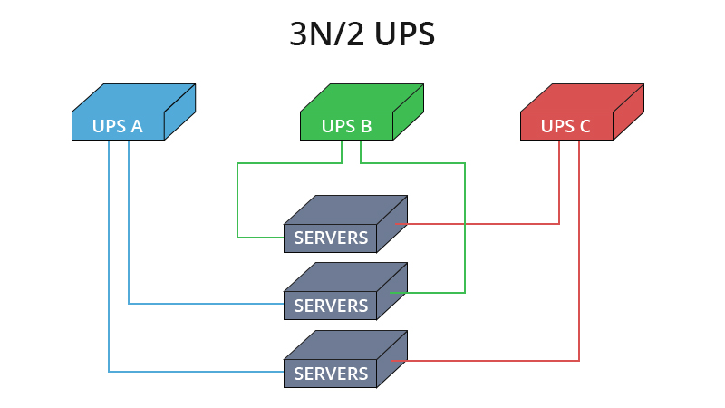

# Network Security Infrastructure

- [On-Premises Data Centers](#on-premises-data-centers)
    - [Heating, Ventilation and Air Conditioning HVAC / Environmental](#heating-ventilation-and-air-conditioning-hvac--environmental)
    - [Data Center/Closets](#data-centerclosets)
    - [Power](#power)
    - [Fire Suppression](#fire-suppression)
- [Redundancy](#redundancy)
- [MOU and MOA](#mou-and-moa)
- [Cloud](#cloud)
- [Managed Service Provider MSP](#managed-service-provider-msp)
- [Service-Level Agreement SLA](#service-level-agreement-sla)
- [Network Design](#network-design)
    - [Network Segmentation](#network-segmentation)
    - [Demilitarized Zone DMZ](#demilitarized-zone-dmz)
    - [Virtual Local Network VLAN](#virtual-local-network-vlan)
    - [Virtual Private Network VPN](#virtual-private-network-vpn)
    - [Defense in Depth](#defense-in-depth)
    - [Network Access Control NAC](#network-access-control-nac)
    - [Zero Trust](#zero-trust)
- [Segmentation for Embedded Systems and IoT](#segmentation-for-embedded-systems-and-iot)
- [Microsegmentation](#microsegmentation)

## On-Premises Data Centers

When it comes to data centers, there are two primary options: organizations can outsource the data center or own the data center. If the data center is owned, it will likely be built on premises. A place, like a building for the data center is needed, along with power, HVAC, fire suppression and redundancy.

Components of a Datacenter:

- [Heating, Ventilation and Air Conditioning HVAC / Environmental](#heating-ventilation-and-air-conditioning-hvac--environmental)
- [Data Center/Closets](#data-centerclosets)
- [Power](#power)
- [Fire Suppression](#fire-suppression)

### Heating, Ventilation and Air Conditioning (HVAC) / Environmental

- Ensure adequate cooling for high-density and enclosed space equipment.
- Follow temperature standards for optimized hardware life.
- Use temperature sensors at various rack levels for precise monitoring.
- Implement contaminant controls for dust and noxious fumes.
- Monitor for water or gas leaks, sewer overflow, and HVAC failure.
- Prioritize critical systems in contingency planning.

### Data Center/Closets

- Protect access to the physical layer for information system security.
- House critical components such as servers and network connections.
- Address security challenges related to data centers and wiring closets.
- Safeguard against intentional or unintentional damage.

### Power

- Ensure constant and consistent power delivery to data centers.
- Mitigate wide fluctuations in power quality to preserve system lifespan.
- Size backup generators for the critical load and use battery backups for stabilization.
- Regularly test alternate power sources for effective failover.

### Fire Suppression

- Choose appropriate fire detection/suppression considering room size and equipment risks.
- Be cautious of water-based suppression's potential harm to electronic components.
- Consider gas-based systems for electronics-friendly suppression, but be mindful of potential human toxicity.

## Redundancy

Design systems with duplicate components for backup in case of failure.

- Assess the need for multiple utility service entrances for redundant communication.
- Aim for full redundancy with devices having two power supplies from diverse sources.
- Backup power sources include batteries and generators.
- In high-availability environments, generators should be redundant and fueled by different sources.

## MOU and MOA 

Both are types of agreements used in various contexts, providing a basis for collaboration and establishing the foundation for future cooperation. MOAs are typically more structured and legally binding compared to MOUs.

- **MOU (Memorandum of Understanding)**
  - Agreement between parties to understand mutual goals and expectations.
  - Outlines broad terms and general understanding.
  - Often non-binding and serves as a framework for future agreements.

- **MOA (Memorandum of Agreement)**
  - More formal than MOU, involves a legally binding commitment.
  - Specifies detailed terms, responsibilities, and obligations.
  - Clearly outlines the agreed-upon course of action.

Additionally:

- **MOU/MOA in Business Continuity**
  - Organizations create agreements for mutual support during emergencies.
  - Parties share resources if one faces a facility-related emergency.
  - Agreements may involve competitors, enhancing industry-wide resilience.

- **Joint Operating Agreements (JOA)**
  - Competing entities collaborate for shared continuity during disruptions.
  - Focus on safety and security collaboration rather than competition.
  - Both outline responsibilities in sharing information, resources, or collaborative efforts, including security responsibilities.

- **Regulatory and Industry Guidelines**
  - Agreements may be mandated by regulations or industry guidelines.
  - Administrative safeguards within industry norms.

- **Difference from SLA**
  - MOU/MOA focuses on system and information usage.
  - SLA delves into granular details, specifying service intricacies.
  - Caution required in cloud-based outsourcing, thorough legal review recommended.

To learn more about other agreement types, please see [Risk Management ](./003-Risk-Management.md#agreement-types)

## Cloud 

Associated with internet-based computing resourcesm it is sold as services by Cloud Service Providers (CSPs).

- **Utility Model**
  - Similar to utilities like electricity.
  - Provisioned in a specific location.
  - Offers scalability, elasticity, and ease of use for IT service deployment.

- **NIST Definition**
  - National Institute of Standards and Technology (NIST) provides a widely accepted definition.
  - Described as a model enabling ubiquitous, on-demand access to a shared pool of configurable computing resources.
  - Emphasizes rapid provisioning and release with minimal management effort.

TO learn more, check out [Cloud Computing](../../README.md#cloud---fundamentals).

## Managed Service Provider (MSP)

A company managing IT assets for another organization and is Commonly utilized by small- and medium-sized businesses for day-to-day IT operations.

- **Outsourcing Functions**
  - Used to outsource specific IT functions or manage entire operations.
  - Expertise provided in areas where the company lacks internal capabilities.

- **Services Provided by MSPs**
  - Network and security monitoring.
  - Patching services.
  - Cloud-based solutions, including Managed Detection and Response (MDR).

- **MDR Service Example**
  - Managed Detection and Response (MDR) involves active incident investigation and response.
  - Monitors security tools, such as firewalls, for event triaging.

- **Common MSP Implementations**
  - Augmenting in-house staff for projects.
  - Implementing products or services.
  - Providing payroll services.
  - Managing Help Desk service.
  - Responding to and managing security incidents.
  - Overseeing all in-house IT infrastructure.

## Service-Level Agreement (SLA)

It is an agreement between a cloud service provider and customer that defines the quality of cloud services, specific to cloud computing terms and roles.

- **Importance of SLA**
  - Functions as a rule book and legal contract.
  - Outlines minimum service levels, availability, security, controls, and more.

- **Purpose of SLA**
  - Documents specific parameters, service levels, and remedies for failures.
  - Addresses data ownership, return, and destruction details.

- **Key SLA Points**
  - Cloud system infrastructure and security standards.
  - Customer's right to audit legal and regulatory compliance.
  - Rights and costs associated with service use continuation/discontinuation.
  - Service availability and performance.
  - Data security, privacy, and location.
  - Disaster recovery processes and data access.
  - Data portability and problem identification/resolution.
  - Change management processes and dispute mediation.
  - Exit strategy considerations.

## Network Design

The objective of network design is to satisfy data communication requirements and result in efficient overall performance.

### Network Segmentation

  - Controls traffic among networked devices.
  - Involves isolating a network from outside communications.

### Demilitarized Zone (DMZ)
  - Isolated network area for outside visitors.
  - Hosts public servers like web, email, and files.

    

    
    

### Virtual Local Network (VLAN)
  - Logically segments a network without altering physical topology.
  - Created by switches.
  - Examples of VLAN Segmentation:
    
    - **Corporate Network:**
        - Departments like HR, Finance, and IT each on separate VLANs.
    - **Guest Wi-Fi:**
        - Isolate guest devices from internal network using a dedicated VLAN.
    - **Voice over IP (VoIP):**
        - Separate VLAN for VoIP traffic to prioritize voice communication.
    - **Server Farm:**
        - Different VLANs for web servers, database servers, ensuring segmentation.

    

    
    

### Virtual Private Network (VPN)

  - Communication tunnel for point-to-point transmission.
  - Secures authentication and data traffic over untrusted networks.

### Defense in Depth
  - Utilizes multiple access controls in layers.
  - Avoids a monolithic security stance.

### Network Access Control (NAC)

- **Overview**
  - Network access is a critical asset, requiring control for both insiders and outsiders.
  - Shift from limited internal access to extended access, including remote connections, BYOD, and IoT.

- **Scope of IoT Devices**
  - Diverse range of devices within an organization, from HVAC systems to security sensors and cameras.
  - Need for NAC solution to identify and control access to these devices.

- **Role of NAC Device**
  - Enforces organization's access control and security policies.
  - Provides network visibility for access security and potential incident response.

- **Key Capabilities of NAC Device**
  - Initiates with policy enforcement based on organization policies.
  - Identifies connections, isolates noncompliant devices, and supports incident response.
  - Ensures compliance with organization policies before allowing devices to join the network.

- **Use Cases for NAC Deployment**
  - Medical devices
  - IoT devices
  - BYOD/mobile devices (laptops, tablets, smartphones)
  - Guest users and contractors

- **Onboarding Process Importance**
  - Emphasizes the importance of an onboarding process for all mobile devices.
  - Device identification and interrogation to ensure compliance with organization policies during network connection.
  
### Zero Trust 

- **Microsegmentation in Zero Trust Networks**
  - Networks are microsegmented with firewalls at each connection point.
  - Focuses on encapsulating information assets and their security properties.

- **Enhanced Security Measures**
  - Recognizes vulnerabilities even in robust access control systems.
  - Adds defenses at the user, asset, and data levels.

- **Frequent Re-authentication**
  - Microsegmented networks enforce frequent user re-authentication.
  - Validates user identity at various checkpoints within the network.

- **Beyond Perimeter Defense**
  - Shifts from reliance on perimeter defense to asset and data protection.
  - Emphasizes authentication and authorization for every user action.

- **Analogous to Concert Access**
  - Traditional controls are like showing a ticket at the gate for free venue access.
  - Zero trust adds multiple checkpoints, validating identity at different levels similar to accessing backstage areas at a concert.

## Segmentation for Embedded Systems and IoT

- **Embedded Systems**
  - A computer implemented as part of a larger system.
  - Designed for specific functions within a larger product.
  - Examples: network-attached printers, smart TVs, HVAC controls, medical devices.

- **Network-Enabled Devices**
  - Devices with native network capabilities.
  - Typically on wireless networks provided by mobile telecom companies.
  - Examples: smartphones, tablets, smart TVs, game systems.

- **Internet of Things (IoT)**
  - Devices communicating over the internet to affect and monitor the real world.
  - Includes smart devices and home equipment.
  - Implementation of industrial environmental control in consumer solutions.

- **Security Considerations for IoT Devices**
  - IoT devices, including embedded systems and network-enabled devices, need special attention.
  - Potential for malicious use, and security breaches could cause harm.
  - Multiple access routes (ethernet, wireless, Bluetooth) require careful isolation.

- **Logical Network Segmentation**
  - Use switches and VLANs for logical network segmentation.
  - Traffic control via MAC addresses, IP addresses, physical ports, protocols, or application filtering.
  - Isolation of IoT environments to enhance security and protect against potential threats.

## Microsegmentation 

- **Microsegmentation**
  - Addresses modern cyber threats exploiting traditional security models.
  - Adversaries use polymorphic tools to bypass static controls.
  - Focuses on protection requirements for traffic within a data center and to/from the internet.

- **Design Requirement of Microsegmentation**
  - Shifts away from infrastructure-centric design paradigms.
  - Aims for increased efficiency in service delivery within the data center.
  - Enhances detection and prevention of advanced persistent threats.

----------------------------------------------

[Back to main page](../../README.md#security)    