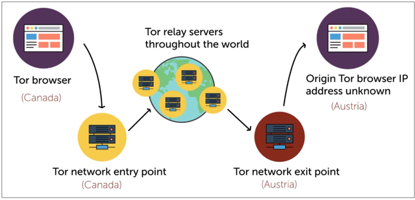

# Threat Intelligence and Sources

- [Threat Intelligence](#threat-intelligence)
- [Quality of Intelligence](#quality-of-intelligence)
- [Types of intelligence](#types-of-intelligence)
    - [Open-Source](#open-source)
    - [Proprietary](#proprietary)
    - [Closed-Source](#closed-source)
    - [Information Sharing Organizations](#information-sharing-organizations)
    - [Open-Source Intelligence OSINT](#open-source-intelligence-osint)
    - [Dark Web](#dark-web)
- [Implicit and Explicit Knowledge](#implicit-and-explicit-knowledge)
- [Automated Indicator Sharing](#automated-indicator-sharing)

## Threat Intelligence 

Threat Intelligence is a continual process used to understand the threats faced by an organization. It is focused on analyzing evidence-based knowledge about an existing or emerging hazard to our asset. 

## Quality of Intelligence 

Consider and measure the quality of intelligence.

- **Timeliness** - Property of an intelligence source that ensures it is up-to-date.

- **Relevancy** - Property of an intelligence source that ensures it matches the use cases intended for it.

- **Accuracy** - Property of an intelligence source that ensures it produces effective results.Information needs to be valid and true.

- **Confidence Levels** - Property of an intelligence source that ensures it produces qualified statements about reliability.

## Types of intelligence

### Open-Source

Data that is available to use without subscription, which may include threat feeds similar to the commercial providers and may contain reputation lists and malware signature databases

- US-CERT
- UK’s NCSC
- AT&T Security (previously Alienvault OTX)
- MISP
- VirusTotal
- Spamhaus
- SANS ISC Suspicious Domains

### Proprietary

Threat intelligence is very widely provided as a commercial service offering, where access to updates and research is subject to a subscription fee 

- Some of these are repackaged information. 
- Not nearly as useful.

Companies that provide proprietary threat intelligence feeds:

- FireEye 
- McAfee 
- Symantec

### Closed-Source

Data that is derived from the provider's own research and analysis efforts, such as data from honeynets that they operate, plus information mined from its customers' systems, suitably anonymized

- Good example is **Fireeye**

### Information Sharing Organizations

These are alliances that are formed to share threat intelligence among its members.

- Centers 
- Organizations

Industries:

- Finance 
- Healthcare
- Energy

### Open-Source Intelligence (OSINT)

Methods of obtaining information about a person or organization through public records, websites, and social media.

### Dark Web 

The Dark Web is a part of the internet that is intentionally hidden and requires special software like Tor to access.

- A segment of the Deep Web, often associated with illegal or illicit activities.
- Often monitored by law enforcement due to its association with cybercrime.
- Contents are not indexed by search engine like Google
- Uses Tor network, which is sits over standard internet protocol.
- Encrypted anonymous connections

How it works:

## Implicit and Explicit Knowledge 

All of the threat feeds mentioned previously as intelligence sources are considered **explicit knowledge**, but **explicit knowledge** comes from years of experience. 

## Automated Indicator Sharing 

Uses a specialized format called **Structured Threat Information Expression (STiX)** to package threat intelligence information.

- Exchange of cybersecurity intelligence between entities

- Uses **Trusted Automated Exchange of Intelligence Information (TAXII)** to transmit the packaged information 
- TAXII is like an RSS feed
- Normally built-in on security monitoring tools

----------------------------------------------

[Back to main page](../../README.md#security)    