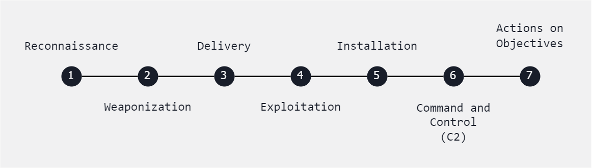
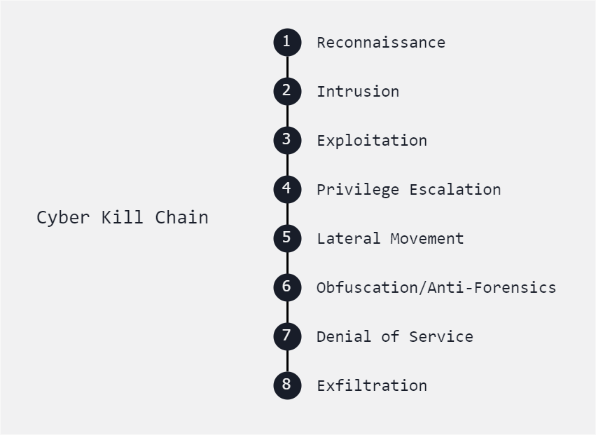

# Attack Frameworks 

Each of the models below have their own benefits and drawbacks. They can be used individually or combined. 

- [Cyber Kill Chain](#cyber-kill-chain)
    - [Reconnaissance](#reconnaissance)
    - [Intrusion](#intrusion)
    - [Exploitation](#exploitation)
    - [Privilege Escalation](#privilege-escalation)
    - [Lateral Movement](#lateral-movement)
    - [Obfuscation/Anti-forensics](#obfuscationanti-forensics)
    - [Denial of Service](#denial-of-service)
    - [Exfiltration](#exfiltration)
- [MITRE ATT&CK Framework](#mitre-attck-framework)
- [Diamond Model of Intrusion Analysis](#diamond-model-of-intrusion-analysis)

## Cyber Kill Chain

A model developed that describes the stages by which a threat actor progresses a network intrusion. 

These are the generic stages of Cyber Kill Chain Analysis.

<!-- - Reconnaissance
- Weaponization
- Delivery
- Exploitation
- Installation
- Command and Control (C2)
- Actions on Objectives -->

Below is another variation of the Cyber Kill Chain which focuses on a detailed range of stages.

### Reconnaissance

- Gathering information about the target, such as identifying vulnerabilities and system configurations.
- Example: 
    - Conducting port scans
    - network mapping
    - OS fingerprinting to identify potential entry points into the target network.

### Intrusion

- Gaining unauthorized access to the target system or network.
- Often done through exploitation of vulnerabilities.
- Example: 
    - Exploiting a known software vulnerability to gain access to a web server 
    - Exploiting weak credentials to log in to a database.

### Exploitation

- Utilizing identified vulnerabilities to compromise the target system or gain control.
- Example: 
    - Exploiting a buffer overflow vulnerability in a web application
    - Execute arbitrary code or deploying malware through a phishing email.

### Privilege Escalation

- Elevating privileges to gain deeper access and control over the compromised system or network.
- Example: 
    - Exploiting a misconfigured service to gain root access on a Linux server 
    - Exploiting a Windows privilege escalation vulnerability to gain administrative privileges.

### Lateral Movement

- Moving laterally within the network to expand access and compromise additional systems or resources.
- Example: 
    - Using compromised credentials to pivot from one system to another within the network
    - Exploiting trust relationships between systems to gain access to sensitive data.

### Obfuscation/Anti-forensics

- Concealing malicious activities and evade detection by security tools and forensic analysis.
- Example: 
    - Encrypting malware payloads to evade antivirus detection 
    - Using steganography to hide malicious code within image files

### Denial of Service

- Disrupting the availability of services or resources to legitimate users.
- Achieved by overwhelming systems with excessive traffic or resource requests.
- Example: 
    - Launching a distributed denial-of-service (DDoS) attack against a web server.
    - Flooding a network with malformed packets to degrade performance.
    - This makes it unavailable to legitimate users

### Exfiltration

- Stealing sensitive data from the compromised system to external servers controlled by attackers.
- Example: 
    - Extracting customer credit card information from a compromised database  
    - Then transferring it to a remote server under the attacker's control 
    - Exfiltrating proprietary company documents via encrypted communication channels.

## MITRE ATT&CK Framework

A knowledge base maintained by the MITRE Corporation for listing and explaining specific **adversary tactics, techniques, and common knowledge** (ATT&CK) or procedures (attack.mitre.org).

- The pre-ATT&CK tactics matrix aligns to the reconnaissance and weaponization phases of the kill chain.
- Used for post-compromise analysis to identify attacker techniques:
  - What was done?
  - How was it done?

Mitigation techniques:

- Modify existing firewall or IDS/IPS alert rules
- Deploy honeypot traps

## Diamond Model of Intrusion Analysis

A framework for analyzing cybersecurity incidents and intrusions by exploring the relationships between four core features: 

- Adversary
- Infrastructure
- Victim
- Capability

It shows how malicious actors use exploit capabilities over an infrastructure againsts victims.

- Use data from honeypots

----------------------------------------------

[Back to main page](../../README.md#security)    

