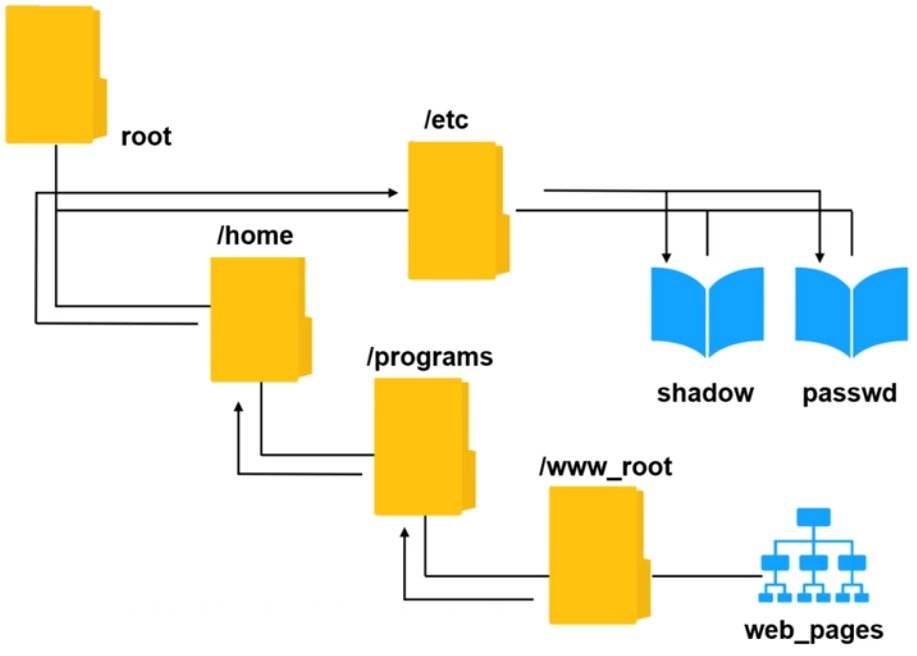
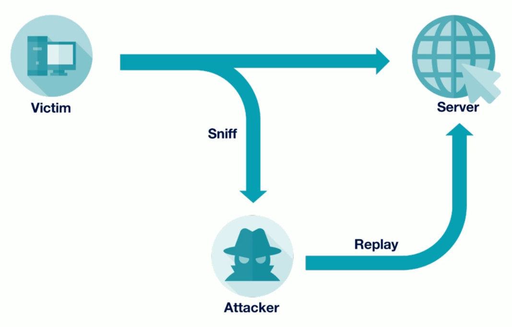
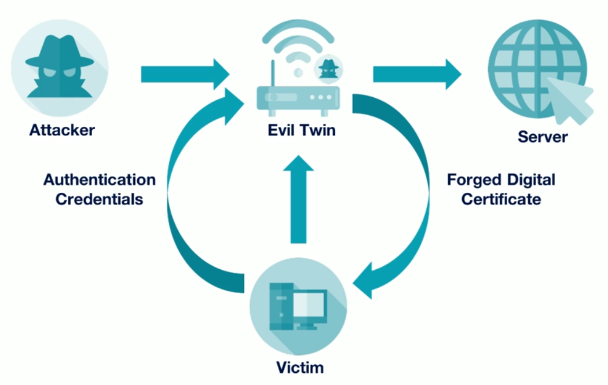
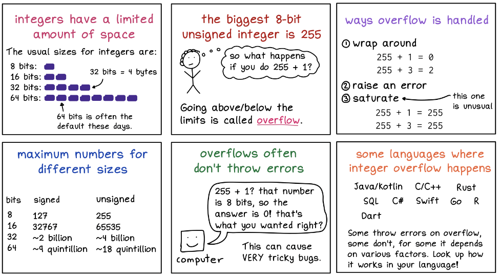

# Attacks 

- [Attacks](#attacks)
- [Password Attacks](#password-attacks)
    - [Brute Force Attack](#brute-force-attack)
    - [Dictionary Attack](#dictionary-attack)
    - [Password Spraying](#password-spraying)
    - [Hybrid Attack](#hybrid-attack)
    - [Birthday Attack](#birthday-attack)
- [Cryptographic Attacks](#cryptographic-attacks)
    - [Downgrade Attacks](#downgrade-attacks)
    - [Collision Attacks](#collision-attacks)
    - [Quantum Computing](#quantum-computing)
    - [Rainbow Table Attack](#rainbow-table-attack)
    - [Pass the Hash Attack](#pass-the-hash-attack)
- [Social Engineering Attacks](#social-engineering-attacks)
    - [Website Redirection](#website-redirection)
    - [Watering Hole Attack](#watering-hole-attack)
    - [Adversarial Artificial Intelligence](#adversarial-artificial-intelligence)
    - [Spam](#spam)
    - [Phishing](#phishing)
    - [Typosquatting](#typosquatting)
- [Denial of Service Attacks](#denial-of-service-attacks)
    - [Flood Attack](#flood-attack)
    - [Permanent DoS](#permanent-dos)
    - [Fork Bomb](#fork-bomb)
    - [Distributed DoS](#distributed-dos)
    - [DNS Amplification](#dns-amplification)
    - [Stopping DDoS](#stopping-ddos)
- [Spoofing Attacks](#spoofing-attacks)
    - [IP Address Spoofing](#ip-address-spoofing)
    - [Session Hijacking](#session-hijacking)
    - [Replay Attack](#replay-attack)
- [Injection Attacks](#injection-attacks)
    - [LDAP Injections](#ldap-injections)
    - [Command Injections](#command-injections)
    - [SQL Injections](#sql-injections)
    - [XML Injections](#xml-injections)
    - [XML Bomb](#xml-bomb)
    - [XML External Entity](#xml-external-entity)
    - [Process Injections](#process-injections)
    - [Directory Traversal](#directory-traversal)
- [Network Attacks](#network-attacks)
    - [Man-in-the-Middle](#man-in-the-middle)
    - [Packet Sniffing](#packet-sniffing)
    - [Oversized Packet Attack](#oversized-packet-attack)
    - [Fragmented Packet Attack](#fragmented-packet-attack)
- [DNS Attacks](#dns-attacks)
    - [Domain Name System](#domain-name-system)
    - [DNS Cache Poisoning](#dns-cache-poisoning)
    - [DNS Amplification Attack](#dns-amplification-attack)
    - [DNS Tunneling](#dns-tunneling)
    - [Domain Hijacking](#domain-hijacking)
    - [DNS Zone Transfer Attacks](#dns-zone-transfer-attacks)
- [Wireless Attacks](#wireless-attacks)
    - [Deauthentication/Deassociation](#deauthenticationdeassociation)
    - [Evil Twin](#evil-twin)
- [Bluetooth Attacks](#bluetooth-attacks)
    - [Bluejacking](#bluejacking)
    - [Bluesnarfing](#bluesnarfing)
    - [Bluebugging](#bluebugging)
    - [Bluesmack](#bluesmack)
    - [Blueborne](#blueborne)
    - [Mitigation Strategies](#mitigation-strategies)
- [On-Path Attack](#on-path-attack)
    - [Interception](#interception)
    - [Replaying the Attack](#replaying-the-attack)
    - [Relaying the Attack](#relaying-the-attack)
    - [SSL Stripping](#ssl-stripping)
- [Layer 2 Attacks](#layer-2-attacks)
    - [ARP Cache Poisoning](#arp-cache-poisoning)
    - [MAC Address Flooding](#mac-address-flooding)
    - [Broadcast Storm](#broadcast-storm)
    - [Layer 2 Attack Mitigation](#layer-2-attack-mitigation)
- [Driver Attacks](#driver-attacks)
    - [Driver Shimming](#driver-shimming)
    - [Driver Refactoring](#driver-refactoring)
- [Execution and Escalation](#execution-and-escalation)
    - [Arbitrary Code Execution](#arbitrary-code-execution)
    - [Remote Code Execution](#remote-code-execution)
    - [Privilege Escalation](#privilege-escalation)
    - [Rootkits](#rootkits)
- [Overflow Attacks](#overflow-attacks)
    - [Integer Overflow](#integer-overflow)
    - [Buffer Overflow Attack](#buffer-overflow-attack)
    - [What is the Heartbleed Bug?](#what-is-the-heartbleed-bug)
- [Other Attacks](#other-attacks)
    - [Cross-Site Scripting](#cross-site-scripting)
    - [Cross-Site Request Forgery](#cross-site-request-forgery)
    - [Server-side Request Forgery](#server-side-request-forgery)
    - [Side Channel Attacks](#side-channel-attacks)
- [Tools](#tools)


## Attacks 

An attempt to compromise the security, availability, or integrity of an IP (Internet Protocol) network.

## Password Attacks 

Attempts to gain unauthorized access by cracking or stealing passwords.

### Brute Force Attack 

A brute force attack uses every possible combination of letters, numbers, and symbols to guess a user's password.

**Mitigations** 

  - Enforce strong and complex password creation policies.
  - Temporarily lock accounts after a certain number of unsuccessful login attempts.
  - Restrict the number of login attempts within a specific time frame.
  - Keep systems and software up-to-date to address vulnerabilities.

### Dictionary Attack 

A dictionary attack is a type of attack that uses a list of common words to guess a user's password. 

**Mitigations** 

  - Enforce strong and complex password creation policies.
  - Temporarily lock accounts after a certain number of unsuccessful login attempts.
  - Use a secure hashing algorithm with a unique salt for each password.
  - Keep systems and software up-to-date to address vulnerabilities.
  - Add an additional authentication layer - MFA

### Password Spraying 

A form of brute force attack that involves trying a small number of commonly used passwords against a large number of username and accounts. 

- Effective, can avoid triggering account lockouts from too many failed login attempts. 
- In a large group of user, there's a good chance some of them uses very common and weak passwords.
- Slower (per-account basis), since each common password is tried on each user first.

**Mitigation:**

- Rate limiting on login attempts to slow down brute force attacks.
- Regular password changes to minimize risks from compromised accounts.
- Ensure users create complex passwords to avoid common and weak ones.
- Monitor for unusual login attempts or patterns.

### Hybrid Attack 

Blends brute force and dictionary techniques by using common passwords with variations, such as adding numbers and special characters.

**Mitigation:**

- Encourage complex passwords - less susceptible to variations.
- Recommend long, randomly generated passwords.
- Lock accounts after repeated failed attempts.
- Implement rate limiting to slow down hybrid attacks.
- Educate users about secure password practices.

### Birthday Attack 

Cybercriminals use birthday attacks to trick systems by cracking digital authentication methods.

**The Birthday Paradox**

  - High odds of at least two will share a birthday in a random group of people. 
  - Easier to find two colliding results of different inputs than generating all possible outputs.

**Birthday Attack in Cybersecurity**

  - Attackers aim to find hash collisions to break security. 
  - Used to crack weak hash functions or forge digital signatures.

**Finding the Collision**

  1. A program repeatedly runs the hash function on randomly selected inputs.
  2. Every input-output pair is stored in a database.
  3. Each output is checked to find collisions (different inputs produce the same output).
  4. Attackers then exploit hash collisions to trick the system into treating different messages as identical.

**Mitigations**
  
  - Use hash functions with large bit sizes; avoid outdated algorithms.


<small>Reference: https://atlasvpn.com/blog/birthday-attack</small>


## Cryptographic Attacks 

In simplests terms, we can perform cryptographic attacks by:

1. Attacking the algorithm
2. Attacking the implementation
3. Attacking the key

### Downgrade Attacks

Also known as **version rollback attack**, downgrade attacks force a system to use a less secure version of a protocol, making it vulnerable to known exploits. 

**How it works**

- Attacker manipulates communication exchanges.
- This makes the parties believe they should use a less secure version of a protocol or a weaker encryption algorithm.
- Achieved by any of the following:
  - Intercepting and altering communication
  - Exploiting fallback mechanisms
  - Exploiting vulnerabilities in protocol negotiation.

**Examples**
  - In HTTPS, an attacker could force a secure connection to revert to an older SSL version with known vulnerabilities.
  - In wireless networks, an attacker might trick a device into connecting to a less secure network.
  - **POODLE Attack** - Padding Oracle on Downgraded Legacty Encryption, which targeted SSL 3.0.

**Mitigations**

- **Protocol Hardening**: 
  - Ensure protocols do not support older, insecure versions. 
  - For example, disable SSL and only use modern TLS versions.

- **Strict Negotiation**: 
  - Implement strict rules for protocol negotiation.
  - This prevents fallback to less secure versions.

- **Secure Communication**: 
  - Use certificates and mutual authentication to validate communication channels and avoid man-in-the-middle attacks.

- **Regular Updates**: 
  - Keep software and systems updated to the latest secure versions, removing outdated protocol support.


### Collision Attacks

Collision attacks find two different inputs that produce the same hash, potentially compromising cryptographic integrity. 

- To breach the integrity of a cryptographic system.
- Exploit vulnerabilities in hash-based security.

**How It Works**

- The attacker tries to find two different inputs that yield the same hash.
- This can be used to forge digital signatures, tamper with data, or bypass security checks.

**Examples**

- MD5 and SHA-1 hash functions have known vulnerabilities allowing collision attacks.
- Birthday Attacks
- Certificate forgery, where an attacker can create a fraudulent certificate with the same hash as a legitimate one.

**Mitigations**

- **Use Secure Hash Functions**:
  - Choose hash functions with no known vulnerabilities. 
  - Avoid MD5 and SHA-1; opt for SHA-256 or stronger.

- **Implement Collision-Resistant Algorithms**: 
  - Employ algorithms designed to resist collisions, especially in digital signatures and certificate generation.

- **Detect Anomalies**: 
  - Implement mechanisms to detect unusual patterns that might indicate a collision attack.

- **Regularly Update Security Practices**: 
  - Stay updated with the latest cryptographic standards and replace vulnerable hash functions as necessary.


### Quantum Computing

Quantum computing poses a threat to traditional cryptography by potentially breaking key cryptographic algorithms. 
  
**How It Works**

- Quantum computers use qubits, which can represent multiple states simultaneously.
- This enables parallel processing at a massive scale.
- This allows quantum computers to run algorithms that can break traditional cryptographic methods.
- Example: Shor's algorithm for integer factorization.
  
**Implications for Cryptography**

- Quantum computing threatens public-key encryption algorithms like RSA and ECC.
- RSA and ECC rely on computational hardness (e.g., factoring large numbers).
- Symmetric key algorithms are more resistant but require longer key lengths to remain secure.
- **Post-quantum cryptography**, which aims to create algorithms resistant to quantum attacks.
  
  - CRYSTALS-Dilithium 
  - FALCON 
  - SPHINCS+


**Mitigations**

- **Transition to Post-Quantum Cryptography**: 

  - Adopt cryptographic algorithms designed to withstand quantum attacks.
  - Examples are lattice-based or hash-based algorithms.

- **Use Larger Key Sizes**: 

  - Increase key sizes in symmetric encryption.
  - This provides a greater buffer against quantum computing threats.

- **Hybrid Cryptographic Systems**: 

  - Implement systems that use a mix of traditional and post-quantum cryptographic techniques.

- **Monitor Quantum Advancements**: 

  - Keep informed about developments in quantum computing and adapt security strategies accordingly.

### Rainbow Table Attack 

A rainbow table attack uses precomputed hashes to find a matching hash value for a user's password (see ISC2 Study Guide, Module 2, under Types of Threats). 

**Mitigations** 

  - Add a unique random value (salt) to each password before hashing.
  - Choose robust cryptographic hash functions resistant to rainbow tables.
  - Enforce strong and complex password creation policies.
  - Stay current with advancements, adopting newer, more secure hash functions.
  - Implement Two-Factor Authentication (2FA)


### Pass the Hash Attack

A "pass the hash" attack involves using a hashed password to gain unauthorized access to a system, bypassing the need for the plaintext password. Attackers obtain the hash and use it to authenticate without knowing the actual password.

- Attackers steal password hashes from compromised systems.
- They use these hashes to authenticate, avoiding password-based checks.
- Common in Windows environments with NTLM authentication.


**Mimikatz**

  - An open-source tool for security testing and penetration testing.
  - Extracts plaintext passwords, hashes, and Kerberos tickets from memory.
  - Enables "pass the hash" and "pass the ticket" attacks.
  - Manipulates Windows authentication tokens.

**Common Use Cases of Mimikatz**

  - Used by penetration testers to assess security on Windows systems.
  - Often exploited by hackers for unauthorized access.

**Mitigation Measures**

  - Apply multi-factor authentication.
  - Keep Windows systems updated with security patches.
  - Limit administrative access and use secure password management.
  - Ensure only trusted OS are allowed to connect to your servers.
  - Implement least privilege for all user accounts.


## Social Engineering Attacks 

### Website Redirection

Redirecting users from legitimate websites to malicious ones without their knowledge or consent.

  - Often achieved through compromised websites, phishing emails, or malicious scripts injected into web pages.
  - Can lead to phishing attacks, malware installation, or theft of sensitive information.
  - Targets users' trust in familiar websites to deceive them into visiting malicious domains.
  - **DNS Poisoning** - compromising a DNS server and create fake domains
  - **URL Hijacking** - Redirects traffic from legitimate URLs to malicious or fraudulent websites.

Mitigation:

- Implementing secure coding practices
- Regular website security audits
- User education about potential risks

### Watering Hole Attack

Considered as a passive attack, Watering Hole attacks target websites that are frequently visited by a specific group of users, such as employees of a company or members of a community.

- Exploits vulnerabilities in these websites to launch phishing attacks against the targeted group.
- Often used to compromise organizations by infecting their employees' devices or stealing sensitive information.
- Mimics the behavior of predators waiting near water sources to ambush prey, hence "watering hole" attack.
  
Mitigation:

- Regularly updating website software
- Implementing web application firewalls
- Educating users about the risks of visiting untrusted websites.

### Adversarial Artificial Intelligence

AI systems designed to deceive, manipulate, or exploit vulnerabilities in other AI systems or human users.

- Uses advanced algorithms to generate realistic fake content or manipulate data for malicious purposes.
- Using algorithm functionalities which can improve themselves over time based on data.
- Example: Analyzing user's habit, Gathering history of compromises, etc.

### Spam 

Spam refers to mass mailing of unsolicited messages.

- Usually used to promote products or services or collect information.
- Can also be used to trick users into clicking links.

### Phishing

Sending deceptive emails or messages to trick recipients into divulging personal information or clicking malicious links.

- Intentionally deceiving people to create a sense of urgency or legitimacy.
- **Smishing** - Phishing through SMS text messages.
- **Vishing** - Phishing over the phone or through call.
- **Spear Phishing** - Targeted phishing on certain individuals.
- **Whaling** - Spear phishing, but for high-ranking people.

### Typosquatting   

Attacker registers a domain name similar to a popular website. The "copycat" domain name usually contains some kind of common typographical errors.

- Goal is to victimize users who might accidentally mistype a URL.
- Can trick users pretty easily, if they're not looking carefully at the URL.
- Example: Registering "gnail.com" to impersonate gmail.com


## Denial of Service Attacks

An attack that attempts to overload a network or website with traffic to make it unavailable.

Mitigation:

- **Load Balancers**: Distribute traffic across multiple servers.
- **Rate Limiting**: Limit requests per user or IP address.
- **CDNs**: Disperse network traffic.
- **DDoS Protection**: Use specialized services for DDoS mitigation.
- **Firewalls and IPS**: Detect and block DoS patterns.

### Flood Attack 

A specialized type of of DoS which attempts to send more packets to a single serve or host than it can handle.

Variations:

- **Ping Flood**

  - A server is sent with too many pings (ICMP request packet).
  - Many organizations are now blocking echo replies.
  - Firewall could be configured to drop these requests.

- **SYN Flood**

  - Attacker initiates multiple TCP sessions but never complete the 3-way handshake.
  - SYN packets could be sent with made-up IP addresses.
  - Server replies to establish the 3-way handshake but no one responds.
  - Server reserves resouces to wait for these acknowledgements from these clients.
  - With enough requests, server will run out of resources.
  - Mitigation:
    - Flood guards - detect SYN floods and block request at the network boundary.
    - Timeouts - stop connections after a period of time, e.g. 10, 15, 30 seconds
    - IPS - can detect and respond to SYN floods.

### Permanent DoS

An attack which exploits a security flaw by reflashing a firmware, permanently breaking the device.

- Device is unable to reboot itself because the OS is overwritten.
- Its permanent, because a quick reboot won't bring it back online.
- Device has to be taken offline and have a full firmware reload.

### Fork Bomb 

A large number of processes is created to use up a computer's available processing power.

- The process is called **fork**
- Process can be forked into more processes until it eats up all resources.
- **Not a worm**, they don't infect programs and don't spread in the network.
- Instead they spread to the processor's cache on a single computer.


### Distributed DoS

With DDoS, more machines are used to launch an attack simultaneously against a single server to create a denial of service condition.

- Usually the machines don't also know they're part of the attack.
- Machines can become zombies or bots inside a large botnet

### DNS Amplification 

A specialized DDoS attack that allows an attacker to initiate DNS requests from a spoof IP address to flood a website.

- High volume of packets are sent, DNS servers respond to the request.
- Response from the DNS server takes up a lot of bandwidth.

To learn more, see [DNS Amplification Attack.](#dns-amplification-attack) 

### Stopping DDoS 

- **Blackhole/Sinkhole**

  - Identifies the attacking IP addresses and routes traffic to non-existent server.
  - Effectively stops attack, but attackers can still move to new IP.

- **IDS/IPS**

  - Identify and respond to DoS attacks.
  - Works for small-scale attacks but not large-scale, not enough processing power.

- **Elastic Cloud Infrastructure**

  - Builds the infrastructure in a scalable way,
  - Cloud providers charge you based on resources used.
  - No return on investment, these traffic are wasted, they don't generate revenue.
  - There are specialized cloud providers for DDoS protection:
    - CloudFlare 
    - Akamai

## Spoofing Attacks 

Cybercriminals impersonate a familiar or trusted source to interact with targets, aiming to steal information, extort money, or install malicious software on their devices.

Example of spoofing attacks:

- Email Spoofing
- Caller ID Spoofing
- Website/Domain Spoofing
- IP Spoofing
- ARP Spoofing
- GPS Spoofing
- Facial Spoofing
- Man-in-the-middle attack 

**Mitigations** 

- **Email Security**: Use SPF, DKIM, and DMARC.
- **User Training**: Educate on recognizing suspicious communications.
- **Secure Authentication**: Use multifactor authentication.
- **Access Controls**: Limit sensitive system access.
- **Secure Routing**: Implement SBGP or similar protocols.
- **Network Access Control (NAC)**: Restrict unauthorized devices.
- **IDS/IPS**: Detect spoofing patterns.

<small>Reference: https://www.crowdstrike.com/cybersecurity-101/spoofing-attacks/</small>

### IP Address Spoofing

Impersonating a trusted IP address to gain unauthorized access. 

**Mitigations** 

- **Packet Filtering**: Block spoofed IP addresses.
- **Secure Routing**: Use SBGP to validate routing.
- **Network Access Control (NAC)**: Restrict unauthorized devices from network access.
- **IDS/IPS**: Monitor for spoofing patterns.


### Session Hijacking 

**Session Management**

- A fundamental security component that enables web applications to identify a user.
- Uniquely identify user across requests while keeping the state of the data.
- Data generated by the user is ensured to be assigned to that user only.
- Information can be stored in database or cookies.

**Cookies**

- HTTP is a stateless protocol, server doesn't preserve any info about the client.
- To store the client information, store it in a cookie or database.
- Cookies allow web app to retain information about the users. 
- Any subsequest request headers sent by the client will contain the cookie.
- Needs to encrypt cookies to protect the session.
- Types: 

  - **Session Cookies**

    - Non-persistent, only stored in the browser.
    - When browser is closed, cookies are deleted.

  - **Persistent Cookies**

    - Stay around even after the browser is closed.
    - Stored in the browser cache until they're deleted by the user.
    - Delete when user "Clear cookies", or when they pass the defined expiration date.

**Session Hijacking**

- Spoofing attack where host is disconnected and replaced by the attacker.
- Occurs through theft or modification of cookies.

**Session Prediction**

- Attacker attempts to predict session token to hijack the session.
- If token is predictable, they can be guessed, attackers can take over the session.

**Cookie Poisoning**

- Modifying the contents of the cookies to be sent to a client's browser.
- Modified cookie can be used to exploit vulnerabilities in a web app

### Replay Attack

Attacker intercepts and retransmits a valid data transmission to trick the receiver into unauthorized actions, often impersonating one of the legitimate parties in the communication.

- Interception and retransmission of valid data packets.
- Unauthorized access, data manipulation, session hijacking.

**Mitigations**:

- Time-stamped tokens or nonces, ensures each transaction is unique and only valid for a short period.
- Use TLS/SSL to encrypt data and make interception more difficult.
- Mutual authentication techniques, validate each other's identities.
- Maintain a session or message log to track and verify unique transactions.
- Replay detection mechanisms to identify and block replayed messages.
- Use WPA3 to avoid replay attacks.

**Difference with Session Hijacking**

- Replay Attacks - attacker intercepts data, decides whether to retransmit it later.
- Session Hijacking - attacker alters data transmission in real-time.


## Injection Attacks

### LDAP Injections

Targets applications which construct LDAP statements based on user input. By injecting malicious LDAP statements, attackers can compromise the LDAP query, allowing them access.

- Maliciously crafted LDAP queries.
- Unauthorized access to sensitive information, data leakage, privilege escalation.
- Anomalous LDAP query patterns, unexpected changes in directory data.

**Mitigations**:

- Input validation and sanitization, ensure only valid data is processed.
- Use parameterized queries and prepared statements.
- Regularly audit and review LDAP queries and access controls.
- Employ security tools to monitor and detect unusual LDAP activity.

### Command Injections

Attacker inserts arbitrary commands into a program that are then executed by the host operating system. This can lead to unauthorized actions and compromise system integrity.

- Injecting commands into a system shell or process.
- Unauthorized command execution, data theft, system compromise, denial of service.
- Unusual command executions, system logs showing unexpected command activity.

**Mitigations**:

- Input validation and sanitization to prevent execution of arbitrary commands.
- Least privilege principles, ensuring applications run with necessary permissions.
- Use secure coding practices to avoid direct command execution from user inputs.
- Regularly update and patch systems to fix vulnerabilities.

### SQL Injections

Attackers insert malicious SQL code into a query. This can allow unauthorized access to the database, retrieval of sensitive data, or alteration of the database structure.

- Maliciously crafted SQL queries.
- Data leakage, unauthorized database access, data manipulation, system compromise.
- Monitoring for unusual SQL query patterns, database activity monitoring.

**Structured Query Language**

- SQL, or Structured Query Language
- Used for managing and manipulating relational databases. 
- Allows users to perform various operations.

**Main SQL Actions**

- **SELECT**: Retrieves data from one or more tables based on specified criteria.
- **INSERT**: Adds new rows of data into a table.
- **UPDATE**: Modifies existing data in a table based on specified conditions.
- **DELETE**: Removes rows of data from a table based on specified conditions.

**Injecting SQL Commands**

- Entering data 
- Modifying cookies
- Changing POST data
- Using HTTP headers 

**Mitigations**:

- Use parameterized queries and prepared statements to prevent SQL injection.
- Implement strict input validation and sanitization.
- Employ least privilege access controls for database accounts.
- Regularly audit and review database queries and security configurations.
- Use web application firewalls (WAF) to filter and monitor SQL injection attempts.

### XML Injections

XML Injection exploits vulnerabilities in XML (eXtensible Markup Language) parsers or applications that process XML input. 

- Injection of malicious XML code into XML documents or data streams.
- Data manipulation, information leakage, denial of service.
- Unexpected behavior in XML parsing, error messages revealing XML structure.

**eXtensible Markup Language**

- XML, or eXtensible Markup Language.
- Defines rules for encoding in human-readable and machine-readable. 
- Structures data in a hierarchical format using tags, similar to HTML. 
- Commonly used for data exchange between different systems and platforms.
- Sample XML data:

    ```xml
    <library>    
      <book>
        <title>The Great Gatsby</title>
        <author>F. Scott Fitzgerald</author>
        <genre>Classic</genre>
        <year>1925</year>
      </book>
      
      <book>
        <title>To Kill a Mockingbird</title>
        <author>Harper Lee</author>
        <genre>Fiction</genre>
        <year>1960</year>
      </book>
    </library>
    ```

**Mitigations**:

- Input validation and input sanitization.
- Parameterized queries and prepared statements when incorporating XML data into database operations.
- XML schema validation to enforce data integrity and prevent injection attacks.
- Limit XML processing capabilities to reduce the attack surface.
- Regularly update XML parsers and libraries to patch known vulnerabilities.

### XML Bomb

An XML bomb is a type of denial-of-service (DoS) attack where an XML document is crafted to consume excessive system resources when parsed by an XML parser.

- Recursive or nested elements designed to expand exponentially when parsed.
- XML encodes entities that expand to exponential sizes.
- Consumes large memory, CPU, or disk space when processed by an XML parser.
- Can lead to system downtime, service disruption, or unavailability.

The reason why its also called as **Billion Laughs Attack** is because the XML entities referenced in the file are written as "lol1" through "lol9". Each of these references the line before it, with the pattern continuing all the way up until it creates a billion "lols" due to the factorial nature.

```xml
<!DOCTYPE lol [
  <!ENTITY lol "lol">
  <!ENTITY lol1 "&lol;&lol;&lol;&lol;&lol;&lol;&lol;&lol;&lol;&lol;">
  <!ENTITY lol2 "&lol1;&lol1;&lol1;&lol1;&lol1;&lol1;&lol1;&lol1;&lol1;&lol1;">
  <!ENTITY lol3 "&lol2;&lol2;&lol2;&lol2;&lol2;&lol2;&lol2;&lol2;&lol2;&lol2;">
  <!ENTITY lol4 "&lol3;&lol3;&lol3;&lol3;&lol3;&lol3;&lol3;&lol3;&lol3;&lol3;">
]>
<root>
  &lol4;&lol4;&lol4;&lol4;&lol4;&lol4;&lol4;&lol4;&lol4;&lol4;
</root>
```

Another form of XML Bomb:

```xml
<!DOCTYPE bomb [
  <!ENTITY a "1234567890">
  <!ENTITY b "&a;&a;&a;&a;&a;&a;&a;&a;&a;&a;">
  <!ENTITY c "&b;&b;&b;&b;&b;&b;&b;&b;&b;&b;">
  <!ENTITY d "&c;&c;&c;&c;&c;&c;&c;&c;&c;&c;">
  <!ENTITY e "&d;&d;&d;&d;&d;&d;&d;&d;&d;&d;">
]>
<root>
  &e;&e;&e;&e;&e;&e;&e;&e;&e;&e;
</root>
 ```

**Mitigations**: 

- Use secure XML parsers.
- Limit entity expansion.
- Implement resource usage limits.


### XML External Entity

XML External Entity (XXE) allows an attacker to include external entities in an XML document, which can lead to information disclosure, server-side request forgery (SSRF), or remote code execution. This vulnerability arises when an XML parser processes external entities defined within the document.

- Attackers embeds a request for a local resource.
- Read local files, perform SSRF attacks, or execute arbitrary code.
- Compromise of sensitive data, unauthorized access to resources, etc.

When the below XML document is processed by an XML parser, it attempts to resolve the xxe entity, resulting in the inclusion of the contents of the /etc/passwd file within the "username" element.

```xml
<?xml version="1.0" encoding="UTF-8"?>
<!DOCTYPE data [
  <!ENTITY xxe SYSTEM "file:///etc/passwd">
]>
<data>
  <username>&xxe;</username>
</data>
```

**Mitigations**: 

- Disable external entity processing.
- Use secure XML parsers.
- Input validation/sanitization.


### Process Injections

Malicious code is injected into a legitimate process to evade detection and execution restrictions. This allows the attacker to execute code within the address space of a separate live process.

- Execution is masked as a legitimate process, evading security products.
- Stealthy execution of malicious code, evasion of security mechanisms, data theft.
- Monitoring for unusual process behavior, changes in process memory.

**Ways to inject code:**

- Injection through DLLs 
- Thread Execution Hijacking
- Process Hollowing
- Process Doppelganging
- Asynchronous Procedure Calls
- Portable Execution Injections

**Mitigations**:

- Endpoint protection tools that detect and block process injection techniques.
- Use process integrity monitoring to detect changes in process behavior.
- Data execution prevention (DEP) and address space layout randomization (ASLR).
- Regularly update and patch applications and operating systems.

### Directory Traversal

Also known as **Path Traversal**, it exploits insufficient security validation/sanitization of user-supplied file names to access directories and files outside the web root folder. 

- Manipulation of file paths to traverse directories.
- Unauthorized access to files and directories, data leakage, system compromise.
- Unusual file access patterns, log entries showing traversal sequences like `../`.


How it looks like:

<p align=center>

</p>

**Hiding the traversal**

- Attackers can still hide traversal attempts by masking "../" with:

  ```bash
  %2e%2e%2f
  ```

**File Inclusion**

- Allows an attacker to download files or upload an executable for backdoor.
- Types:
  - **Remote File Inclusion**
    - Attacker executes a script to inject a remote file into the web app.
    
  - **Local File Inclusion**
    - Attacker tries to add a file that already exists.

**Mitigations**:

- Validate and sanitize user inputs to ensure only safe characters are allowed.
- Secure APIs to abstract file paths and prevent direct access to the filesystem.
- Configure web server to disallow requests containing traversal sequences.
- Access controls restricting aaccess to sensitive files and directories.
- Regularly audit and monitor file system access logs for suspicious activities.


## Network Attacks 

### Man-in-the-Middle

Intercepting and possibly altering communication between two parties.

Mitigation:

- **Encryption**: Use HTTPS, SSL/TLS, and VPNs.
- **Public Key Infrastructure (PKI)**: Verify certificate authenticity.
- **Secure Authentication**: Implement multifactor authentication.
- **Network Segmentation**: Limit access to sensitive systems.
- **IDS/IPS**: Monitor for suspicious network activity.

### Packet Sniffing

Illegally intercepting and examining unencrypted data packets.

**Mitigations** 

- **Encryption**: Secure data in transit with HTTPS or VPNs.
- **Secure Wi-Fi**: Use WPA3 for wireless networks.
- **Network Segmentation**: Restrict access to sensitive data.
- **Network Monitoring**: Detect unauthorized packet sniffing.


### Oversized Packet Attack 

Oversized packet attacks involve sending data packets that exceed the maximum allowable size, exploiting vulnerabilities in network protocols.   

**Mitigations** 

- **Packet Size Limits**: Enforce maximum packet sizes.
- **Network Monitoring**: Detect oversized packet patterns.
- **Rate Limiting**: Limit large packets.
- **Firewall Rules**: Block unusually large packets.

### Fragmented Packet Attack 

Fragmented packet attacks involve breaking down data into smaller fragments to bypass network security measures, exploiting vulnerabilities in reassembly processes.

**Mitigations** 

- **Reassembly Timeouts**: Set timeouts for reassembly.
- **Fragmentation Limits**: Limit fragment size and count.
- **IDS/IPS**: Detect unusual fragmentation.
- **Secure Protocols**: Use protocols that handle fragmentation securely.


## DNS Attacks 

### Domain Name System 

Domain Name System or DNS is responsible for translating human-friendly domain names into IP addresses that computers understand.


### DNS Cache Poisoning

Also known as **DNS spoofing**, is a type of attack where false DNS information is introduced into the DNS resolver's cache, causing it to return an incorrect IP address.

- Manipulation of DNS cache.
- Redirects users to fraudulent websites, phishing attacks, malware distribution.
- Monitoring DNS traffic for unusual patterns, unexpected DNS responses.

**Mitigations**:

- **DNSSEC** (Domain Name System Security Extensions), verifies authenticity of DNS data.
- Use secure DNS resolvers and regularly clear and update DNS cache.
- Protect DNS servers with secure network configurations and firewalls.
- Employ intrusion detection systems (IDS) to monitor for unusual DNS activity.

### DNS Amplification Attack

DNS Amplification Attack is a type of DDoS attack that uses open DNS resolvers to flood a target with amplified traffic, overwhelming the target's resources and causing service disruption.

- Exploitation of DNS resolvers to amplify traffic.
- Service outages, network congestion, degraded performance.
- Unusually high DNS traffic, traffic originating from multiple sources.

**Mitigations**:

- Configure DNS servers to prevent recursion for unauthorized users.
- Rate limiting on DNS requests and anomaly detection mechanisms.
- Use Anycast networks to distribute and manage traffic load.

### DNS Tunneling

DNS Tunneling involves encoding the data within DNS queries and responses to bypass network security measures. This technique can be used for covert communication or data exfiltration.

- Encapsulate non-DNS trafic over port 53 to bypass firewalls rules.
- Legitimate technique, but is often exploited by attackers.
- Data exfiltration, bypassing security controls, command and control for malware.
- Unusual DNS query patterns, large volume of DNS traffic, long domain names.

**Mitigations**:

- Monitor and analyze DNS traffic for unusual patterns.
- Implement deep packet inspection (DPI) to detect tunneled traffic.
- Restrict DNS queries to known and trusted DNS servers.
- Use DNS firewalls to block suspicious or unauthorized DNS traffic.

### Domain Hijacking

Domain Hijacking involves the unauthorized acquisition of a domain name. Attackers gain control over the domain registrar account or exploit vulnerabilities to change domain registration information.

- Exploitation of domain registrar accounts, social engineering.
- Loss of domain control, website defacement, phishing, etc.
- Configure alerts for unauthorized changes to domain registration, WHOIS records.

**Mitigations**:

- Enable two-factor authentication (2FA) for domain registrar accounts.
- Use strong, unique passwords for domain accounts.
- Regularly monitor and review domain registration details.
- Lock the domain to prevent unauthorized transfers.

### DNS Zone Transfer Attacks

Attackers successfully requests a copy of the DNS zone data from a DNS server. This data can provide valuable information about the network, such as internal IP addresses and hostnames, which can be used to launch further attacks.

- Unauthorized zone transfer requests.
- Exposure of sensitive network information, reconnaissance for further attacks.
- Monitoring for unauthorized zone transfer requests, unusual query patterns.

**Mitigations**:

- Restrict zone transfers to specific IP addresses/authorized secondary DNS servers.
- Implement access controls and authentication for DNS zone transfers.
- Regularly audit and update DNS server configurations.
- Use network security tools to detect and block unauthorized zone transfer attempts.

## Wireless Attacks

Wireless attacks target vulnerabilities in wireless networks to disrupt service or gain unauthorized access.

### Deauthentication/Deassociation

Deauthentication and deassociation attacks force devices to disconnect from a wireless network.

- Exploits the deauthentication frame in the 802.11 protocol.
- Disrupts network connectivity for users.
- Can be used to capture WPA/WPA2 handshakes for brute-force attacks.
- Commonly used in denial-of-service (DoS) attacks on Wi-Fi networks.

Summary steps:

1. Discover Access Points

  - Need to know the AP MAC address and the channel it is listening on.
  - This can easily be found through **airodump**, which is built-in to Kali Linux.

2. Discover connected clients.

  - Find connected clients or clients that are in the process of connecting.
  - The goal is to capture the wireless traffic while client is authenticating.
  - Record the MAC address of the client that is authenticating to the wireless network.

3. Disconnect active client from AP.

  - Tools can be used, like **aireplay** which is built-in to Kali Linux.
  - Need to specify the MAC address of both the client and the AP.

4. Monitor client-AP handshake.

  - When victim client is disconnected, it will try to reconnect to the wireless network.
  - Capture the traffic.

5. Perform online/offline dictionary or brute-force attack.

  - The goal is to determine the pre-shared key (PSK).
  - A text file containing a long list of common passphrases can be used.

### Evil Twin

Evil Twin attacks involve setting up a rogue access point that mimics a legitimate one to intercept data.

- Attackers create a fake Wi-Fi network with the same SSID as a trusted network.
- Users unknowingly connect to the rogue access point.
- Allows attackers to capture sensitive information like passwords and emails.
- Often used in phishing attacks to steal login credentials.

## Bluetooth Attacks 

### Bluejacking
Bluejacking involves sending unsolicited messages to Bluetooth-enabled devices. These messages usually appear as notifications or contact information and are typically harmless.

- An attacker uses a Bluetooth device to scan for nearby devices.
- Messages are sent via the Bluetooth "contact" feature.
- Recipients receive unexpected notifications.
- Typically harmless but can be used for spam or pranks.

### Bluesnarfing
Bluesnarfing is the unauthorized access to information on a Bluetooth-enabled device through a Bluetooth connection. Attackers can retrieve sensitive data such as contacts, messages, and emails.

- Attackers scan for discoverable Bluetooth devices.
- Exploits vulnerabilities in the Bluetooth connection process.
- Specialized software exploits Bluetooth protocol vulnerabilities.
- Can lead to stolen contact lists, messages, and other sensitive information.

### Bluebugging
Bluebugging allows attackers to gain control over a Bluetooth-enabled device. They can perform actions like making calls, sending messages, or accessing data remotely.

- Advanced bluesnarfing.
- Exploits vulnerabilities in the Bluetooth protocol.
- Allows remote control of a Bluetooth-enabled device without the owner's consent.
- Attackers can make calls, send messages, and access other device functions.

### Bluesmack
Bluesmack is a denial-of-service (DoS) attack that overwhelms Bluetooth-enabled devices, causing them to become unresponsive.

- Attackers send a large number of malicious packets to the target device.
- The device's resources get overwhelmed and become slow or crash.
- Results in temporary or permanent denial of service.

### Blueborne
Blueborne exploits vulnerabilities in the Bluetooth protocol, allowing attackers to take complete control of a device without any user interaction. It can lead to full device compromise and data theft.

- Attackers scan for Bluetooth-enabled devices.
- Exploits Blueborne vulnerabilities for remote code execution.
- Allows malware to spread via Bluetooth without user interaction.
- Unauthorized data access, device takeover, and further malware distribution.

### Mitigation Strategies
To protect against these Bluetooth attacks:

- Keep Bluetooth off when not in use.
- Use non-discoverable mode to prevent unauthorized scanning.
- Update devices regularly for the latest security patches.
- Pair devices only with trusted sources.
- Monitor Bluetooth connections for unusual activity.
- Use encryption and strong authentication mechanisms where possible.


## On-Path Attack 

An on-path Attack is an attack that attempts to position between two devices (e.g., web browser and server) to intercept or modify information.

- Passive attack with no direct interaction with the target system.
- Differs from DDoS attacks involving numerous unsuspecting secondary victims.
- Primary goal is to gain system access by impersonating a legitimate user or device.

**Mitigations** 

- Use HTTPS, SSL/TLS to protect data.
- Network Segmentation, limit access to critical systems.
- IDS/IPS, detect suspicious traffic patterns.
- Ensure routing data is accurate and secure.

### Interception 

Ways to conduct on-path or interception attacks:

- **ARP Poisoning**

  - Manipulates the ARP cache on a local network.
  - Associates attacker's MAC address with the IP address of a legitimate device.
  - More details found here: [ARP Cache Poisoning](#arp-cache-poisoning)

- **DNS Poisoning**

  - Inserts malicious entries into DNS resolver's cache.
  - Redirects users to fraudulent or malicious websites.
  - Can be used to steal credentials or deliver malware.
  - Affects the integrity of DNS resolution.

- **Introducing a Rogue WAP**

  - Sets up a fake Wireless Access Point.
  - Entices users to connect to it instead of a legitimate WAP.
  - Intercepts and monitors all traffic between the user and the internet.
  - Can capture sensitive information like passwords and personal data.

- **Introducing a Rogue Router/Switch**

  - Deploys unauthorized networking devices into the network.
  - Intercepts, manipulates, or redirects network traffic.
  - Can be used to capture data packets for analysis.
  - May disrupt legitimate network operations or degrade performance.


### Replaying the Attack 

Occurs when an attacker captures a valid data which is then repeated immediately or delayed and then repeated. See [Replay Attack.](#replay-attack)

<p align=center>

</p>

### Relaying the Attack 

Occurs when an attacker inserts themselves in between two hosts and become part of the conversation, and they can read or modify any any communications.

<p align=center>

</p>

### SSL Stripping 

If the server is using a strong encryption scheme like TLS 1.3, it's going to be difficult for an attacker to insert himself in between the two hosts. To overcome this, the attacker can use SSL stripping.

- Tricking the application to use HTTP instead of HTTPS connection.
- If it is impossible, attackers can resort to [downgrade attacks.](#downgrade-attacks)


## Layer 2 Attacks 

### ARP Cache Poisoning

ARP cache poisoning involves sending falsified ARP (Address Resolution Protocol) messages to a local network.

- Redirects traffic intended for one host to another host.
- Often used for man-in-the-middle attacks.
- Can lead to data interception and unauthorized access.

Mitigations:

- Use static ARP cache entries. 
- Hosts should not accept ARP cache updates.
- Limit access to the network.

### MAC Address Flooding

MAC address flooding overwhelms a network switch with fake MAC addresses.

- Forces switch to broadcast traffic to all ports.
- Results in potential data exposure and network congestion.
- Used to intercept data in a switched network environment.

**Fail-open**

- When MAC flooding occurs, the network switch will simply fail open.
- When it fail-open, the switch begins to rebroadcast all traffic out to every port.


### Broadcast Storm

A broadcast storm occurs when a network is overwhelmed with continuous broadcast or multicast traffic.

- Also known as **Switching Loop**
- Can cause network congestion and slow down or crash the network.
- Often triggered by a loop in the network.
- Disrupts normal network communication.

Can be caused by:

- Faulty switch, network card ("jabber")
- Redundant links between switches

Mitigation:

- Configure STP (Spanning Tree Protocol) on the switch.

### Layer 2 Attack Mitigation

Mitigating Layer 2 attacks involves implementing various security measures.

- Enable port security to limit the number of MAC addresses per port.
- Employ MAC address filtering for network access.
- Use VLANs to segment and isolate network traffic.
- Implement Dynamic ARP Inspection (DAI) to prevent ARP spoofing.
- Use Static MAC Address assignments.
- Disable unused switch ports.
- Enable storm control to prevent broadcast storms.
- Configure STP and BPDU to prevent broadcast storms.
- Regularly update network devices to patch vulnerabilities.


## Driver Attacks

**Driver**:
A driver is software that allows the operating system to communicate with hardware devices, enabling the functionality of peripherals such as printers, graphics cards, and network adapters.

**Driver Attacks**:
Driver attacks exploit vulnerabilities within these drivers to gain unauthorized access or control over a system, potentially leading to data breaches, system instability, and other security issues.

### Driver Shimming

Driver shimming involves inserting a layer of code between the operating system and the driver to intercept and modify its behavior.

- Used to add compatibility for older drivers or to monitor and log driver activities.
- Can be exploited to introduce malicious code or alter driver functions.
- May lead to system instability or unauthorized access.

### Driver Refactoring

Driver refactoring entails modifying the internal structure of driver code without changing its external behavior.

- Hidden malicious functionalities are added while preserving normal driver operations.
- Often used to bypass security mechanisms and avoid detection.
- Makes it challenging to identify malicious changes due to the subtle nature of modifications.


## Execution and Escalation

- **Execution**
  - Running arbitrary or remote code on a target system by exploiting vulnerabilities.

- **Escalation**
  - Increasing privileges to gain unauthorized access to higher-level resources.

### Arbitrary Code Execution

Arbitrary Code Execution is an attack where an attacker exploits vulnerabilities to execute arbitrary commands or code on a target machine.

- Exploitation of software vulnerabilities.
- Unauthorized actions on the target system.
- Monitoring for unusual or unexpected process activity.

**Mitigations**:

- Regularly update and patch software to fix known vulnerabilities.
- Employ input validation and sanitization.
- Use security-focused coding practices.
- Implement runtime protections like DEP and ASLR.

### Remote Code Execution

Remote Code Execution (RCE) is an attack where an attacker exploits vulnerabilities to run arbitrary code on a remote system (e.g. over the internet), often leading to complete system compromise.

- Exploitation of network-exposed vulnerabilities.
- Full control over the target system.
- Unusual network traffic and process activity.

**Mitigations**:

- Apply security patches and updates promptly.
- Disable unnecessary network services.
- Use firewalls to restrict network access.
- Employ intrusion detection/prevention systems (IDS/IPS).

### Privilege Escalation

Privilege Escalation is an attack where an attacker gains elevated access to resources that are normally protected from an application or user.

- Exploitation of software vulnerabilities or misconfigurations.
- Unauthorized access to privileged information or functionality.
- Monitoring for changes in user permissions and role assignments.

**Types**:

- **Vertical Privilege Escalation**:
  - Attacker gains higher-level privileges than those initially granted.
  - Example: A normal user account exploiting a vulnerability to gain administrative or root access.

- **Horizontal Privilege Escalation**:
  - Attacker accesses resources at same privilege level, but as another user.
  - Example: A user accessing another user’s account details without proper authorization.

**Mitigations**:

- Apply the principle of least privilege (PoLP).
- Regularly update and patch systems.
- Monitor and log access to critical systems and data.
- Use security tools to detect and prevent privilege escalation attempts.

### Rootkits

Rootkits are malicious software designed to hide the existence of certain processes or programs from normal methods of detection and enable continued privileged access to a computer.

- Modifies system files, often at the kernel level, to conceal its presence.
- Installing malicious software, often via compromised system components.
- Stealthy control over the infected system, difficult detection and removal.
- Anomalous system behavior, discrepancies in system and kernel data.

**Types**:

- **Kernel Mode**

  - Rootkits that operate at the kernel level of the operating system.
  - Gain deep access to system functions and resources.
  - Difficult to detect and remove due to their low-level nature.

- **User Mode**

  - Rootkits that operate at the user level of the operating system.
  - Manipulate system processes and user-level functions.
  - Easier to detect compared to kernel mode rootkits but still pose a significant threat to system security.

**Mitigations**:

- Use rootkit detection tools.
- Regularly update and patch operating systems and software.
- Implement robust access controls and monitoring.
- Conduct regular system integrity checks and audits.


## Overflow Attacks

Overflow attacks exploit the limits of data storage, leading to unexpected behavior in a program.

### Integer Overflow

Integer overflow occurs when an arithmetic operation exceeds the maximum value a variable can hold.

- Developers may allocate less memory than expected; can cause an application to crash.
- Can lead to erroneous calculations and unpredictable software behavior.
- Often used to bypass input validation or security checks.
- Scenarios where precise integer values are crucial, e.g. financial calculations, memory allocations.

Here's a [Wizardzines' comic diagram](https://wizardzines.com/comics/integer-overflow/) of how integer overflow works:



### Buffer Overflow Attack 

A Buffer Overflow attack involves sending malicious data to an application or system, causing it to crash or become unresponsive. 

- Takes advantage of programming errors in applications or systems.
- Allow attackers to send malicious data that exceeds the size of the allocated memory buffer.
- Causes the application or system to crash or become unresponsive.

**Buffer**

- A temporary storage area where a program stores its data.
- A program reserves a chunk of system memory when started up, this area is called a **stack.**
- Stacks stores the return addresses from function calls

**Smashing the Stack**

- Occurs when malicious code overwrites the return address.
- Attacker fills the buffer with **NOP** (Non-operation) instruction.
- **NOP Instruction** - tells the computer to do nothing and proceed to the next instruction.
- **NOP Slide** - NOPS is hit by non-malicious programs because buffer is already filled.
- The pointer now points to the area in the stack which contains the malicious code.
- It will "slide down" up to the last instruction, causing the pointer to branch out to the memory address where the malicious code is.

**Mitigations** 

- Implement strict checks for input length.
- Regularly audit code for vulnerabilities.
- Replace standard functions with bounds-checking alternatives.
- Deploy canaries for early detection of buffer overflows.
- Restrict code execution in specific memory areas.
- Keep software current to address vulnerabilities.
- Apply **ASLR** to randomize memory addresses.
  - ASLR or Address Space Layout Randomization
  - Prevents an attacker from guessing where the return pointer is.
  - Randomizes memory addresses, making buffer overflows attackers difficult. 
  - Can still be bypassed using sidechannel attacks.


### What is the Heartbleed Bug?

The Heartbleed bug is a flaw in the heartbeat extension of TLS and DTLS protocols which allows one computer to send a small amount of data to another computer to keep the connection alive and verify that the other computer is still responsive.

- A serious vulnerability in the popular OpenSSL cryptographic software library.
- Discovered in April 2014 and is officially designated as CVE-2014-0160
- Affects the heartbeat extension implemented in OpenSSL, hence the name "Heartbleed."

**How it works:**

1. **Heartbeat Request**: 
   - A client sends a heartbeat request to the server, which includes a payload (a small piece of data) and specifies the payload's length.
   - For example, the client might send a request with a payload of 5 characters ("hello") and specify a length of 5.

2. **Server Response**:
   - The server is supposed to respond with the same payload and length, confirming that it received the request.

3. **Exploitation**:
   - The bug occurs because the server does not properly verify the length of the payload in the request. 
   - An attacker can send a malformed heartbeat request that specifies a much larger length than the actual payload. For example, the attacker could send a request with a payload of 1 character ("A") and specify a length of 65,535.
   - The server will then respond with the payload plus additional data from its memory buffer, up to the specified length.
   - This can result in the server inadvertently sending back sensitive data from its memory, including private keys, user passwords, session tokens, and other confidential information.

**Example Scenario:**

1. **Normal Heartbeat Request:**

  - Client: "hello" (5 bytes) with length field = 5
  - Server: "hello" (5 bytes)

2. **Malicious Heartbeat Request:**

  - Attacker: "A" (1 byte) with length field = 65,535
  - Server: "A" followed by up to 65,534 bytes of adjacent memory data

**Mitigation and Response:**

- **Patch OpenSSL**: 
  - Updating OpenSSL to a version that patches the Heartbleed bug (versions 1.0.1g and later) is crucial.

- **Reissue Certificates**: 
  - After patching, affected organizations should revoke and reissue SSL/TLS certificates, as private keys may have been compromised.

- **Change Passwords**: 
  - Users should change passwords for any accounts that may have been accessed during the period the vulnerability was exploitable.

- **Monitor for Attacks**: 
  - Implement monitoring solutions to detect unusual activity that might indicate exploitation of the vulnerability.


## Other Attacks 

### Cross-Site Scripting

Cross-Site Scripting (XSS) is a web security vulnerability that involves injecting malicious scripts into web pages viewed by other users, allowing the attackers to circumvent the browser's security model or trusted zones.

- Attackers inject malicious scripts into web pages.
- Scripts execute in the context of the victim's browser (client-side)
- Allows session hijacking, data theft, defacement.
- Exploitations include phishing attacks, cookie theft, form manipulation.

**Steps in an XSS Attack:**

1. Attacker identifies input validation vulnerability within a trusted website.
2. Attacker crafts a URL to perform code injection against the trusted website.
3. URL is posted or embedded to an email to get somebody to click it.
4. Trusted site returns a page containing the injected malicious code.
5. Malicious code is ran in client's browser with permission level of trusted site.


**Types**: 

- **Reflected XSS**
  - Malicious script is part of the request sent to the server.
  - Server includes the script in the response, reflecting it back to the user.
  - Commonly found in search queries, error messages, or URL parameters.
  
- **Persistent XSS**
  - Malicious script is stored in the web application's database.
  - Executed whenever the compromised data is retrieved and displayed to users.
  - More dangerous as it affects all users who access the compromised data.

- **Non-persistent XSS**
  - Malicious script is injected into a web page, but it's only reflected back to the current user.
  - Often found in input fields or URL parameters.
  - Requires social engineering to trick users into visiting a specially crafted link.

- **Stored XSS**
  - Similar to persistent XSS, but the injected script is stored permanently on the server.
  - Can affect multiple users accessing the compromised data.
  - Commonly found in comment sections, message boards, or user profiles.

- **DOM-based XSS**
  - Document Object Model or DOM.
  - Client-side JavaScript code manipulates DOM, leads to execution of scripts.
  - Script execution happens within the victim's browser, without involving the server.
  - Difficult to detect and mitigate compared to server-side XSS vulnerabilities.
  - Examples of code snippets that can be used to affect the DOM:

    ```JavaScript
    document.cookie 
    document.write 
    document.location 
    ```

**Mitigations**:

- Use input validation libraries or frameworks to enforce strict input requirements.
- Encode output data before displaying in web pages, prevents execution of malicious code.
- HTML escaping functions or libraries to encode special characters (<, >, &, etc.) into their respective HTML entities.
- Regular security audits/code reviews, identify and fix XSS vulnerabilities in web apps.
- Automated scanning tools and manual testing techniques to detect and remediate XSS issues.
- Raise awareness onsafe coding practices, input validation, and output encoding techniques.
- Implement the following:

  - **Content Security Policy (CSP)**
    - Restrict the types of content that can be loaded and executed on web pages.
    - Specify allowed sources for scripts, stylesheets, and other resources.

  - **HTTPOnly and Secure Cookies**:
    - Prevents access from client-side scripts, reducing the risk of session hijacking.
    - "Secure" flag ensures cookies are only transmitted over secure (HTTPS) connections.

  - **XSS Protection Headers**:
    - Features like X-XSS-Protection to detect and mitigate XSS attacks.
    - Block or sanitize pages when potential XSS vulnerabilities are detected.
  


### Cross-Site Request Forgery

Cross-Site Request Forgery (XSRF) is a malicious script host on the attacker's site which is used to exploit a session started on another site within the same web browser. The attacker needs to convince the victim to start a session with the targeted website.

- Manipulation of session cookies, user impersonation.
- Users are tricked into executing malicious actions without their consent.
- Form submissions, image requests, API calls.
- Exploits the trust relationship between the user and the web application.
- Impact include account takeover, unauthorized transactions.

**Mitigations**:

- Use of user-specific CSRF tokens in all form submissions.
- Add randomness and prompt for additional information.
- Require users to enter current password when changing their password.
- Use Web application firewalls (WAFs).

### Server-side Request Forgery

Server-side request forgery (SSRF) allows an attacker to make unauthorized requests from a server they control or manipulate, exploiting the server's network interaction capabilities.

- Typically involves manipulating the server to route requests internally.
- Security controls are bypassed by leveraging server’s trust to make internal requests.
- Accessing sensitive data, exploiting services, or unauthorized actions.
- Data breaches, service disruptions, or unauthorized data manipulation.

**Mitigations**:

- Rigorously validate input data, especially URLs and addresses.
- Prevent user-supplied data in URLs used for server-side requests.
- Limit access to internal services from the server.
- Apply security policies to control server interactions.
- Use network segmentation to isolate internal networks.
- Implement firewalls and access control lists (ACLs).
- Set up comprehensive logging and monitoring.

### Side Channel Attacks 

Side channel attacks exploit unintended information leakage from a system's physical implementation, such as power consumption, electromagnetic emissions, or timing variations.

Examples: Timing attacks, power analysis attacks, and electromagnetic analysis attacks.

**Mitigations** 

- Constant-time algorithms, noise injection, and secure hardware design.
- This countermeasures reduce the risk of information leakage from side channels. 
- Regularly update and patch systems to address potential vulnerabilities.

## Tools 

| Tool              | Description                                                                                       |
|-------------------|---------------------------------------------------------------------------------------------------|
| **John the Ripper** | Famous open-source password security auditing and password recovery tool.                         |
| **Burp Suite**     | Well-known set of tools for vulnerability scanning, penetration testing, and web app security (not for cracking passwords). |
| **Wireshark**      | Most used network protocol analyzer in the world.                                                  |
| **Cain and Abel**  | Password recovery tool for Microsoft Operating Systems. Uses network packet sniffing, cracking various password hashes, and revealing password boxes. |
| **Hydra**          | Fast network logon cracker supporting many different services.                                      |

----------------------------------------------

[Back to main page](../../README.md#security)    