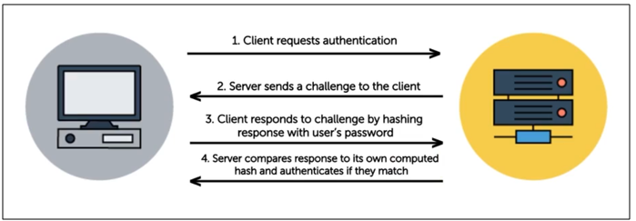
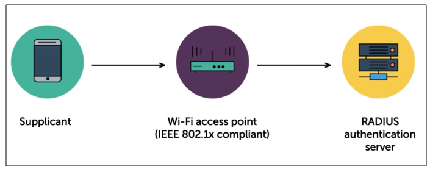

# Network Authentication Protocols 

- [Network Authentication Protocols](#network-authentication-protocols)
  - [PAP Password Authentication Protocol](#pap-password-authentication-protocol)
  - [MS-CHAPv2 Microsoft Challenge-Handshake Authentication Protocol version 2](#ms-chapv2-microsoft-challenge-handshake-authentication-protocol-version-2)
  - [NTLM NT LAN Manager](#ntlm-nt-lan-manager)
  - [Kerberos](#kerberos)
  - [EAP Extensible Authentication Protocol](#eap-extensible-authentication-protocol)
  - [LDAP Lightweight Directory Access Protocol](#ldap-lightweight-directory-access-protocol)
  - [IEEE 802.1X](#ieee-8021x)
  - [RADIUS Remote Authentication Dial-In User Service](#radius-remote-authentication-dial-in-user-service)
  - [TACACS+ Terminal Access Controller Access-Control System Plus](#tacacs-terminal-access-controller-access-control-system-plus)
- [Identity Federation](#identity-federation)
  - [Key Concepts](#key-concepts)
  - [Benefits of Identity Federation](#benefits-of-identity-federation)
  - [How it works](#how-it-works)
  - [Use Cases](#use-cases)
- [Identity Federation Methods](#identity-federation-methods)
  - [SSO Single Sign-On](#sso-single-sign-on)
  - [OAuth Open Authorization](#oauth-open-authorization)
  - [OpenID Connect OIDC](#openid-connect-oidc)
  - [SAML](#saml)

## Network Authentication Protocols  

Network authentication protocols are mechanisms or sets of rules that ensure that users or devices can securely prove their identity to access network resources or services.

They ensure that only authorized users or devices can access a network, reducing the risk of unauthorized access and enhancing security.

### PAP (Password Authentication Protocol)

- Transmits passwords in plaintext, making it less secure.
- Outdated, passwords are transmitted in clear text.
- Typically used as a basic authentication method in older systems or legacy environments.

### MS-CHAPv2 (Microsoft Challenge-Handshake Authentication Protocol version 2)

- An improved version of CHAP with better security.
- Uses challenge-response mechanism with stronger encryption.
- Commonly used in VPNs and Windows-based environments.
  
  

### NTLM (NT LAN Manager)

- "NT" - New technology
- Microsoft’s proprietary authentication protocol.
- Supersedes the older LANMAN protocol
- Used for workgroup computers - NOT JOINED TO ANY AD DOMAIN 
- Known for its vulnerability to certain attacks, replaced by Kerberos in modern environments.
- Passwords hashes with NTLM are not salted - easy to crack
- **NTLM v2** passwords are salte

### Kerberos

- A secure network authentication protocol based on tickets.
- Primarily used in enterprise environments for single sign-on (SSO).
- Used by Microsoft AD authentication
- Account is given a "ticket" - can be presented when accessing resources.
- Components include:
    - Kerberos Key Distribution Center (KDC)
    - Authentication Service (AS)
    - Ticket-Granting Service (TGS)
    - Ticket-Granting Ticket (TGT)

### EAP (Extensible Authentication Protocol)

- A flexible authentication framework supporting various methods like EAP-TLS, EAP-TTLS, and PEAP.
- Commonly used in wireless networks (e.g., Wi-Fi) and secure network access setups.
- Offers strong security through certificate-based authentication.
- Examples:
    - PKI certificate authentication
    - Smart card authentication

### LDAP (Lightweight Directory Access Protocol)

- A protocol used for accessing and managing directory information.
- Used for sharing information infrastructure
- Can be used to form a directory of employees 
- Serves as central repository for user information 
- Stores group membership and roles - used for authorization
- Can supports:
  - LDAP over SSL
  - StartTLS 

### IEEE 802.1X

- A port-based network access control protocol 
- Requires devices to authenticate before accessing the network
- Devices authenticate to a central RADIUS server
- Commonly used in wired and wireless networks.

### RADIUS (Remote Authentication Dial-In User Service)

- Centralized authentication protocol commonly used in enterprise networks.
- Supports various authentication methods, such as username/password and digital certificates.
- **RADIUS Supplicants** - devices trying to authenticate to RADIUS
- **RADIUS Clients** - edgepoint devices, not devices authenticating to RADIUS
    - Ethernet switches 
    - WIFI routers 
    - VPN appliances
- Variations:
    - TACACS
    - TACACS+
    - XTACACS
- How it works:
    - If edge point device (like a router) is IEEE 802.1x compliant, it will handover the authentication to the RADIUS 
    - Note that the router has limited memory, so it's useful to handoff the authentication
    - The router will not be storing the credentials as well.
    

### TACACS+ (Terminal Access Controller Access-Control System Plus)

- Similar to RADIUS but allows for more detailed control over authentication, authorization, and accounting (AAA) functions.

## Identity Federation 

A system where multiple organizations share authentication data, allowing users to access resources across organizational boundaries without re-authenticating.

### Key Concepts

- **Single Sign-On (SSO)**
  - Authenticate once, access multiple applications.
  
- **Trust Relationships**
  - Organizations agree to trust each other's authentication assertions.
  
- **Identity Provider (IdP)**
  - Authenticates users and issues security tokens.
  
- **Service Provider (SP)**
  - Provides resources, relying on IdP for user authentication.
  
- **Federation Standards**
  - Examples include SAML, OAuth, OpenID Connect, and WS-Federation.

### Benefits of Identity Federation

- **User Convenience**
  - One login grants access to multiple services.
  
- **Centralized Authentication**
  - Authentication managed at the IdP, enhancing security.
  
- **Cross-Domain Collaboration**
  - Enables seamless collaboration across different organizations.

### How it works 

1. Login initiation - User logs in
2. User is redirected to an identity provider 
3. IdP will authenticate the user
4. IdP generated an assertions (like a token)
5. User is returned to a service provider with the assertion
6. Verification and access

### Use Cases

- **Enterprise Collaboration**
  - Allows employees to work across different business units or partners.
  
- **Cloud Services**
  - Enables seamless access to cloud-based applications.
  
- **Education**
  - Connects students and faculty across affiliated institutions.
  
- **Public Services**
  - Provides secure, unified authentication for government services.

## Identity Federation Methods

### SSO (Single Sign-On)

- Authenticates user once without re-entering credentials.
- Implemented through protocols like:
    - LDAP
    - SAML (Security Assertion Markup Language)
    - OpenID Connect.

### OAuth (Open Authorization)

- An open standard for token-based authentication and authorization.
- Authorizing third-party applications to access user data without exposing credentials.
- Allows secure exchange of information between sites via JWT

How it works: 

- Client app or server needs to register with authorization server
- Authorization server provides a redirect URL +  ID + Secret
- Token is received by the user 
- User can use the token to access the requested resource

### SAML 

- Open standard for exchanging authentication and authorization information between Identity Providers (IdPs) and Service Providers (SPs), facilitating Single Sign-On (SSO).
- Service providers doesn't authenticate the users directly, they just receive confirmation that IdP have authenticated the users to the given service.

### OpenID Connect (OIDC)

- An authentication layer built on top of OAuth 2.0.
- Provides additional user identity information along with authorization.

----------------------------------------------

[Back to main page](../../README.md#security)    