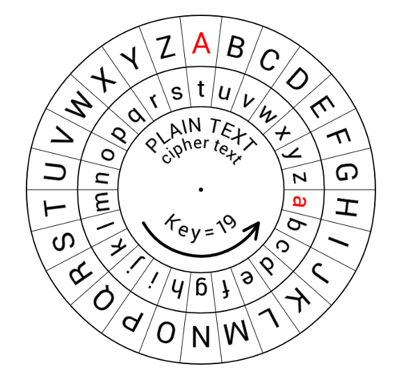
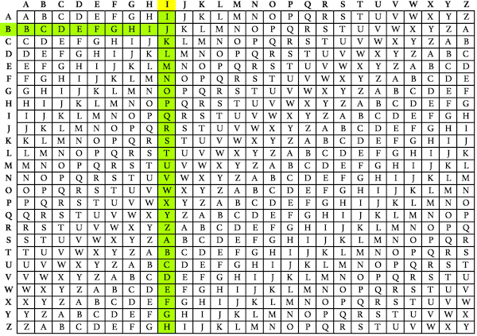
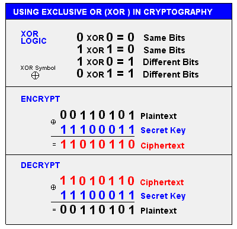

# Cryptography Basics

- [Cryptography](#cryptography)
- [Types of Encryption](#types-of-encryption)
    - [Symmetric Encryption](#symmetric-encryption)
    - [Asymmetric Encryption](#asymmetric-encryption)
    - [Hybrid Implementation](#hybrid-implementation)
- [Storing Keys](#storing-keys)
- [Ciphers](#ciphers)
    - [Stream Ciphers](#stream-ciphers)
    - [Block Ciphers](#block-ciphers)
- [Common Ciphers](#common-ciphers)
    - [Cease Cipher](#cease-cipher)
    - [Vigenere Cipher](#vigenere-cipher)
    - [Exlusive OR XOR](#exlusive-or-xor)
- [Hashing](#hashing)
    - [Digital Signature](#digital-signature)
    - [Digital Signature Standard DSS](#digital-signature-standard-dss)
    - [Code Signing](#code-signing)
- [Hash Functions](#hash-functions)
    - [MD5](#md5)
    - [SHA Family](#sha-family)
    - [RIPEMD](#ripemd)
    - [HMAC](#hmac)

## Cryptography

The science and practice of securing communication and information through encoding, ensuring only authorized parties can access it. Its purpose is to protect data integrity, confidentiality, and authenticity.

- **Steganography**
    - Hiding secret data within ordinary, non-secret files or messages.
    - Purpose is to avoid detection.

- **Masking/Obfuscation**
    - Take an information and hide it so that it doesn't make sense to external observer.

- **Diffusion**
    - Making the information less visible, less obvious.
    - Example is blurring an image.

- **Confusion**
    - Changing a property of the data and make it more difficult to interpret, more unintelligible.
    - Confusion works alongside diffusion to create robust encryption schemes.
    - Example is scrambling or changing the pixels of an image.

- **Tokenization**
    - Substituting sensitive data elements with non-sensitive equivalents called **tokens.**
    - Tokens have no intrinsic or exploitable meaning.

- **Encryption**
    - Transforming plaintext into ciphertext using an algorithm and a key.

- **Decryption**
    - Converting ciphertext back to plaintext with the appropriate key.

## Types of Encryption 

These types of encryption play critical roles in modern cybersecurity, often used together to achieve a balance of speed and security.

### Symmetric Encryption 

Symmetric cryptography uses the same key for both encryption and decryption. The sender and receiver must share this key, keeping it secret from others.

- **Session key** - single key is used to encrypt and decrypt data. 
- Both parties must have this key.

Symmetric encryption is generally faster and less computationally intensive compared to asymmetric cryptography. It is also effective for encrypting large volumes of data.

Sending the key:

- **In-band** 
    - Sending the key along with the encrypted data
    - Risky, vulnerable to sniffing 

- **Out-of-band** 
    - Providing the key separately from the encrypted data
    - Can be provided beforehand or via phone/SMS

Disadvantages:

- Key distribution and management can be challenging
- If the key is compromised, the entire system is at risk.

Use Cases:

- Secure communication within closed networks
- Encrypting files or databases
- Securing backups.

### Asymmetric Encryption

Asymmetric cryptography uses a pair of keys: 

- a public key for encryption 
- a private key for decryption. 

The public key can be shared openly, but the private key must remain confidential.

- <mark>**Public key encrypts data**</mark>, and only the corresponding private key can decrypt it. 
- <mark>**Private key decrypts the data**</mark>, can be used to sign data, which the public key can verify.

Example Algorithms:

- **RSA** (Rivest-Shamir-Adleman)
- **ECC** (Elliptic Curve Cryptography)
- **DSA** (Digital Signature Algorithm).

Advantages: 

- No need to share the private key, reducing the risk of key compromise.
- Allows for digital signatures and public key infrastructure (PKI).

Disadvantages: 

- Slower and more resource-intensive than symmetric cryptography. 
- Less efficient for large amounts of data.

Use Cases: 

- Secure communication over public networks, digital signatures, certificate authorities, and secure key exchange. 

### Hybrid Implementation 

Utilizes asymmetric encryption to securely transfer a private key, which can then be used with symmetric encryption.

## Storing Keys 

Best practices:

- Store keys in secure hardwared modules 
- Encrypt keys when at rest 
- Transmit keys securely when used
- Limit key access to regular audits and monitoring

## Ciphers

A cipher is an algorithm used to encrypt and decrypt information, transforming plain text into coded (cipher) text and vice versa. 

- Ciphers ensure data confidentiality 
- Central to encryption protocols.

Types of Ciphers:

- Stream Cipher
- Block Cipher

### Stream Ciphers

Stream Ciphers encrypt data bit by bit or byte by byte in a continuous stream.

- Performs encryption on <mark>**single byte at a time.**</mark>
- Uses a key stream generator to create a pseudo-random sequence of bits (the key stream).
- The key stream is then XORed with the plaintext to produce ciphertext.

**Common Features**:

- <mark>**Uses same key for encryption and decryption.**</mark>
- Implemented mostly on <mark>**hardware-based solutions**
- Often used in <mark>**real-time applications**</mark> where data is continuously transmitted (e.g., streaming services).
- Vulnerable to certain types of attacks if key stream is reused or not sufficiently random.

**Examples**: 

- RC4
- Salsa20
- ChaCha20

### Block Ciphers

Block Ciphers break the input into fixed-size blocks (e.g., 64-bit or 128-bit) and performs the encryption on each block.

- Performs encryption on <mark>**per block basis.**</mark>
- A block of plaintext is processed with a key to produce a block of ciphertext.
- Multiple rounds of transformation can also be used (e.g., substitution and permutation).

**Common Features**:
- <mark>**Easier to implement, less susceptible to security problems.**
- Implemented mostly on <mark>**software solutions**
- Often used in protocols and file encryption, where data is processed in chunks.
- Require padding when the plaintext doesn't evenly divide into block sizes.
- Can be operated in various modes to enhance security or support specific applications.

**Examples**: 
- AES
- DES
- 3DES

## Common Ciphers

### Cease Cipher 

Named after Julius Caesar, it is a simple substitution cipher where each letter in the plaintext is shifted a certain number of positions down or up the alphabet.
- Shifts each letter in the plaintext a certain number of positions along the alphabet.
- The number of positions to shift, typically between 1 and 25.
- Example: With a shift of 3, 'A' becomes 'D', 'B' becomes 'E', and so on.
- **ROT2** - two shifts in positions
- **ROT3** - three shifts in positions, and so on.

Although it's historically significant, the Caesar Cipher is not used for serious encryption today due to its simplicity and vulnerability to straightforward cryptanalysis

### Vigenere Cipher

The Vigenère Cipher is a type of polyalphabetic substitution cipher that uses a repeating key phrase to determine shifting patterns for each letter in the plaintext, offering greater security than simple substitution ciphers.

- A key phrase, repeated to match the plaintext length, determines the shift for each letter.
- To decrypt, use the same key to reverse the shifts and recover the plaintext.

**Strengths**: 
- Provides increased complexity, making frequency analysis and brute-force attacks more difficult.

**Weaknesses**: 
- Susceptible to Kasiski examination and Friedman tests, which can reveal key patterns and lengths, leading to cryptanalysis.

**Example**: 
- With the key "LEMON," the plaintext "HELLO" is encrypted by shifting each letter according to the corresponding letter in the key, resulting in "OIWWC."

### Exlusive OR (XOR) 

Exclusive OR (XOR) is a binary operation used extensively in cybersecurity and cryptography. It operates on bits, returning 1 if the bits are different and 0 if they are the same. Here's a concise description with key bullet points:

- XOR compares two bits; if they're different, it outputs 1; if they're the same, it outputs 0.
- XOR is reversible, allowing data encrypted with a key to be decrypted by XORing again with the same key.

**Applications**:

  - **Encryption**: 
    - Commonly used in stream ciphers and some block ciphers to combine plaintext with a key stream, creating ciphertext.

  - **One-Time Pad (OTP)**: 
    - A theoretically unbreakable encryption method that uses XOR with a key as long as the plaintext, provided the key is truly random and never reused.

  - **Data Manipulation**: 
    - XOR can be used to toggle bits or swap values without additional storage.

  - **Error Detection/Correction**: 
    - In parity checks and error-correcting codes, XOR helps identify errors in transmitted or stored data.

**Security Considerations**:
  - **Key Management**: 
    - Security in XOR-based encryption relies heavily on key secrecy and randomness.

  - **Vulnerabilities**: 
    - If the key is reused or predictable, XOR-based encryption is susceptible to various attacks, including known-plaintext attacks.

## Hashing

Hashing is a process of converting data (like a file or a message) into a fixed-size value or string, typically using a hash function.

- Used for data integrity checks, digital signatures, password storage, and more.
- The same input always produces the same hash output.
- **Fixed Size**: Hash outputs are of fixed length, regardless of input size.
- **Fast Computation**: Hash functions are designed to be quick to compute.
- **Irreversible**: Not feasible to reverse-engineer the original input from the hash.
- **Collision Resistance**: Unlikely for two different inputs to produce the same hash (a "collision").
  
**Common Uses**
- Verify data hasn't been altered (e.g., checksums).
- Securely store passwords, often with added salt.
- Create digital signatures by compressing data before signing.
- Used in various cryptographic operations, including blockchains.

### Digital Signature

The digital signature is the encrypted hash which is sent along with the message to prove the integrity of the message.

- Uses a private key to create the signature and a public key to verify it.
- The digital signature confirms the sender's identity.
- This ensures the message hasn't been altered.
- **Non-repudiation** - signer can't deny signing because there's proof.

To learn more, please see [Digital Signatures in Asymmetric Encryptions.](./030-Asymmetric-Encryption.md)

### Digital Signature Standard (DSS)

DSS, or the Digital Signature Standard, is a cryptographic standard used for generating and verifying digital signatures. 

- Established by the **National Institute of Standards and Technology (NIST)** in the United States.
- Ensures authenticity, integrity, and non-repudiation for digital data through digital signatures.
- Relies upon a 160-bit message digest created by the Digital Signature Algorithm (DSA)

**How it works:**

  - Public-private key pairs is created for signing and verifying.
  - Private key is used to generate a digital signature from a message hash.
  - The public key verifies the digital signature and check the message's integrity.

### Code Signing

Code signing is the process of digitally signing software code or executables to verify their origin and ensure their integrity.

- Verifies that the code is from a trusted developer or publisher.
- Ensures the code hasn't been modified since it was signed.
- Protects users from malicious software and unauthorized code changes.

**How It Works**:

  - A software developer uses a private key to create a digital signature for their code.
  - The digital signature is attached to the code, forming a certificate.
  - A user or system uses the public key to verify the signature.
  - The public key confirms the software's source and that it hasn't been tampered with.

**Use Cases**:
  - Software distribution, ensuring safe installation of programs and updates.
  - Application stores, confirming that apps meet security standards.
  - Operating systems, allowing signed drivers and system software.

**Common Tools**:

  - **Certificate Authorities (CAs)**: Organizations that issue digital certificates to verify the identity of the signer.
  - **Code Signing Certificates**: Certificates issued to developers for signing their code.

**Challenges**:

  - **Certificate Management**: Properly handling and securing code signing certificates.
  - **Revocation**: Handling compromised or invalid certificates.
  - **Cost**: Obtaining code signing certificates from reputable CAs can be expensive.
  

## Hash Functions 

Hash functions convert input data into a fixed-size hash value. Below are some of the common algorithms used for hashing.

### MD5

An older hash function, MD5 is now considered insecure due to known collisions.

- Creates a 128-bit hash value unique to the input file.
- 128-bits long means it can only create limited values, which can lead to collisions.
- **Collisions** - when two distinct inputs produce the same hash.
- Despite its insecurities, it's still used for checksums and non-security-sensitive applications.

### SHA Family  

A family of cryptographic hash functions designed by the National Security Agency (NSA).

- **SHA-1**: 
    
    - Creates a 160-bit hash digest, reducing chance of collisions.
    - More secure than MD5, but also deprecated due to vulnerabilities.
    - Formerly used for digital signatures; now discouraged.

- **SHA-2**: 

    - Hash family containing longer hash digests.
    - Includes:
        - SHA-224
        - SHA-256
        - SHA-384
        - SHA-512

- **SHA-256**: 

   - Part of the SHA-2 family, SHA-256 offers a 256-bit output.
   - Stronger security, highly collision-resistant, and a commonly used standard.
   - Secure communication, SSL/TLS, and blockchain.

- **SHA-3**: 

   - A newer family of hash functions
   - Hash digest can go between **224 to 512 bits.**
   - Uses **120 rounds of computations** to create the message digest.
   - SHA-3 uses a different underlying algorithm (Keccak).
   - Designed to provide high security and flexibility.
   - Used in applications requiring a strong hash function with versatility.

### RIPEMD

RIPEMD stands for **Race Integrity Primitives Evaluation Message Digest.** It is a family of cryptographic hash functions designed to ensure data integrity and secure hashing.

- A family of cryptographic hash functions developed in Europe.
- Comes in **160/256/320-bit versions**
- **RIPEMD-160** is the most known, with a 160-bit output.
- Offers strong security and is used as an alternative to SHA-1.

### HMAC

Stands for "Hash-based Message Authentication Code", HMAC uses a hash function combined with a secret key to generate a message authentication code (MAC).

- Uses a hash function and secret key for message authentication.
- HMAC provides message integrity and authentication.
- Ensures that a message has not been tampered with and verifies identity of the sender.

Commonly paired with other algorithms for additional security:

- **HMAC-MD5**: 

    - Historically used for message authentication and checksum verification.
    - Now considered insecure due to the vulnerabilities in MD5

- **HMAC-SHA1**: 

    - Offers more security than HMAC-MD5.
    - SHA-1 is now deprecated due to known vulnerabilities and potential collision attacks.

- **HMAC-SHA256**: 

    - Offers stronger security and used widely in modern cryptographic applications.
  
    - Most recommended for secure applications.

----------------------------------------------

[Back to main page](../../README.md#security)    