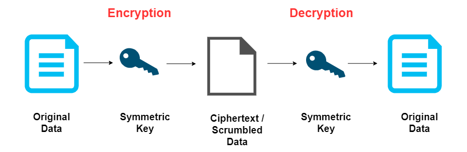
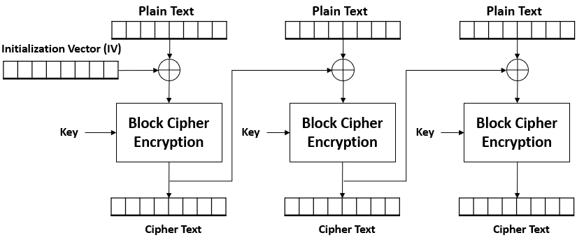
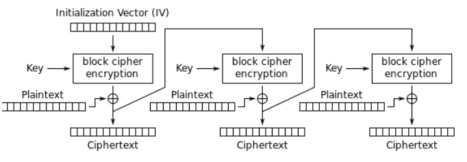
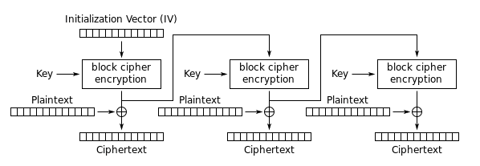
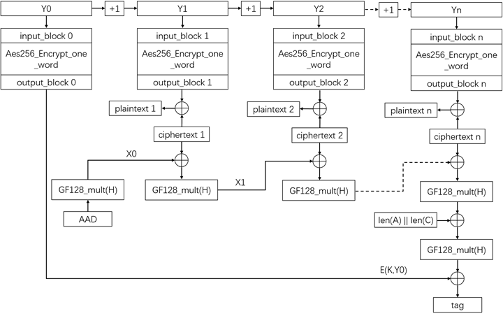

# Symmetric Encryption

- [Symmetric Cryptosystems](#symmetric-cryptosystems)
    - [Block Algorithms](#block-algorithms)
    - [RC Cipher Suites](#rc-cipher-suites)
- [Symmetric Block Modes](#symmetric-block-modes)
    - [Electronic Codebook](#electronic-codebook)
    - [Cipher Block Chaining CBC](#cipher-block-chaining-cbc)
    - [Cipher Feedback CFB](#cipher-feedback-cfb)
    - [Output Feedback OFB](#output-feedback-ofb)
    - [Counter CTR](#counter-ctr)
    - [Galois/Counter Mode GCM](#galoiscounter-mode-gcm)

## Symmetric Cryptosystems 

Symmetric cryptography uses the same key for both encryption and decryption. The sender and receiver must share this key, keeping it secret from others.

- **Session key** - single key is used to encrypt and decrypt data. 
- Both parties must have this key.

Symmetric encryption is generally faster and less computationally intensive compared to asymmetric cryptography. It is also effective for encrypting large volumes of data.

### Block Algorithms

| Algorithm                                             | Cipher Type   | Block Size        | Number of Rounds      | Key Size                  | Description                                                                               |
|-------------------------------------------------------|---------------|-------------------|-----------------------|---------------------------|-------------------------------------------------------------------------------------------|
| DES (Data Encryption Standard)                        | Block Cipher  | 64-bit            | 16 rounds             | 56-bit                    | Legacy block cipher; once widely used but now considered insecure.                        |
| 3DES (Triple DES)                                     | Block Cipher  | 64-bit            | 48 rounds (3x16)      | 168-bit                   | 3DES repeats DES process 3 times, hence 56*3 = 168-bit key size.                          |
| IDEA (International Data Encryption Algorithm)        | Block Cipher  | 64-bit            | 8 rounds              | 128-bit                   | 128-bit key size makes it harder to break, but is not widely utilized.                    |
| AES (Advanced Encryption Standard)                    | Block Cipher  | 128-bit           | 10/12/14 rounds       | 128/192/256-bit           | Current encryption standard; highly secure and widely used.                               |
| Blowfish                                              | Block Cipher  | 64-bit            | 16 rounds             | 32-448 bit (variable)     | Developed as DES replacement; fast and flexible block cipher with variable key length.    |
| Twofish                                               | Block Cipher  | 128-bit           | 16 rounds             | 128/192/256-bit           | A finalist in the AES competition, released as open source along with Blowfish.           |

**A few notes:** 

- 64-bit block size, but in reality its 56-bits because 8-bits is for overhead/parity.
- The larger the block size, the faster the encryption.
- Number of rounds refers to how many rounds the data went through encryption. It is a pretty good clue as to how robust encryption is.
- Blowfish and twofish were both released as open source products.

### RC Cipher Suites 

The RC suite comprises a range of ciphers, from block to stream, with varying levels of flexibility and security. 

- Rivest Cipher, created by Ron Rivest.
- Some are now considered insecure (like RC4)
- Others have had broader applications in encryption history (like RC5 and RC6).

| Algorithm  | Cipher Type   | Block Size        | Number of Rounds      | Key Size                  | Description                                                                                                   |
|------------|---------------|-------------------|-----------------------|---------------------------|---------------------------------------------------------------------------------------------------------------|
| RC2        | Block Cipher  | 64-bit            | Variable rounds       | 8-128 bit (variable)      | Early block cipher; adjustable key size, mostly used in legacy applications.                                  |
| RC4        | Stream Cipher | N/A               | Variable              | 40-2048 bit (variable)    | Used in SSL and WEP; now considered insecure due to vulnerabilities in key scheduling.   |
| RC5        | Block Cipher  | 32/64/128-bit     | Variable rounds       | 0-2040 bit (variable)     | Highly flexible block cipher with variable block size, key size, and rounds.                                  |
| RC6        | Block Cipher  | 128-bit           | 20 rounds             | 128/192/256-bit           | Extended version of RC5; designed for high security and was a finalist in the AES competition.                |

A few notes:

- RC1 was never published.
- RC2 was considered weak and was skipped over.
- RC3 was cracked before it was even released to the public.
- RC4, RC5, and RC6 are commonly used in networks today.

## Symmetric Block Modes 

Symmetric block ciphers can operate in various modes that define how blocks of plaintext are transformed into ciphertext. Different modes address specific requirements and security concerns. 

### Electronic Codebook 

ECB (Electronic Codebook) mode can show identical blocks for identical plaintext inputs, compromising security.

As an example, if we encrypt the image above, we'll get a scrambled image that still shows some patterns. Although it is encrypted, the image is still recognizable.

**Advantages**: 
- Simple and fast; allows random access to blocks.

**Disadvantages**: 

- Patterns in plaintext are retained in ciphertext
- Identical plaintext blocks result in identical ciphertext blocks 
- This makes it vulnerable to analysis

### Cipher Block Chaining (CBC)

Each block of plaintext is XORed with the previous ciphertext block before encryption. The first block uses an initialization vector (IV).

**Initialization vector**
- Same size as the other blocks.
- The first block is applied with XOR using the IV.
- The output will then be used as the IV for the next block, repeating the cycle.

**Advantages**: 
- Adds randomness to encryption
- Even identical plaintext blocks yield different ciphertext due to chaining.

**Disadvantages**: 

- Requires sequential processing
- Small changes in plaintext can affect the whole chain
- Complicates decryption if data is corrupted

### Cipher Feedback (CFB)

Turns block ciphers into self-synchronizing stream ciphers. The previous ciphertext block (or IV) is encrypted and then XORed with the plaintext to produce ciphertext.

**Advantages**: 
- Provides flexibility in block size
- Allows for partial block updates
- Ideal for real-time encryption

**Disadvantages**: 

- More complex error propagation
- If an error occurs, it affects multiple blocks

### Output Feedback (OFB)

Similar to CFB, but the encrypted output (keystream) is generated independently of the plaintext and then XORed with the plaintext to produce ciphertext.

- IV is encrypted, then output is XORed to first block 
- Same IV is used throughout the process.

**Advantages**: 
- Errors in ciphertext do not propagate
- Ideal for secure data streaming

**Disadvantages**: 

- If the same IV and key are reused, the entire encryption can be compromised
- Requires careful management of IVs

### Counter (CTR)

Converts block ciphers into stream ciphers by using a counter that is encrypted to produce a keystream, which is then XORed with the plaintext.

- Uses a Nonce value + counter value
- Counter increments in binary
- Both are combined and then encrypted
- First block of plaintext ix XORed with the encrypted NONCE+Counter
- Output becomes the ciphertext
- Repeat steps for each block of plain text 

**Advantages**: 
- Allows for parallel processing
- Errors do not propagate
- Noo chaining issues
- Widely used in modern applications

**Disadvantages**: 

- Counter and key must never repeat
- Can be vulnerable to attacks if not implemented carefully

### Galois/Counter Mode (GCM)

Combines CTR mode with a message authentication code (MAC) to ensure data integrity and confidentiality.

**Advantages**: 
- Provides authenticated encryption
- Ensures that ciphertext has not been tampered with
- Supports parallel processing

**Disadvantages**: 

- More complex implementation
- Requires careful management of IVs and counters

----------------------------------------------

[Back to main page](../../README.md#security)    