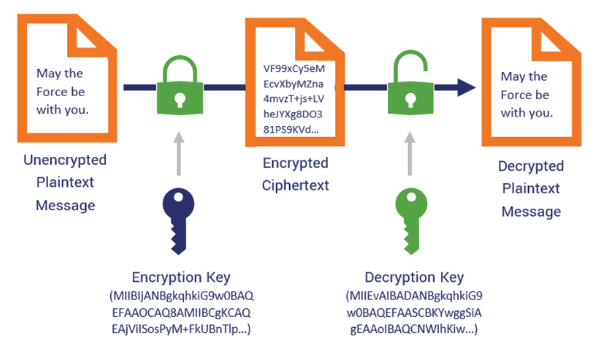
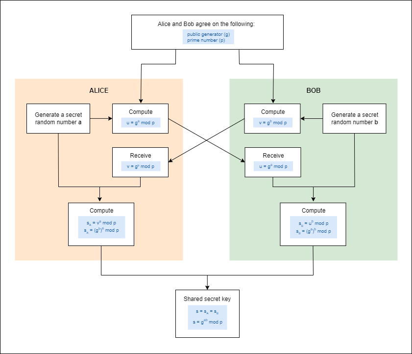

# Asymmetric Encryption

- [Asymmetric Encryption](#asymmetric-encryption)
- [Digital Signature](#digital-signature)
- [Asymmetric Encryption Methods](#asymmetric-encryption-methods)
- [ECC Variations](#ecc-variations)
    - [ECDSA Elliptic Curve Digital Signature Algorithm](#ecdsa-elliptic-curve-digital-signature-algorithm)
    - [ECDH Elliptic Curve Diffie-Hellman](#ecdh-elliptic-curve-diffie-hellman)
    - [ECMQV Elliptic Curve Menezes-Qu-Vanstone](#ecmqv-elliptic-curve-menezes-qu-vanstone)
    - [EdDSA Edwards-curve Digital Signature Algorithm](#eddsa-edwards-curve-digital-signature-algorithm)
    - [Secp256k1](#secp256k1)
- [Diffie-Hellman](#diffie-hellman)
- [Diffie-Hellman Groups](#diffie-hellman-groups)

## Asymmetric Encryption 

Asymmetric encryption uses a pair of keys: a public key for encryption and a private key for decryption. 

- <mark>**Public key encrypts data**</mark>, and only the corresponding private key can decrypt it. 
- <mark>**Private key decrypts the data**</mark>, can be used to sign data, which the public key can verify.

This dual-key system allows for secure communication, digital signatures, and secure key exchange without requiring shared secrets.

## Digital Signature

A digital signature is a cryptographic method for verifying the authenticity and integrity of digital messages or documents.

- Uses a private key to create the signature and a public key to verify it.
- The signature confirms the sender's identity, ensures the message hasn't been altered, and provides proof that the signer can't deny signing.

**How It Works**

- A hash function creates a fixed-size hash from the message.
- The private key is used to sign the hash, creating the digital signature.
- The public key is used to verify the signature and check the message's integrity.

**Benefits**

- **Authentication**: Confirms the identity of the signer.
- **Integrity**: Ensures the message hasn't been changed.
- **Non-Repudiation**: Prevents the signer from denying their signature.

**Use Cases**
- **Email Encryption**: Verifies email sources.
- **Software Distribution**: Confirms software integrity.
- **Legal Documents**: Validates digital contracts and agreements.
- **Blockchain and Cryptocurrency**: Secures transactions.

## Asymmetric Encryption Methods

Each algorithm supports a range of key sizes that directly influence the security and efficiency of encryption and key exchange. Generally, **larger key sizes offer more security but require more computational resources.**

**RSA and DSA:**
- RSA is the **most widely used**, offering compatibility with a range of systems.
- DSA is optimized for **digital signatures**.

**ECC:**
- Mostly used in **mobile devices and low-power computing devices.**
- Provides similar security with **smaller key sizes**, leading to efficiency gains. 
- ECC with a 256-bit key is just as secure as RSA with 2048-bit key.

| Algorithm                             | Key Structure             | Supported Key Sizes   | Use Cases                                         | Strengths                                                     | Weaknesses                                                                        |
|---------------------------------------|---------------------------|-----------------------|---------------------------------------------------|---------------------------------------------------------------|-----------------------------------------------------------------------------------|
| RSA                                   | Public-private key pair   | 1024-4096 bits        | Secure communication, digital signatures          | Established, widely used; supports large key sizes            | Slower than symmetric methods; susceptible to certain attacks with smaller keys   |
| ECC (Elliptic Curve Cryptography)     | Public-private key pair   | 160-521 bits          | Secure communication, digital signatures          | Smaller key sizes; heavily used in mobile devices             | More complex mathematical basis; not as widely adopted as RSA                     |
| DSA (Digital Signature Algorithm)     | Public-private key pair   | 1024-3072 bits        | Digital signatures, authentication                | Fast for signature generation; widely accepted                | Slower for verification; requires secure parameter selection                      |
| Diffie-Hellman                        | Key exchange              | 1024-8192 bits        | Secure key exchange, establishing shared keys     | Enables secure key exchange over insecure channels            | Does not provide encryption or authentication by itself                           |

## ECC Variations

Elliptic Curve Cryptography (ECC) is a type of public-key cryptography that relies on the mathematical properties of elliptic curves to secure communications. Within ECC, there are several variations that offer different approaches and benefits.

### ECDSA (Elliptic Curve Digital Signature Algorithm)

- **A variant of the Digital Signature Algorithm (DSA)** that uses elliptic curves for digital signatures.
- Often used in secure communications, blockchain technology, and software signing.
- Provides strong security with smaller key sizes compared to RSA. 
- Efficient for generating digital signatures.
- Requires careful selection of curve parameters and robust implementation to avoid vulnerabilities.

### ECDH (Elliptic Curve Diffie-Hellman)

- **A variation of the Diffie-Hellman key exchange** that uses elliptic curves.
- Used to establish shared secret keys for secure communication.
- Offers secure key exchange with reduced computational overhead compared to traditional Diffie-Hellman.
- Like ECDSA, requires careful parameter selection to ensure security.

### ECMQV (Elliptic Curve Menezes-Qu-Vanstone)

- An elliptic curve-based key agreement protocol.
- Used in situations requiring authenticated key exchange.
- Provides authenticated key exchange with lower computational requirements than traditional MQV.
- Less commonly used than ECDSA or ECDH. 
- Robustness depends on correct parameter choices and secure implementation.

### EdDSA (Edwards-curve Digital Signature Algorithm)

- **A digital signature algorithm based on the Edwards curve family**.
- Increasingly used in modern cryptographic systems for digital signatures.
- High security and simplicity; resistant to several types of attacks, with rapid signature verification.
- Relatively new, but gaining adoption due to its efficiency and security characteristics.

### Secp256k1

- A specific elliptic curve used in ECC.
- Widely used in blockchain and cryptocurrency applications, notably in Bitcoin.
- Offers a strong level of security with smaller key sizes, optimized for efficient computation.
- Selection of this curve over others is driven by specific community choices
- Less versatile outside blockchain applications.

## Diffie-Hellman

Diffie-Hellman is a cryptographic protocol for secure key exchange, enabling two parties to establish a shared secret over an insecure communication channel.

- Establishes a shared secret key without directly sharing it.
- Based on discrete logarithms and modular arithmetic.
- Shared secret can't derived easily by attackers due to complex math.
- An **asymmetric algorithm**, but **doesn't provide the actual encryption.**
- It is **key exchange protocol**,

**Use Cases**:
- Often used to set up shared encryption keys.
- Used when setting up VPN tunnels or other encryption tunnels.
- Applied in SSL/TLS, IPsec, and VPNs.

**How It Works**:
- Both parties agree on a base (generator) and a prime modulus.
- Each party chooses a private key. 
- Public key is derived by raising the base to the power of the private key, modulo the prime.
- The public keys are then exchanged.
- Each party calculates the shared secret using the other's public key and their own private key.

**Example**:
- Parties agree on a common base \( g \) and a prime modulus \( p \).
- Alice chooses a private key \( a \) and sends \( g^a \mod p \) to Bob.
- Bob chooses a private key \( b \) and sends \( g^b \mod p \) to Alice.
- Alice calculates \( (g^b \mod p)^a \) to get the shared secret.
- Bob calculates \( (g^a \mod p)^b \) to get the same shared secret.
 

    

**Strengths**: 

- Secure key exchange without revealing the key
- Resistant to eavesdropping and man-in-the-middle attacks when implemented correctly.

**Weaknesses**: 

- Vulnerable to attacks like the man-in-the-middle if proper authentication is not implemented

- Depends on the difficulty of solving the discrete logarithm problem.

- To be truly secure, it should be combined with additional mechanisms

## Diffie-Hellman Groups 

Diffie-Hellman groups are pre-defined sets of parameters used in the Diffie-Hellman key exchange protocol. These groups consist of a **generator (a base number)** and a **prime modulus**, which are critical for the mathematical operations that allow two parties to create a shared secret. 

| Group Name      | Prime Modulus Size (bits) | Typical Use Cases               | Notes                                 |
|----------------|--------------------------|---------------------------------|---------------------------------------|
| Group 1         | 768                      | Legacy applications             | Considered insecure, rarely used today |
| Group 2         | 1024                     | Legacy applications             | Also considered insecure               |
| Group 14        | 2048                     | Secure communication            | Standard for many modern protocols     |
| Group 15        | 3072                     | Enhanced security               | Suitable for more secure applications  |
| Group 16        | 4096                     | High-security environments      | Used when stronger security is needed  |
| Group 17        | 6144                     | High-security environments      | Rarely used due to computational cost  |
| Group 18        | 8192                     | Very high-security environments | Used for extremely secure applications |

Each group is characterized by the following:

- **Prime Modulus**: 
    - A large prime number that determines the "space" within which the key exchange operates. 
    - The size of this prime (measured in bits) correlates with the security level of the key exchange.

- **Generator**: 
    - A base number that is used to derive the public and private keys.

- **Security Level**: 
    - The estimated strength against known cryptographic attacks.

The specific characteristics of the group influence the security and performance of the key exchange. 

- Larger prime numbers generally provide more security 
- But it also require more computational resources, affecting speed and efficiency.

----------------------------------------------

[Back to main page](../../README.md#security)    