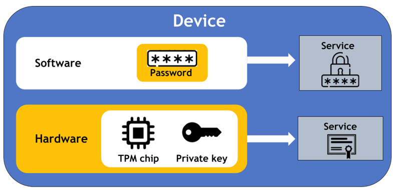
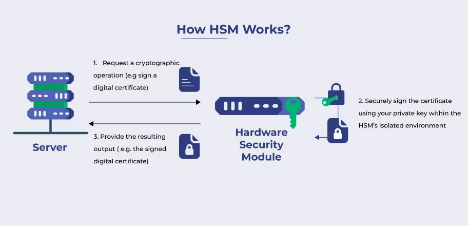
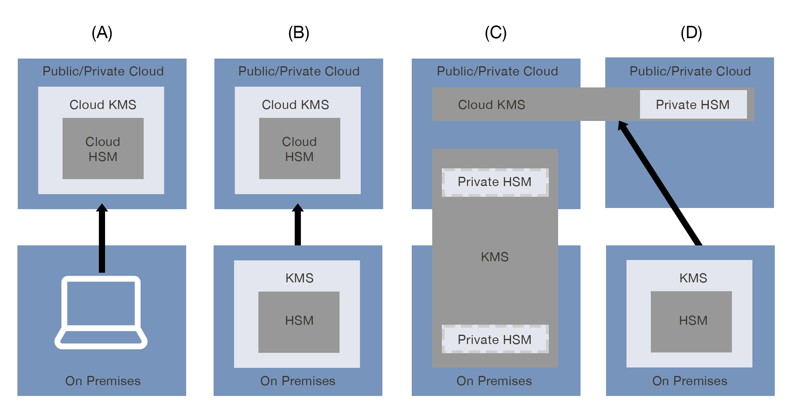
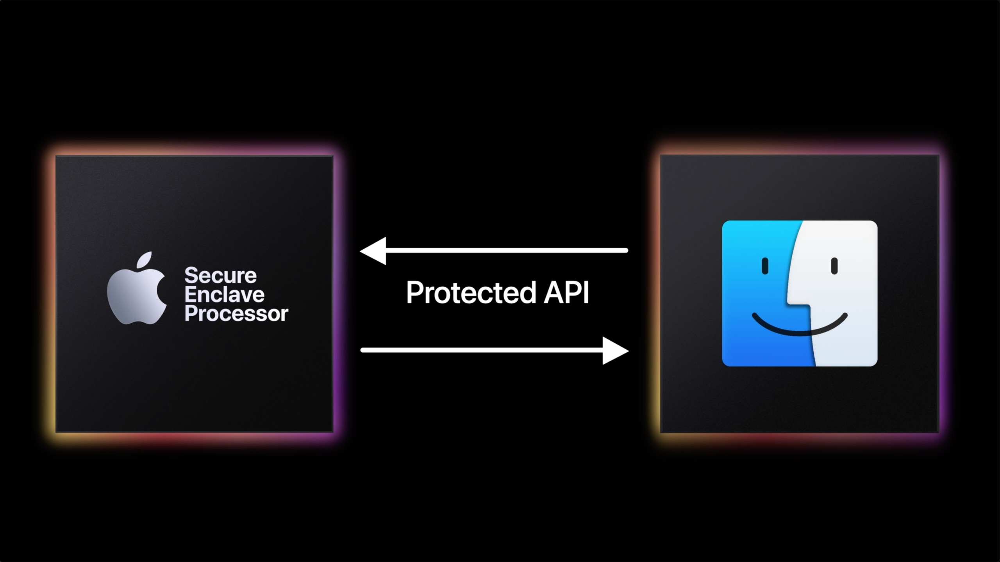

# Encryption Tools

- [Encryption Tools](#encryption-tools)
- [Trusted Platform Module](#trusted-platform-module)
- [Hardware Security Module](#hardware-security-module)
- [Key Management Service](#key-management-service)
- [Secure Enclave](#secure-enclave)

## Encryption Tools

Encryption tools are technologies used to secure data through various methods, ensuring confidentiality, integrity, and protection against unauthorized access. 

## Trusted Platform Module

A Trusted Platform Module (TPM) is a **hardware-based microcontroller** designed to securely generate, store, and manage cryptographic keys and other sensitive information.

- **TPM is likened to a personal vault, while HSM is to a high-security bank vault.**
- Securely stores encryption keys, certificates, and passwords.
- Enables hardware-based encryption and attestation (proving system integrity).
- Supports secure boot and platform integrity checks.

**Applications**
  - Commonly used in laptops and desktops to secure boot processes and protect encryption keys.
  - Utilized in enterprise environments for secure device authentication and attestation.
  

## Hardware Security Module

A Hardware Security Module (HSM) is a dedicated hardware device that safeguards cryptographic keys and perform cryptographic operations in a tamper-proof environment.

  - Securely stores and manages cryptographic keys.
  - Performs encryption, decryption, and digital signature operations.
  - Supports high-availability configurations for mission-critical applications.

**Applications**

  - Used in banking and financial institutions to secure transaction processing.
  - Employed in data centers for key management and securing sensitive data.

## Key Management Service

A Key Management Service (KMS) is a cloud-based or on-premises service designed to manage cryptographic keys, providing **centralized control** and **automated key lifecycle management**.

  - Generates, rotates, and revokes cryptographic keys.
  - Supports role-based access controls for key management.
  - Integrates with various services for encryption and decryption.

**Applications**

  - Used in cloud environments to manage encryption keys for storage and data protection.
  - Enterprise systems;automate key lifecycle management and ensure compliance with security policies.

<small>Common KMS Models for the cloud.</small>

## Secure Enclave

A Secure Enclave is a hardware-based co-processor or device designed to perform sensitive operations and store sensitive data in a secure manner.

  - Encrypts and stores sensitive data, like biometric information or encryption keys.
  - Performs secure computations that are **isolated from the main OS.**
  - Provides a trusted environment for sensitive tasks, like authentication and digital signing.
  - Even if data gets compromised, secure enclaved remains untouched.

**Applications**

  - Mobile devices (e.g., Apple's Secure Enclave); protect biometric data and manage encryption keys.

----------------------------------------------

[Back to main page](../../README.md#security)    