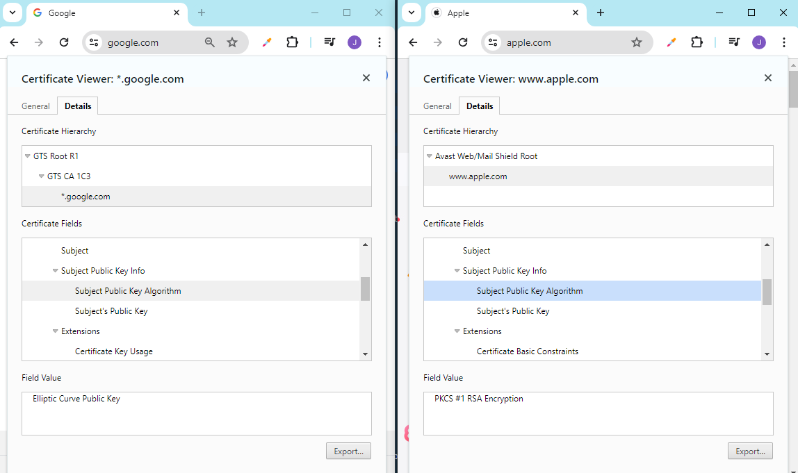

# Public Key Infrastructure

- [Trust Models](#trust-models)
    - [Centralized Trust Model](#centralized-trust-model)
    - [Decentralized Trust Model](#decentralized-trust-model)
- [Public Key Infrastructure PKI](#public-key-infrastructure-pki)
- [Components](#components)
    - [Certificate Authority CA](#certificate-authority-ca)
    - [Registration Authority RA](#registration-authority-ra)
    - [Key Escrow](#key-escrow)
    - [Key Recovery Agent](#key-recovery-agent)
    - [Digital Certificates](#digital-certificates)
    - [Certificate Signing Requests CSRs](#certificate-signing-requests-csrs)
    - [Certificate Templates](#certificate-templates)
    - [Certificate Revocation Standards](#certificate-revocation-standards)
- [Digital Certificate Types](#digital-certificate-types)
    - [Domain Validation Certificates DV](#domain-validation-certificates-dv)
    - [Extended Validation Certificates EV](#extended-validation-certificates-ev)
    - [Wildcard Certificates](#wildcard-certificates)
    - [SAN Certificates](#san-certificates)
    - [Single-Sided Certificates](#single-sided-certificates)
    - [Double-Sided Certificates](#double-sided-certificates)
    - [Self-Signed Certificates](#self-signed-certificates)
    - [Third-Party Certificates](#third-party-certificates)
    - [Root of Trust](#root-of-trust)
- [Certificate Revocation Standards](#certificate-revocation-standards)
    - [Certificate Revocation Lists](#certificate-revocation-lists)
    - [Online Certificate Status Protocol OCSP](#online-certificate-status-protocol-ocsp)
    - [OCSP Stapling](#ocsp-stapling)
    - [Public Key Pinning](#public-key-pinning)
    - [Delta CRL](#delta-crl)
- [Resources](#resources)

## Trust Models 

Trust models define how trust is established and managed in a system or network. They provide a framework for determining the authenticity and integrity of entities, such as users, devices, or services. 

### Centralized Trust Model

In a centralized trust model, trust is placed in a central authority, such as a Certificate Authority (CA) in a Public Key Infrastructure (PKI). 

- The CA issues digital certificates that bind public keys to identities.
- Entities trust the CA to verify the authenticity of certificates.

**Public Key Infrastructure (PKI)**

- Centralized trust model used to establish and manage trust in a networked environment.
- Trusted CA issue digital certificates that bind public keys to identities.
- Validates authenticity and integrity of digital certificates during secure communications.
- Hierarchical structure; Root CA at the top and subordinate CAs under the root CA's authority.
- Widely used in securing network communications, such as HTTPS.

### Decentralized Trust Model

In a decentralized trust model, trust is distributed among multiple entities without relying on a central authority. 

- Often used in peer-to-peer networks or blockchain systems.
- Trust is established through consensus mechanisms or cryptographic algorithms.
- Example: Blockchain technology, distributed ledger systems.

**Web of Trust**

- A specific implementation of the decentralized trust model.
- Used in **PGP (Pretty Good Privacy) encryption** software and similar systems. 

- Users vouch for each other's public keys by signing them with their own private keys. 
- Trust is based on the network of trust relationships between users, rather than a centralized authority.
- Trust is transitive; If user A trusts user B and user B trusts user C, then user A can also trust user C.

## Public Key Infrastructure (PKI)

Public Key Infrastructure or PKI is a combination of software, encryption technologies, processes, and services that enables an organization to secure its communications and business transactions.

- Based on **Asymmetric Encryption**
- A system that creates the asymmetrical key pairs used in encryption and decryption process.
- Provide confidentiality, integrity, access control, authentication, and non-repudiation.

As a recap:

Requirement | Description | PKI Solution
---------|----------|---------
 Confidentiality | The secure transmission of information over networks ensuring that it is not accessed by unauthorised individuals | Data encryption
 Integrity | To validate that all the outputs are equivalent to the inputs. Any alter of the data can be immediately detected and prevented. | Digital signatures 
 Authenticity | Both the sender and recipient should be able to validate each other's identities. | Hash algorithms, message digests, digital signatures
 Non-repudiation | To ensure that the sender or receiver of a message cannot deny either sending or receiving such a message in future.  | Digital signatures, audit logs
 Availability |  Information should be consistently and readily accessible for authorized parties. Involves properly maintaining hardware and technical infrastructure and systems that hold and display the information. | Redundancy 

## Components 

### Certificate Authority (CA)

Primary component of a PKI. The CA server is used for issuing certificates for users, applications, and other CAs as well. In the CA server, the following are configured:

- Policies
- Rules
- Conditions fo the certificates 
- Hierarchy of the CAs:
    - Root CA
    - Subordinate CA)
- Subordinate CA is also known as Issuing CA

Hierarchical Structure:

How it works:

1. Root CA is precious, usually taken offline.
2. Intermediate CAs do all the hardwork.
3. User requests presents the digital certificates to the intermediate CAs.
4. The intermediate CAs performs the confirmations themselves.

### Registration Authority (RA)

A Registration Authority (RA) is an entity responsible for authenticating and verifying the identities of individuals or organizations before they are issued digital certificates by a Certificate Authority (CA). 

- Verifies identity of certificate applicants through interviews, or background checks.
- Collects and processes documentation from certificate applicants to establish their identity.
- Receives certificate requests from users and validates the information provided.
- Approved requests are forwarded to the CA for certificate issuance.
- Maintains records of requests and approvals for auditing and accountability purposes.

### Key Escrow 

Refers to the process where the user's private keys are stored in a secure, third-party location, which is effectively an "**escrow**".

- Key escrows can be set up using key escrow agents.
- In case of any investigation, keys can be retrieved from the escrow.
- Ensures encrypted data is always accessible.
- Access is strongly regulated.
- At least two administrators are required when taking out the key from the escrow.

### Key Recovery Agent 

Key recovery agents are specialized type of software that allows the restoration of a lost or corrupted keys.

- Useful in case of major incidents or disasters

### Digital Certificates

Digital certificates are digitally signed electronic document that binds a public key with a user's identity.

- Purchased from the CA
- Electronic documents binding identity to public key
- Provide authentication, encryption, integrity
- Commonly uses X.509 protocol standard.

This certificates contains:

- User's info like name and organization
- Digital signature 
- Serial number for the certificate
- Issue and expiration date
- Version of the certificate
- Public key
- Information about the CA

As an example, we can see the digital certificates for both Goole and Apple's websites below:

We can see that Google uses ECC certificates while Apple uses RSA public certificates.

- Google is heavily focused on mobile devices.
- Mobile devices have less processing power.
- ECC has smaller 256-bits key size, while RSA has 2048-bits key size.
- ECC public certificates are favored for mobile and low favor devices.
- RSA public certificates are favored for desktops.

### Certificate Signing Requests (CSRs)

A Certificate Signing Request (CSR) is a message sent from an applicant to a Certificate Authority (CA) to apply for a digital certificate. CSRs are typically generated by the entity requesting the digital certificate, such as a website owner or an organization's IT department. 

- **Public Key**: Key that will be included in the digital certificate.
  
- **Identity Information**: Common name (CN), organization name, country.
  
- **Key Information**: Cryptographic algorithm and key size to be used in the digital certificate.
  
- **Signature**: Signed by the private key corresponding to the public key.

Once the CSR is submitted to the CA:

- The CA verifies the information provided.
- The information is used to generate the digital certificate.
- The digital certificate is issued and returned to the entity. 
- Issued certs can be installed on the entity's server for secure communications.

### Certificate Templates

Certificate templates are predefined formats or structures that specify the key attributes and parameters for creating digital certificates.

- Streamline the certificate issuance process.
- Specify key usage, validity, attributes
- Allow customization to meet specific organizational needs
- Ensure consistency and compliance.
- Example is **EFS** - Encrypted File System

### Certificate Revocation Standards 

Certificate revocation is the process of invalidating a previously issued digital certificate before its expiration date. Several standards and protocols facilitate the certificate revocation process in a Public Key Infrastructure (PKI) environment:

- Certificate Revocation List (CRL)
- Online Certificate Status Protocol (OCSP)
- Delta CRL
- OCSP Stapling

## Digital Certificate Types 

### Domain Validation Certificates (DV)

A basic SSL/TLS certificate that verifies domain ownership without authenticating organizational details.

- Confirms domain ownership through email validation or DNS records.
- Doesn't verify organization details, only domain control.
- Automated process allows for quick certificate issuance.
- Provides encryption for HTTPS connections.
- Suitable for blogs, personal sites, and small businesses.
- Widely supported by web browsers.

### Extended Validation Certificates (EV)

High-assurance SSL/TLS certificates that undergo rigorous validation processes to provide enhanced trust and security.

- Extensive vetting of the requesting entity's legal identity and operational existence.
- Displays organization's name prominently in the browser's address bar to signify enhanced verification.
- Offers users increased confidence in the legitimacy of the website and organization.
- Validates both domain ownership and organizational identity, ensuring comprehensive authentication.
- Ideal for websites handling sensitive data or transactions, e.g. financial institutions.

### Wildcard Certificates

Wildcard certificates **secure a domain and all its subdomains** with a single certificate.

- Simplify certificate management
- Cost-effective for securing multiple subdomains
- Typically used for broader domain coverage
- Example: *.example.com covers www.example.com, blog.example.com, etc.

Disadvantage:

- Cannot secure subdomains independently with different certificates.
- Compromising one subdomain compromises all subdomains under the wildcard domain.
- Revoking a wildcard certificate affects all subdomains, potentially causing disruptions.
- However, re-issuing a new certificate is an quick process.

### SAN Certificates

Instead of using Wildcard, we can modify the Subject Alternate Name (SAN) field to **specify multiple domains**.

- Useful for supporting different domains with a single digital certificate.
- Different domains with different root domain, e.g. abc.com and xyz.com

### Single-Sided Certificates

Single-sided certificates are issued by only one party to authenticate the identity of the recipient. This only requires the server to be validated.

- Unidirectional authentication
- Issued by the sender to verify recipient's identity
- Typically issued by the issuer
- Commonly used in email encryption
- Example: S/MIME certificates for email encryption

### Double-Sided Certificates

Double-sided certificates authenticate both parties involved in a transaction, providing mutual trust and security.

- Bidirectional authentication
- Both sender and receiver authenticate each other
- Enhanced security for sensitive transactions
- Example: SSL/TLS certificates for secure web browsing

### Self-Signed Certificates

Self-signed certificates are **generated and signed by the entity itself**, used for internal testing or private networks.

- No third-party involvement in certificate issuance
- Suitable for private network encryption
- Not suitable for public-facing services due to lack of trust
- Commonly used for local development or testing environments

### Third-Party Certificates

Third-party certificates are issued and signed by a trusted Certificate Authority (CA) to validate the identity of an entity, commonly used in public networks like the internet.

- Certificates are embedded into major web browsers and operating systems
- Preferred choice for public-facing websites
- Provides trust and authenticity
- Issued by trusted Certificate Authorities (CAs)
- Verifies the identity of the certificate holder
- Widely used for securing websites, email servers, and other online services

### Root of Trust 

Each certificate is validated using the concept of **root of trust** or the **chain of trust.**

- Bottom-top approach approach.
- The family tree or path followed by the chain of trust is called the **certification path.**
- Root of trust can be trusted third-party providers, e.g. Verisign, Amazon, Google, Cloudflare.

## Certificate Revocation Standards 

These standards and protocols ensure that relying parties can efficiently and securely verify the validity of digital certificates, enhancing the overall security of PKI-enabled systems and applications.

### Certificate Revocation Lists

CRLs or **Certificate Revocation Lists** serves as an online list of digital certificates that the CA has already revoked.

- Certificates are usually revoked because they have been compromised.
- Full list of every certificated revoked by that CA.

How it works:

1. User connects to the application's web server.
2. User's computer requests for current public key for the digital certificate from the CA.
3. CA will first check the CRL to ensure the current digital certificate is not revoked.
4. If its not in the CRL, the public key is sent back to the user's computer.

### Online Certificate Status Protocol (OCSP)

OCSP is a protocol used to obtain the revocation status of a digital certificate in real-time.

- Instead of downloading and parsing a CRL, a relying party sends query to an OCSP responder.
- OCSP responder checks the certificate's status and returns a response: valid, revoked, or unknown.
- OCSP reduces the overhead associated with CRL management.
- Provides more up-to-date revocation information.
- More quick and efficient because it doesn't use an encryption.
- Looks up only one digital certificate at a time.

As mentioned, OCSP doesn't use encryption which makes it less secure than OCSP Stapling. 

### OCSP Stapling 

OCSP Stapling, also known as **TLS Certificate Status Request extension**, is a method for improving the performance and privacy of OCSP.

- The web server sends TLS certificate + signed OCSP response during SSL/TLS handshake.
- OCSP record is sent at regular intervals by the server.
- Eliminates extra connection required for the initial request by the user.
- Speeds up tunnel creation, ensuring the data can be sent back quickly.

OCSP Stapling  allows clients to verify the certificate's revocation status without needing to query an external OCSP responder, enhancing privacy and reducing latency.

### Public Key Pinning

Public Key Pinning prevents impersonation attacks like man-in-the-middle (MITM) attacks by associating a host with its expected public key or keys. This helps ensure that the server's public key used for encryption is authentic and has not been replaced with a malicious one.

- **HTTP Headers**
    - Public keys are sent by the server to the client's browser as part of the HTTP header.
    - If web browser doesn't get matching public keys, it'll know that website is compromised.
    - It will then alert the user with the issue.
  
- **Pins**
    - Pins are cryptographic hashes of public keys or entire certificates that are associated with the domain.
  
- **Validation**
    - When a client connects to the server, it checks whether the received public key matches any of the pinned keys.
  
- **Prevents MITM Attacks**
    - If the public key does not match any of the pinned keys, the client browser rejects the connection, preventing potential MITM attacks where an attacker intercepts and replaces the server's public key.

- **HPKP (HTTP Public Key Pinning)**
    - A deprecated standard that allowed website owners to specify which Certificate Authorities (CAs) were allowed to issue certificates for their domain.

- **Expect-CT Header**
    - A replacement for HPKP, the Expect-CT header allows websites to require that browsers enforce Certificate Transparency (CT), which provides visibility into the certificates issued for a domain.

### Delta CRL

Delta CRL is an optimization of the traditional CRL mechanism.

- Instead of downloading the entire CRL, relying party can download smaller "delta" CRLs.
- Delta CRLs contains only the updates since the last full CRL.
- Reduces the bandwidth and processing requirements for CRL validation.
- Maintains the ability to check the revocation status of certificates.

## Resources 

- [Public Key Infrastructure (PKI) and other Concepts in Cryptography for CISSP Exam](https://hub.packtpub.com/public-key-infrastructure-pki-and-other-concepts-cryptography-cissp-exam/)