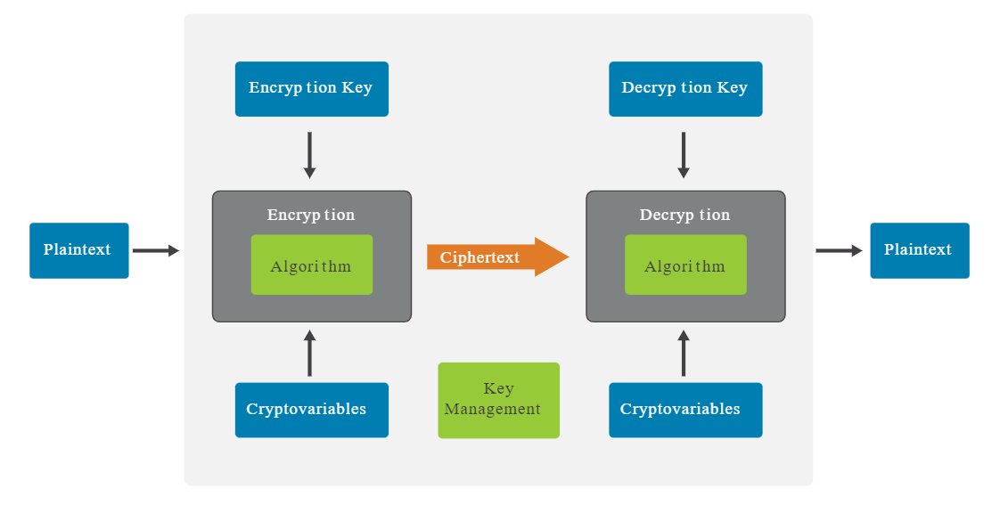

# Data Security 

- [Data Security](#data-security)
   - [Classification](#classification)
   - [Labeling](#labeling)
   - [Retention](#retention)
   - [Destruction](#destruction)
- [Destroying Data](#destroying-data)
   - [Data Media Sanitization](#data-media-sanitization)
   - [Overwriting](#overwriting)
   - [Degaussing](#degaussing)
   - [Secure Erase](#secure-erase)
   - [Cryptographic Erase](#cryptographic-erase)
   - [The Right to be Forgotten](#the-right-to-be-forgotten)
- [Protecting Data](#protecting-data)
   - [Anonymization](#anonymization)
   - [Pseudo-Anonymization](#pseudo-anonymization)
   - [Data Minimization](#data-minimization)
   - [Tokenization](#tokenization)
   - [Data Masking](#data-masking)
   - [Encryption](#encryption)
   - [Cryptography](#cryptography)
   - [Cryptographic Hash Function](#cryptographic-hash-function)
   - [Digital Signatures](#digital-signatures)
   - [Message Digests](#message-digests)
   - [Message Authentication Code](#message-authentication-code)
- [Data Encryption](#data-encryption)
   - [Data-at-Rest Encryption](#data-at-rest-encryption)
   - [Data-in-Transit Encryption](#data-in-transit-encryption)
   - [Data-in-Use Encryption](#data-in-use-encryption)
- [Mishandling Data](#mishandling-data)
   - [Cybersquatting](#cybersquatting)
- [Data Loss Prevention](#data-loss-prevention)
   - [Endpoint DLP System](#endpoint-dlp-system)
   - [Network DLP System](#network-dlp-system)
   - [Storage DLP](#storage-dlp)
   - [Cloud-based DLP](#cloud-based-dlp)

## Data Security

### Classification

Classification involves assessing potential impacts on confidentiality, integrity, and availability.

- **Assessment**
   - Evaluate impacts on confidentiality, integrity, and availability.
   - Understand sensitivity before labeling.

- **Labeling and Handling**
   - Classify based on laws, regulations, or business expectations.
   - Labels reflect impacts, guiding protection.

- **Risk Management**
   - Classifications range from minor disruptions to severe threats.
   - Align with the organization's risk approach.

- **Efficiency in Security**
   - Enables efficient security processes.
   - Similar levels share common controls.

### Labeling

Label information to enforce appropriate access controls.

**Data Sensitivity Levels**

1. **Highly Restricted**
    - Potential risk to the organization's future existence.
    - Could result in significant harm, loss of life, injury, or property damage.

2. **Moderately Restricted**
    - Risk of loss of temporary competitive advantage.
    - May lead to revenue loss or disruption of planned investments.

3. **Low Sensitivity (Internal Use Only)**
    - Possible minor disruptions, delays, or impacts.

4. **Unrestricted Public Data**
    - Already published; no harm from further dissemination or disclosure.

### Retention

It is the responsibility of the organization to establish and enforce a comprehensive data retention policy.

1. **Compliance**
   - Adhere to industry standards, laws, and regulations.
   - Establish an organization-specific data retention policy.

2. **Destruction**
   - Implement systematic data destruction when assets reach their retention limits.
   - Maintain a precise inventory detailing asset location and retention requirements.

3. **Review**
   - Conduct periodic reviews of retained records.
   - Reduce information volume, retaining only necessary data.

4. **Implementation**
   - Ensure personnel understand and follow retention requirements.
   - Document specific retention guidelines for each type of information.

5. **Avoid Uniform Retention**
   - Steer clear of applying the longest retention period universally.
   - Prevent unnecessary data storage, minimizing the risk of exposure.

6. **Legal Compliance**
   - Dispose of records not mandated for retention.
   - Adhere to enterprise policies and legal requirements in the destruction process.

**Common mistake in record retention**

A common mistake in record retention is applying the longest retention period without taking into account the sensitivity or importance of the corresponding information. 

Retaining unnecessary data has considerable costs in terms of storage and management. Less important or sensitive information can have shorter retention periods, thereby allowing longer retention periods for more important or sensitive information (see ISC2 Study Guide, chapter 5, module 1).

### Destruction

**Data remanence**, or residual data left on media after deletion, poses a security risk. Mitigation strategies include:

1. **Clearing**
   - Involves overwriting with random patterns.
   - Known as "zeroizing," but zeroing has risks.

2. **Purging**
   - Eliminates residual effects from original data.
   - Some technologies may retain recoverable data "ghosts."
   - Degaussing may be needed for certain media.

3. **Destruction**
   - Ultimate remedy for data remanence.
   - Involves shredding, chopping, burning, or etching.
   - Remains disposed of in protected landfills.

## Destroying Data 

### Data Media Sanitization

Ensures that data is completely destroyed.

- Data could still be recovered if not sanitized 
- Use disk wiping tools such as performing:
   - Multiple pass disk overwrites (SSD and HDD)
   - Degaussing (HDD)

### Overwriting 

Overwriting involves writing multiple patterns across all storage media (see ISC2 Study Guide, Chapter 5, Module 1). 

- Ensures that the original data cannot be recovered. 
- Overwrite the drive with multiple data patterns to ensure that the original data is completely erased.
- Each overwrite makes it increasingly difficult to retrieve any meaningful data using forensics tools.

The number of passes refers to how many times the data is overwritten, and this process is designed to increase the difficulty of recovering the original data.

- Single Pass
- 7 Passes 
- 35 Passes 

### Degaussing 

Degaussing is a process used to erase data from magnetic storage media by reducing or eliminating the magnetic field that stores the data. This method is effective for securely erasing data from hard drives, tapes, and other magnetic storage devices.

- Uses a powerful magnetic field to disrupt and erase data stored on magnetic media.
- Ensures permanently removal, also effective for bulk erasure.
- Once a device is degaussed, it can no longer be used for storage.

Limitations:

- Only effective on magnetic media; not applicable for SSDs or flash memory devices.
- Requires access to specialized equipment, which may involve additional costs.

### Secure Erase

### Secure Erase

Secure erase is a command and process designed to completely erase all data from a storage device, typically used with solid-state drives (SSDs) and other modern storage technologies. It ensures that the data is permanently removed, providing a high level of security for sensitive information.

  - Utilizes built-in commands to purge the data blocks, making data irretrievable from the device.
  - Can complete the erasure process quickly compared to other methods.
  - Typically implemented at the firmware level of the storage device.

Some flaws were found overtime on secure erase overtime, and this prompted the use of a newer and more secure technique called cryptographic erase.

### Cryptographic Erase 

Introduced as a replacement for Secure Erase in most modern storage devices, Cryptographic Erase involves destorying the decryption key to ensure that the encrypted data cannot be decrypted.

- Data is still in the device, but its now inaccessible.
- Useful for self-encrypting drives (SEDs).
- Speed advantage over Secure Erase, since only the key is deleted and not the data blocks.
- Data storage can be repurposed or resolv without there being the risk of data leakage.

### The Right to be Forgotten 

The right to be forgotten is a principle under the General Data Protection Regulation (GDPR).

- Individuals can request erasure of personal data.
- Empowers control over online presence.
- Involves removing outdated or excessive information from online platforms.

## Protecting Data 

### Anonymization 

Anonymization of data is the process of removing or altering personally identifiable information (PII) to ensure that the data cannot be traced back to specific individuals.

- Anonymized data has limited marketing value
- GDPR allows anonymized data collection and use without user consent 

### Pseudo-Anonymization 

Replacing unique identifiers (such as PII) with fake identifiers.

- Information can also be selectively removed. 

### Data Minimization 

Refers to limiting the amount of data that is stored or retained.

- Example is PCI DSS 
- Merchants doesn't need to retain the customers' credit card details 
- Retain only what's legally allowed.

### Tokenization 

Using a service or app that creates a unique token that authorizes the access instead of using the original credentials. 

### Data Masking 

Refers to hiding sensitive data from unauthorized users.

- Masked out credit card number digits on receipts

### Encryption 

Encryption is essential for data security as it ensures that sensitive information remains secure and unreadable to unauthorized individuals, both while stored and during transmission over networks.

- **Encryption for Transactions**
   - Safeguards personal and business transactions.
   - Protects information by making it unreadable without decryption.

- **Digital Signatures for Authenticity**
   - Verifies the legitimacy of software updates and sources.
   - Ensures the integrity and authenticity of digital content.

- **Secure Email Communication**
   - Enables the exchange of digitally signed contracts.
   - Validates the binding nature and authenticity of digital contracts.

### Cryptography

Cryptography is a versatile tool, providing crucial services like confidentiality and integrity for enhanced system security.

- **Confidentiality**
   - Hides messages, ensuring restricted access.
   - Keeps information secret, accessible only to authorized users.

- **Integrity Services**
   - Utilizes hash functions and digital signatures.
   - Verifies message integrity, detecting any alterations.

 
    

    
    

### Cryptographic Hash Function 

A hash function is a mathematical function that takes an input or 'message' and generates an output or 'hash value', usually much smaller than the original message, typically of a fixed-size (see ISC2 Study Guide, Module 1, under Encryption Overview).

Hash functions are used to generate unique representations of data or verify data integrity and are a crucial element of cryptographic systems.

A cryptographic hash function should have the following characteristic: 

- unique 
- deterministic
- useful 
- tamper-evident 
- non-reversible

### Digital Signatures 

A digital signature is the result of a cryptographic transformation of data which is useful for providing: 
- data origin authentication
- data integrity
- non-repudiation of the signer 

See NIST SP 800-12 Rev. 1 under Digital Signature.

However, digital signatures **cannot guarantee confidentiality** (i.e. the property of data or information not being made available or disclosed).

### Message Digests 

Message digesting ensures data integrity by maintaining accuracy and consistency.

- It uses cryptographic hash functions like MD5 or SHA-256.
- Creates a unique, fixed-length "digest" of the original message data.
- When downloading a file, a Web site may provide a hash value.
- Users can perform the same hash function on the downloaded file.
- Matching digests confirm the file's integrity, indicating no alteration during transmission.

### Message Authentication Code 

A Message Authentication Code (MAC) does not guarantee anonymity. MAC is a cryptographic function that guarantees a message's:

- integrity,
- authenticity, and 
- non-repudiation.

On the other hand, **anonymity is not a guaranteed by a MAC.**

## Data Encryption 

### Data-at-Rest Encryption

Each type of data encryption serves a specific purpose and can be used individually or in combination to protect sensitive information from unauthorized access or disclosure.

- **FDE (Full Disk Encryption):**
  - Encrypts entire hard drive, including OS and user data.
  - Data is encrypted when off, decrypted when turned on and used by user.
  - Guards against unauthorized access if device is lost.
  - Examples: BitLocker (Windows), FileVault (macOS).

- **Partition Encryption**
  - Encrypts specific drive partitions.
  - Allows selective encryption, leaving other partitions unencrypted.
  - Useful for targeted data protection.

- **File Encryption**
  - Encrypts individual files or folders.
  - Enables secure storage and sharing.
  - Examples: VeraCrypt, AES Crypt.

- **Volume Encryption**
  - Encrypts entire volumes or logical drives.
  - Shields multiple partitions. 
  - Common in enterprise setups.

- **Database Encryption**
  - Encrypts data within databases.
  - Protects against unauthorized access. 
  - Can be done at the column, row, or table level.
  - Assists with GDPR, HIPAA compliance.

- **Record Encryption**
  - Encrypts individual database records or fields.
  - Useful: multiple users with unequal permissions are accessing the same database.
  - Offers precise data protection.
  - Often used for compliance requirements.

### Data-in-Transit Encryption

Secures data while it's being transmitted over networks to prevent interception or eavesdropping.

- **SSL/TLS**
  - Establish secure connections between clients and servers over the internet.
  - Encrypts data exchange to ensure confidentiality and integrity.
  - Securing web traffic (HTTPS), email (SMTPS, IMAPS), and other internet protocols.

- **VPNs (Virtual Private Networks)**
  - Encrypted tunnel between a user's device and a remote server or network.
  - Encrypts all traffic going through the tunnel, prevents interception or monitoring.
  - Remote access to corporate networks or for securing public Wi-Fi environments.

- **IPSec (Internet Protocol Security)**
  - Suite of protocols; secure IP communications by encrypting and authenticating data packets.
  - End-to-end security for IP traffic, ensuring confidentiality, integrity, and authenticity.
  - Often used with VPNs to encrypt traffic between network segments.
  - More details can be found here: [IPSec](./042-Securing-the-Network.md#ipsec)

### Data-in-Use Encryption

Protects data while it's being accessed or used by applications or users.

- **Application level**
  - Encryption implemented within applications.
  - Protect sensitive data during processing or manipulation.
  
- **Access Control**
  - Controls access to data based on user permissions and authentication.
  
- **Secure Enclaves**
  - Hardware-based secure areas for processing sensitive data.
  - Ensures isolation from other system components.
  
- **Intel Software Guard Extensions (SGX)**
  - Hardware-based security technology for creating secure enclaves within the CPU.
  - Protect data from unauthorized access or modification.

## Mishandling Data 

### Cybersquatting

Cybersquatting involves speculatively registering and selling domain names for profit.

- Intent is to profit from someone else's trademark.
- Example: Registering "mycompany.com" to sell it to the trademark owner.
- Can cause confusion and damage to the trademark owner's brand.
- Generally considered unethical and deceptive.
- Illegal under the United States' Anticybersquatting Consumer Protection Act (ACPA) and similar laws in other countries.

## Data Loss Prevention 

DLP is a technology used to identify, monitor, and protect sensitive data to prevent unauthorized access, use, or transmission.

- Prevents unauthorized access, use, or transmission of sensitive data.
- Safeguards against accidental or malicious data sharing.
- Uses policies, monitoring, and enforcement to mitigate potential breaches.
- Protects against data leakage across channels like email, web, and endpoints.
- Involves content discovery, classification, encryption, and policy enforcement.

### Endpoint DLP System 

An Endpoint Data Loss Prevention (DLP) system is a security solution designed to monitor and control data transfers on endpoint devices such as laptops, desktops, smartphones, and tablets.

  - Detects sensitive data based on predefined rules.
  - Prevents unauthorized data transfers.
  - Enforces data security policies consistently.
  - Works like an IDS/IPS but for data 
  - Can be set to **detection mode** or **prevention mode**

### Network DLP System 

A Network Data Loss Prevention (DLP) system is a piece of software or hardware that monitors and control data transfers within a network infrastructure.

- Placed at the perimeter of the network.
- Detects **data-in-transit**; focused on things going out of the network.

### Storage DLP

A Storage Data Loss Prevention (DLP) system is a software installed on a server in a datacenter that inspects the data-at-rest.

- Safeguard sensitive **data stored** across different storage platforms.
- Ensure compliance with security policies and regulations.

### Cloud-based DLP

A DLP usually offered as a SaaS and is part of the cloud service and storage needs.

- Data stored in the cloud services are protected.
- Example: Google Drive