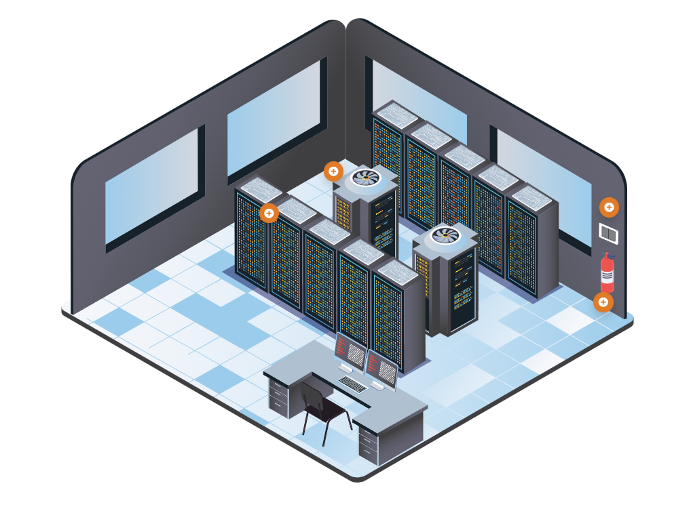

# Security Architecture

- [Security Architecture](#security-architecture)
- [On-Premises Data Centers](#on-premises-data-centers)
    - [Heating, Ventilation and Air Conditioning HVAC / Environmental](#heating-ventilation-and-air-conditioning-hvac--environmental)
    - [Data Center/Closets](#data-centerclosets)
    - [Power](#power)
    - [Fire Suppression](#fire-suppression)
    - [Using Robust Systems](#using-robust-systems)
- [Cloud Computing](#cloud-computing)
    - [Cloud Concepts](#cloud-concepts)
    - [Key Considerations](#key-considerations)
    - [Managed Service Provider MSP](#managed-service-provider-msp)
    - [Service-Level Agreement SLA](#service-level-agreement-sla)
    - [Cloud Security](#cloud-security)
- [Virtualization](#virtualization)
    - [Hypervisors](#hypervisors)
    - [VM Vulnerabilities](#vm-vulnerabilities)
    - [Securing VMs](#securing-vms)
- [Containerization](#containerization)
    - [Advantages](#advantages)
- [Serverless](#serverless)
    - [Vendor Lock-in](#vendor-lock-in)
- [Microservices](#microservices)
    - [Monolithic vs Microservices](#monolithic-vs-microservices)
    - [Benefits](#benefits)
    - [Challenges](#challenges)

## Security Architecture

Design, structure and behavior of an organization's information security environment.

- **On-Premise**
    - Local infrastructure.
    - Data processed and stored on-site.
    - Direct control over hardware and software.

- **Cloud**
    - Internet-based services.
    - Hosted and managed by third-party providers.
    - Pay-per-use model.

- **Hybrid**
    - Combination of on-premise and cloud.
    - Integrates local infrastructure with cloud services.
    - Offers flexibility and scalability.

## On-Premises Data Centers

When it comes to data centers, there are two primary options: organizations can outsource the data center or own the data center. If the data center is owned, it will likely be built on premises. A place, like a building for the data center is needed, along with power, HVAC, fire suppression and redundancy.

Components of a Datacenter:

- [Heating, Ventilation and Air Conditioning HVAC / Environmental](#heating-ventilation-and-air-conditioning-hvac--environmental)
- [Data Center/Closets](#data-centerclosets)
- [Power](#power)
- [Fire Suppression](#fire-suppression)

### Heating, Ventilation and Air Conditioning (HVAC) / Environmental

Ensure adequate cooling for high-density and enclosed space equipment.

- Follow temperature standards for optimized hardware life.
- Use temperature sensors at various rack levels for precise monitoring.
- Implement contaminant controls for dust and noxious fumes.
- Monitor for water or gas leaks, sewer overflow, and HVAC failure.
- Prioritize critical systems in contingency planning.

### Data Center/Closets

Protect access to the physical layer for information system security.

- House critical components such as servers and network connections.
- Address security challenges related to data centers and wiring closets.
- Safeguard against intentional or unintentional damage.

### Power

Ensure constant and consistent power delivery to data centers.

- Mitigate wide fluctuations in power quality to preserve system lifespan.
- Size backup generators for the critical load and use battery backups for stabilization.
- Regularly test alternate power sources for effective failover.

Key terms:

- **Surges**
    - Small and unexpected increase in the amount of voltage being provided.
    - Utilize a surge protector or line conditioner.

- **Spikes**
    - Short transient voltage that is usually caused  by a short circuit, a power outage, or a lightning strike.
    - Utilize a surge protector or line conditioner.

- **Sags**
    - Small and unexpected decrease in the amount of voltage being provided.
    - Usually occurs for short period of time.
    - During a sag, computer can still remain operational but hardware components may be damaged over time. 
    - Utilize a surge protector or line conditioner.

- **Undervoltage events**
    - Usually referred to as "brownouts".
    - Voltage is reduced to lower levels; occurs for longer period of time.

- **Full power loss events**
    - Usually referred to as "blackouts".
    - Total loss of power for a given period of time.
    - When power is restored, it can cause a power spike.

### Fire Suppression

Choose appropriate fire detection/suppression considering room size and equipment risks.

- Be cautious of water-based suppression's potential harm to electronic components.
- Consider gas-based systems for electronics-friendly suppression, but be mindful of potential human toxicity.

### Using Robust Systems

- **Line Conditioners**
  - Overcome minor fluctuations in the power being received.
  - Stabilize voltage levels; filter out electrical noise.
  - Protect against power surges, but not from a complete failure event.

- **Uninterruptible Power Supply (UPS) Systems**
  - Provide backup power during outages and protect against power fluctuations.
  - Prevent data loss by allowing safe shutdown.
  - Most UPS only provides 15-60 minutes of power; not for long-term outage.

- **Generators**
  - Convert mechanical energy into electrical energy for use.
  - Supply power during extended outages.
  - Automatically start when primary power fails.
  - Support critical systems for prolonged periods.
  - Usual types:
    - Portable gas-engine 
    - Permanently installed 
    - Battery-inverter

- **Power Distribution Centers**
  - Central hub that distribute electrical power efficiently.
  - Integrated circuit protection, monitoring, and loadbalancing.

## Cloud Computing

Cloud computing involves accessing and utilizing computing resources and services over the internet, provided by third-party vendors. It offers scalability, flexibility, and reduced dependency on on-premise hardware.

- Servers 
- Storage 
- Databases 
- Networking
- Software Analytics 
- Intelligence

### Cloud Concepts 

TO learn more, check out [Cloud Computing](../../README.md#cloud---fundamentals).

- **Utility Model**

    - Similar to utilities like electricity.
    - Provisioned in a specific location.
    - Offers scalability, elasticity, and ease of use for IT service deployment.

- **NIST Definition**

    - National Institute of Standards and Technology (NIST) provides a widely accepted definition.
    - Described as a model enabling ubiquitous, on-demand access to a shared pool of configurable computing resources.
    - Emphasizes rapid provisioning and release with minimal management effort.

- **Responsibility Matrix**

    - A tool outlining roles and responsibilities within a project or organization.
    - Clarifies who is accountable for specific tasks or areas of work.
    - Helps ensure clear communication and accountability.

- **Third-party Vendors**

    - External entities providing goods or services to a company.
    - Often contracted for specialized expertise or resources.
    - Can include suppliers, service providers, consultants, or software vendors.
    - Require clear communication, contracts, and management to ensure successful collaboration.

- **Hybrid Solutions**

    - In the context of IT, often refers to a mix of on-premise and cloud solutions.
    - Offers flexibility by leveraging both local infrastructure and cloud services.
    - Integration and management to ensure smooth operation and maximum benefit.

### Key Considerations 

- **Availability**

    - Redundancy measures to prevent single points of failure.
    - Monitoring systems for early detection of issues.
    - Disaster recovery plans for quick restoration of services.
  
- **Cost**

    - Total cost of ownership analysis including initial setup, maintenance, and operational expenses.
    - Cost optimization strategies such as resource consolidation or automation.
    - Budget forecasting to anticipate future expenses.
  
- **Resilience**

    - Fault-tolerant architecture design.
    - Regular testing of backup and recovery procedures.
    - Geographic redundancy for data centers or cloud regions.
  
- **Responsiveness**

    - Service level agreements (SLAs) defining response times and resolution targets.
    - Proactive monitoring and alerting systems.
    - Efficient incident management processes.
  
- **Scalability**

    - Horizontal and vertical scaling capabilities.
    - Auto-scaling mechanisms based on demand fluctuations.
    - Performance testing to ensure scalability thresholds are met.
  
- **Ease of Deployment**

    - Streamlined deployment pipelines or automation tools.
    - Compatibility testing with existing infrastructure.
    - User-friendly interfaces and documentation.
  
- **Risk Transference**

    - Clearly defined contractual agreements and service level guarantees.
    - Insurance policies to mitigate financial risks.
    - Compliance with regulatory requirements and standards.
  
- **Patch Availability**

    - Patch management processes to ensure timely application of updates.
    - Vulnerability scanning and assessment tools.
  
- **Inability to Patch**

    - Risk assessment and prioritization of unpatched vulnerabilities.
    - Compensating controls or mitigation strategies.
    - Regular security audits and assessments.
  
- **Power**

    - Redundant power sources such as uninterruptible power supplies (UPS) or backup generators.
    - Monitoring and maintenance of power infrastructure.
    - Energy-efficient hardware and cooling systems.
  
- **Compute**

    - Performance benchmarks and optimization techniques.
    - Load balancing for efficient resource utilization.
    - Capacity planning based on workload requirements and growth projections.

### Managed Service Provider (MSP)

A company managing IT assets for another organization and is Commonly utilized by small- and medium-sized businesses for day-to-day IT operations.

- **Outsourcing Functions**
  - Used to outsource specific IT functions or manage entire operations.
  - Expertise provided in areas where the company lacks internal capabilities.

- **Services Provided by MSPs**
  - Network and security monitoring.
  - Patching services.
  - Cloud-based solutions, including Managed Detection and Response (MDR).

- **MDR Service Example**
  - Managed Detection and Response (MDR) involves active incident investigation and response.
  - Monitors security tools, such as firewalls, for event triaging.

- **Common MSP Implementations**
  - Augmenting in-house staff for projects.
  - Implementing products or services.
  - Providing payroll services.
  - Managing Help Desk service.
  - Responding to and managing security incidents.
  - Overseeing all in-house IT infrastructure.

### Service-Level Agreement (SLA)

It is an agreement between a cloud service provider and customer that defines the quality of cloud services, specific to cloud computing terms and roles.

- **Importance of SLA**
  - Functions as a rule book and legal contract.
  - Outlines minimum service levels, availability, security, controls, and more.

- **Purpose of SLA**
  - Documents specific parameters, service levels, and remedies for failures.
  - Addresses data ownership, return, and destruction details.

- **Key SLA Points**
  - Cloud system infrastructure and security standards.
  - Customer's right to audit legal and regulatory compliance.
  - Rights and costs associated with service use continuation/discontinuation.
  - Service availability and performance.
  - Data security, privacy, and location.
  - Disaster recovery processes and data access.
  - Data portability and problem identification/resolution.
  - Change management processes and dispute mediation.
  - Exit strategy considerations.

### Cloud Security 

- **Shared Physical Server Vulnerabilities**
    - Multiple users often share the same underlying physical servers in a cloud environment.
    - Isolation mechanims prevent unauthorized access between virtual machines.
    - Regular security assessments and audits of underlying hardware.
    - Implementation of hypervisor security measures to mitigate risks.

- **Inadequate Virtual Environment Security**
    - Segmentation of virtual networks and resources.
    - Intrusion detection and prevention systems within virtual environments.
    - Regular security updates and patches for virtualization software.

- **User Access Management**
    - Role-based access controls (RBAC) to limit privileges based on job roles.
    - Multi-factor authentication (MFA) for enhanced user verification.
    - Regular reviews and audits of user permissions to prevent unauthorized access.

- **Lack of Up-to-date Security Measures**
    - Continuous monitoring for security vulnerabilities and emerging threats.
    - Automated patch management systems to ensure timely updates.
    - Integration with threat intelligence feeds for proactive threat detection.

- **Single Point of Failure**
    - Redundancy and failover mechanisms across multiple data centers or availability zones.
    - Load balancing to distribute traffic and mitigate the impact of failures.
    - Disaster recovery plans to maintain operations in the event of a failure.

- **Weak Authentication and Encryption**
    - Strong encryption protocols for data transmission and storage.
    - Secure key management practices to protect encryption keys.
    - Regular password policy enforcement and password rotation.

- **Unclear Policies and Data Remnants**
    - Clear data retention policies outlining data lifecycle management.
    - Secure data deletion procedures to ensure data remnants are properly erased.
    - Compliance with regulatory requirements regarding data privacy and disposal.

## Virtualization 

Virtualization involves creating virtual instances of computing resources, such as servers, storage devices, or networks, to maximize resource utilization and flexibility.

### Hypervisors

Hypervisors are software or firmware that create and manage virtual machines (VMs).

- **Type-1 (Bare Metal)**

    - Installed directly on the physical hardware.
    - Provides direct access to hardware resources.
    - Typically used in enterprise data centers and cloud environments.
    - Examples: VMware vSphere, Microsoft Hyper-V, Xen, KVM.

- **Type-2 (Hosted)**

    - Installed on top of an operating system.
    - Relies on the host OS for hardware access.
    - Often used for development, testing, and desktop virtualization.
    - Examples: Oracle VirtualBox, VMware Workstation, Parallels Desktop.

### VM Vulnerabilities 

- **VM Escape**

    - Exploiting vulnerabilities to break out of a virtual machine's isolation.
    - Allows unauthorized access to the host system or other VMs.
    - *Example:* 
        - CVE-2018-3646: A vulnerability in Intel CPUs allowed malicious code running in a virtual machine to access memory outside its allocated space, potentially compromising the host system.
    - *Mitigation:* 
        - Regularly update hypervisor software to patch known vulnerabilities. 
        - Implement strict access controls and isolation techniques.

- **Privilege Escalation**

    - Elevating user privileges within a virtualized environment.
    - Grants unauthorized access to sensitive resources or capabilities.
    - *Example:* 
        - CVE-2019-14849: A vulnerability in the Linux Kernel allowed users with lower privileges to escalate their privileges and gain root access within a virtual machine.
    - *Mitigation:* 
        - Apply operating system patches and security updates promptly. 
        - Implement least privilege principles.
        - Regularly audit user permissions to prevent unauthorized privilege escalation.

- **Live VM Migration**

    - Intercepting data during the migration process.
    - Potentially exposing sensitive information to unauthorized entities.
    - *Example:* 
        - Insecure VM migration protocols or misconfigured network settings may expose sensitive data during live VM migrations.
    - *Mitigation:* 
        - Encrypt data during VM migration to prevent interception. 
        - Implement secure network configurations.
        - Restrict access to migration interfaces.

- **Resource Reuse**

    - Exploiting leftover resources from previously used virtual machines.
    - Can lead to unauthorized access or data leakage.
    - *Example:* 
        - Residual data left in memory or storage after a VM is terminated may be exploited to access sensitive information.
    - *Mitigation:* 
        - Use secure deletion techniques to ensure that data remnants are properly erased. 
        - Implement memory and disk scrubbing mechanisms to prevent residual data exploitation. 
        - Regularly monitor and audit resource allocation to detect and mitigate resource reuse vulnerabilities.    

### Securing VMs 

Securing VMs are almost similar with how we secure physical servers.

- Hypervisors needs to be regularlly updated, patched, and secured.
- Limit the connections between VMs and the physical machines.
- Minimize and remove unneeded features to reduce potential vulnerabilities.
- Consider VM distribution across different servers.
- Beware of **Virtualization Sprawl** - Provisioning VMs without proper oversight.
- Enable encryption of the file that hosts the VM.

## Containerization 

Containerization is a lightweight form of virtualization that encapsulates an application and its dependencies into a standardized unit known as a container. Containers can be easily deployed and run consistently across different computing environments.

- Docker 
- Kubernetes 
- Red Hat OpenShift 

### Advantages 

- **Efficiency**
    - Optimizes resource usage.
    - Fast startup times.

- **Speed**
    - Rapid deployment.
    - Quick application scaling.

- **Portability**
    - Consistent across environments.
    - Easily deployable anywhere.

- **Scalability**
    - Dynamic resource allocation.
    - Horizontal scaling capabilities.

- **Isolation**
    - Ensures application separation.
    - Minimizes impact of failures.

- **Consistency**
    - Standardized deployment process.
    - Reproducible builds and deployments.

## Serverless 

Serverless is an approach where cloud providers manage the infrastructure, allowing developers to focus solely on writing and deploying code.

- Resources are provisioned dynamically and automatically scale based on demand.
- Billed based on actual usage rather than pre-provisioned capacity.
- Eliminates the need for managing servers, operating systems, or infrastructure components.
- Enable faster development and deployment cycles.

### Vendor Lock-in

It is a situation where a customer becomes dependent on a particular vendor's products or services to an extent that switching to another vendor becomes impractical or costly..

- Developers heavily utilize proprietary services or features provided by a specific cloud provider.
- This makes it challenging to migrate to another provider in the future.

Mitigation:

- Using open standards
- Implementing abstraction layers
- Designing applications for portability to reduce dependency on specific vendor offerings.

## Microservices 

Microservices is an architectural approach where applications are composed of small, independently deployable services. Each service is focused on a specific business function and communicates with others through APIs. This allows for modularity, flexibility, and scalability, enabling teams to develop, deploy, and maintain services independently.

### Monolithic vs Microservices 

- **Monolithic**
    - Single, unified codebase and application.
    - Components tightly integrated and deployed together.
    - Scaling involves replicating the entire application.
    - Development, testing, and deployment are typically done as a single unit.
    - Changes and updates require redeploying the entire application.
    - Simple to develop and initially deploy.
    - Can become complex and difficult to maintain as the application grows.

- **Microservices**
    - Application divided into small, independently deployable services.
    - Each service focuses on a specific business function.
    - Services communicate through APIs or message queues.
    - Scaling is done at the service level, allowing for more efficient resource utilization.
    - Development, testing, and deployment can be done independently for each service.
    - Enables continuous deployment and faster iteration.
    - Additional overhead for managing service communication and orchestration.

### Benefits

- **Scalability**
    - Enables scaling individual components independently based on demand.
    - Optimizes resource usage by allocating resources where needed most.
    - Allows for horizontal scaling of specific services without affecting others.

- **Flexibility**
    - Provides freedom to choose different technologies and programming languages for each service.
    - Allows teams to use the most appropriate tools and frameworks for specific tasks.
    - Facilitates experimentation and innovation by enabling the adoption of new technologies as needed.

- **Resilience**
    - Isolates failures to individual services, preventing them from affecting the entire system.
    - Enhances fault tolerance by ensuring that failures in one service do not propagate to others.
    - Supports **graceful degradation**, where the system continues to function despite partial failures.

- **Faster Deployment and Updates**
    - Enables continuous deployment by allowing changes to be deployed independently for each service.
    - Reduces time-to-market by facilitating rapid iteration and experimentation.
    - Enhances agility and responsiveness to customer feedback by enabling quick updates and feature releases.

### Challenges 

- **Complexity**
  - Increased complexity in development, deployment, and maintenance.
  - Requires effective coordination between teams.

- **Data Management**
  - Handling data consistency and synchronization challenges.
  - Requires careful management of data storage and retrieval.

- **Network Latency**
  - Service-to-service communication introduces latency.
  - Requires optimization of network communication.

- **Security**
  - Distributed nature raises security concerns.
  - Requires robust authentication and encryption mechanisms.

----------------------------------------------

[Back to main page](../../README.md#security)    