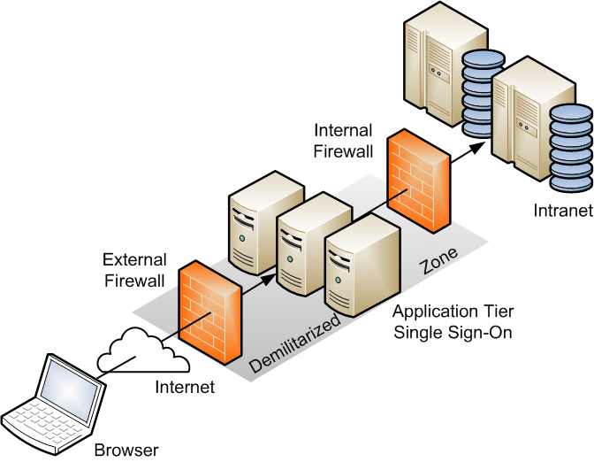

# Securing the Network

- [Securing the Infrastructure](#securing-the-infrastructure)
    - [Infrastructure Considerations](#infrastructure-considerations)
    - [Physical vs Logical Separation](#physical-vs-logical-separation)
    - [Network Segmentation](#network-segmentation)
    - [Demilitarized Zone](#demilitarized-zone)
    - [Virtual Local Network](#virtual-local-network)
    - [Microsegmentation](#microsegmentation)
    - [Network Access Control](#network-access-control)
- [Selecting Infrastructure Controls](#selecting-infrastructure-controls)
    - [Defense in Depth](#defense-in-depth)
    - [Zero Trust Model](#zero-trust-model)
    - [Risk-Based Approach](#risk-based-approach)
    - [Lifecycle Management](#lifecycle-management)
    - [Open Design Principle](#open-design-principle)
- [Methods and Practices for Effective Controls](#methods-and-practices-for-effective-controls)
    - [Selection Process](#selection-process)
    - [Best Practices](#best-practices)
- [Virtual Private Network](#virtual-private-network)
    - [VPN Configurations](#vpn-configurations)
    - [Tunnel Configurations](#tunnel-configurations)
- [TLS](#tls)
    - [TCP](#tcp)
    - [DTLS](#dtls)
- [IPSec](#ipsec)
    - [Steps in Establishing IPSec Tunnel](#steps-in-establishing-ipsec-tunnel)
    - [Data Transfer Modes](#data-transfer-modes)
    - [Authentication Header](#authentication-header)
    - [Encapsulating Security Payload](#encapsulating-security-payload)
- [Firewall](#firewall)
    - [Types of Firewall](#types-of-firewall)
    - [Evolution of Firewalls](#evolution-of-firewalls)
    - [Access Control Lists](#access-control-lists)
- [IDS and IPS](#ids-and-ips)
    - [Intrusion](#intrusion)
    - [Difference between IDS and IPS](#difference-between-ids-and-ips)
    - [Types of IDS/IPS](#types-of-idsips)
    - [IDS Detection Methods](#ids-detection-methods)
- [Evolution of Network Security](#evolution-of-network-security)
    - [SIEM](#siem)
    - [Mobile Device Management](#mobile-device-management)
    - [Software Defined Networking](#software-defined-networking)

## Securing the Infrastructure 

TCP/IP’s vulnerabilities are numerous. Improperly implemented TCP/IP stacks in various operating systems are vulnerable to various attacks:

- DoS/DDoS attacks
- fragment attacks
- oversized packet attacks
- spoofing attacks
- man-in-the-middle attacks

TCP/IP (as well as most protocols) is also subject to passive attacks via monitoring or sniffing. Network monitoring, or sniffing, is the act of monitoring traffic patterns to obtain information about a network. 

### Infrastructure Considerations

Infrastructure considerations play a pivotal role in the efficiency and security of a network environment.

- **Correct placement of devices**
  - Location influences security and performance.
  - Proper placement ensure optimal data flow and minimized latency
  - If placed in the wrong places, it can lead to:
    - Network bottlenecks 
    - Vulnerability points 
    - Areas without connectivity
- **Security Zones and Screened subnets** 
  - **Security zones** - Isolating or segmenting networks 
  - **Screened subnet** - previously referred to as **Demilitarized Zone (DMS)**
- **Understanding attack surface**
  - **Attack Surface** - all points that an unauthorized user can try to enter.
  - The more complex a network becomes, the wider the attack surface becomes.
  - Implement proper controls to mitigate the risk.
- **Determine connectivity methods**
  - Wired networks provide stabiilty and speed, but restrictive in terms of mobility.
  - Wirelss connections offer greater levels of flexibility and scalability.
  - Hybrid methods can be used to combine both.
  - When deciding for connectivity methods to user, consider:
    - scalability
    - Speed requirements
    - Security considerations 
    - Budgetary constraints
- **Understand device attributes**
  - Whether a device is active or passive, and it it'll be inline or tap-based.
  - **Active**
    - Monitor and act on suspicious network traffic by influencing data flows
    - Makes real-time decisions based on the network's current state
    - Example: IPS 
  - **Passive**
    - Simply observe and report on network traffic without actively intervening
    - Example: IDS 
  - **Inline** 
    - Positioned directly in the path of the network traffic
    - Can influence or block traffic as it passes through the device
    - Filters malicious traffic and optimize data flow
    - Example: Firewall, routers, IPS
  - **Tap-based**  
    - Discreet; placed outside of the direct network path
    - Configured to only listen to network activity
    - Captures data for analysis without impacting the actual traffic
- **Configure the failure mode**
  - Failover mode determines how devices will act in case something goes wrong.
  - **Fail-open**
    - Allows all traffic to pass through in the event of failure
    - Will not inspect or filter, ensuring no disruption to the network service
  - **Fail-closed**
    - Blocks all traffic in the event of failure.
    - Ensure security of the network is intact, but will impact network connectivity.

### Physical vs Logical Separation

- **Physical Separation (Air-gapping)**

  - Usually called "air-gapping"
  - Physically isolates critical components.
  - Prevents unauthorized access.
  - Common in high-security environments.

- **Logical Separation**
  - Uses virtualization or segmentation techniques.
  - Separates network traffic or user groups.
  - Implemented with VLANs, VPNs, or SDN.

### Network Segmentation

Involves isolating a network from outside communications.

- Controls traffic among networked devices.

### Demilitarized Zone

Demilitarized Zone (DMZ) is an isolated network area for outside visitors.

- Also called as **"screened subnets"**
- Hosts public servers like web, email, and files.

### Virtual Local Network

VLANs are created by switches to logically segments a network without altering physical topology. 

- **Corporate Network:**
    - Departments like HR, Finance, and IT each on separate VLANs.
- **Guest Wi-Fi:**
    - Isolate guest devices from internal network using a dedicated VLAN.
- **Voice over IP (VoIP):**
    - Separate VLAN for VoIP traffic to prioritize voice communication.
- **Server Farm:**
    - Different VLANs for web servers, database servers, ensuring segmentation.

  

  
  

### Microsegmentation 

Microsegmentation addresses modern cyber threats exploiting traditional security models by focusing on protection requirements for traffic within a data center and to/from the internet.

  - Adversaries use polymorphic tools to bypass static controls.
  - Shifts away from infrastructure-centric design paradigms.
  - Aims for increased efficiency in service delivery within the data center.
  - Enhances detection and prevention of advanced persistent threats.

### Network Access Control 

- **Role of NAC Device**
  - Enforces organization's access control and security policies.
  - Provides network visibility for access security and potential incident response.

- **Key Capabilities of NAC Device**
  - Initiates with policy enforcement based on organization policies.
  - Identifies connections, isolates noncompliant devices, and supports incident response.
  - Ensures compliance with organization policies before allowing devices to join the network.

- **Use Cases for NAC Deployment**
  - Medical devices
  - IoT devices
  - BYOD/mobile devices (laptops, tablets, smartphones)
  - Guest users and contractors

- **Onboarding Process Importance**
  - Emphasizes the importance of an onboarding process for all mobile devices.
  - Device identification and interrogation to ensure compliance with organization policies during network connection.

## Selecting Infrastructure Controls

### Defense in Depth

Defense in Depth is an approach in cybersecurity in which a series of defensive mechanisms are layered in order to protect valuable data and information. 

- Utilizes multiple access controls in layers.
- Avoids a monolithic security stance.
- If one mechanism fails, the next layer steps up and stops attack

### Zero Trust Model 

The Zero Trust Model, also known as **Perimeterless security**, focuses on "**Never trust, always verify** concept whereby users and devices should not be trusted by default.

  - Adds defenses at the user, asset, and data levels.
  - Recognizes vulnerabilities even in robust access control systems.
  - Shifts from reliance on perimeter defense to asset and data protection.
  - Emphasizes authentication and authorization for every user action.

**Microsegmentation in Zero Trust Networks**

  - Networks are microsegmented with firewalls at each connection point.
  - Focuses on encapsulating information assets and their security properties.
  - Microsegmented networks enforce frequent user re-authentication.
  - Validates user identity at various checkpoints within the network.

**Analogy: Concert Access**
  - Traditional controls: showing a ticket at the gate for free venue access.
  - Zero trust: Multiple checkpoints at different levels, e.g. accessing backstage areas

### Risk-Based Approach 

Prioritizes controls based on potential risks and vulnerabilities specific to the infrastructure to make efficient use of resources.

### Lifecycle Management

Involves regular reviewing, updating, and retiring controls to adapt to evolving threat landscapes.

### Open Design Principle 

Ensures transparency and accountability through rigorous testing and scrutiny of infrastructure and controls.

## Methods and Practices for Effective Controls

### Selection Process

1. Assess the current state.
2. Conduct gap analysis.
3. Setting clear objective.
4. Benchmarking against industry best practices.
5. Conduct cost-benefit analysis.
6. Ensure stakeholder involvement.
7. Implement monitoring and feedback loops.

### Best Practices 

- Conduct a recurring comprehensive risk assessment.
- Align control selection with established frameworks.
- Customize framework controls for your own usage.
- Emphasize stakeholder engagement and training.

## Virtual Private Network

A Virtual Private Network or VPN extends a private network over a public one, enabling users to securely send and receive data.

- Communication tunnel for point-to-point transmission.
- With VPN, users can work from remote or different locaions.
- Secures authentication and data traffic over untrusted networks.

### VPN Configurations

- **Site-to-site**
  - Connects multiple networks over the internet.
  - Commonly used for linking branch offices to headquarters.
  - Secures traffic, but can slow down users due to extra hops
  - Requires compatible hardware at each site.

- **Client-to-site**
  - Connects individual devices to a remote network.
  - Ideal for remote or mobile workers.
  - Requires VPN client software on the user's device.
  - Uses strong authentication and encryption methods.

- **Clientless**
  - Provides secure access via a web browser.
  - No need for VPN software installation on client devices.
  - Ideal for temporary or unmanaged devices.
  - Access is typically limited to specific web applications.

### Tunnel Configurations

Both tunnel configurations can be used for site-to-site or client-to-site VPNs.

- **Full Tunnel**
  - All network traffic is routed through the VPN.
  - Ensures all internet activity is monitored and controlled.
  - Maximum security, but slower internet speeds due to traffic routing.
  - Ideal for environments requiring strict security.
  - Most organizations used this by default.

- **Split Tunnel**
  - Only specific traffic is routed through the VPN.
  - Non-critical traffic uses the local internet connection.
  - Improves internet speed by reducing VPN load.
  - Useful for accessing local resources and internet simultaneously.
  - Requires careful configuration to avoid security risks.

## TLS 

TLS or Transport Layer Security is a protocol that provides cryptography security for secure data transmission between clients and servers.

- Verifies the identities of communicating parties.
- Ensures data has not been tampered with during transit.
- Commonly used for securing web traffic (HTTPS).
- Works with multiple protocols like HTTP, SMTP, and IMAP.

### TCP 

TLS uses the Transmission Control Protocol (TCP) to establish secure communications between a client and a server.

- TCP has a lot of overhead than UDP connections.
- This can slow down connection.

### DTLS 

Datagram TLS is a UDP-version of TLS protocol that offers that same security level as TLS while maintaining faster operations.

- Less overhead in the UDP protocol.
- Ideal for video streaming over a secure and encrypted tunnel.

## IPSec 

IPSec (Internet Protocol Security) is the most famous protocol used today for establishing VPNs because of its confidentiality, integrity, authentication, and anti-replay operations.

- Encrypts IP packets to secure data transmission.
- Confirms the identity of communicating devices.
- Protects against data modification during transit.
- an be used for site-to-site and client-to-site VPNs.
- Supports secure communication between hosts (transport) and networks (tunnel).

### Steps in Establishing IPSec Tunnel

1. Request to start Internet Key Exchange (IKE).
    - PC1 Initiates trafffic to PC2.
    - This triggers IPSec tunnel creation by router 1

2. IKE Phase 1 
    - Router 1 and router 2 negotiates security associations for IKE Phase 1.
    - Also known as **ISAKMP Tunnel**

3. IKE Phase 2 
    - Establishes a tunnel within the tunnel.

4. Data Transfer
    - Data can now be securely transferred between PC1 and PC2.

5. Tunnel Termination
    - Tunnel is torn down, deleting IPSec security associations

### Data Transfer Modes 

- **Transport Mode**
  - Employs the original IP header, keeping it intact.
  - Encrypts only the payload of the IP packet.
  - Works well when you want to increase packet size, exceeding the MTU size
  - **Max Transmission Size (MTU)** - set at only 1500 bytes
  - Anything beyond MTU, packet gets fragmented and causes VPN problems.
  - Used for end-to-end communication between hosts, e.g. client-to-site VPNs
  
- **Tunneling Mode**
  - Commonly used for site-to-site VPNs
  - Packets are encapsulated within new ones, increasing the actual packet size.
  - **Workaround for the packetsize:**
    - Drop Max MTU size to 1400 bytes on inner router, then connect to VPN
    - Allow jumbo frames, bigger thatn 1500 bytes
    - Adjust MTU size to 9000 bytes, not recommended for internet use due to latency issues
  - **At source and destination:**
    - **Source side:** Encapsulates the encrypted packet within a new IP packet.
    - **Destination side:** VPN concentrator removes outer header, decrypts content, and routes internally.

### Authentication Header 

Authentication Header (AH) offers connectionless data integrity and data origin authentication for IP datagrams using cryptographic hash as identification information.

- Provides protection against replay attacks
- Does not provide confidentiality of the data itself 

### Encapsulating Security Payload 

ESP provides authentication, integrity, replay protection, and data confidentiality by encrypting the packet's payload.

- Payload can be rewritten inside of an encrypted format.
- Only protect confidentiality of the payload contained within the packet, not the headers.

In tunneling mode, ESP can be used along with authentication headers.

- New IP header is added in front of the packet to cover the hops.
- AH provides integrity for TCP header, ESP encrypts TCP header and payload.

## Firewall 

Safeguards networks by monitoring and controlling traffic based on predefined security rules.

- Can be hardware-based or specialized software installed on the client or server
- By placing in front of the network segment, it creates a **screened subnet.**

**Screened Subnet** 

- Also known as a **Dual-homed Host Configuration**.
- Acts a protective barrier between external untrusted networks and internal trusted networks.
- Often equipped with a packet-filtering firewall or other security mechanisms.

**In-depth Inspection**

- A firewall with in-depth inspection may slow down due to time taken.
- Each packet goes through all the rules, increasing the network latency.
- On the other hand, less depth inspection can mean less security.

### Types of Firewall 

- **Packet Filtering**

  - Most efficient in terms of maximizing throughput.
  - Minimum level of inspection, only inspects the header of the packet.
  - Filters based on source and destination IP addresses, ports, and protocols.
  - Operates at the network layer (Layer 4) of the OSI model.
  - Simple and fast but lacks deep inspection capabilities.
  - Cannot prevent IP spoofing, packet fragementation attacks, or TCP handshake attacks.

- **Dynamic Packet Filtering**

  - Adapts filtering rules dynamically based on traffic patterns.
  - Monitors ongoing connections and updates rules in real-time.
  - Offers higher security by adjusting to current network conditions.
  - More complex and resource-intensive than static packet filtering.

- **Stateful**

  - Tracks the state of active connections and requests.
  - Inspects packets within the context of the traffic flow.
  - Operates at the transport layer (Layer 4) of the OSI model.
  - Provides more security than packet filtering by ensuring packets are part of a valid session.

- **Proxy**

  - Acts as an intermediary between users and the internet.
  - Filters requests and responses based on content and protocol.
  - Operates at the application layer (Layer 7) of the OSI model.
  - Can provide caching, content filtering, and access control.
  - Types:
    - **Circuit Level Proxy**
      - Like a SOCKS firewall
      - Operate at Layer 5 (Session layer)

    - **Application Level Proxy**
      - Deeper packet inspection
      - Conducts various proxy function for each type of application
      - Best positioned inside of the network, as closely as possible to the application server

- **Kernel Proxy**

  - Known as a "5th Generation Firewall".
  - Minimal impact on network performance but thorough inspects packets across all layers.
  - Uses the operating system's kernel to process and filter packets.
  - Often used in high-throughput environments requiring granular control and speed.
  - Best positioned as close as possible to the application server.

### Evolution of Firewalls 

- **Layer 4 Firewall**

  - Operates at the transport layer of the OSI model.
  - Filters traffic based on TCP/UDP ports and IP addresses.
  - Monitors traffic without inspecting the content of packets.
  - Simple and efficient for basic traffic control.
  - Limited in detecting application-specific attacks.

- **Layer 7 Firewall**

  - Operates at the application layer of the OSI model; application proxy.
  - Inspects, filters, and controls traffic based on the content and context of the application.
  - Detailed control over web and application trafficl.
  - Detect and block application-specific threats.
  - Resource-intensive but offers higher security and functionality compared to lower-layer firewalls.

- **Next Generation Firewall (NGFW)**

  - Combines traditional firewall capabilities with advanced features.
  - Includes deep packet inspection (DPI), also integrates intrusion prevention systems (IPS).
  - Provides application awareness and control; can distinguish types of traffic.
  - Operates fast with minimal network performance impact.
  - Full-stack visibility and granular control over traffic through custom signatures.
  - **Single engine**

- **Unified Threat Management Firewall (UTM)**

  - Consolidates multiple security functions into a single device.
  - Firewall, antivirus, anti-spam, content filtering, and intrusion detection/prevention.
  - Simplifies network security management, ideal for small to medium-sized businesses.
  - Lower upfront costs, maintenance, and power consumption.
  - Becomes single point of failure; if it fails, multiple functions are also lost.
  - **Separate individual engines**

- **Web Application Firewall (WAF)**

  - Specifically designed to protect web applications, focused on HTTP/HTTPS inspection.
  - Defends against common web threats like SQL injection, XSS, and CSRF.
  - Operates at the application layer (Layer 7) of the OSI model.
  - Types of configuration:
   
    - **Inline Configuration**
      - Device will between the network firewall and the web servers.
      - Prevent live attacks, but slow down web traffic.
      - Can block legitimate traffic by mistake.

    - **Out-of-band Configuration**
      - Device receives a mirrored copy of the web server traffic.
      - Non-intrusive way of conducting web application filtering.
      - Cannot block live web traffic, works more of an IDS and then alert on it.

### Access Control Lists 

Access Control Lists (ACLs) is a rule set that is placed on firewalls, routers, and other network infrastructure devices that permit or allow traffice through a particular interface.

- Can also be used to define proper quality of service levels.
- The order in which rules are defined is followed; performed in a top-down manner.
- Specific rules normally at top of the list, more generic rules at the bottom.
- Any action taken should be logged, including all ALLOW and DENY.
- Some ACL includes a DENY ALL rule at the end of the ACL.

Information contained in ACLs:
  - Type 
  - Source 
  - Destination 
  - Action

ACLs can be configured through:
  - Web-based interface 
  - Text-based command line interface

## IDS and IPS 

### Intrusion 

An **intrusion** occurs when security mechanisms are bypassed, enabling unauthorized access to an organization’s resources. 

**Intrusion detection** is a monitoring method that examines recorded information and real-time events to identify abnormal activities indicative of potential incidents or intrusions. 

### Difference between IDS and IPS 

- **Intrusion Detection Systems (IDS)**
  - Logs and alerts when it finds something suspicious or malicious.
  - Automates log inspection and real-time event analysis to detect intrusion attempts.
  - Recognizes anomalies and responds with alerts or alarms.
  - Do not stop an attack, but are programmed to alert based on a criteria.

- **Intrusion Protection Systems (IPS)**
  - Logs, alert on it, and take an action when it finds something suspicious or malicious.
  - Can block the traffic or prevent the application from running.
  - Should be placed at the border of the network, behind the firewall.

### Types of IDS/IPS

Both IDS and IPS have similar types based on how they are deployed.

- **Network-based (NIDS/NIPS)**

  - Usually standalone devices installed on spam port or mirrored port from backbone switch.
  - Monitors network traffic patterns and supports centralized administration.
  - Detects network attacks on other systems, based on the placement of NIDS Sensor.
  - Generally more cost-effective to manage compared to HIDS.

- **Host-based (HIDS/HIPS)**

  - Usually installed on a server, configured to look for traffic to that endpoint.
  - Examines detailed events, including process calls and logs.
  - Detects specific file compromises and tracks attacker processes.
  - Can identify anomalies on the host system that network-based IDSs cannot.
  - More management-intensive, requiring attention on each system.

- **Wireless (WIDS/WIPS)**

  - Focused on wireless network, WIDS detect Denial of Service (DoS) attempts
  - Detects flooding authentication requests, de-authentication attacks, etc.

### IDS Detection Methods 

- **Signature-based IDS**

  - Detects intrusions by comparing traffic to a database of known attack patterns or signatures.
  - Can only detect attacks based on previously identified attacks in the database.
  - Highly effective at identifying known threats.
  - Low false-positive rate for known attacks.
  - Requires regular updates to maintain a current database of signatures.
  - Limited in detecting new, unknown threats or variations of known attacks.
  - Types:

    - **Pattern-matching**
      - Specific patterns of steps recognized during an attack.
      - More common in NIDS and WIDS.

    - **Stateful-matching**
      - Focus on known system baseline, reporting any changes to that state.
      - More common in HIDS.

- **Anomaly-based IDS**
  - Also known as "Behavioral-based IDS".
  - Identifies intrusions by detecting deviations from normal network behavior or baseline.
  - Higher false-positive rate due to variations in activities that deviate from the established norm.
  - Effective at discovering new and unknown threats.
  - Can adapt to changing network conditions and behaviors.
  - Types

    - **Statistical**
      - Uses statistical models to define normal behavior.
      - Detects unusual patterns; useful for known and unknown threats.
      - False positives if activity is variable; requires model updates.

    - **Protocol**
      - Monitors adherence to protocol standards.
      - Detects protocol-specific attacks; ensures protocol compliance.
      - Limited to protocol violations; may miss sophisticated attacks.

    - **Traffic**
      - Analyzes network traffic patterns and volumes.
      - Detects large-scale attacks like DDoS; monitors network health.
      - False positives in high-traffic environments; requires traffic analysis.

    - **Rule/Heuristic**
      - Uses predefined rules and heuristics.
      - Tailored detection; effective for complex patterns.
      - Requires rule updates; may miss novel attacks.

    - **Application-based**
      - Monitors specific applications.
      - Detects application-specific threats; deep insight into behavior.
      - Limited to monitored applications; requires knowledge of normal behavior.

## Evolution of Network Security 

### SIEM 

A SIEM (Security Information and Event Management) is a comprehensive security solution that collects, correlates, and analyzes log data from various sources across an organization's IT infrastructure.

A SIEM typically provides the following features:

- **Log consolidation**, which consists in collecting logs from various sources (like servers, firewalls or IDS/IPS) and then storing them in one central location.

- **Log retention**, which consists in storing logs for a specific period (like 90 days), so as to allow security analysts to keep track of and investigate past events.

- **Log encryption**, which is an optional feature that safeguards the confidentiality of log data.

- **Log analysis**, which involves identifying patterns, trends and anomalies related to security events, in or close to real time.

### Mobile Device Management 

Mobile Device Management (MDM) enables organizations to manage and secure mobile devices across various platforms (smartphones, tablets).

- Allows remote management and wiping of devices for data protection.
- Tracks device usage and location for monitoring and control.
- Enforce configuration to ensure devices are meeting the security benchmarks.
- Enforces security policies to enhance device security.
- Lowers risks tied to unsecured or outdated devices.

Example features:

- Disable a device's ability to sideload programs.
- Detect if a device has been jailbroken or rooted.
- Force each device to use a VPN connection.

### Software Defined Networking

Software Defined Networking (SDN) is a networking approach that centralizes network control, enabling programmability and automation for improved network management and efficiency.

- **Data Plane**
  - Handles the **actual forwarding of data** packets within the network.
  - Performs packet switching or routing based on instructions received from the control plane.
  - Consists of switches, routers, and other network devices.

- **Control Plane**
  - Centralized controller that manages the behavior of the data plane.
  - Responsible for **making forwarding decisions** and configuring network devices.
  - Uses software-based algorithms and protocols to communicate with network devices.

- **Application Plane**
  - Interfaces with the control plane to define network policies and configurations.
  - Enables network administrators to deploy applications for specific network functions.
  - Examples include network monitoring, security, and traffic optimization applications.

----------------------------------------------

[Back to main page](../../README.md#security)    

