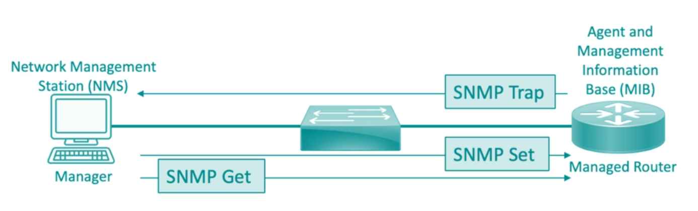
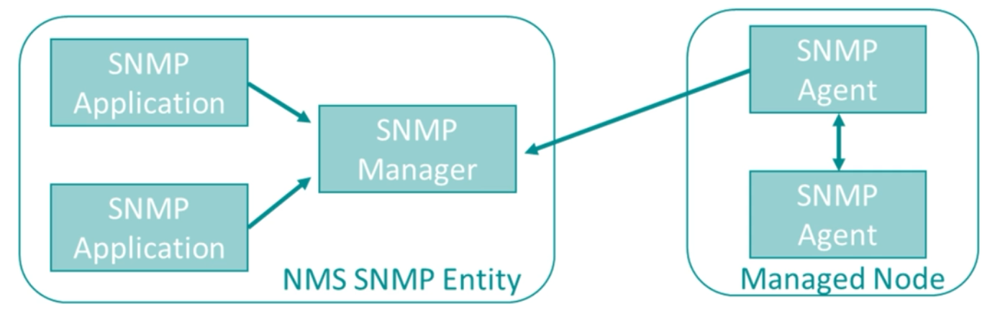

# Alerting and Monitoring


- [Alerting and Monitoring](#alerting-and-monitoring)
    - [Alerting](#alerting)
    - [Monitoring](#monitoring)
- [Monitoring Resources](#monitoring-resources)
    - [System Monitoring](#system-monitoring)
    - [Application Monitoring](#application-monitoring)
    - [Infrastructure Monitoring](#infrastructure-monitoring)
- [Alerting and Monitoring Activities](#alerting-and-monitoring-activities)
    - [Log Aggregation](#log-aggregation)
    - [Alerting](#alerting)
    - [Scanning](#scanning)
    - [Reporting](#reporting)
    - [Archiving](#archiving)
    - [Alert Response and Remediation](#alert-response-and-remediation)
- [SNMP](#snmp)
    - [Components](#components)
    - [Operations](#operations)
    - [Types of Trap Messages](#types-of-trap-messages)
    - [Management Information Base](#management-information-base)
    - [Variable-binding](#variable-binding)
    - [Versions](#versions)
- [SIEM](#siem)
    - [Key Features](#key-features)
    - [Deployment](#deployment)
    - [Considerations](#considerations)
    - [Recommendations](#recommendations)
- [SCAP](#scap)
    - [Supported Languages](#supported-languages)
    - [Enumeration Methods](#enumeration-methods)
    - [CVSS](#cvss)
    - [Benchmarks](#benchmarks)
- [Network Traffic Flow](#network-traffic-flow)
    - [Packet Captures](#packet-captures)
    - [Flow Analysis](#flow-analysis)
    - [NetFlow, Zeek, and MRTG](#netflow-zeek-and-mrtg)
- [Single Pane of Glass](#single-pane-of-glass)
    - [Defining the requirements](#defining-the-requirements)
    - [Identifying and integrating data sources](#identifying-and-integrating-data-sources)
    - [Customizing the interface](#customizing-the-interface)
    - [Developing SOPs and documentations](#developing-sops-and-documentations)
    - [Continuously monitoring and maintaining the solution](#continuously-monitoring-and-maintaining-the-solution)


## Alerting and Monitoring 

Alerting and monitoring are critical components of cybersecurity, focusing on the continuous observation of systems to detect and respond to security incidents promptly.

### Alerting

The process of generating notifications or alarms when specific conditions or thresholds indicative of security issues are met. Its purpose is to provide timely warnings about potential security threats or anomalies.

Components:

  - Automated Alerts
  - Custom Alerts
  - Real-Time Notifications

### Monitoring

The continuous observation and analysis of system activities, network traffic, and security events. Its purpose is to detect, analyze, and respond to security incidents and ensure ongoing system health.

Components:
  - Log Monitoring
  - Network Monitoring
  - Behavioral Monitoring
  - Endpoint Monitoring


## Monitoring Resources

Monitoring resources involves continuously tracking and analyzing various system and network components to ensure optimal performance and security.

### System Monitoring

Observing server and application performance metrics such as utlization and consumption of its resources in order for us to identify any potential issues that could affect the system's stability.

**Baseline**

- Established performance metrics for standard behavior of a system or application.
- Can include CPU Usage, memory utilization, disk activity, network traffic, etc.
- Reference point to compare against when monitoring systems over time.
- Deviations can mitigate potential issues and performance problems.

### Application Monitoring

Keeping an eye on the health and performance of software applications to ensure they are running smoothly.

- Also known as **Application Performance Monitoring**.
- Tracking errors, bottlenecks, and other potential issues that can affect performance. 
- If response time is slow, this could indicate a need for additional resources.

### Infrastructure Monitoring

Infrastructure monitoring involves the continuous observation and analysis of an organization's physical and virtual IT infrastructure to ensure optimal performance, availability, and security

- Using Solarwinds or PRTG to monitor network infrastructure.
- Determine bandwodth utilization, network traffic, status of devices, etc. 
- Overloaded device could mean a need for additional capacity.


## Alerting and Monitoring Activities 

Alerting and monitoring activities are crucial for maintaining the integrity, availability, and performance of an organization's infrastructure.

- Log Aggregation 
- Alerting
- Scanning
- Reporting 
- Archiving 
- Alert Response and Remediation


### Log Aggregation

The process of collecting and consolidating log data from various sources into a central repository. It facilitate comprehensive analysis and correlation of events.

- Helps in troubleshooting system issues, security incidents, and performance problems.
- Gather logs from servers, applications, and network devices.
- Centralized log management helps us correlate events across different systems.
- Ensure logs are structured and formatted consistently.

**GDPR Compliance**

- Requires the business to maintain a comprehensive set of logs.
- Log aggregation helps in complying with GDPR and HIPAA requirements.
- Logs can easily be reviewed by auditors since they are all in one place.


### Alerting

The mechanism for generating notifications when specific events or thresholds are met.

- Provide timely warnings about potential security incidents or performance issues.
- Send alerts via email, SMS, or monitoring dashboards.
- Ensures issue resolution, incident detection, and compliance is practiced.
- Configure alert rules based on predefined conditions.
- Prioritize alerts based on severity and impact.

### Scanning

Systematically checking systems, networks, and applications for vulnerabilities, configuration issues, or policy violations.

- Identify security weaknesses and ensure compliance with standards.
- Perform regular vulnerability scans using automated tools.
- Conduct compliance scans to ensure adherence to policies.
- Analyze scan results and prioritize remediation efforts.

Tools:

- Nessus 
- OpenVAS 
- Qualys

Types of scans:

- **Vulnerability Scan**

    - Identifies security weaknesses in systems and networks.   
    - Detect and prioritize vulnerabilities that could be exploited by attackers.
    - Comparing the system's current state against a database of known vulnerabilities.


- **Configuration Scan**
    
    - Checks the settings and configurations of systems and applications.
    - Identify misconfigurations that could lead to security issues.
    - Ensure compliance with security policies and best practices.

- **Code Scan**

    - Analyzes source code for security flaws and vulnerabilities.
    - Detect coding errors and potential security weaknesses before deployment.
    - Use SAST tools such as Fortify or Sonarqube to examine the source code.
    - Integrated into the SDLC to ensure secure coding practices.

### Reporting

The creation and distribution of reports based on monitored data and alerts. These reports can provide insights into system performance, security incidents, compliance status, and other aspects.

- Inform stakeholders about the security posture and performance of systems.
- Generate regular and ad-hoc reports on security incidents, performance metrics, etc.
- Customize reports for different audiences (e.g., technical teams, management).
- Use visualization tools to present data clearly and effectively.
- Tools like Splunk or SumoLogic can be used to generate reports.

### Archiving

The process of securely storing log data and reports for long retention periods of future reference and compliance.

- Maintain a historical record for analysis, auditing, and regulatory requirements.
- Implement data retention policies to determine the duration of storage.
- Use secure storage solutions to protect archived data.
- Ensure archived data is easily retrievable for investigations and audits.

### Alert Response and Remediation

The actions taken in response to alerts to address and mitigate identified issues.

- Investigate alerts to determine the root cause of issues.
- Implement remediation steps to resolve vulnerabilities or performance bottlenecks.
- Document response actions and lessons learned for continuous improvement.

**Remediation** refers to steps used to resolve identified issues or vulnerabilities which could include:

- Patching outdated software 
- Reconfiguring services 
- Modifying an application's source code.

**Validation** involves verifying that the remediation implemented was actually successful and has effectively addressed the given vulnerability.

- **Quarantining** 
    - Isolating a system to prevent the spread of threat.
    - Limits the threat's potential impact while security team is working to remove it.

- **Alert Tuning**
    - Adjust the alert parameters to reduce the errors and false positives.
    - Improves the overall relevance of the alerts being generated by the given system.

## SNMP

Simple Network Management Protocol (SNMP) is a widely used protocol for network management and monitoring. It allows network administrators to remotely monitor and manage network devices, such as routers, switches, servers, and printers, from a central management station.

- Collects and reports information about device performance.
- Enables remote configuration of network devices.
- Generates alerts and notifications based on predefined conditions or thresholds.
- Provide real-time data and historical logs for analysis.
- Authentication and access control mechanisms.

Sample diagram:


### Components

- **SNMP Manager**

    - Also known as the Management Information Base (MIB)
    - Responsible for monitoring and managing network devices. 
    - It runs SNMP management software.
    - Management station, a master node that can send and receive.

- **Agent**

    - Software embedded in network devices.
    - Collects and reports information to the management station.

- **Managed Device**

    - Network devices, such as routers, switches, and servers.
    - Devices monitored and managed using SNMP.

### Operations

The SNMP Manager can send and receive messages to the agents using three message types;

- **Set**

    - Modifies configuration settings on a managed device.
    - Updating parameters or enabling/disabling features.
    - Agents receive this and changes the variable.
    - After changing, agents responds to manager with the new values.

- **Get**

    - Retrieves information from a managed device.
    - Details such as system configuration or performance data.

- **Trap**

    - Sent asynchronously, unsolicited notifications from agents to the server.
    - Agent send them without being requested by the manager.
    - Allows agents to notify the manager in near real time.
    - Used to provide events or alarm notifications to the manager.
    - Can include:
        - Uptime 
        - Configuration changes
        - Unexpected downtime
        - Other essential information

### Types of Trap Messages 

- **Granular**
    - Sent trap messages get a unique objective identifier (OID).
    - Distinguishes each message as a unique message received.
    - OIDs are consolidated and stored inside a translation file called MIB.

- **Verbose**
    - May be configured to contain all information about an alert or event.
    - More data is sent, taking up more resources and bandwidth.

### Management Information Base 

Used to describe the structure of the management data of a device subsystem using a hierarchical namespace containing object identifiers.

- Allows the trap messages to send just the changes for the specific OID.
- Saves bandwidth because SNMP traps don't send redundant information.

### Variable-binding 

Data in SNMP traps are stored in a simple key-value pair configuration known as **variable-binding.** Sample:

```YAML
Site: Main-HQ 
Criticality: High 
Severity: Low 
Alarm Description: High Temperature  
```

### Versions

There are three SNMP versions with varying security:

- **SNMPv1** 

    - The original version of SNMP
    - Basic functionality and limited security features.

- **SNMPv2** 

    - Introduced improvements in performance.
    - Added new features, such as bulk retrieval operations.
    
- **SNMPv3** 

    - The most recent version, offering enhanced security features.
    - Encryption and authentication mechanisms.

Both SNMPv1 and SNMPv2 uses a community strings to access the managed devices.

- Strings are stored as insecure plain text.
- Default community string are either public (read-only) or private (read-write).

In SNMPv3, three enhancements are added to ensure integrity and confidetiality.

- Messages are hashed before being sent.
- Source of the messages is validated.
- Uses DES with a 56-bit encryption key
- DES is being replaced by 3DES and AES in newer devices

Another benefit of SNMPv3 is it groups the SNMP components into different entities with different authorization and access privileges.




## SIEM

SIEM, or Security Information and Event Management, is a comprehensive approach to security management that combines SIM (Security Information Management) and SEM (Security Event Management) functions into a single, integrated solution.

SIEM can provide details such as:

- Source of the attack 
- System or data it's targeting 
- Method being used.

### Key Features

- **Log Management**

    - Collects, normalizes, and correlates log data from various sources.
    - Sources include network devices, servers, applications, and security tools.

- **Event Correlation**

    - Analyzes and correlates security events in real-time.
    - Identify patterns and detect potential security threats.

- **Incident Response**

    - Facilitates incident detection, investigation, and response.
    - Provide actionable insights and automated response capabilities.

- **Compliance Reporting**

    - Regulatory compliance through reporting and auditing capabilities.
    - Demonstrate adherence to security policies and standards.

- **Threat Intelligence Integration**

    - Incorporates threat intelligence feeds.
    - Enhance detection capabilities and prioritize security events.

- **User Activity Monitoring**

    - Monitors user activity and behavior.
    - Detects insider threats and unauthorized access attempts.

### Deployment 

A SIEM can be implemented in a couple of ways:

- Software 
- Hardware Appliances 
- Outsourced Managed Service

It can also be agent-based or agent-less.

- Agent - installed on each system, from which the SIEM needs to collect log data.
- Agentless - SIEM relies on standard protocols such as SNMP or WMI.

### Considerations  

- **Sensor**
    - Actual endpoint being monitored.
    - The sensors can feed the data up into the SIEM.

- **Sensitivity**
    - Focused on how much or how little you are logging.
    - Based on how you configure the sensor. 
    - Note that the SIIEM can also be overloaded with too much information. 

- **Trends**
    - By configuring the SIEM, we can see trends in the traffic.
    - Increasing number of failed authentication attempts can be a sign of attack.

- **Alerts**
    - We can set alerts based on certain parameters.
    - Example, alerts can be sent after five failed login attempts.

- **Correlations**
    - Information needs to be correlated to build a better picture.
    - Example, ensuring that all devices are using the same timezone.


### Recommendations

Recommendations: 

- Log all relevant events and filter irrelevant data.
- Establish and document scope of events.
- Develop use cases to define a threat. 
- Plan incident response for a threat or event.
- Establish a ticketing system to track events.
- Schedule regular threat hunting.
- Provide auditors and analysts an evidence trail. 

Available SIEM solutions:

- Splunk 
- ELK or Elastic Stack
- ArcSight
- QRadar


## SCAP

Security Content Automation Protocol (SCAP) is a collection of open standards developed by the National Institute of Standards and Technology (NIST) to automate vulnerability management, measurement, and policy compliance evaluation.

### Supported Languages

Three main languages used inside a SCAP: 

- **Open Vulnerability and Assessment Language (OVAL)**

    - Vulnerability Reporting Format
    - XML schema for reporting vulnerabilities and configuration issues.
    - Describe system information, machine state, and the reporting method.
    - Allows for consistent and interoperable way of collecting information.
     
- **Extensible Configuration Checklist Description Format (XCCDF)**

    - Security Automation Data 
    - XML schema for developing and auditing best practice configuration rules.
    - Describes security configuration guidelines and automated test procedures.
    - Before XCCDF, a long document containing step-by-step guide is used.
    - With XCCDF, we can use automated scanning tools to check the systems.
     
- **Asset Reporting Format (ARF)**

    - XML schema for expressing informattion about assets and relationships. 
    - Standardized format for reporting asset identification and metadata.
    - Vendor and technology neutral, suited for different reporting applications.

### Enumeration Methods

There are also different methods of enumerating assets.

- **Common Configuration Enumeration (CCE)**

    - Security Checklists.
    - Configuration guidelines and best practices for secure system configuration.
    - Provides unique identifiers for different configuration system issues.

- **Common Platform Enumeration (CPE)**

    - Structured naming scheme for hardware, software, and operating systems.
    - Written in machine-readable format, with prefix:

        ```bash
        cpe:/ 
        ```
    - Standard format:

        ```bash
        cpe:/<part>:<vendor>:<product>:<version>:<update>:<edition>:<language>
        ```

    - Example:

        ```bash
        cpe:/a:microsoft:internet_explorer:11.0
        ```
     

- **Common Vulnerabilities and Exposures (CVE)**

    - List of records of vulnerability definitions.
    - Provides a standardized identifier for vulnerabilities and exposures.
    - Each CVE has the following format:

        ```bash
        CVE-YYYY-NNNN         ## YYYY is year, NNNN is unique number.
        ```

### CVSS 

CVSS, or Common Vulnerability Scoring System, is a framework for assessing the severity and potential impact of security vulnerabilities. It provides a standardized method for rating vulnerabilities to help organizations prioritize their responses and allocate resources effectively.

- Scores are based on metrics evaluating exploitability and impact.
- Metrics include base, temporal, and environmental scores.
- Scores range from 0 to 10; higher scores indicating more severe vulnerabilities.
- Qualitative severity ratings such as Low, Medium, High, and Critical.

CVSS Ratings:

| CVSS Score Range | Severity Rating |
|------------------|-----------------|
| 0.0 - 3.9        | Low             |
| 4.0 - 6.9        | Medium          |
| 7.0 - 8.9        | High            |
| 9.0 - 10.0       | Critical        |

### Benchmarks 

A benchmark is a set of security configuration rules for some specific set or products to provide a detailed checklist that can be used to secure systems to a specific baseline.

- Usually expressed in the XCCDF.
- Examples are benchmark from Red Hat and CIS.

## Network Traffic Flow

### Packet Captures

**Full Packet Captures**, captures the entire packet, including the header and the payload for all traffic entering and leaving a network.

- Takes up too much storage space, wasting a lot of resources.
- Instead, we can use flow analysis to collect important details. 

In the example below, we can see the source and destination IP, as well as the sequence of packets targeting different ports over time which suggests a port scanning activity.

```bash
10:00:01.000000 IP 192.168.1.100 > 192.168.1.200: ICMP echo request, id 1234, seq 1, length 64
10:00:02.000000 IP 192.168.1.100 > 192.168.1.200: ICMP echo request, id 1234, seq 2, length 64
10:00:03.000000 IP 192.168.1.100 > 192.168.1.200: ICMP echo request, id 1234, seq 3, length 64
10:00:04.000000 IP 192.168.1.100 > 192.168.1.200: ICMP echo request, id 1234, seq 4, length 64
10:00:05.000000 IP 192.168.1.100 > 192.168.1.200: ICMP echo request, id 1234, seq 5, length 64
10:00:06.000000 IP 192.168.1.100 > 192.168.1.200: ICMP echo request, id 1234, seq 6, length 64
10:00:07.000000 IP 192.168.1.100 > 192.168.1.200: ICMP echo request, id 1234, seq 7, length 64
10:00:08.000000 IP 192.168.1.100 > 192.168.1.200: ICMP echo request, id 1234, seq 8, length 64
```

Note that the specific ports being targeted might not be visible in the packet data itself, as ICMP echo requests do not contain port information, unless the scanning technique involves sending packets directly to specific ports.

Below is another example which shows a possible DoS and DDoS attack. The packet captures show the same source IP sending packets but are not receiving any ACK from the client.

```bash
10:00:01.000000 IP 203.0.113.10 > 198.51.100.20: TCP [SYN] Seq=12345, Win=1024, Length=0
10:00:02.000000 IP 203.0.113.10 > 198.51.100.20: TCP [SYN] Seq=23456, Win=1024, Length=0
10:00:03.000000 IP 203.0.113.10 > 198.51.100.20: TCP [SYN] Seq=34567, Win=1024, Length=0
10:00:04.000000 IP 203.0.113.10 > 198.51.100.20: TCP [SYN] Seq=45678, Win=1024, Length=0
10:00:05.000000 IP 203.0.113.10 > 198.51.100.20: TCP [SYN] Seq=56789, Win=1024, Length=0
10:00:06.000000 IP 203.0.113.10 > 198.51.100.20: TCP [SYN] Seq=67890, Win=1024, Length=0
10:00:07.000000 IP 203.0.113.10 > 198.51.100.20: TCP [SYN] Seq=78901, Win=1024, Length=0
10:00:08.000000 IP 203.0.113.10 > 198.51.100.20: TCP [SYN] Seq=89012, Win=1024, Length=0
```

DDoS would look similar but the difference is that the attack will be coming from different source IPs.

```bash
10:00:01.000000 IP 192.0.2.10 > 198.51.100.20: TCP [SYN] Seq=12345, Win=1024, Length=0
10:00:02.000000 IP 192.0.2.11 > 198.51.100.20: TCP [SYN] Seq=23456, Win=1024, Length=0
10:00:03.000000 IP 192.0.2.12 > 198.51.100.20: TCP [SYN] Seq=34567, Win=1024, Length=0
10:00:04.000000 IP 192.0.2.13 > 198.51.100.20: TCP [SYN] Seq=45678, Win=1024, Length=0
10:00:05.000000 IP 192.0.2.14 > 198.51.100.20: TCP [SYN] Seq=56789, Win=1024, Length=0
10:00:06.000000 IP 192.0.2.15 > 198.51.100.20: TCP [SYN] Seq=67890, Win=1024, Length=0
10:00:07.000000 IP 192.0.2.16 > 198.51.100.20: TCP [SYN] Seq=78901, Win=1024, Length=0
10:00:08.000000 IP 192.0.2.17 > 198.51.100.20: TCP [SYN] Seq=89012, Win=1024, Length=0
```


### Flow Analysis

**Flow analysis** relies on a flow collector, which records metadata and statistics rather than recording each frame that passes through the network. 

- By collecting just the metadata, we can save a lot of storage space.
- Minimizes processing costs as well. 
- Generates visualizations to map network cconnections, traffic types, etc.
- Downside: it does not provide actual content.

### NetFlow, Zeek, and MRTG 

**NetFlow** is a Cisco-developed means of reporting network flow information to a structured database. 

- Became a standard under the name **IP Flow Information Export (IPFIX)**
- Define traffic flow based on different packets that share same characteristics.
- Example, traffic flow based on same source and destination IP.

Information that we can find in a NetFlow:

- Network Protocol 
- IP Version/Type 
- Source/Destination IP
- Source/Destination Port
- IP Service Type

**Zeek** is a hybrid tool that passively monitors a network like a sniffer, but only logs full packet capture data of potential interest. 

- Samples the data just like NetFlow and uses a flow collector. 
- Logs the full packet capture whenever it finds something interesting.
- Uses filters or signatures for collectin g full packet capture.
- Performs normalization of data and stores it as tab-delimited or JSON-formatted.
- Normalized files can be imported to other tools for visualization and analysis.

**Multi Router Traffic Grapher (MRTG)** creates graphs showing traffic flows through the network interfaces of routers and switches by polling the appliances using SNMP.

- We can see patterns emerging based on the traffic being sent or received.
- Spikes or drops in traffic can be seen in the graphs.

## Single Pane of Glass

A central point of access for all the informattion, tools, and systems that the security needs to effectively monitor, manage, and secure an organization's IT environment. 

- Unified view of security posture, which could have logs, alerts, and reports.
- Eliminates the need to log to multiple systems, reducing time and effort. 
- Track progress of incident response, ensuring all required steps are taken. 
- Improves efficiency by automating repetitive and time consuming tasks.
- Improves collaboration and communication between teams.

There are five main steps in implementing a single pane of glass (SPOG) 

- Defining the requirements 
- Identifying and integrating data sources 
- Customizing the interface 
- Developing SOPs and documentations
- Continuously monitoring and maintaining the solution
 
### Defining the requirements

- Understand organizational needs and objectives.
- Identify key data and metrics stakeholders require visibility into.
- Clarify user roles and access requirements for the SPOG solution.
- Identify data to be collected and tools to be integrated.

### Identifying and integrating data sources

- Identify relevant data sources across the organization.
- Also consider the data format and the location/storage.
- Integrate monitoring tools, databases, and third-party systems into the platform.
- Ensure data collection, aggregation, and normalization for comprehensive visibility.

### Customizing the interface

- Tailor dashboards, reports, and visualizations to user preferences.
- Make it intuitive, user-friendly, and capable of providing actionable insights.
- Provide customization options for different user roles and requirements.

### Developing SOPs and documentations

- Create Standard Operating Procedures (SOPs) for system usage and management.
- Document roles and responsibilities for data management and access control.
- Establish processes for troubleshooting, maintenance, and updates.
- Ensures consistency and repeatability in the management of security operations.

### Continuously monitoring and maintaining the solution

- Regularly monitor system performance, data quality, and user feedback.
- Implement updates, patches, and enhancements to address evolving requirements.
- Ensure ongoing optimization and reliability of the SPOG solution.


----------------------------------------------

[Back to main page](../../README.md#security)        