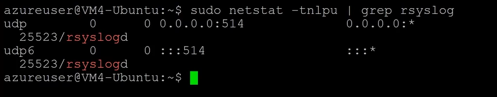

# Logging Data


- [Logs and Metadata](#logs-and-metadata)
- [Network Traffic Flow](#network-traffic-flow)
    - [NetFlow](#netflow)
    - [Sampled Flow](#sampled-flow)
    - [IPFix](#ipfix)
- [Centralized Logging](#centralized-logging)
    - [SNMP](#snmp)
    - [Windows Logs](#windows-logs)
    - [SIEM](#siem)
- [Logging Tools](#logging-tools)
    - [Journalctl](#journalctl)
    - [NXLog](#nxlog)
- [Syslog](#syslog)
    - [Syslog](#syslog)
    - [Rsyslog](#rsyslog)
    - [Syslog-ng](#syslog-ng)
    - [Configuring Linux Log Forwarding](#configuring-linux-log-forwarding)
- [Investigating Logs](#investigating-logs)
    - [Firewall Logs](#firewall-logs)
    - [Application Logs](#application-logs)
    - [Endpoint Logs](#endpoint-logs)
    - [OS Logs](#os-logs)
    - [Network Logs](#network-logs)


## Logs and Metadata

**Log files** record either events that occur in an operating system or other software that runs, or messages between different users of a communication software.  

Types of log files:

- Network log files
- System log files
- Application log files
- Security log files
- Web log files
- DNS logs 
- Authentication logs 
- Dump files 
- VoIP logs, as part of network logs files

**Metadata** describes other data by providing an underlying definition or description by summarizing basic information about data that makes finding and working with particular instances of data easier.

- Data about the data
- Example, phone bill shows the calls made, but not actual conversation in the calls.

## Network Traffic Flow 

### NetFlow 

NetFlow is a Cisco-developed means of reporting network flow information to a structured database. Note that this is not a packet capture, but it can capture:

- Source 
- Destination
- Volume
- Paths

To learn more, please see [NetFlow.](./047-Alerting-and-Monitoring.md#netflow-zeek-and-mrtg)

### Sampled Flow

Sampled Flow or SFlow provides a means for exporting truncated packets, together with interface counters for the purpose of network monitoring. Similar to NetFlow, SFlow doesn't provide a full packet capture, just some of the sampled flow. 

### IPFix 

IPFix (IP Flow Information Export) is a standard protocol for exporting flow information that is used for monitoring and analyzing network traffic flow data.

- Allows network devices to export flow records to a collector for analysis.
- Network traffic analysis, performance monitoring, and security threat detection.


## Centralized Logging 

### SNMP

Simple Network Management Protocol (SNMP) is a widely used protocol for monitoring and managing network devices.

- Operates on the Application Layer of the OSI model.
- Software agent or built into firmware; uses a manager/agent architecture.
- SNMP traps provide real-time alerts and notify management stations.
- More details can be fond here: [SNMP](./047-Alerting-and-Monitoring.md#snmp)

### Windows Logs

Windows Logs record system, security, and application events, essential for troubleshooting and security auditing.

- View and manage with Windows Event Viewer Subscriptions.
- Logs from Windows host can be pushed to a collector server over WinRM protocol.
- The collector server can also initiate and pull the logs from the hosts.
- Key categories: System, Application, Security.

### SIEM

Security Information and Event Management (SIEM) systems aggregate and analyze security events for real-time monitoring and incident response.

- Collects log and event data from multiple sources and uses correlation to detect threats.
- Provides dashboards, alerts, and reports for alerts, packet captures, malware alerts, etc.
- More details can be fond here: [SIEM](./047-Alerting-and-Monitoring.md#siem)

## Logging Tools 

### Journalctl

Linux command-line utility for querying and displaying logs from the systemd journal, which is responsible for managing and storing log data on a Linux machine. 

- Part of the systemd system and service manager used in many Linux distributions.
- Filtering options, including time range, unit, priority, and log level.
- Offers interactive and non-interactive modes for browsing log entries efficiently.

### NXLog

NXLog is an open-source, cross-platform log collection and management tool that facilitates the collection, processing, and forwarding of logs from various sources.

- Supports multiple log formats and protocols, including syslog, JSON, and XML.
- Offers filtering, parsing, and enrichment capabilities for log data.
- Integrates with SIEM solutions and log management platforms.
- Unix, Linux, and Windows.


## Syslog 

There are different variations of syslog which all permit the logging of data from different types of systems in a central repository.

### Syslog

- Standard logging protocol used for message logging on Unix-like systems.
- Sends log messages to a central server or repository for storage and analysis.
- Widely supported by various network devices, servers, and applications.

### Rsyslog

- Enhanced version of syslog, offering additional features and capabilities.
- Supports reliable transmission of log messages over TCP and TLS.
- Provides advanced filtering, message modification, and routing options.
- Linux and Unix.

### Syslog-ng

- Advanced features and customization options.
- High-performance log processing, including filtering, routing, and correlation.
- Offers support for log classification, encryption, and archival.
- Linux and Unix.

### Configuring Linux Log Forwarding

Configure first the centralized host that will receive the logs.
Modify the /etc/rsyslog.conf. Enable a listener on port 514 or you can also specify a different port.

```bash
# /etc/rsyslog.conf

#### MODULES ####
module(load="imuxsock")  # provides support for local system logging (e.g., via logger command)
module(load="imklog")    # provides kernel logging support (previously done by rklogd)
module(load="imudp")     # provides UDP syslog reception
input(type="imudp" port="514")
module(load="imtcp")     # provides TCP syslog reception
input(type="imtcp" port="514")
```

Save the file and restart rsyslog afterwards.

```bash
sudo systemctl restart rsyslog 
sudo systemctl status rsyslog 
```

Verify that the listener is created:

```bash
sudo netstat -tnlpu | grep rsyslog  
```

<p>

</p>


Next, configure the client that will be forwarding the logs to the centralized log server. Modify the /etc/rsyslog.conf and add the line at the bottom of the file:

```bash
*.*  @10.1.1.5      # IP of the central log server.
``` 

"*.*" means any log entry. Save the file and restart the rsyslog service.

```bash
sudo systemctl restart rsyslog 
sudo systemctl status rsyslog 
```

To verify, we can use the logger utility.

```bash
logger "testing forwarding from client"  
```

This should appear in the syslog file in the client side.

```bash
tail -10 /var/log/syslog 
```

Go to the central log server and run the same command. We should see the same message.


## Investigating Logs 

### Firewall Logs 

Below is a sample Fortigate Firewall log showing blocked connection attempts via different ports. From here we can see that an attacker might be trying to perform port scans.

```bash
2024-05-30T10:15:23.000Z Fortigate:ID=firewall time="2024-05-30 10:15:23" action=deny src=203.0.113.10 dst=192.0.2.20 proto=tcp sport=54321 dport=22
2024-05-30T10:15:24.000Z Fortigate:ID=firewall time="2024-05-30 10:15:24" action=deny src=203.0.113.10 dst=192.0.2.20 proto=tcp sport=54321 dport=80
2024-05-30T10:15:25.000Z Fortigate:ID=firewall time="2024-05-30 10:15:25" action=deny src=203.0.113.10 dst=192.0.2.20 proto=tcp sport=54321 dport=443
2024-05-30T10:15:26.000Z Fortigate:ID=firewall time="2024-05-30 10:15:26" action=deny src=203.0.113.10 dst=192.0.2.20 proto=udp sport=12345 dport=53
2024-05-30T10:15:27.000Z Fortigate:ID=firewall time="2024-05-30 10:15:27" action=deny src=203.0.113.11 dst=192.0.2.20 proto=tcp sport=65432 dport=22
2024-05-30T10:15:28.000Z Fortigate:ID=firewall time="2024-05-30 10:15:28" action=deny src=203.0.113.11 dst=192.0.2.20 proto=tcp sport=65432 dport=443
2024-05-30T10:15:29.000Z Fortigate:ID=firewall time="2024-05-30 10:15:29" action=deny src=203.0.113.11 dst=192.0.2.20 proto=udp sport=23456 dport=53
```

In this second one, we can see a web application firewall with deep inspection enabled. This can block attacks suck as time-based SQL injections. 

```bash
Timestamp           Action Source IP      Destination IP Method Path               Attack                       Rule                      Reason
------------------- ------ --------------- -------------- ------ ------------------ ---------------------------- ------------------------- --------------------------------------------------
2024-05-30T10:15:23 Block  203.0.113.10   192.0.2.50     POST   /login.php        SQL Injection                SQL Injection Prevention SQL injection attempt detected
2024-05-30T10:15:24 Block  203.0.113.11   192.0.2.50     GET    /api/user_info.php Database Drop                Database Protection     Attempt to drop database detected
2024-05-30T10:15:25 Block  203.0.113.12   192.0.2.50     POST   /search.php       Time-Based SQL Injection    SQL Injection Prevention Time-based SQL injection attempt detected
2024-05-30T10:15:26 Block  203.0.113.13   192.0.2.50     POST   /admin.php        Information Gathering SQL   SQL Injection Prevention Attempt to gather information through SQL commands
```


### Application Logs 

Sample log from a Spring Boot application deployed via a Tomcat server, showing various types of attacks.

```bash
2024-05-30 10:15:23.000 INFO  [http-nio-8080-exec-1] com.example.demo.security.SecurityConfig: Blocked access from IP: 203.0.113.10 - SQL Injection attempt detected in /login
2024-05-30 10:15:24.000 INFO  [http-nio-8080-exec-2] com.example.demo.security.SecurityConfig: Blocked access from IP: 203.0.113.11 - Cross-Site Scripting (XSS) attempt detected in /search
2024-05-30 10:15:25.000 INFO  [http-nio-8080-exec-3] com.example.demo.security.SecurityConfig: Blocked access from IP: 203.0.113.12 - Path Traversal attempt detected in /files
2024-05-30 10:15:26.000 INFO  [http-nio-8080-exec-4] com.example.demo.security.SecurityConfig: Blocked access from IP: 203.0.113.13 - Remote Code Execution attempt detected in /execute
2024-05-30 10:15:27.000 INFO  [http-nio-8080-exec-5] com.example.demo.security.SecurityConfig: Blocked access from IP: 203.0.113.14 - Brute Force attempt detected in /login
2024-05-30 10:15:28.000 INFO  [http-nio-8080-exec-6] com.example.demo.security.SecurityConfig: Blocked access from IP: 203.0.113.15 - Malicious File Upload attempt detected in /upload
2024-05-30 10:15:29.000 INFO  [http-nio-8080-exec-7] com.example.demo.security.SecurityConfig: Blocked access from IP: 203.0.113.16 - Denial of Service (DoS) attempt detected in /api/data
```

### Endpoint Logs

Sample log from an endpoint security system showing various malware attacks. 

```bash
2024-05-30 10:15:23.000 INFO  [EndpointSecurity] Malware detected: Trojan.Win32.Generic, Action taken: Quarantined, File: C:\Users\User\Downloads\malicious.exe, Source IP: 203.0.113.10
2024-05-30 10:15:24.000 WARN  [EndpointSecurity] Malware detected: Ransomware.WannaCry, Action taken: Blocked, File: C:\Users\User\Documents\important.doc, Source IP: 203.0.113.11
2024-05-30 10:15:25.000 INFO  [EndpointSecurity] Malware detected: Spyware.Keylogger, Action taken: Removed, File: C:\Windows\System32\keylogger.dll, Source IP: 203.0.113.12
2024-05-30 10:15:26.000 INFO  [EndpointSecurity] Malware detected: Adware.Win32.PopAd, Action taken: Quarantined, File: C:\Program Files\PopAd\popad.exe, Source IP: 203.0.113.13
2024-05-30 10:15:27.000 WARN  [EndpointSecurity] Malware detected: Worm.Win32.Blaster, Action taken: Blocked, File: C:\Users\User\AppData\Local\Temp\blaster.exe, Source IP: 203.0.113.14
2024-05-30 10:15:28.000 INFO  [EndpointSecurity] Malware detected: Virus.Win32.Sality, Action taken: Removed, File: C:\Windows\System32\infectedfile.dll, Source IP: 203.0.113.15
2024-05-30 10:15:29.000 WARN  [EndpointSecurity] Malware detected: TrojanDownloader.Win32.Agent, Action taken: Blocked, File: C:\Users\User\Downloads\agent.exe, Source IP: 203.0.113.16
```

### OS Logs 

Example of a Linux log file (/var/log/auth.log) showing multiple failed login attempts.

```bash
May 30 10:15:23 server sshd[12345]: Failed password for invalid user admin from 203.0.113.10 port 42258 ssh2
May 30 10:15:24 server sshd[12346]: Failed password for invalid user root from 203.0.113.11 port 42259 ssh2
May 30 10:15:25 server sshd[12347]: Failed password for invalid user user1 from 203.0.113.12 port 42260 ssh2
May 30 10:15:26 server sshd[12348]: Failed password for invalid user guest from 203.0.113.13 port 42261 ssh2
May 30 10:15:27 server sshd[12349]: Failed password for invalid user test from 203.0.113.14 port 42262 ssh2
May 30 10:15:28 server sshd[12350]: Failed password for invalid user admin from 203.0.113.15 port 42263 ssh2
May 30 10:15:29 server sshd[12351]: Failed password for invalid user root from 203.0.113.16 port 42264 ssh2
May 30 10:15:30 server sshd[12352]: Failed password for invalid user user1 from 203.0.113.17 port 42265 ssh2
May 30 10:15:31 server sshd[12353]: Failed password for invalid user guest from 203.0.113.18 port 42266 ssh2
May 30 10:15:32 server sshd[12354]: Failed password for invalid user test from 203.0.113.19 port 42267 ssh2
```

### Network Logs 

Sample network logs from AWS CloudWatch, where we can see a possible attacker attempting to change their MAC address to evade detection.

```bash
2024-05-30T10:15:23.000Z ALLOW SourceIP=203.0.113.10 DestinationIP=192.0.2.10 SourceMAC=00:0a:95:9d:68:16 DestinationPort=22 Protocol=TCP Action=ALLOW
2024-05-30T10:15:24.000Z DENY SourceIP=203.0.113.11 DestinationIP=192.0.2.11 SourceMAC=00:0a:95:9d:68:17 DestinationPort=80 Protocol=TCP Action=DENY
2024-05-30T10:15:25.000Z ALLOW SourceIP=203.0.113.12 DestinationIP=192.0.2.12 SourceMAC=00:0a:95:9d:68:18 DestinationPort=443 Protocol=TCP Action=ALLOW
2024-05-30T10:15:26.000Z DENY SourceIP=203.0.113.13 DestinationIP=192.0.2.13 SourceMAC=00:0a:95:9d:68:19 DestinationPort=22 Protocol=TCP Action=DENY
2024-05-30T10:15:27.000Z ALLOW SourceIP=203.0.113.14 DestinationIP=192.0.2.14 SourceMAC=00:0a:95:9d:68:16 DestinationPort=80 Protocol=TCP Action=ALLOW
2024-05-30T10:15:28.000Z DENY SourceIP=203.0.113.15 DestinationIP=192.0.2.15 SourceMAC=00:0a:95:9d:68:20 DestinationPort=443 Protocol=TCP Action=DENY
2024-05-30T10:15:29.000Z ALLOW SourceIP=203.0.113.16 DestinationIP=192.0.2.16 SourceMAC=00:0a:95:9d:68:21 DestinationPort=22 Protocol=TCP Action=ALLOW
2024-05-30T10:15:30.000Z DENY SourceIP=203.0.113.17 DestinationIP=192.0.2.17 SourceMAC=00:0a:95:9d:68:22 DestinationPort=80 Protocol=TCP Action=DENY
2024-05-30T10:15:31.000Z ALLOW SourceIP=203.0.113.18 DestinationIP=192.0.2.18 SourceMAC=00:0a:95:9d:68:16 DestinationPort=443 Protocol=TCP Action=ALLOW
2024-05-30T10:15:32.000Z DENY SourceIP=203.0.113.19 DestinationIP=192.0.2.19 SourceMAC=00:0a:95:9d:68:23 DestinationPort=22 Protocol=TCP Action=DENY
```

Cisco router logs showing blocked ARP spoofing attacks:

```bash
May 30 10:15:23.000: %SW_MATM-4-MACFLAP_NOTIF: Host 00:0a:95:9d:68:16 in vlan 10 is flapping between port Gi0/1 and port Gi0/2
May 30 10:15:23.001: %IP-4-DUPADDR: Duplicate address 192.0.2.10 on Vlan10, sourced by 00:0a:95:9d:68:16
May 30 10:15:23.002: %SW_DAI-4-DHCP_SNOOPING: ARP inspection check failed on interface Gi0/1, VLAN 10. Incoming packet from 00:0a:95:9d:68:16 was dropped.
May 30 10:15:24.000: %SW_MATM-4-MACFLAP_NOTIF: Host 00:0a:95:9d:68:17 in vlan 10 is flapping between port Gi0/3 and port Gi0/4
May 30 10:15:24.001: %IP-4-DUPADDR: Duplicate address 192.0.2.11 on Vlan10, sourced by 00:0a:95:9d:68:17
May 30 10:15:24.002: %SW_DAI-4-DHCP_SNOOPING: ARP inspection check failed on interface Gi0/3, VLAN 10. Incoming packet from 00:0a:95:9d:68:17 was dropped.
May 30 10:15:25.000: %SW_MATM-4-MACFLAP_NOTIF: Host 00:0a:95:9d:68:18 in vlan 10 is flapping between port Gi0/5 and port Gi0/6
May 30 10:15:25.001: %IP-4-DUPADDR: Duplicate address 192.0.2.12 on Vlan10, sourced by 00:0a:95:9d:68:18
May 30 10:15:25.002: %SW_DAI-4-DHCP_SNOOPING: ARP inspection check failed on interface Gi0/5, VLAN 10. Incoming packet from 00:0a:95:9d:68:18 was dropped.
May 30 10:15:26.000: %SW_MATM-4-MACFLAP_NOTIF: Host 00:0a:95:9d:68:19 in vlan 10 is flapping between port Gi0/7 and port Gi0/8
May 30 10:15:26.001: %IP-4-DUPADDR: Duplicate address 192.0.2.13 on Vlan10, sourced by 00:0a:95:9d:68:19
May 30 10:15:26.002: %SW_DAI-4-DHCP_SNOOPING: ARP inspection check failed on interface Gi0/7, VLAN 10. Incoming packet from 00:0a:95:9d:68:19 was dropped.
```


----------------------------------------------

[Back to main page](../../README.md#security)        