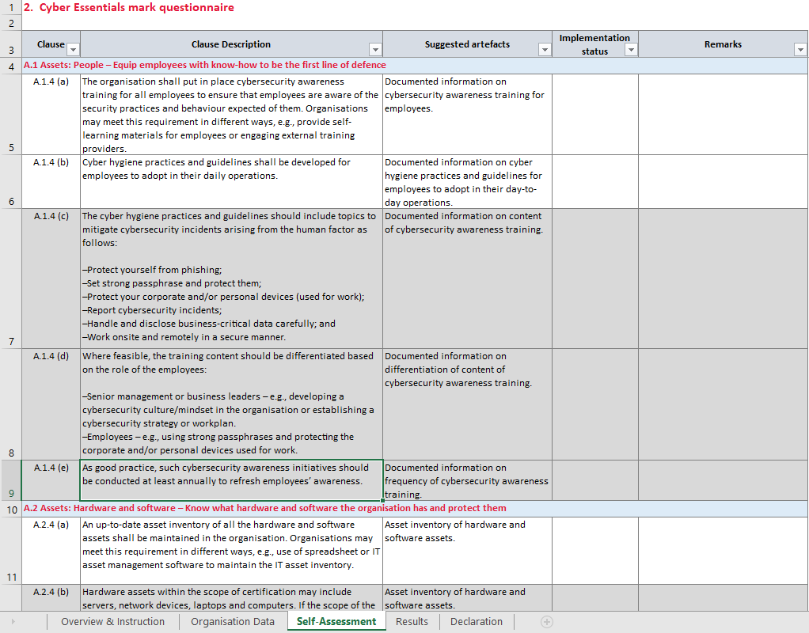
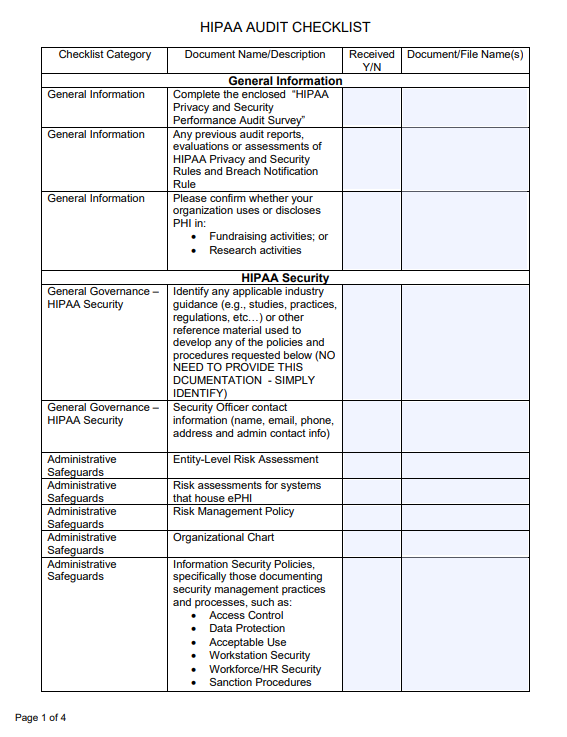

# Audits and Assessments

- [Internal Audits](#internal-audits)
    - [How it works](#how-it-works)
    - [Compliance](#compliance)
    - [Audit Committee](#audit-committee)
- [Internal Assessments](#internal-assessments)
    - [Assessment Process](#assessment-process)
    - [Example of Self Assessment Questionnaire](#example-of-self-assessment-questionnaire)
- [External Audits and Assessments](#external-audits-and-assessments)
    - [External Audits](#external-audits)
    - [External Assessments](#external-assessments)
    - [Regulatory Compliance](#regulatory-compliance)
    - [Independent Third-Party Audit](#independent-third-party-audit)
    - [Example of HIPAA Audit Checklist](#example-of-hipaa-audit-checklist)
- [Penetration Testing](#penetration-testing)
    - [Physical Pentesting](#physical-pentesting)
    - [Offensive Pentesting](#offensive-pentesting)
    - [Defensive Pentesting](#defensive-pentesting)
    - [Integrated Pentesting](#integrated-pentesting)
- [Reconnaisance in Pentesting](#reconnaisance-in-pentesting)
    - [Types of Reconnaissance](#types-of-reconnaissance)
    - [Environment Classifications](#environment-classifications)
    - [Methods and Techniques](#methods-and-techniques)
    - [Tools](#tools)
- [Attestation of Findings](#attestation-of-findings)
    - [Software Attestation](#software-attestation)
    - [Hardware Attestation](#hardware-attestation)
    - [System Attestation](#system-attestation)

## Internal Audits

Internal Audits are systematic evaluations of the effectiveness of internal controls, compliance, and integrity of information systems and processes.

- Focuses on data protection, network security, access controls, and incident response.
- Example: Internal review of password policies, user access controls

### How it works

1. Internal audit team checks control policies and procedures agains best practices and regulatory requirements.
2. User access rights is examined ensure each employee's access is align with their responsibilities.
3. Audit team verifies user access rights processes, including approvals and timely revocation.
4. Finally, they test the effectiveness of access controls using accounts with limited permissions.
5. Findings are documented and used as basis for recommendation for procedure improvements

### Compliance

Compliance ensures that information systems and security practices meet established standards, regulations, and laws.

- Crucial for protecting sensitive data and avoiding legal penalties.
- Involves implementing specific security controls and maintaining policies and procedures.
- Regularly auditing and assessing the organization's security posture.

To learn more, please [Compliance as a Governance Element.](./005-Governance-Elements.md#compliance) 

### Audit Committee

A group of people responsible for supervising the organization's audit and compliance functions.

- Typically members of the company's board of directors.
- Reviews the organization's financial reporting processes and internal controls.
- Ensures the organization is in compliance with legal regulatory requirements.
- Addresses any issues raised by auditors.

## Internal Assessments

An in-depth analysis to identify and assess potential risks and vulnerabilities in an organization's information systems.

- Often performed before implementing new systems or before making any changes to existing ones.
- Identify gaps in an organization's compliance efforts and to prepare for formal audits.
- Most are conducted as **Self-assessments** - conducted to gauge adherence to standards and regulations.

### Assessment Process 

1. Conducting threat modelling exercise to identify potential threats.
2. Combination of automated tools and manual testing techniques are used to assess vulnerabilities.
3. Risks assessment, for evaluating potential impact of the identified threats and the cost of implementing security measures.
4. Mitigation strategies are recommended based on the assessment results

### Example of Self Assessment Questionnaire

Below is an excerpt from the Self-Assessment Questionnaire provided by Cyber Security Agency of Singapore.
The full questionnaire can be found [here](https://www.csa.gov.sg/docs/default-source/our-programmes/support-for-enterprises/sg-cyber-safe-programme/cyber-essentials-self-assessment-v20220897321ea6-f473-4f1f-8ecb-77531ac02665.xlsx?sfvrsn=90e46f58_1).

## External Audits and Assessments

### External Audits 

External Audits are systematic evaluations carried out by external entities to assess an organization's information systems and security controls.

- Provides an objective perspective to an organization's true security posture.
- Also covers data protection, network security, access controls, and incident response.
- Uncover deficiencies in policies and controls to ensure alignment with diverse regulatory standards.
- Example: Evaluating compliance with PCI DSS, HIPAA, GDPR, etc.

### External Assessments

Detailed analysis conducted by independent entities to identify vulnerabilities and risks.

- Involves combinations of automated scanning tools and manual testing techniques.
- Risk Assessment, Vulnerability Assessment, and Threat Assessment.

### Regulatory Compliance    

Objective that organizations aim to reach in adherence to applicable laws, policies, and regulations.

- Organizations are adopting the use of consolidated and harmonized set of compliance controls.
- Adherence to industry-specific requirements like HIPAA, PCI DSS, and GDPR.
- Controls, such as NIST Cybersecurity Framework for compliance mechanisms.

### Independent Third-Party Audit 

Offers validation of security practices, fostering trust with customers, stakeholders, and regulatory authorities.

- Provides an unbiased perspective of the organization's security posture.
- Identify potential weaknesses that might be overlooked in internal audits and assessments.
- Regulations include GDPR and PCI DSS.

### Example of HIPAA Audit Checklist

Below is an excerpt from the HIPAA Audit Checklist provided by [San Bernardino County.](https://wp.sbcounty.gov/dbh/wp-content/uploads/2016/07/HIPAA_Audit_Checklist.pdf)

## Penetration Testing 

Penetration Testing is a simulated cyber attack that helps in the assessment of computer systems for exploitable vulnerabilities.

- Simulate network intrusion based on threat scenarios.
- There's a **specific goal in mind.**
- Agree on methodology and rules of engagement before performing pentests.

Types:

- Physical Pentesting
- Offensive Pentesting
- Defensive Pentesting
- Integrated Pentesting

### Physical Pentesting

Physical pentesting involves evaluating the physical security measures of a facility to identify vulnerabilities that could be exploited to gain unauthorized access to sensitive areas or information.

- Assesses physical barriers such as locks, doors, and gates.
- Tests the effectiveness of security personnel and protocols.
- Evaluates the security of entry points, such as windows and ventilation systems.
- Identifies potential social engineering vulnerabilities, like tailgating.
- Raises awareness about the importance of physical security among employees.

### Offensive Pentesting

Offensive pentesting, also known as **red teaming**, is a **proactive** approach that focuses on simulating real-world attacks to identify weaknesses in an organization's security infrastructure from an attacker's perspective.

- Identifies vulnerabilities in networks, systems, and applications.
- Evaluates response capabilities of security teams.
- Provides actionable insights for improving security posture.
- Results can also used to garner more funding and support for cybersecurity investments.

### Defensive Pentesting

Defensive pentesting, also known as **blue teaming**, is a **reactive** approach that emphasizes identifying and fortifying weaknesses within an organization's defenses by simulating potential attack scenarios.

- Focuses on strengthening existing security measures.
- Enhances incident detection and response capabilities.
- Conducts regular security assessments to identify new vulnerabilities.
- Collaborates with offensive teams to improve overall security.

### Integrated Pentesting

Integrated pentesting, also known as **purple teaming**, combines both offensive and defensive strategies to create a comprehensive security evaluation, ensuring that both attack simulations and defensive measures are optimized.

- Merges red and blue team methodologies for holistic security testing.
- Identifies and addresses both internal and external threats.
- Enhances coordination between offensive and defensive security teams.
- Provides a thorough analysis of an organization's security posture.

## Reconnaisance in Pentesting

Reconnaissance, also known as **information gathering**, is the first phase of a penetration test where the pentester collects as much information as possible about the target system to identify potential vulnerabilities.

- Helps in identifying potential entry points for an attack.
- Provides critical information to tailor the penetration test to the specific target.
- Proper reconnaissance can help in planning stealthy attacks to avoid detection.
- Ensures overall test effectiveness by covering all possible vulnerabilities.

### Types of Reconnaissance

**Active Reconnaissance**

- Directly interacting with the target system to gather detailed information.
- Performing network scans to identify active devices and services.
- Sending probes or queries to the target to elicit responses.
- Utilizing tools like ping sweeps and traceroutes to map network paths.
- While it can yield a lot of information, it also carries a higher risk of detection.

**Passive Reconnaissance**

- Gathering information without directly interacting with the target system to avoid detection.
- Analyzing publicly available data such as website content and social media profiles.
- Reviewing public records and documentation for insights.
- Monitoring news articles and press releases for information leaks.
- Less likely to be detected, but can yield less information.

### Environment Classifications 

Environment classifications define the level of information available to the tester about the target system. This classification helps in simulating different attack scenarios, ranging from those performed by internal employees to external attackers with no prior knowledge of the system.

**Known Environment**

- Tester has full knowledge of the target system's architecture, configurations, and security measures.
- Focuses on known assets, evaluating vulnerabilities and weaknesses.
- Often referred to as **white-box testing**.
- Allows for comprehensive and detailed testing.
- Resembles an insider threat scenario.
- Typically used for internal audits and in-depth security assessments.

**Partially Known Environment**

- The tester has limited knowledge about the target system.
- Also known as **grey-box testing**.
- Combines elements of both known and unknown environments.
- Balances thoroughness and realistic attack scenarios.
- Often used when some information is available but full details are not disclosed.
- Uncovers vulnerabilities in known assets, as well as vulnerabilities in hidden or forgotten assets.

**Unknown Environment**

- The tester has no prior knowledge of the target system.
- Commonly referred to as **black-box testing**.
- Simulates a real-world external attacker, where attacker knows little to nothing about the target.
- Relies heavily on reconnaissance and discovery techniques.
- Provides an unbiased view of the system's security posture from an outsider’s perspective.

### Methods and Techniques

**Open Source Intelligence (OSINT)**

- Using publicly available resources such as social media, websites, and databases to gather information.
- Leveraging search engines to find data about the target.
- Reviewing forums, blogs, and online communities for relevant information.
- Analyzing metadata from documents and images for hidden details.

**Network Scanning**

- Identifying live hosts, open ports, and services running on the target network.
- Using tools like Nmap to perform comprehensive scans.
- Conducting vulnerability scans to find exploitable weaknesses.
- Mapping network topologies and discovering connected devices.

**Footprinting**

- Mapping out the network architecture, including domain names, IP addresses, and subdomains.
- Identifying key infrastructure components and their relationships.
- Gathering details about network devices, operating systems, and software versions.
- Documenting external and internal network boundaries.

**Social Engineering**

- Manipulating individuals to divulge confidential information.
- Conducting phishing attacks to obtain login credentials.
- Pretexting to impersonate trusted individuals or entities.
- Using baiting tactics to lure targets into revealing information.

### Tools 

- **Nmap**: A network scanning tool to discover hosts and services on a network.
- **Shodan**: A search engine for Internet-connected devices to find exposed systems.
- **WHOIS Lookup**: A protocol used to query databases for domain registration information.
- **Google Dorking**: Using advanced search techniques to find specific information on the web.

## Attestation of Findings 

Process that involves the formal validation or confirmation provided by an entity that is used to assert the accuracy and authenticity of a specific information.

- Signifies that the findings of the penetration testing is valid based on the evidence.
- Organizations may require a letter of attestation from the pentesting firm to show as an official record.
- Should include the summary of findings and the evidence that the security assessment is conducted.
- Evidences might include data, logs, explanations, or even some of the exploit code.
- Some evidences can be showed during the attestation meeting, but doesn't need to leave the evidence.
- In contrast to pentesting reports, which are actually delivered and left to the organization.

Types: 

- Software Attestation
- Hardware Attestation
- System Attestation

### Software Attestation

Software attestation verifies the integrity and authenticity of software running on a device, ensuring that it has not been tampered with or compromised.

- Confirms the software's integrity using cryptographic methods.
- Ensures that the software is from a trusted source.
- Detects unauthorized modifications or malware.
- Commonly used in secure boot processes to verify operating systems and applications.

### Hardware Attestation

Hardware attestation ensures that the physical hardware of a device is authentic and has not been altered or replaced with malicious components.

- Utilizes unique hardware identifiers and cryptographic signatures.
- Verifies the integrity of hardware components, such as CPUs and TPMs (Trusted Platform Modules).
- Detects counterfeit or tampered hardware.
- Essential for maintaining trust in secure environments, like financial institutions and military systems.

### System Attestation

System attestation involves validating the overall security posture of an entire system, including both its hardware and software components.

- Assesses the combined integrity of hardware, firmware, and software.
- Ensures that all system components work together securely.
- Provides a comprehensive security overview of the entire device or network.
- Often used in critical infrastructure and high-assurance systems to maintain robust security standards.

----------------------------------------------

[Back to main page](../../README.md#security)    