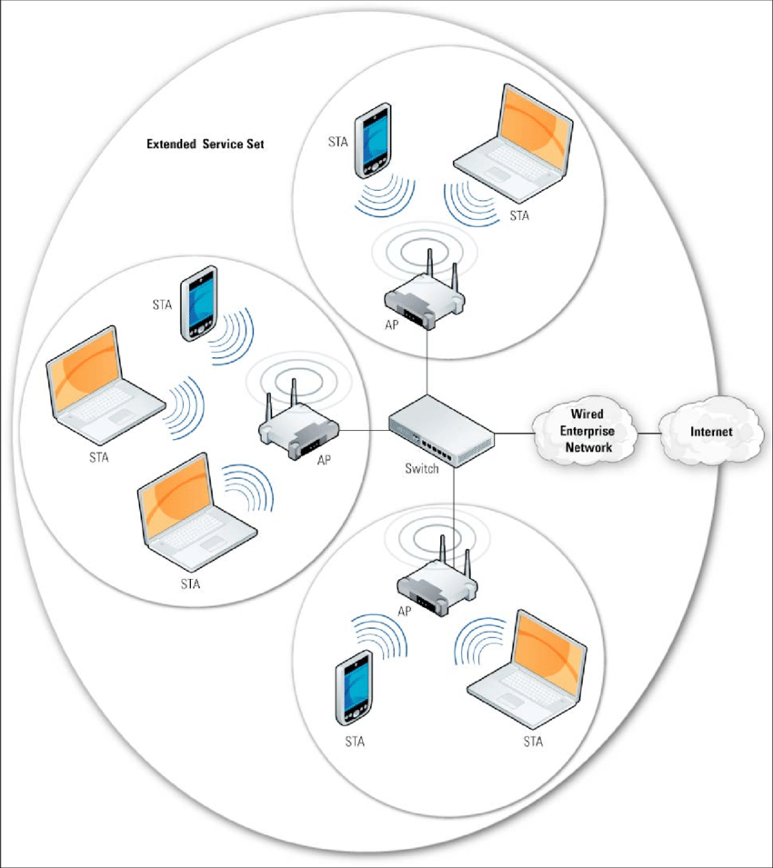
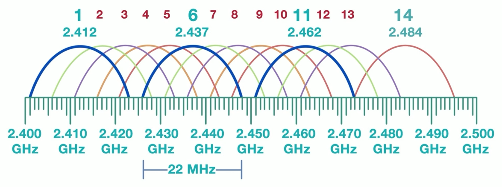

# Security Techniques

- [Wireless Infrastructure Security](#wireless-infrastructure-security)
    - [Wireless Access Points](#wireless-access-points)
    - [Placements of WAPs](#placements-of-waps)
    - [ESS Configuration](#ess-configuration)
    - [Interference Considerations](#interference-considerations)
    - [Site Survey](#site-survey)
    - [Heat Map](#heat-map)
- [Wireless Security Settings](#wireless-security-settings)
    - [Wireless Encryption](#wireless-encryption)
    - [WPA3](#wpa3)
    - [AAA](#aaa)
    - [RADIUS](#radius)
    - [TACACS+](#tacacs)
    - [EAP](#eap)
- [Application Security](#application-security)
    - [Input Validation](#input-validation)
    - [Secure Cookies](#secure-cookies)
    - [Static Code Analysis](#static-code-analysis)
    - [Dynamic Code Analysis](#dynamic-code-analysis)
    - [Code Signing](#code-signing)
    - [Sandboxing](#sandboxing)
    - [Package Monitoring](#package-monitoring)
- [Web Filtering](#web-filtering)
    - [Agent-Based Web Filtering](#agent-based-web-filtering)
    - [Centralized Proxies](#centralized-proxies)
    - [URL Scanning](#url-scanning)
    - [Content Categorization](#content-categorization)
    - [Block Rules](#block-rules)
    - [Reputation-Based Filtering](#reputation-based-filtering)
- [DNS Filtering](#dns-filtering)
- [Email Security](#email-security)
    - [DKIM](#dkim)
    - [SPF](#spf)
    - [DMARC](#dmarc)
    - [Email Gateway Protocol](#email-gateway-protocol)
    - [Spam Filtering](#spam-filtering)
- [Endpoint Detection and Response](#endpoint-detection-and-response)
    - [EDR](#edr)
    - [FIM](#fim)
    - [XDR](#xdr)
- [User Behavior Analytics](#user-behavior-analytics)
    - [UBA](#uba)
    - [UEBA](#ueba)

## Wireless Infrastructure Security

Wireless infrastructure security is crucial for protecting networks from unauthorized access and cyber threats. Effective security measures ensure the integrity, confidentiality, and availability of wireless communications. 

### Wireless Access Points

Wireless access points (WAPs) are essential components in wireless networks, providing connectivity for various devices. Securing them is critical for protecting the network against unauthorized access and potential attacks.

- Implement strong encryption protocols (WPA3) to secure wireless communications.
- Regularly update firmware to protect against vulnerabilities.
- Configure strong, unique passwords and disable default settings.
- Use MAC address filtering to control device access.
- Monitor wireless network traffic for suspicious activities.
- Position access points strategically to minimize unauthorized physical access.

### Placements of WAPs

Strategic placement of wireless access points (WAPs) is vital for optimizing network performance and ensuring security. The positioning of the WAPs will significantly impact the range, coverage, and signal strength of your organization's wireless network.

- Position WAPs centrally to provide even coverage and minimize dead zones.
- Avoid placing WAPs near external walls to reduce signal leakage outside the building.
- External wall-mounted uninidirectional antenna only broadcasts signal inwards the facility.
- Install WAPs at a height to prevent physical tampering.
- Use signal strength mapping tools to identify optimal placement locations.
- Ensure adequate coverage in high-traffic areas to maintain performance.
- Consider potential sources of interference, such as microwaves and other electronic devices

### ESS Configuration

An Extended Service Set (ESS) configuration extends wireless coverage by interconnecting multiple wireless access points (WAPs) to provide seamless connectivity across a larger area. Proper configuration ensures efficient network performance and robust security.

- **SSID Management**
  - Use a consistent SSID for all access points to enable seamless roaming.
  - Hide SSID broadcast to enhance security.
  
- **Channel Assignment**
  - Configure non-overlapping channels to minimize interference.
  - Utilize automatic channel selection features if available.
  
- **Security Settings**
  - Apply strong encryption methods (WPA3) across all access points.
  - Implement consistent security policies and access controls.
  
- **Load Balancing**
  - Distribute client connections evenly across access points to prevent overload.
  - Adjust power settings to manage coverage and client distribution.
  
- **Roaming Optimization**
  - Enable fast roaming protocols (802.11r) to improve client handoff between access points.
  - Configure access points to support seamless transition without connection drops.
  
- **Monitoring and Maintenance**
  - Regularly monitor network performance and signal strength.
  - Schedule periodic maintenance and firmware updates for all access points.

Sample diagram of an ESS Configuration with three access points.

### Interference Considerations

When deploying multiple wireless access points in an ESS configuration, interference must be carefully managed. Interference can degrade signal quality and reduce network efficiency, and there are only a limited number of channels that most wireless access points can use.

- **Co-Channel Interference**

    - Multiple WAPs in the same area, operate on the same channel or frequency bands
    - Reduces overall network throughput as devices contend for the same channel.
    - Signals between WAPs collide, requiring the data to be re-transmitted.
    - Re-transmission of data slows down the network since additional traffic is added.
    - Mitigate by using proper channel planning and spacing out access points.

- **Adjacent Channel Interference**

    - Happens when access points operate on overlapping channels.
    - Causes signal overlap and interference, reducing network performance.
    - Avoid by selecting non-overlapping channels (e.g., 1, 6, 11 in the 2.4 GHz band).
     

    

    
    

### Site Survey

Conducting a site survey is essential for optimizing the placement and configuration of wireless access points. It helps identify potential interference sources, assess signal strength, and ensure comprehensive coverage.

- Evaluate physical environment and identify obstacles.
- Measure existing signal strength and coverage areas.
- Identify sources of potential interference (e.g., microwaves, neighboring networks).
- Determine optimal locations for access points.

### Heat Map

A heat map visually represents the signal strength and coverage of wireless access points within a specific area. It is an invaluable tool for planning and optimizing wireless networks.

- Displays areas of strong and weak signal coverage.
- Highlights potential dead zones and areas needing improvement.
- Assists in identifying interference sources and their impact on coverage.
- Aids in optimal placement of access points for maximum coverage and performance.
- Provides a clear visual aid for stakeholders to understand network performance.

Sample heat map:

## Wireless Security Settings 

Implementing robust security settings is essential for protecting wireless networks from unauthorized access and attacks. Key security protocols and settings include WPA3, AAA, RADIUS, and EAP.

### Wireless Encryption

Wireless encryption nad cryptographic protocols protect wireless networks and safeguarda it from unauthorized access by securing data from interception.

- **WEP (Wired Equivalent Privacy)**
  - Outdated 1999 wireless security standard, meant to match wired LAN security.
  - Provides basic encryption but is not recommended due to security flaws.
  - Uses a fixed encryption key for all devices on the same network to secure messages.
  - WEP encryption keys comes in 64-bit and 128-bit key sizes.
  - Insecure, because of the weak 24-bit initialization vector.

- **WPA (Wi-Fi Protected Access)**
  - An improvement over WEP, offering better security features.
  - Features TKIP (Temporal Key Integrity Protocol) for enhanced data protection.
  - Still considered less secure compared to WPA2 and WPA3.
  - Insecure, because of insufficient data integrity checks in TKIP.

- **WPA2**
  - WPA enhancement, with robust encryption using AES (Advanced Encryption Standard).
  - **CCMP** - Counter Cipher Mode with Block Chaining Message Authentication Code Protocol.
  - Considered secure for many applications, though WPA3 is now preferred.

- **WPA3**
  - Latest standard, using AES GCMP for robust encryption.
  - Introduces SAE, Enhanced Open, and updated cryptographic protocols.

### WPA3

WPA3 is the latest security protocol for Wi-Fi networks, designed to provide stronger data protection and improve security against attacks.

- Provides improved encryption for safer wireless communication.
- Protects against brute-force password guessing attacks.
- Supports individual encryption per device to enhance privacy.

WPA3 also introduced advanced security features:

- **SAE (Simultaneous Authentication of Equals)**
  - A more secure password-based authentication mechanism.
  - Designed to resist offline dictionary attacks.
  - Provides improved security over the traditional PSK method.
  - Replaced the 4-way handshake with a protocol based on the Diffie-Helman key agreement.
  - Even if attacker captures the data required for the handshake, the data is unusable.

- **Enhanced Open/OWE (Opportunistic Wireless Encryption)**
  - Enables encryption even on open networks without requiring a password.
  - Protects data in transit against eavesdropping.
  - Increases privacy on open Wi-Fi networks.

- **AES GCMP (Advanced Encryption Standard Galois/Counter Mode Protocol)**
  - Supports 128-bit AES for personal networks.
  - Supports 192-bit AES for enterprise networks.
  - Ensures both data confidentiality and integrity.
  - Supports high-efficiency encryption in Wi-Fi networks.

- **Management Frame Protection**
  - Secures management frames from key recovery attacks. 
  - Prevents eavesdropping, forging, and tampering.
  - Protects against threats like spoofing and Denial of Service (DoS) attacks.
  - Enhances the overall security of the Wi-Fi network management.

### AAA 

AAA (Authentication, Authorization, and Accounting) is a framework used in network management to control access and usage, ensuring secure network operations.

- Authentication: Verifies the identity of users or devices.
- Authorization: Grants access based on permissions.
- Accounting: Monitors and logs user activities for security auditing.

More details can be found here: [AAA of Security](./002-Security-Principles.md#aaa-of-security)

### RADIUS

RADIUS (Remote Authentication Dial-In User Service) is a protocol used for network access authentication, authorization, and accounting, commonly employed in enterprise networks.

- Widely used to manage network access for employees, contractors, and guests.
- Enhances security by providing a secure method for authentication.

More details can be found here: [RADIUS](./025-Network-Authentication-Protocols.md#radius)

### TACACS+

TACACS+ (Terminal Access Controller Access-Control System Plus) separates the functions of AAA to allow for a more granular control over processes.

- Similar to RADIUS, but allows for more detailed control over AAA functions.
- This level of separation permits the distinct handling of each component across different services.
- Uses TCP and encrypts authentication for improved security over older AAA protocols.

More details can be found here: [TACACS+](./025-Network-Authentication-Protocols.md#tacacs)

### EAP 

EAP (Extensible Authentication Protocol) is a flexible authentication framework frequently used in network access control, providing various methods for secure authentication.

- Supports multiple authentication methods, including passwords and certificates.
- Facilitates secure access in enterprise networks.
- Commonly used in wireless networks for enhanced security.

More details can be found here: [EAP Variants](./025-Network-Authentication-Protocols.md#eap)

## Application Security 

Application security focuses on protecting software applications from security threats by implementing measures to prevent, detect, and respond to vulnerabilities and attacks.

### Input Validation

Input validation is crucial for protecting applications from malicious data by ensuring that only safe and expected inputs are processed.

- Serves as quality control of data to ensure every piece of information is valid and secure.
- Prevents common vulnerabilities like SQL injection and cross-site scripting (XSS).
- Ensures data integrity and application stability, early in the process.

**Validation Rules** delineate acceptable and unacceptable inputs.

- Any input not conforming to the validation rules will be flagged and detected.
- System might also prompt the user to input the data again.

### Secure Cookies

**Cookies** are small pieces of data stored in the user's computer by the web browser while browsing a website.

- Used to maintain stateful information between the web server and the client.
- If not properly secured, cookies can be exploited to hijack user sessions.
- Refrain from using persistent cookies for session validation.
- Always generate a fresh cookie each time the user authenticates.

**Secure cookies** enhance session security by protecting the data stored in cookies from unauthorized access and tampering. 

- Uses secure attributes to protect cookie transmission over HTTPS
- Use **HttpOnly** to secure cookies from client-side.
- Use **SameSite** to control which origin can access a given cookie.
- Both HttpOnly and SameSite attributes to prevent XSS and CSRF attacks.
- Limits the lifespan of cookies to minimize potential risks.

### Static Code Analysis

Static code analysis, also known as **Static Application Security Testing (SAST)**, involves examining the source code for vulnerabilities without executing the program, helping to identify security flaws early in the development process.

- Scans source code for potential security vulnerabilities.
- Detects issues like buffer overflows, injection flaws, and insecure data handling.
- Supports compliance with security standards and best practices.
- Usually performed using software analyzers, such as Sonarqube. Veracode, Semgrep.

### Dynamic Code Analysis

Dynamic code analysis, also known as **Dynamic Application Security Testing (DAST)**, tests the running application to identify vulnerabilities that may not be apparent in static analysis.

- Analyzes an application during execution to find runtime vulnerabilities.
- Identifies issues such as memory leaks, improper error handling, and authentication flaws.
- Provides insights into the application’s behavior under different conditions.

Common Methods:

- **Fuzzing**
  - Automatically inputs random data ("fuzz") to identify software bugs and vulnerabilities.
  - Involves automated injection of malformed data or unexpected data.
  - Helps discover unexpected application crashes and security flaws.
  - Typically used to test input validation and error handling mechanisms.

- **Stress Testing**
  - Assesses how the application performs under high load or extreme conditions.
  - Identifies potential failure points and system weaknesses under stress.
  - Useful for evaluating the application’s resilience and stability under abnormal operating conditions.

### Code Signing

Code signing is used to verify the authenticity and integrity of software code, ensuring that it has not been tampered with.

- Developer creates a cryptographic hash of the file, then encrypts it with his own private key.
- Associates code with a verified digital certificate whenever the program is sent out.
- Helps users and systems confirm the software’s source and integrity.
- Prevents the execution of unauthorized or modified software.

It is important to know that the presence of digital signatures on a file or program does not guarantee its absolute security or the absence of vulnerabilities, but the digital signature confirms that the file is in the same state that the developer intended it to be when he/she distributed it.

### Sandboxing

Sandboxing is a security mechanism used to isolate running applications to prevent them from affecting the operating system or other applications.

- Limits the access of an application to the system resources.
- Provides a controlled environment for executing untrusted code.
- Helps protect the system from potential malicious activity initiated by the application.

### Package Monitoring

Package Monitoring involves keeping track of security of third-party packages and dependencies used.

- Ensures that packages are up-to-date with the latest security patches.
- Verifies the integrity and authenticity of packages to prevent supply chain attacks.
- Alerts developers to known vulnerabilities in dependencies.
- Example tools are Snyk and Dependabot.

## Web Filtering 

Web filtering involves controlling the content that users can access on the internet through an organization's network. This process is crucial for protecting users from harmful websites and maintaining productivity by blocking access to non-work-related content.

- Blocks access to malicious and unsafe websites.
- Prevents access to inappropriate or non-compliant content.
- Helps enforce company policies and legal requirements.
- Can be configured to allow or restrict access based on categories, keywords, or specific URLs.
- Monitors user activity to provide insights and reporting on web usage.

Types:

- Agent-Based Web Filtering 
- Centralized Proxies 
- URL Scanning
- Content Categorization 
- Block Rules 
- Reputation-Based Filtering

### Agent-Based Web Filtering

Agent-based web filtering uses software agents installed on client devices to enforce web content policies directly on the user's computer.

- Provides direct control over user activities on the device.
- Particularly effective for organizations with remote or mobile workers.  
- Allows for personalized filtering settings based on user or group profiles.
- Can block content at the endpoint level, reducing reliance on network-level controls.

### Centralized Proxies

Centralized proxies route all network requests through a single proxy server, where web content is filtered and monitored.

- Centralizes control of internet access and content filtering.
- Reduces the load on client devices by offloading filtering to the proxy server.
- Enables consistent policy enforcement across all devices in the network.
- If request does not conform with the policies, the request is blocked or denied.

### URL Scanning

URL scanning involves inspecting the URLs accessed by users to determine if they are safe or harmful.

- Helps detect malicious websites before they can be accessed.
- Requested URL is checked against a database of known malicious websites.  
- If URL is not found in the database, it is assumed safe to access.
- Integrates with other security systems for comprehensive protection.

### Content Categorization

Content categorization involves classifying web content into categories to facilitate filtering based on predefined rules.

- Simplifies the management of web content policies.
- Allows for more granular control over internet usage by category.
- Helps in compliance with industry standards and regulations.

### Block Rules

Block rules define specific criteria or conditions under which web access is restricted or blocked.

- Enables precise control over which websites or content types are accessible.
- Helps enforce company policies and prevent access to harmful or non-compliant content.
- Can be customized based on organizational needs.

### Reputation-Based Filtering

Reputation-based filtering assesses the trustworthiness of websites based on their history and feedback from a global network of users. It also uses **reputation score**, which is typically determined by a third-party service.

- Provides dynamic protection against emerging threats.
- Utilizes global databases of known good and bad sites to filter content.
- Enhances security by blocking access to potentially harmful sites in real-time.

## DNS Filtering

DNS filtering controls internet content access by blocking domains at the DNS resolution level, preventing users from accessing harmful or inappropriate websites.

- Blocks access to known harmful websites before the connection is established.
- Reduces the load on network resources by stopping threats early in the DNS resolution process.
- Can be configured to block access to categories of sites, such as social media or gambling.
- Provides a broad security layer by integrating with other security measures to protect users.

## Email Security 

Email security involves protecting email accounts and systems from unauthorized access and malicious activities. It is essential for safeguarding sensitive information and maintaining the integrity of communications.

- Protects against phishing and spoofing attacks.
- Scans incoming and outgoing emails for malware and malicious links.
- Implements encryption to safeguard email content during transmission.
- Monitors and audits email traffic to detect unusual activities and potential breaches.

Types:

- DKIM
- SPF 
- DMARC 
- Email Gateway Protocol 
- Spam Filtering

### DKIM 

DKIM (DomainKeys Identified Mail) is an email authentication method designed to detect forged sender addresses in emails, a common technique used in phishing and email spoofing.

- Cryptographic signatures is added to the headers of the email.
- Signature isvalidated against a public cryptographic key located on the domain's DNS record.
- This entire process Verifies that the email comes from the claimed domain.
- Helps ensure that the content of the email has not been altered in transit.

### SPF 

SPF (Sender Policy Framework) is an email validation system designed to prevent spam by verifying the sender's IP address against the domain's authorized list.

- Allows domain owners to specify authorized mail servers to send emails on behalf of their domain.
- Reduces the risk of unauthorized use of the domain in email communications.
- Helps prevent email spoofing and phishing attacks.

How it works:

- When an SPF-enabled mail server receives email, it checks the sender's IP first.
- Sender IP is verified againsts a list of authorized IPs in the sender's domain DNS records.
- If the sender IP is not in the SPF list, the email will be marked as spam or rejected. 

### DMARC 

DMARC (Domain-based Message Authentication, Reporting, and Conformance) uses SPF and DKIM to determine the authenticity of an email message and allows domain owners to specify how to handle non-authenticated emails.

- Policy for how emails from your domain should be handled if they fail SPF or DKIM checks.
- Offers domain owners visibility into how their domain is being used via aggregate/forensic reports.
- Helps protect the domain from being abused in phishing and spoofing attacks.

Receiving mail servers can be configured with a DMARK policy that reject emails that claim to come from the legitimate domain but have already failed the DKIM and SPF checks. The primary purpose of DMARC is to protect a domain from being used in business email compromised attacks.

### Email Gateway Protocol

Email gateway protocols are used to secure and manage the flow of email traffic within and between organizations.

- Serves as entry and exit points for emails.
- Usually relies on SMTP protocol to send and receive emails.
- Ensures emails are securely transferred between the internet and a local network.
- Acts as a filter to block malicious emails before they reach the user's inbox.

Email gateways are implemented to help with:

- Email routing
- Email security 
- Policy enforcement 
- Encryption and decryption 

Deployment Methods:

- On-premise 
- Cloud-based 
- Hybrid

### Spam Filtering

Spam filtering is a technique used to identify and block unwanted or unsolicited email messages.

- Uses algorithms to detect spam based on content, sender, and other characteristics.
- Protects users from phishing attempts, scams, and potentially harmful content.
- Helps maintain the security and productivity of email systems.

Techniques used:

- **Content analysis**
  - Scans the body and subject of emails for patterns typical of spam.
  - Uses machine learning algorithms to adapt to new spam tactics.

- **Bayesian filtering**
  - Analyzes the frequency of words in emails to predict spam probability.
  - Continuously updates as new spam emails are processed.

- **DNS-based sinkhole list**
  - Maintains a list of IP addresses known to send spam.
  - Redirects traffic from these IPs to a controlled environment for further analysis.

- **General email filtering rules**
  - Applies rules based on sender reputation, message format, and known spam signatures.
  - Regularly updates rules to adapt to evolving spam strategies.

## Endpoint Detection and Response 

### EDR 

Endpoint Detection and Response (EDR) refers to security technologies that continuously monitor endpoint activities to detect, analyze, and respond to potential security threats.

- Continous real-time surveillance of endpoint activities to detect suspicious behaviors.
- Responding to incidents, including isolation of affected endpoints and automated response actions.
- Enables detailed investigation, including timeline reconstruction and root cause analysis.
- Gathers detailed data from endpoints to support security analysis and compliance requirements.

**EDR Process**

1. **Data Collection**
  - Monitors endpoint activities.
  - Captures data from various sources on the endpoint:
    - System processes
    - Changes to the Registry
    - Memory Usage 
    - Patterns of Network Traffic
    - Other system activities

2. **Data Consolidation**
  - Aggregates data from multiple endpoints and sends to a database.
  - Centralizes data for easier analysis, could be on-prem or in the cloud.

3. **Threat Detection**
  - Analyzes patterns and anomalies in the data. 
  - Uses algorithms and techniques to identify potential threats.
    - Signature-based Detection
    - Behavior-based Detection

4. **Alerts and Threat Response**
  - Generates alerts for security teams when a potential attack is detected.
  - Initiates predefined response actions to mitigate threats.

5. **Threat Investigation**
  - Analyzes the cause and impact of detected threats.
  - Examines data to understand attack methods and sources.

6. **Remediation**
  - Applies fixes and updates to prevent further incidents.
  - Implements changes to improve security posture:
    - Removing malicious files 
    - Reversing changes made by the threat 
    - Restoring effective systems

### FIM

File Integrity Monitoring (FIM) is a security measure that ensures the files on a system remain unchanged by unauthorized alterations.

- Monitors files for unauthorized changes.
- Compares current file states to known good baselines.
- Alerts on discrepancies or changes.

Files that can be checked:

- Binary files 
- System and application files
- Configuration and parameter files

### XDR

Extended Detection and Response (XDR) is a security solution that provides integrated threat detection, investigation, and response capabilities across multiple security products.

- Integrates data across multiple security layers, provides unified view.
- Streamlines incident response processes and enhances threat detection with advanced analytics.
- Improves visibility and reduces response time across the security environment.
- No longer need separate solutions for network, email, and endpoint security.
- **EDR focuses on endpoints, XDR monitors endpoints, network, cloud, and email.**

## User Behavior Analytics 

### UBA 

User Behavior Analytics (UBA) involves monitoring and analyzing the behavior of users within a network to identify patterns that may indicate malicious activity or security risks.

- Analyzes normal user activities to establish baseline behaviors.
- Detects deviations from typical user behaviors that could signify threats.
- Utilizes machine learning and statistical models to identify anomalies.
- Helps in early detection of insider threats and compromised accounts.

How it works:

1. Collect and analyze data from diverse sources.
2. Employ advanced analytics methods.
3. Create a baseline for normal user behavior.
4. COntinuously monitor user activity to detect anomalies.

### UEBA

User and Entities Behavior Analytics (UEBA) extends the principles of traditional user behavior analytics to include all entities in an organization, such as devices, applications, and network connections.

- Monitors activities of both users and other entities within the network.
- Identifies unusual patterns that may indicate security threats.
- Utilizes machine learning to detect anomalies and potential security incidents.
- Provides context to understand the relationships and interactions between users and entities.

----------------------------------------------

[Back to main page](../../README.md#security)    