# GCP DevOps Project 


## Pre-requisites 

- [Setup Github account](https://docs.github.com/en/get-started/onboarding/getting-started-with-your-github-account)

- [Add an SSH key to your Github account](https://docs.github.com/en/authentication/connecting-to-github-with-ssh/adding-a-new-ssh-key-to-your-github-account)

- [Add the SSH key to your ssh-agent (Optional)](https://docs.github.com/en/authentication/connecting-to-github-with-ssh/generating-a-new-ssh-key-and-adding-it-to-the-ssh-agent)

- [Install Docker Desktop](https://docs.docker.com/desktop/install/windows-install/) 

- [Create a GCP account](https://console.cloud.google.com/freetrial/signup) 

- [Understanding of Kubernetes Basics](https://github.com/joseeden/All-Things-Docker-and-Kubernetes?tab=readme-ov-file#kubernetes) 


<!-- 
- [Understanding of GKE fundamentals](https://cloud.google.com/kubernetes-engine/docs/concepts/kubernetes-engine-overview) -->


## Sprints 

This project will be broken down into seven sprints. 

- [Sprint 01](#sprint-01)
- [Sprint 02](#sprint-02)
- [Sprint 03](#sprint-03)
- [Sprint 04](#sprint-04)
- [Sprint 05](#sprint-05)
- [Sprint 06](#sprint-06)

<!-- 
## NOTES 

✔️ Copy the check sign when done with a task for a sprint.  -->


## Sprint 01

```
TODO: 
✔️ Create a Github Repo and clone it locally 
✔️ Setup Github repo according to best practices 
✔️ Code the application locally 
✔️ Test the application locally
```

<details><summary> See sprint details </summary>
 

1. Create the Github repository. 
    
    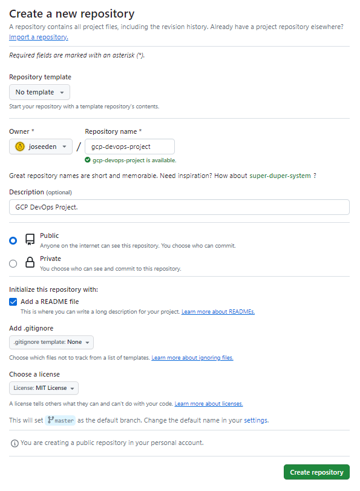

2. Clone the repository locally.

    ```bash
    joseeden@EdenJose:4-Test-repos$ git clone https://github.com/joseeden/gcp-devops-project.git
    Cloning into 'gcp-devops-project'...
    remote: Enumerating objects: 4, done.
    remote: Counting objects: 100% (4/4), done.
    remote: Compressing objects: 100% (3/3), done.
    remote: Total 4 (delta 0), reused 0 (delta 0), pack-reused 0
    Unpacking objects: 100% (4/4), 1.52 KiB | 11.00 KiB/s, done.
    joseeden@EdenJose:4-Test-repos$
    joseeden@EdenJose:4-Test-repos$ ls -la
    total 0
    drwxrwxrwx 1 joseeden joseeden 512 Jan 26 01:34 .
    drwxrwxrwx 1 joseeden joseeden 512 Jan 26 01:34 ..
    drwxr-xr-x 1 joseeden joseeden 512 Jan 26 01:34 gcp-devops-project
    joseeden@EdenJose:4-Test-repos$
    joseeden@EdenJose:4-Test-repos$ cd gcp-devops-project/
    joseeden@EdenJose:gcp-devops-project$ ls -la
    total 4
    drwxr-xr-x 1 joseeden joseeden  512 Jan 26 01:34 .
    drwxrwxrwx 1 joseeden joseeden  512 Jan 26 01:34 ..
    drwxr-xr-x 1 joseeden joseeden  512 Jan 26 01:34 .git
    -rw-r--r-- 1 joseeden joseeden 1066 Jan 26 01:34 LICENSE
    -rw-r--r-- 1 joseeden joseeden   93 Jan 26 01:36 README.md 
    ```

3. Enable branch protection on the main branch. 


    <p>
    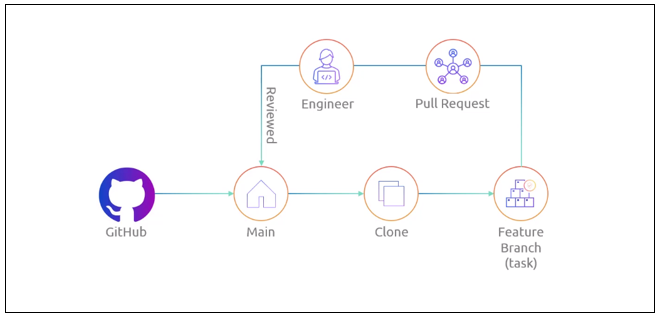
    </p>

    

    To do this, go back to the Github repo > Settings > Branches > Add branch protection rule


    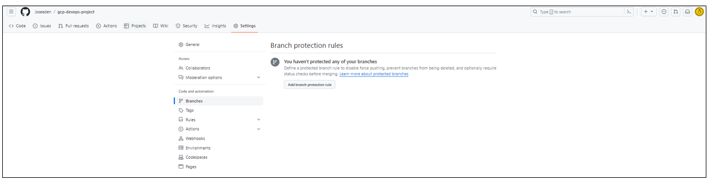

    Put in "master" for branch  name and then tick the box for "Require a pull reqeust before merging. Click Create at the bottom.


    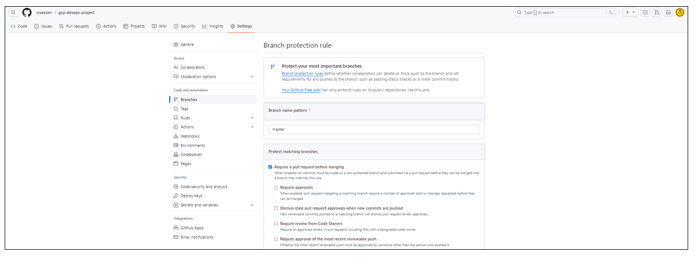


    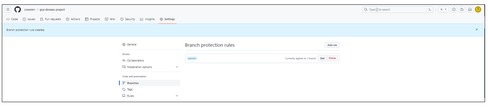


    **Note**: In a team setting, you may need to add an "Approval" stage so that any changes will be reviewed by another team member before it is pushed to the master branch.

4. Back in the terminal, create a feature branch so that we don't commit directly to the master branch.

    ```bash
    joseeden@EdenJose:gcp-devops-project$ git branch
    * master
    joseeden@EdenJose:gcp-devops-project$ git checkout -b "feature/sprint-01"
    Switched to a new branch 'feature/sprint-01'
    joseeden@EdenJose:gcp-devops-project$
    joseeden@EdenJose:gcp-devops-project$ git branch
    * feature/sprint-01
    master 
    ```

5. Try to change the README file and do a <code>git push.</code> If you encounter an error, make sure that you have [generated your SSH keys and added them to your Github account](https://docs.github.com/en/authentication/connecting-to-github-with-ssh/adding-a-new-ssh-key-to-your-github-account). Also, you might need to modidy the <code>.git/config</code> in your project directory.

    ```bash
    [remote "origin"]
    url =  git@github.com:joseeden/gcp-devops-project.git
    fetch = +refs/heads/*:refs/remotes/origin/*
    [branch "master"]
    remote = origin
    merge = refs/heads/master
    [branch "feature/sprint-01"]
    remote = origin
    merge = refs/heads/feature/sprint-01
    ```

    Set upstream branch as the feature branch.

    ```bash
    git add . 
    git commit -m "Updated README" 
    git push --set-upstream origin feature/sprint-01
    ```


6. **Shortcuts**. As a shortcut, we can add an alias in out <code>~/.bashrc</code>.

    ```bash
    alias gitacp='git add -A; git commit; git push' 
    alias gitst="git status"      
    ```

    ```bash
    source ~/.bashrc
    ```

7. Back at the Github repo, a new message will appear. Click the "Compare & pull request". The original text and the changes will appear at the bottom, highlighted with red and green. In the "Add a description" box, specify the change made and then click "Create pull request".

    |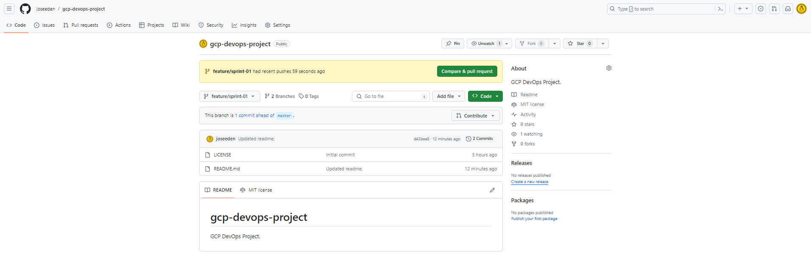|
    |-|

    |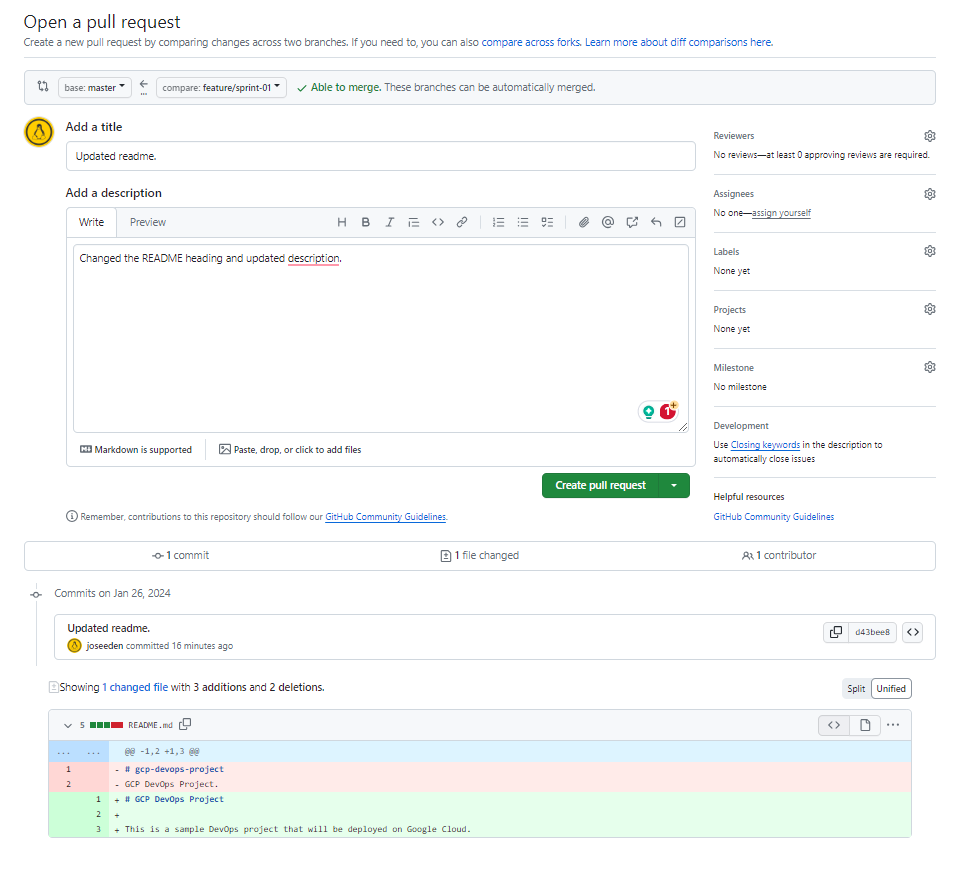|
    |-|

8. In a team setting, a review will be done by another team member before it is merged. The members names will appear in the "Reviewer" section at the left. This is a self project, simply clik the Merge pull request > Confirm merge.

    |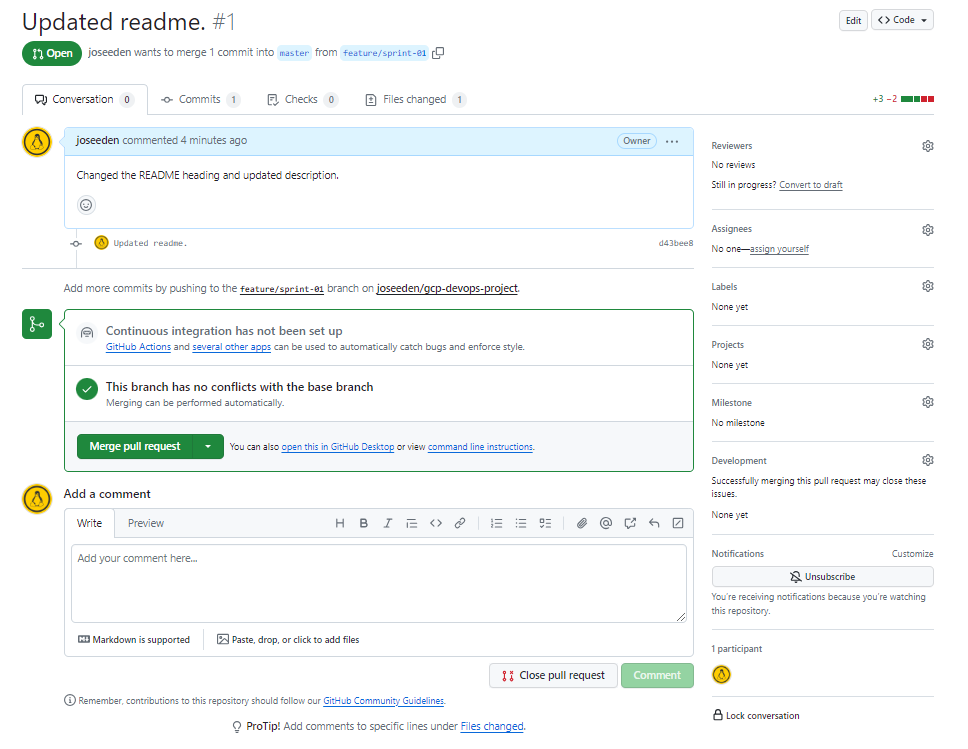|
    |-|
    </p>

    |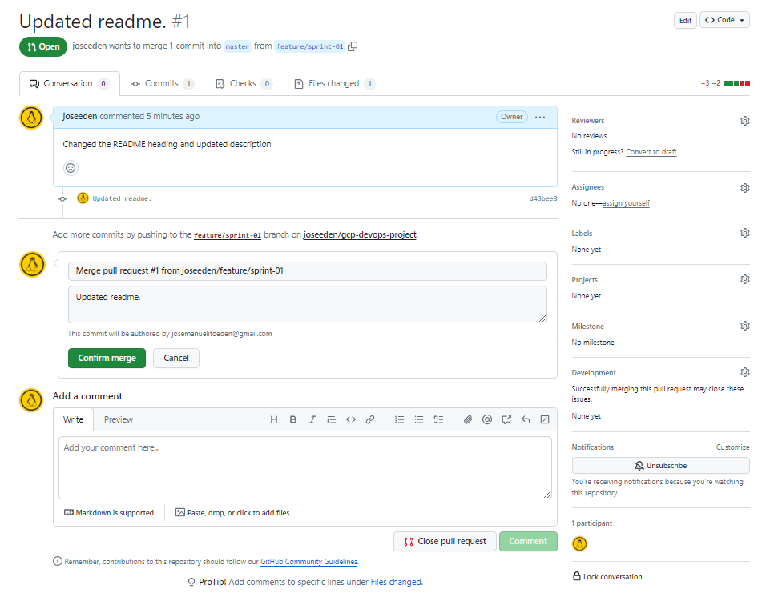|
    |-|
    
    There is an option to delete the branch after every merge to the master branch, as this is a common practice. Whenever changes are merged to the master branch, it means that all changes have undergone testing, has been reviewed, and no additional change is needed. 

    But since this is a self-project, we can keep the branch open for now. 

9. Back in the project directory, create the files. 

    app.py:

    ```python
    from flask import flask 
    app = Flask(__name__) 

    @app.route('/')
    def hello_world(): 
        return 'This is a simple Flask application' 
    ```

    requirements.txt:

    ```bash
    flask 
    ```

    Dockerfile:

    ```Dockerfile
    FROM python:3.8-slim-buster 

    WORKDIR /app

    COPY requirements.txt requirements.txt 
    RUN pip3 install -r requirements.txt

    COPY . .

    CMD ["python3", "-m", "flask", "run", "--host=0.0.0.0"]
    ```

10. Test the application locally. To do this, we will need to have [Docker desktop installed locally](https://docs.docker.com/desktop/install/windows-install/).

    ```bash
    docker build -t simple-flask-app . 
    ```

    Check the created image. 

    ```bash 
    joseeden@EdenJose:gcp-devops-project$ docker images
    REPOSITORY         TAG       IMAGE ID       CREATED         SIZE
    simple-flask-app   latest    6cf9598ecf38   2 minutes ago   129MB
    ```

11. Run the docker container locally.

    ```bash
    joseeden@EdenJose:gcp-devops-project$ docker run -p 5000:5000 simple-flask-app
    * Debug mode: off
    WARNING: This is a development server. Do not use it in a production deployment. Use a production WSGI server instead.
    * Running on all addresses (0.0.0.0)
    * Running on http://127.0.0.1:5000
    * Running on http://172.17.0.2:5000
    ```

    Open a browser and navigate to the URL and port:

    ```bash
    localhost:5000 
    ```

    |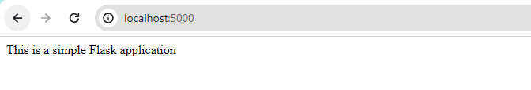|
    |-|

12. Since the application is running locally, we can now commit the changes. But first, make sure to check your current branch and verify the changes. Afterwards, commit and push the changes. 

    
    ```bash
    joseeden@EdenJose:gcp-devops-project$ git branch
    * feature/sprint-01
    master
    joseeden@EdenJose:gcp-devops-project$ gitst
    On branch feature/sprint-01
    Your branch is up to date with 'origin/feature/sprint-01'.

    Changes not staged for commit:
    (use "git add <file>..." to update what will be committed)
    (use "git restore <file>..." to discard changes in working directory)
            modified:   README.md

    Untracked files:
    (use "git add <file>..." to include in what will be committed)
            Dockerfile
            app.py
            requirements.txt

    no changes added to commit (use "git add" and/or "git commit -a")
    joseeden@EdenJose:gcp-devops-project$
    joseeden@EdenJose:gcp-devops-project$ gitacp
    [feature/sprint-01 e604161] Added files for containerized flask app.
    4 files changed, 24 insertions(+), 1 deletion(-)
    create mode 100644 Dockerfile
    create mode 100644 app.py
    create mode 100644 requirements.txt
    Enumerating objects: 8, done.
    Counting objects: 100% (8/8), done.
    Delta compression using up to 4 threads
    Compressing objects: 100% (5/5), done.
    Writing objects: 100% (6/6), 826 bytes | 16.00 KiB/s, done.
    Total 6 (delta 0), reused 0 (delta 0)
    To github.com:joseeden/gcp-devops-project.git
    d43bee8..e604161  feature/sprint-01 -> feature/sprint-01
    ```
    ```bash
    ## COMMIT 
    Added files for containerized flask app.
    # Please enter the commit message for your changes. Lines starting
    # with '#' will be ignored, and an empty message aborts the commit.
    #
    # On branch feature/sprint-01
    # Your branch is up to date with 'origin/feature/sprint-01'.
    #
    # Changes to be committed:
    #       new file:   Dockerfile
    #       modified:   README.md
    #       new file:   app.py
    #       new file:   requirements.txt
    #   
    ```

13. Back at the Github repo, switch to the feature branch and open a pull request. 

    |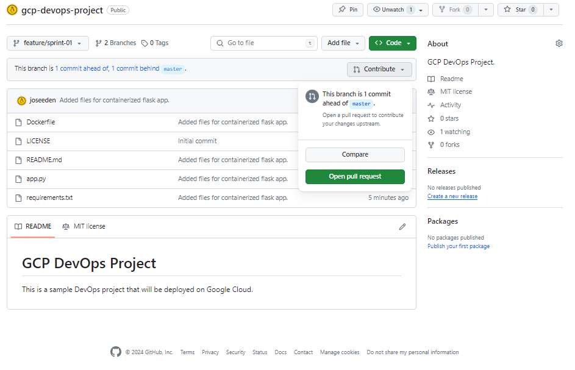|
    |-|

    |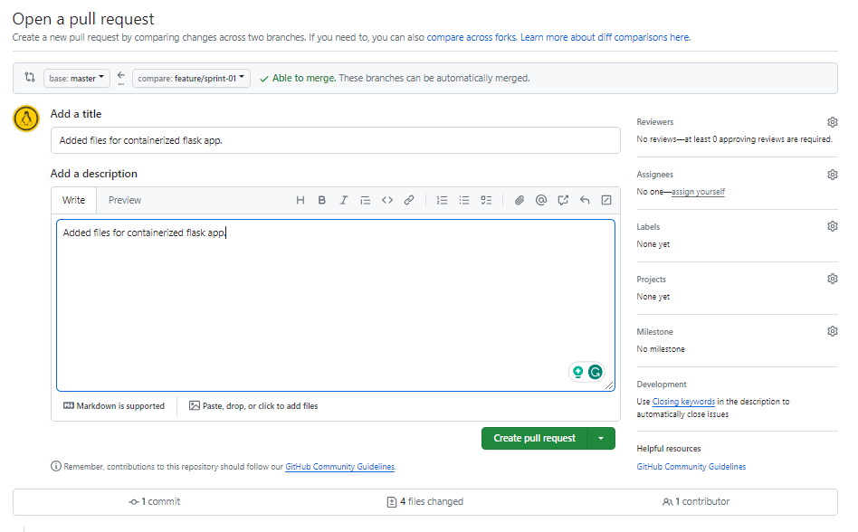|
    |-|

    Merge the PR.

    |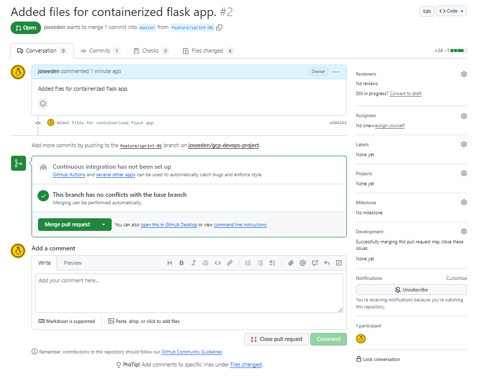|
    |-|


14. At this point, we can now safely delete the feature branch. Click Delete branch.

    |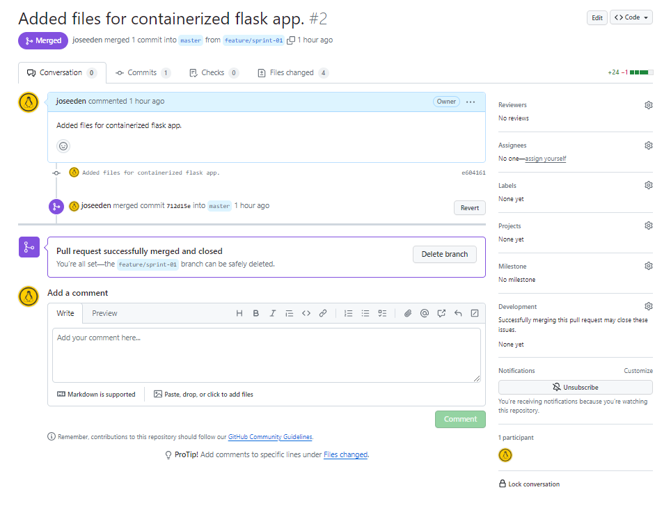|
    |-|


</details>


## Sprint 02

```
TODO: 
✔️ Setting up a GKE cluster
✔️ Verify connection to the GKE cluster
```

<details><summary> See sprint details </summary>


1. Login to your GCP account and go to the GKE menu. Click CREATE > Standard: You manage your cluster > CONFIGURE. 

    |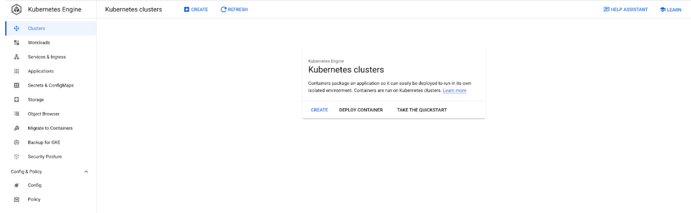|
    |-|

2. Provide the following specifics for the cluster:

    Basics: 

    - Name: cluster-1
    - Location type: Zonal 
    - Zone: asia-southeast1-a

    |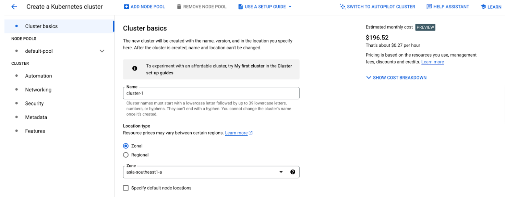
    |-|


3. The cluster creation may take up 5-10 mins. Once done, it should appear in the Clusters menu. Click the clsuter name to see details of the cluster. 

    |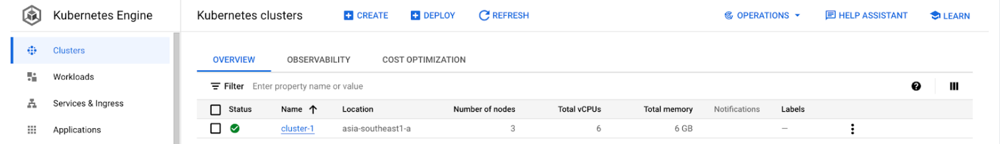
    |-|

4. **Maintenance window**. For production environments, it is recommended to change the maintenance window from Any time to xx.  

<!-- Clusters > select cluster > Details > Automation -->


5. To connect to the cluster, click CONNECT. It will show the available options to connect to the cluster. Click RUN IN CLOUD SHELL. This will open a Linux terminal.

    |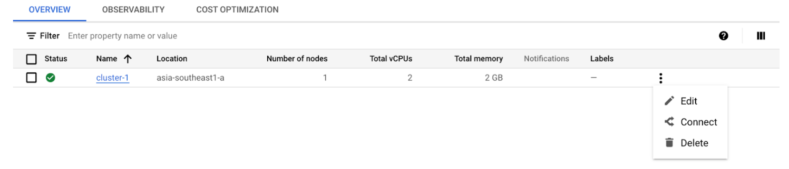
    |-|

    In the "Authorize Cloud Shell" window, click AUTHORIZE. A kubeconfig will then be generated.  


    Run some kubectl commands to test.

    ```bash
    kubectl get ns  
    kubectl get po -n kube-system  
    ```

    **Note:** These information can also be seen from the GCP console.

</details>

## Sprint 03

```
TODO: 
✔️ Design Discussions
✔️ Explore CICD options
```

<details><summary> See sprint details </summary>

What we have: 

- Code written in Python 
- Code is hosted in Github 

What we want to do:

- Automate build of Docker image 
- Store the Docker image in an artifactory 
- Write the manifest files for Kubernetes deployment
- Setup CD to deploy code to GKE

Available GCP Tools: 

-  Cloud Build
    - CICD Tool 
    - Can automate docker image build 
    - Can be used to deploy image to GKE cluster
    - Serverless CI/CD platform 
    - No infrastructure to maintain 
    - Build logic is in YAML file 

- GCP Artifact Registry 
    - Store the Docker image 

Architecture:

|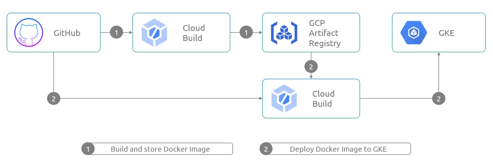|
|-|

</details>


## Sprint 04

```
TODO: 
✔️ Connect Cloud Build to Github repository 
✔️ Automate Docker image build process 
```

<details><summary> See sprint details </summary>

**Notes**

In traditional Jenkins, we use **Webhooks** to monitor activities in a repository. The Jenkins job will be triggered when new changes are committed. 

||
|-|

In Cloud Build, we can use a **Cloud Build Trigger.** This will be the event that will start the Cloud Build job. This can be any push that is done on the main/master branch. This can also be configured for other branches.

|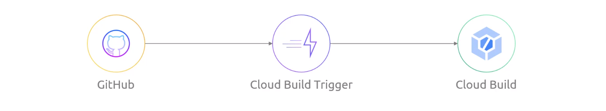|
|-|

Once triggered, Cloud Build will check the Cloudbuild.yaml which will contain the instructions. This is the CD code.

<p>
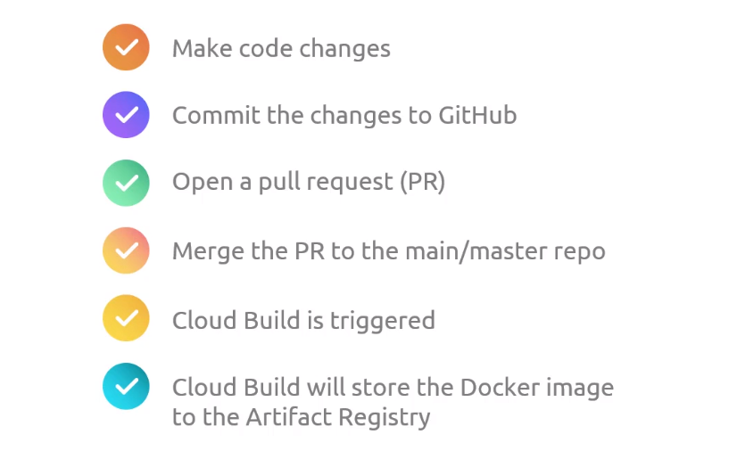
</p>

**Connecting Github repo to Cloud Build**

1. First, search for Cloud Build. If this is the first you've used it, you'll need to enable the Cloud Build API. Refresh the window or try searching Cloud Build from the search bar again. 

    |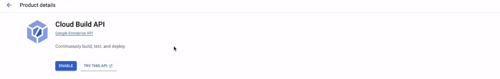|
    |-|


2. In the Cloud Build homepage, go to Triggers > MANAGE REPOSITORIES > CONNECT REPOSITORY.


    In the right-side window, select Github. This will open a new tab for authentication.  It will fail for the first time because it will require the Google Cloud Build to be installed in your Github account.


    When installing tools in you code repository, make sure to allow access to specific repositories only. Click "Only select repositories" and select the "gcp-devops-project". Click Install afterwards. 

    Provide your Github password to confirm. You'll be redirected back to Cloud Build.  


4. Still in the connect repository step, your Github account should appear. Select the correct resporitory, tick the box to accept the conditions, and click CONNECT.


**Setup the Cloud Build Trigger**

1. In the Cloud Build page, click the three dots at the right side of your repository > Add trigger. Provide the following details and click CREATE afterwards.

    - Name: gcp-devops-project-master-branch-trigger 
    - Description: Trigger for master branch 
    - Event: Push to a branch 
    - Configuration: Cloud Build configuration file (yaml or json)   

2. Return to the terminal and create a new branch.

    ```bash
    git checkout -b "minor/cloudbuild  
    git branch 
    ```

3. Create the cloudbuild.yaml.

```yaml
  
```

4. Commit the change to your Github repository. 

```bash
git add .
git commit -m "Created the cloudbuild yaml file"
git push  
```

5. Open a PR and then merge it to the master branch. 


6. Back at the Cloud Build console, we should see a running job. This will take up to 2 minutes to finish.


    Go to History.  Once successful, we should see a green check mark. 


7. Search for Artifact Resgitry in the search bar. If this is the first time you've used it, you'll need to enable the API first. 


    Refresh the page. Go to Repositories > CONTAINER REGISTRY > asia.gcr.io


    We should see the folder. The Docker image should be inside it.


</details>


## Sprint 05

```
TODO: 
✔️ Create the namespace in the GKE cluster
✔️ Create the deployment manifest 
✔️ Expose the application via endpoint
✔️ Update the Cloud Build code for deployment
✔️ Validate the deployment

```

<details><summary> See sprint details </summary>

1. In the Cloud Build menu, select your clsuter and connect to it via Cloudshell. Create the namespace.

    ```bash
    kubectl create ns gcp-devops-prod
    kubectl get ns 
    ```

    From the GCP console, go to Workloads > SHOW SYSTEM WORKLOADS > Namespace dropdown bar.

    |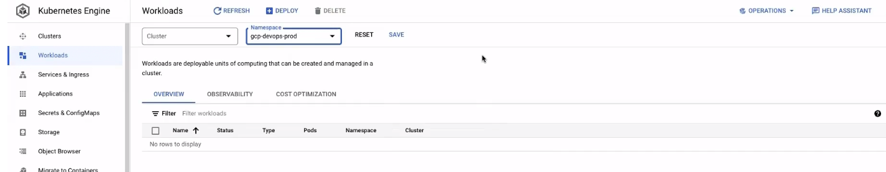|
    |-|


2. Back in your local terminal, create another branch. 

    ```bash
    git checkout -b "minor/deployment-file"
    git branch
    ```

3. Create the deployment file. 

    ```yaml
    
    ```

4. Update the cloudbuild.yaml file. 

    ```yaml
    
    ```

5. Commit the code to Github repo. 

    ```bash
    git add .
    git commit -m "Update the manifest with deployment and service." 
    gt push 
    ```

6. Switch to the Github UI and then to the branch. Create a PR and then merge it. Once the changes get merged to the master branch, it will trigger the Cloud Build.


7. Refresh the Github page then click on the left commit message. We should see the notification that the Cloud Build has been triggered. Click Details > View more details on Google CLoud Build. It should open a new tab. 


    Once successful, we should see all green check marks. 


9. From the GKE console, go to Workloads > Namespace: gcp-devops-prod > Click the deployment name. 


    Go to Services & Ingress. We should see the endpoint here. This is an external loadbalancer provisioned by GCP.
    
    
    
    Click the public IP address to open the application in a new tab. 


    Connect to the GKE cluster using Cloudshell and check the pods. 

    ```bash
    kubectl get po  
    ```


 


</details>


## Sprint 06

```
TODO: 
✔️ Create the development branch
✔️ Create the development Cloud Build YAML file
✔️ Create the Cloud Build trigger for the development branch
✔️ Create the development namespace 
✔️ Push changes to development 
```

<details><summary> See sprint details </summary>

1. Do a git pull for the main branch.

    ```bash
    git checkout master 
    git pull 
    ```

2. Create a new branch.

    ```bash
    git checkout -b development
    git branch  
    ```

3. Update the Cloud Build YAML file. 

    ```yaml
    
    ```

4. Go to Cloud Build > Trigger > CREATE TRIGGER. Specify the following:

    - Name: gcp-devops-project-dev 
    - Description: This is the Cloud Build trigger for the development branch.
    - Event: Push to a branch
    - Repository: gcp-devops-project 
    - Branch: <code>^development$</code>
    - Configuration: Cloud Build configuration file (yaml or json)


5. Go to GKE > Connect to your GKE cluster using Cloudshell. Create the namespace.

    ```bash 
    kubectl create ns gcp-devops-dev 
    ```

6.  Update the gke.yaml to point the image and namespace to the correct one. 

    ```yaml
    
    ```


7. Push the change to Github. 

    ```bash
    git add . 
    git commit -m "Add deployment files for dev environment."
    git push 
    ```

8. Go to Cloud Build to see the running job.


    We should see all green check marks.


9. Back at the GKE console, go to Workloads > Namespace: gcp-devops-dev 


    Go to Services & Ingress > Namespace: gcp-devops-dev 


    Click the endpoint and verify that you can access the application.

</details>


## Reference 

- [GCP DevOps Project](https://kodekloud.com/courses/gcp-devops-project/)